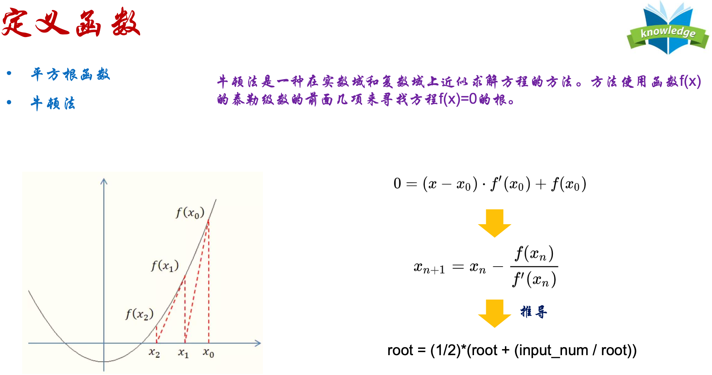
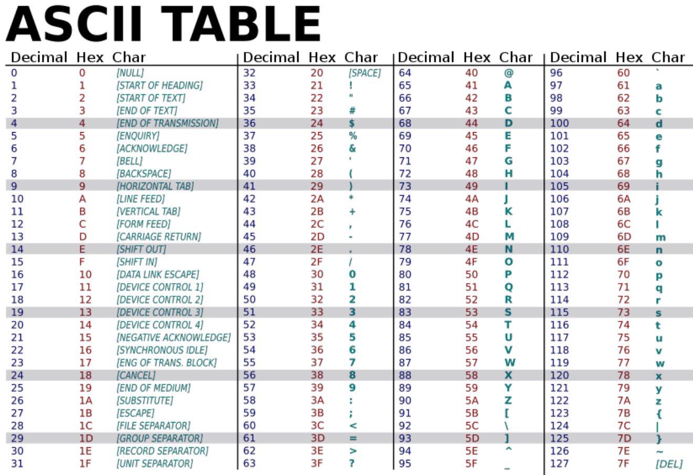
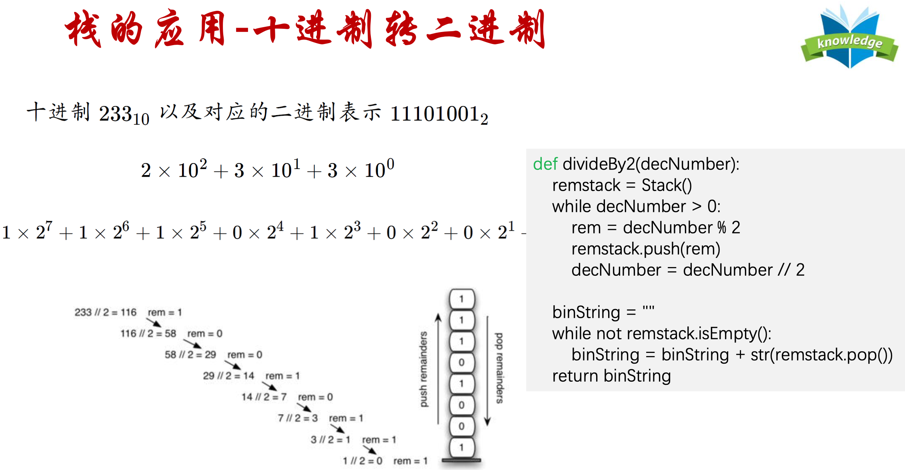
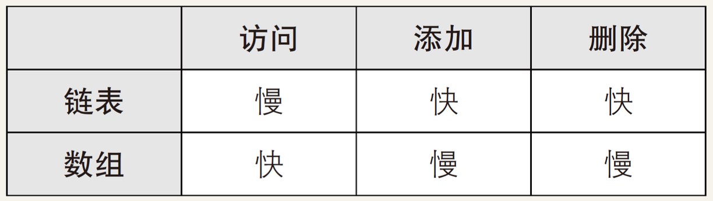
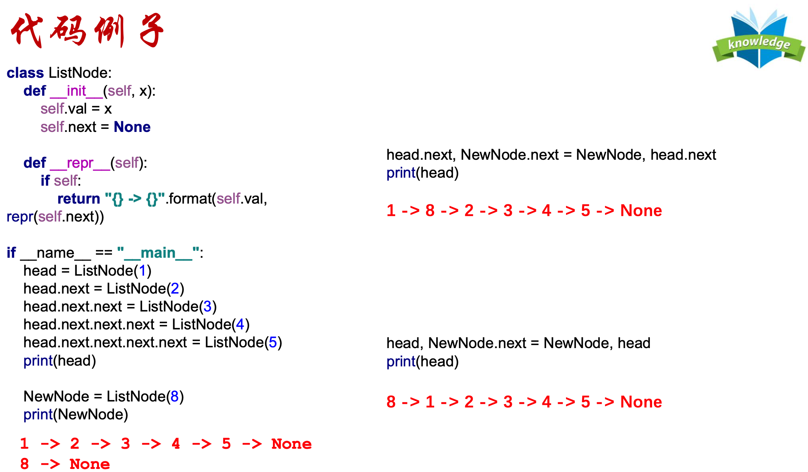

# AATCC - 算法分析和复杂性理论 - Analysis of Algorithms and Theory of Computational Complexity

> 2101212850 干皓丞

PKU 2022 個人實驗報告作業


## Knowledge Point

### Define

名詞對應 : 

https://github.com/kancheng/kan-cs-report-in-2022/blob/main/AATCC/define.md

### Log

課堂紀錄 :

https://github.com/kancheng/kan-cs-report-in-2022/blob/main/AATCC/log.md

1. 平方根函數

2. ＊牛頓法

3. 乱序字符串检查 - 逐字检查

4. 乱序字符串检查 - 排序与比较

5. ＊乱序字符串检查 - 计数与比较(ASCII)

6. ＊栈 - 十进制转二进制

7. 栈 - 2 ~ 16 进制轉換

8. 堆疊、链表應用

9. 链表, Linked List, 鏈結串列

10. 数组, Array, 陣列

11. 栈, Stack, 堆疊

12. 队列, Queue, 佇列

13. 查找, Search, 搜索, 搜尋 - 順序查找, 二分查找, Hash 查找

14. Map 抽象数据类型

15. 递归与分治

16. 排序 - 冒泡排序, 选择排序, 归并排序, 快速排序, 插入排序

17. 环形链表


## 平方根函數

```
import math
a =100
print(math.sqrt(a))
```

## `*` 牛頓法




```
def squareroot(input_num):
    root = input_num/2
    for k in range(20):
        root = (1/2)* (root + (input_num/root))
    return root

print(squareroot(3))
```


## 乱序字符串检查 - 逐字检查

乱序字符串是指一个字符串只是另一个字符串的重新排列。例如，'heart' 和 'earth' 就是乱序字符串。 'python' 和'typhon' 也是。为了简单起见，我们假设所讨论的两个字符串具有相等的长度，并且他们由26个小写 字母集合组成。我们的目标是写一个布尔函数，它将两个字符串做参数并返回它们是 不是乱序。

```
def anagramSolution1(s1, s2):
    alist = list(s2)
    pos1 = 0
    stillOK = True
    while pos1 < len(s1) and stillOK:
        pos2 = 0
        found = False
        while pos2 < len(alist) and not found:
            if s1[pos1] == alist[pos2]:
                found = True
            else:
                pos2 = pos2 + 1
        if found :
            alist[pos2] = None
            pos1 = pos1 + 1
        else:
            stillOK = False
    return stillOK and (len(list(filter(None, alist))) == 0)
print(anagramSolution1('eat', 'eat'))
print(anagramSolution1('eat', 'ade'))
```

## 乱序字符串检查 - 排序与比较

```
def anagramSolution2(s1, s2):
    alist1 = list(s1)
    alist2 = list(s2)
    alist1.sort()
    alist2.sort()
    pos = 0
    matches = True

    while pos < len(s1) and matches:
        if alist1[pos] == alist2[pos] :
            pos = pos + 1
        else:
            matches = False
    return matches

print(anagramSolution2('eat', 'eat'))
print(anagramSolution2('eat', 'ade'))
```

## `＊` 乱序字符串检查 - 计数与比较(ASCII)



```
# 利用 ASCII TABLE

def anagramSolution3(s1, s2):
    c1 = [0] * 26
    c2 = [0] * 26
    for i in range(len(s1)):
        pos = ord(s1[i]) - ord('a')
        c1[pos] = c1[pos] + 1
    for i in range(len(s2)):
        pos = ord(s2[i]) - ord('a')
        c2[pos] = c2[pos] + 1
    j = 0
    stillOK = True
    while j < 26 and stillOK:
        if c1[j] == c2[j]:
            j = j + 1
        else :
            stillOK = False
    return stillOK

print(anagramSolution3('eat', 'eat'))
print(anagramSolution3('eat', 'ade'))
```

## `＊`栈 - 十进制转二进制

### 栈, Stack, 堆疊

是计算机科學中的一種抽象資料型別，只允許在有序的線性資料集合的一端（稱為堆疊頂端，英語：top）進行加入数据（英語：push）和移除数据（英語：pop）的運算。因而按照後進先出（LIFO, Last In First Out）的原理運作。常與另一種有序的線性資料集合佇列相提並論。堆疊常用一維数组或連結串列來實現。

栈(Last In First Out，LIFO)是一个项的有序集合，其中添加移除新项总发生在同一端。这一端通常称为“顶 部”。与顶部对应的端称为“底部”。


栈的抽象数据类型由以下结构和操作定义。栈被构造为项的有序集合，其中项被添加和从末端移除的位置称为“顶部”。

栈操作如下:

1. Stack() 创建一个空的新栈。 它不需要参数，并返回一个空栈。

2. push(item) 将一个新项添加到栈的顶部。它需要 item 做参数并不返回任何内容。

3. pop() 从栈中删除顶部项。它不需要参数并返回 item 。栈被修改。

4. peek() 从栈返回顶部项，但不会删除它。不需要参数。不修改栈。

5. isEmpty() 测试栈是否为空。不需要参数，并返回布尔值。

6. size() 返回栈中的 item 数量。不需要参数，并返回一个整数。

```
# 1. Stack() 创建一个空的新栈。 它不需要参数，并返回一个空栈。
class Stack:
    def __init__(self):
        self.items = []
# 5. isEmpty() 测试栈是否为空。不需要参数，并返回布尔值。
    def isEmpty(self):
        return self.items == []

    def push(self, item):
        self.items.append(item)
# 2. push(item) 将一个新项添加到栈的顶部。它需要 item 做参数并不返回任何内容。

    def pop(self):
        return self.items.pop()
# 3. pop() 从栈中删除顶部项。它不需要参数并返回 item 。栈被修改。

    def peek(self):
        return self.items[len(self.items) - 1]
# 4. peek() 从栈返回顶部项，但不会删除它。不需要参数。不修改栈。

    def size(self):
        return len(self.items)
# 6. size() 返回栈中的 item 数量。不需要参数，并返回一个整数。
```

### 栈, Stack, 堆疊 - Python 實現

```
class Stack:
    def __init__(self):
        self.items = []
    def isEmpty(self):
        return self.items == []
    def push(self, item):
        self.items.append(item)
    def pop(self):
        return self.items.pop()
    def peek(self):
        return self.items[len(self.items) - 1]
    def size(self):
        return len(self.items)

s = Stack()
print(s.isEmpty())
s.push(4)
s.push('dog')
print(s.peek())
s.push(True)
print(s.size())
print(s.isEmpty())
s.push(8.4)
print(s.pop())
print(s.pop())
print(s.size())
```

### 栈, Stack, 堆疊 - 十进制转二进制 Python 實現



```
class Stack:
    def __init__(self):
        self.items = []
    def isEmpty(self):
        return self.items == []
    def push(self, item):
        self.items.append(item)
    def pop(self):
        return self.items.pop()
    def peek(self):
        return self.items[len(self.items) - 1]
    def size(self):
        return len(self.items)

def divideBy2(decNumber):
    remstack = Stack()
    while decNumber > 0 :
        rem = decNumber % 2
        remstack.push(rem)
        decNumber = decNumber // 2
    binString = ""
    while not remstack.isEmpty():
        binString = binString + str(remstack.pop())
    return binString

print(divideBy2(100))
```

## 栈 - 2 ~ 16 进制轉換 Python 實現

```
class Stack:
    def __init__(self):
        self.items = []
    def isEmpty(self):
        return self.items == []
    def push(self, item):
        self.items.append(item)
    def pop(self):
        return self.items.pop()
    def peek(self):
        return self.items[len(self.items) - 1]
    def size(self):
        return len(self.items)

def baseConverter(decNumber, base):
    digits = "0123456789ABCDEF"
    remstack = Stack()
    while decNumber > 0:
        rem = decNumber % base
        remstack.push(rem)
        decNumber = decNumber // base
    newString = ""
    while not remstack.isEmpty():
        newString = newString + digits[remstack.pop()]
    return newString

print(baseConverter(109, 16))
```

## 队列, Queue, 佇列

計算機科學中的一種抽象資料型別，是先進先出（FIFO, First-In-First-Out）的線性表。在具體應用中通常用鍊表或者數組來實現。佇列只允許在後端（稱為rear）進行插入操作，在前端（稱為front）進行刪除操作。佇列的操作方式和堆疊類似，唯一的區別在於佇列只允許新數據在後端進行添加。

队列是项的有序结合，其中添加新项的一端称为队尾，移除项的一端称为队首。(First In First Out，FIFO)

队列操作如下:

- 1. Queue() 创建一个空的新队列。 它不需要参数，并返回一个空队列。

- 2. enqueue(item) 将新项添加到队尾。 它需要 item 作为参数，并不返回任何内容。 

- 3. dequeue() 从队首移除项。它不需要参数并返回 item。 队列被修改。

- 4. isEmpty() 查看队列是否为空。它不需要参数，并返回布尔值。

- 5. size() 返回队列中的项数。它不需要参数，并返回一个整数。

```
# 1. Queue() 创建一个空的新队列。 它不需要参数，并返回一个空队列。
class Queue:
    def __init__(self):
        self.items = []

    def isEmpty(self):
        return self.items == []
# 4. isEmpty() 查看队列是否为空。它不需要参数，并返回布尔值。

    def enqueue(self, item):
        self.items.insert(0, item)
# 2. enqueue(item) 将新项添加到队尾。 它需要 item 作为参数，并不返回任何内容。

    def dequeue(self):
        return self.items.pop()
# 3. dequeue() 从队首移除项。它不需要参数并返回 item。 队列被修改。

    def size(self):
        return len(self.items)
# 5. size() 返回队列中的项数。它不需要参数，并返回一个整数。
```

```
class Queue:
    def __init__(self):
        self.items = []
    def isEmpty(self):
        return self.items == []
    def enqueue(self, item):
        self.items.insert(0, item)
    def dequeue(self):
        return self.items.pop()
    def size(self):
        return len(self.items)
```

```
## e.g.1
def function(decNumber):
    remstack = Stack()
    while decNumber > 0:
        rem = decNumber % 2
        remstack.push(rem)
        decNumber = decNumber // 2
    binString = ""
    while not remstack.isEmpty():
        binString = binString + str(remstack.pop())
    return binString
print(function (10))
print(function (9))
print(function (8))
print(function (7))
## e.g.2
def function(input_num, n):
    root = input_num / 2
    for k in range(n):
        root = (1 / 2) * (root + (input_num / root))
    return root
print(function (10, 4))
print(function (9, 6))
print(function (8, 7))
print(function (7, 4))
## e.g.3
def function(namelist, num):
    simqueue = Queue()
    for name in namelist:
        simqueue.enqueue(name)
    while simqueue.size() > 1:
        for i in range(num):
            simqueue.enqueue(simqueue.dequeue())
        simqueue.dequeue()
    return simqueue.dequeue()
print(function ([4, 3, 6, 9, 14, 2, 5], 8))
```

## 呼應堆疊實作 LeetCode 20. Valid Parentheses 有效的括号

Given a string s containing just the characters '(', ')', '{', '}', '[' and ']', determine if the input string is valid.

An input string is valid if:

1. Open brackets must be closed by the same type of brackets.

2. Open brackets must be closed in the correct order.


给定一个只包括 '(', ')', '{', '}', '[' and ']' 的字符串 s ，判断字符串是否有效。

有效字符串需满足：

1. 左括号必须用相同类型的右括号闭合。

2. 左括号必须以正确的顺序闭合。


### 解题思路

- 遇到左括号就进栈push，遇到右括号并且栈顶为与之对应的左括号，就把栈顶元素出栈。最后看栈里面还有没有其他元素，如果为空，即匹配。

- 需要注意，空字符串是满足括号匹配的，即输出 true。

### 補充

括號匹配是使用棧解決的經典問題。題意其實就像我們在寫代碼的過程中，要求括號的順序是一樣的，有左括號，相應的位置必須要有右括號。

如果還記得編譯原理的話，編譯器在 詞法分析的過程中處理括號、花括號等這個符號的邏輯，也是使用了棧這種數據結構。

再舉個例子，linux 系統中，cd 這個進入目錄的命令我們應該再熟悉不過了。

```
cd a/b/c/../../
```

這個命令最後進入a目錄，系統是如何知道進入了a目錄呢 ，即為棧的應用


```
class Solution(object):
    def isValid(self, s):
        stack = []
        paren_map = {')': '(', ']':'[', '}':'{'}
        for c in s:
            if c not in paren_map:
                stack.append(c)
            elif not stack or paren_map[c] != stack.pop():
                return False
        return not stack
x = "()"
ob = Solution()
print(ob.isValid(x))
```

## `*` 用栈实现队列 - LeetCode 232. Implement Queue using Stacks

```
class MyQueue:
    def __init__(self):
        """
        in主要负责push，out主要负责pop
        """
        self.stack_in = []
        self.stack_out = []
    def push(self, x: int) -> None:
        """
        有新元素进来，就往in里面push
        """
        self.stack_in.append(x)
    def pop(self) -> int:
        """
        Removes the element from in front of queue and returns that element.
        """
        if self.empty():
            return None
        
        if self.stack_out:
            return self.stack_out.pop()
        else:
            for i in range(len(self.stack_in)):
                self.stack_out.append(self.stack_in.pop())
            return self.stack_out.pop()
    def peek(self) -> int:
        """
        Get the front element.
        """
        ans = self.pop()
        self.stack_out.append(ans)
        return ans
    def empty(self) -> bool:
        """
        只要in或者out有元素，说明队列不为空
        """
        return not (self.stack_in or self.stack_out)
    
# Your MyQueue object will be instantiated and called as such:
# obj = MyQueue()
# obj.push(x)
# param_2 = obj.pop()
# param_3 = obj.peek()
# param_4 = obj.empty()
x = ["MyQueue","push","push","peek","pop","empty"]
obj = MyQueue()
print(obj.push(x))
param_2 = obj.pop()
param_3 = obj.peek()
param_4 = obj.empty()
print(param_2)
print(param_3)
print(param_4)
    
class MyQueue:
    def __init__(self):
        self.A, self.B =[], []
    def push (self, x):
        self.A.append(x)

    def pop(self):
        self.peek()
        return self.B.pop()

    def peek(self):
        if not self.B:
            while self.A:
                self.B.append(self.A.pop())
        return self.B[-1]

    def empty(self):
        return not self.A and not self.B

```

## 數組, Array, 陣列 VS List





```
class ListNode:
    def __init__(self, x):
        self.val = x
        self.next = None
    def __repr__(self):
        if self:
            return "{} -> {}".format(self.val, repr(self.next))

    if __name__ == "__main__":
        head = ListNode(1)
        head.next = ListNode(2)
        head.next.next = ListNode(3)
        head.next.next.next = ListNode(4)
        head.next.next.next.next = ListNode(5)
        print(head)
        NewNode = ListNode(8)
        print(NewNode)

    head.next, NewNode.next = NewNode, head.next
    print(head)

    head, NewNode.next = NewNode, head
    print(head)
```

## 反转链表 - eetCode 206. Reverse Linked List

Given the head of a singly linked list, reverse the list, and return the reversed list.

给你单链表的头节点 head ，请你反转链表，并返回反转后的链表。


## 解题思路

两种思路 1.后挂 2.交换

```
# Knowledge Point

class ListNode:
    def __init__(self, x):
        self.val = x
        self.next = None

    def __repr__(self):
        if self:
            return "{} -> {}".format(self.val, repr(self.next))

    if __name__ == "__main__":
        head = ListNode(1)
        head.next = ListNode(2)
        head.next.next = ListNode(3)
        head.next.next.next = ListNode(4)
        head.next.next.next.next = ListNode(5)
        print(head)
```

## Reference

1. https://ithelp.ithome.com.tw/m/articles/10271920

2. https://ithelp.ithome.com.tw/articles/10263980

```
class ListNode:
    def __init__(self, x):
        self.val = x
        self.next = None

    def __repr__(self):
        if self:
            return "{} -> {}".format(self.val, repr(self.next))

class Solution:
    def reverseList(self, head):
        dummy = ListNode(float("-inf"))
        while head:
            dummy.next, head.next, head = head, dummy.next, head.next
        return dummy.next

# 交換法

class Solution:
    def reverseList(self, head: Optional[ListNode]) -> Optional[ListNode]:
        prev = None
        while head:
            next = head.next
            head.next = prev
            prev = head
            head = next
        return prev

# 遞迴法
class Solution:
    def reverseList(self, head: Optional[ListNode], prev=None) -> Optional[ListNode]:
        if not head: return prev
        next = head.next # 先把下一個記起來
        head.next = prev # 將自己反過來指向前一個
        return self.reverseList(next, head)
```

## 两两交换链表中的节点 - LeetCode 24. Swap Nodes in Pairs

Given a linked list, swap every two adjacent nodes and return its head. You must solve the problem without modifying the values in the list's nodes (i.e., only nodes themselves may be changed.)

给你一个链表，两两交换其中相邻的节点，并返回交换后链表的头节点。你必须在不修改节点内部的值的情况下完成本题（即，只能进行节点交换）。

## 解题思路

两两相邻的元素，翻转链表

`pre->a->b->b.next to pre->b->a->b.next`

```
# Knowledge Point

class ListNode:
    def __init__(self, x):
        self.val = x
        self.next = None

    def __repr__(self):
        if self:
            return "{} -> {}".format(self.val, repr(self.next))

if __name__ == "__main__":
    head = ListNode(1)
    head.next = ListNode(2)
    head.next.next = ListNode(3)
    head.next.next.next = ListNode(4)
    head.next.next.next.next = ListNode(5)
    print(head)
```

## Reference

1. https://ithelp.ithome.com.tw/m/articles/10271920

2. https://ithelp.ithome.com.tw/articles/10263980

```
class Solution:
    def swapPairs(self, head: ListNode) -> ListNode:
        pre, pre.next = self, head
        while pre.next and pre.next.next:
            a = pre.next
            b = a.next
            pre.next, b.next, a.next = b, a, b.next
            pre = a
        return self.next
```