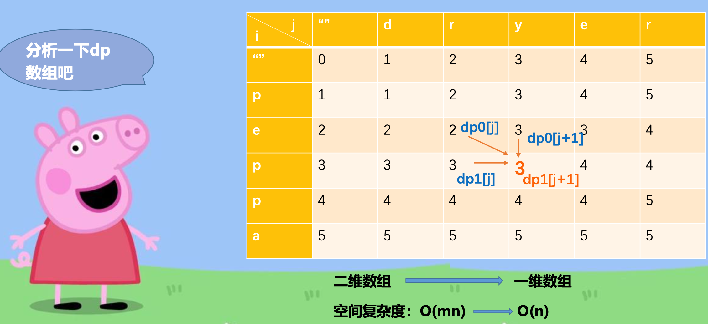
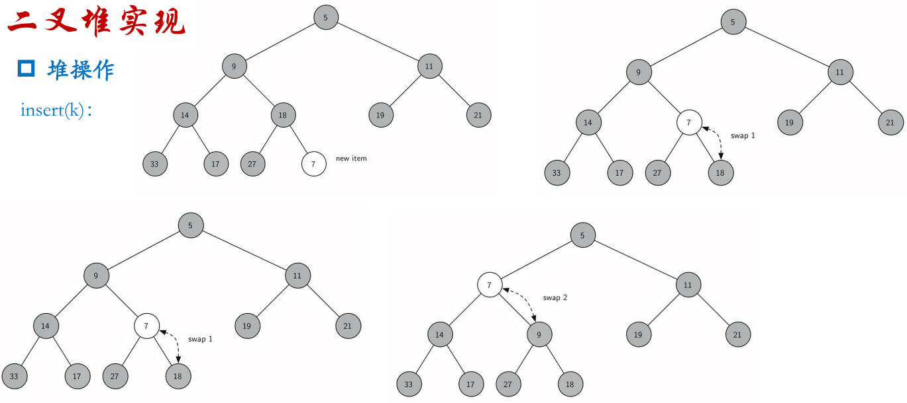

# AATCC - 算法分析和复杂性理论 - Analysis of Algorithms and Theory of Computational Complexity

> 2101212850 干皓丞

PKU 2022 個人實驗報告作業


## Knowledge Point

### Define

名詞對應 : 

https://github.com/kancheng/kan-cs-report-in-2022/blob/main/AATCC/define.md

### Log

課堂紀錄 :

https://github.com/kancheng/kan-cs-report-in-2022/blob/main/AATCC/log.md

1. 平方根函數

2. ＊牛頓法

3. 乱序字符串检查 - 逐字检查

4. 乱序字符串检查 - 排序与比较

5. ＊乱序字符串检查 - 计数与比较(ASCII)

6. ＊栈 - 十进制转二进制

7. 栈 - 2 ~ 16 进制轉換

8. 堆疊、链表應用

9. 链表, Linked List, 鏈結串列

10. 数组, Array, 陣列

11. 栈, Stack, 堆疊

12. 队列, Queue, 佇列

13. 查找, Search, 搜索, 搜尋 - 順序查找, 二分查找, Hash 查找

14. Map 抽象数据类型

15. 递归与分治

16. 排序 - 冒泡排序, 选择排序, 归并排序, 快速排序, 插入排序

17. 环形链表

18. 貪心法

- 貪心法 - 找最少硬币

- 貪心法 - LC 122. 买卖股票的最佳时机 II

- 貪心法 - LC 392. 判断子序列

- 貪心法 - LC 263. 丑数

19. 动态规划 Dynamic Programming, DP

- 动态规划 - 找最少硬币

- 动态规划 - LC 70. 爬楼梯

- 动态规划 - LC 62 & 63 不同路径 & 从一维到二维的扩展

20. 矩阵相乘加括号

21. 从一维到二维的扩展 with LC 746 & LC 120 說明

22. 矩阵相乘加括号 with LC 123 說明

23. 多起点多终点最短路径问题

24. 不满足优化子结构的例子 with LC 300 & LC 53

25. 最长公共子序列 (Longest Common Subsequence, LCS)

26. 背包问题 (Knapsack Problem)

27. 投资问题

28. 编辑距离, LC 72, LC 312

29. 樹

- 樹各名詞定義

- 定义树（Tree）

- Know Thy Complexities!

- Binary Tree & Binary Search Tree

- 树的表示-列表

- 树的表示-类

- 树和链表, LC 100, LC 112, LC 226

- 树的遍历(Traversal), LC 144

- 分析树 (Parse Tree)

- 构建分析树

- 树的遍历 & 分析树 (Parse Tree) LC 105

31. 基于二叉堆实现优先队列

- 优先队列 priority queue

- 二叉堆

- 二叉堆操作

- 二叉堆实现

- 构建二叉堆操作

- 二叉查找树


## 平方根函數

```
import math
a =100
print(math.sqrt(a))
```

## `*` 牛頓法


```
def squareroot(input_num):
    root = input_num/2
    for k in range(20):
        root = (1/2)* (root + (input_num/root))
    return root

print(squareroot(3))
```


## 乱序字符串检查 - 逐字检查

乱序字符串是指一个字符串只是另一个字符串的重新排列。例如，'heart' 和 'earth' 就是乱序字符串。 'python' 和'typhon' 也是。为了简单起见，我们假设所讨论的两个字符串具有相等的长度，并且他们由26个小写 字母集合组成。我们的目标是写一个布尔函数，它将两个字符串做参数并返回它们是 不是乱序。

```
def anagramSolution1(s1, s2):
    alist = list(s2)
    pos1 = 0
    stillOK = True
    while pos1 < len(s1) and stillOK:
        pos2 = 0
        found = False
        while pos2 < len(alist) and not found:
            if s1[pos1] == alist[pos2]:
                found = True
            else:
                pos2 = pos2 + 1
        if found :
            alist[pos2] = None
            pos1 = pos1 + 1
        else:
            stillOK = False
    return stillOK and (len(list(filter(None, alist))) == 0)
print(anagramSolution1('eat', 'eat'))
print(anagramSolution1('eat', 'ade'))
```

## 乱序字符串检查 - 排序与比较

```
def anagramSolution2(s1, s2):
    alist1 = list(s1)
    alist2 = list(s2)
    alist1.sort()
    alist2.sort()
    pos = 0
    matches = True

    while pos < len(s1) and matches:
        if alist1[pos] == alist2[pos] :
            pos = pos + 1
        else:
            matches = False
    return matches

print(anagramSolution2('eat', 'eat'))
print(anagramSolution2('eat', 'ade'))
```

## `＊` 乱序字符串检查 - 计数与比较(ASCII)


```
# 利用 ASCII TABLE

def anagramSolution3(s1, s2):
    c1 = [0] * 26
    c2 = [0] * 26
    for i in range(len(s1)):
        pos = ord(s1[i]) - ord('a')
        c1[pos] = c1[pos] + 1
    for i in range(len(s2)):
        pos = ord(s2[i]) - ord('a')
        c2[pos] = c2[pos] + 1
    j = 0
    stillOK = True
    while j < 26 and stillOK:
        if c1[j] == c2[j]:
            j = j + 1
        else :
            stillOK = False
    return stillOK

print(anagramSolution3('eat', 'eat'))
print(anagramSolution3('eat', 'ade'))
```

## `＊`栈 - 十进制转二进制

### 栈, Stack, 堆疊

是计算机科學中的一種抽象資料型別，只允許在有序的線性資料集合的一端（稱為堆疊頂端，英語：top）進行加入数据（英語：push）和移除数据（英語：pop）的運算。因而按照後進先出（LIFO, Last In First Out）的原理運作。常與另一種有序的線性資料集合佇列相提並論。堆疊常用一維数组或連結串列來實現。

栈(Last In First Out，LIFO)是一个项的有序集合，其中添加移除新项总发生在同一端。这一端通常称为“顶 部”。与顶部对应的端称为“底部”。


栈的抽象数据类型由以下结构和操作定义。栈被构造为项的有序集合，其中项被添加和从末端移除的位置称为“顶部”。

栈操作如下:

1. Stack() 创建一个空的新栈。 它不需要参数，并返回一个空栈。

2. push(item) 将一个新项添加到栈的顶部。它需要 item 做参数并不返回任何内容。

3. pop() 从栈中删除顶部项。它不需要参数并返回 item 。栈被修改。

4. peek() 从栈返回顶部项，但不会删除它。不需要参数。不修改栈。

5. isEmpty() 测试栈是否为空。不需要参数，并返回布尔值。

6. size() 返回栈中的 item 数量。不需要参数，并返回一个整数。

```
# 1. Stack() 创建一个空的新栈。 它不需要参数，并返回一个空栈。
class Stack:
    def __init__(self):
        self.items = []
# 5. isEmpty() 测试栈是否为空。不需要参数，并返回布尔值。
    def isEmpty(self):
        return self.items == []

    def push(self, item):
        self.items.append(item)
# 2. push(item) 将一个新项添加到栈的顶部。它需要 item 做参数并不返回任何内容。

    def pop(self):
        return self.items.pop()
# 3. pop() 从栈中删除顶部项。它不需要参数并返回 item 。栈被修改。

    def peek(self):
        return self.items[len(self.items) - 1]
# 4. peek() 从栈返回顶部项，但不会删除它。不需要参数。不修改栈。

    def size(self):
        return len(self.items)
# 6. size() 返回栈中的 item 数量。不需要参数，并返回一个整数。
```

### 栈, Stack, 堆疊 - Python 實現

```
class Stack:
    def __init__(self):
        self.items = []
    def isEmpty(self):
        return self.items == []
    def push(self, item):
        self.items.append(item)
    def pop(self):
        return self.items.pop()
    def peek(self):
        return self.items[len(self.items) - 1]
    def size(self):
        return len(self.items)

s = Stack()
print(s.isEmpty())
s.push(4)
s.push('dog')
print(s.peek())
s.push(True)
print(s.size())
print(s.isEmpty())
s.push(8.4)
print(s.pop())
print(s.pop())
print(s.size())
```

### 栈, Stack, 堆疊 - 十进制转二进制 Python 實現


```
class Stack:
    def __init__(self):
        self.items = []
    def isEmpty(self):
        return self.items == []
    def push(self, item):
        self.items.append(item)
    def pop(self):
        return self.items.pop()
    def peek(self):
        return self.items[len(self.items) - 1]
    def size(self):
        return len(self.items)

def divideBy2(decNumber):
    remstack = Stack()
    while decNumber > 0 :
        rem = decNumber % 2
        remstack.push(rem)
        decNumber = decNumber // 2
    binString = ""
    while not remstack.isEmpty():
        binString = binString + str(remstack.pop())
    return binString

print(divideBy2(100))
```

## 栈 - 2 ~ 16 进制轉換 Python 實現

```
class Stack:
    def __init__(self):
        self.items = []
    def isEmpty(self):
        return self.items == []
    def push(self, item):
        self.items.append(item)
    def pop(self):
        return self.items.pop()
    def peek(self):
        return self.items[len(self.items) - 1]
    def size(self):
        return len(self.items)

def baseConverter(decNumber, base):
    digits = "0123456789ABCDEF"
    remstack = Stack()
    while decNumber > 0:
        rem = decNumber % base
        remstack.push(rem)
        decNumber = decNumber // base
    newString = ""
    while not remstack.isEmpty():
        newString = newString + digits[remstack.pop()]
    return newString

print(baseConverter(109, 16))
```

## 队列, Queue, 佇列

計算機科學中的一種抽象資料型別，是先進先出（FIFO, First-In-First-Out）的線性表。在具體應用中通常用鍊表或者數組來實現。佇列只允許在後端（稱為rear）進行插入操作，在前端（稱為front）進行刪除操作。佇列的操作方式和堆疊類似，唯一的區別在於佇列只允許新數據在後端進行添加。

队列是项的有序结合，其中添加新项的一端称为队尾，移除项的一端称为队首。(First In First Out，FIFO)

队列操作如下:

- 1. Queue() 创建一个空的新队列。 它不需要参数，并返回一个空队列。

- 2. enqueue(item) 将新项添加到队尾。 它需要 item 作为参数，并不返回任何内容。 

- 3. dequeue() 从队首移除项。它不需要参数并返回 item。 队列被修改。

- 4. isEmpty() 查看队列是否为空。它不需要参数，并返回布尔值。

- 5. size() 返回队列中的项数。它不需要参数，并返回一个整数。

```
# 1. Queue() 创建一个空的新队列。 它不需要参数，并返回一个空队列。
class Queue:
    def __init__(self):
        self.items = []

    def isEmpty(self):
        return self.items == []
# 4. isEmpty() 查看队列是否为空。它不需要参数，并返回布尔值。

    def enqueue(self, item):
        self.items.insert(0, item)
# 2. enqueue(item) 将新项添加到队尾。 它需要 item 作为参数，并不返回任何内容。

    def dequeue(self):
        return self.items.pop()
# 3. dequeue() 从队首移除项。它不需要参数并返回 item。 队列被修改。

    def size(self):
        return len(self.items)
# 5. size() 返回队列中的项数。它不需要参数，并返回一个整数。
```

```
class Queue:
    def __init__(self):
        self.items = []
    def isEmpty(self):
        return self.items == []
    def enqueue(self, item):
        self.items.insert(0, item)
    def dequeue(self):
        return self.items.pop()
    def size(self):
        return len(self.items)
```

```
## e.g.1
def function(decNumber):
    remstack = Stack()
    while decNumber > 0:
        rem = decNumber % 2
        remstack.push(rem)
        decNumber = decNumber // 2
    binString = ""
    while not remstack.isEmpty():
        binString = binString + str(remstack.pop())
    return binString
print(function (10))
print(function (9))
print(function (8))
print(function (7))
## e.g.2
def function(input_num, n):
    root = input_num / 2
    for k in range(n):
        root = (1 / 2) * (root + (input_num / root))
    return root
print(function (10, 4))
print(function (9, 6))
print(function (8, 7))
print(function (7, 4))
## e.g.3
def function(namelist, num):
    simqueue = Queue()
    for name in namelist:
        simqueue.enqueue(name)
    while simqueue.size() > 1:
        for i in range(num):
            simqueue.enqueue(simqueue.dequeue())
        simqueue.dequeue()
    return simqueue.dequeue()
print(function ([4, 3, 6, 9, 14, 2, 5], 8))
```

## 呼應堆疊實作 LeetCode 20. Valid Parentheses 有效的括号

Given a string s containing just the characters '(', ')', '{', '}', '[' and ']', determine if the input string is valid.

An input string is valid if:

1. Open brackets must be closed by the same type of brackets.

2. Open brackets must be closed in the correct order.


给定一个只包括 '(', ')', '{', '}', '[' and ']' 的字符串 s ，判断字符串是否有效。

有效字符串需满足：

1. 左括号必须用相同类型的右括号闭合。

2. 左括号必须以正确的顺序闭合。


### 解题思路

- 遇到左括号就进栈push，遇到右括号并且栈顶为与之对应的左括号，就把栈顶元素出栈。最后看栈里面还有没有其他元素，如果为空，即匹配。

- 需要注意，空字符串是满足括号匹配的，即输出 true。

### 補充

括號匹配是使用棧解決的經典問題。題意其實就像我們在寫代碼的過程中，要求括號的順序是一樣的，有左括號，相應的位置必須要有右括號。

如果還記得編譯原理的話，編譯器在 詞法分析的過程中處理括號、花括號等這個符號的邏輯，也是使用了棧這種數據結構。

再舉個例子，linux 系統中，cd 這個進入目錄的命令我們應該再熟悉不過了。

```
cd a/b/c/../../
```

這個命令最後進入a目錄，系統是如何知道進入了a目錄呢 ，即為棧的應用


```
class Solution(object):
    def isValid(self, s):
        stack = []
        paren_map = {')': '(', ']':'[', '}':'{'}
        for c in s:
            if c not in paren_map:
                stack.append(c)
            elif not stack or paren_map[c] != stack.pop():
                return False
        return not stack
x = "()"
ob = Solution()
print(ob.isValid(x))
```

## `*` 用栈实现队列 - LeetCode 232. Implement Queue using Stacks

```
class MyQueue:
    def __init__(self):
        """
        in主要负责push，out主要负责pop
        """
        self.stack_in = []
        self.stack_out = []
    def push(self, x: int) -> None:
        """
        有新元素进来，就往in里面push
        """
        self.stack_in.append(x)
    def pop(self) -> int:
        """
        Removes the element from in front of queue and returns that element.
        """
        if self.empty():
            return None
        
        if self.stack_out:
            return self.stack_out.pop()
        else:
            for i in range(len(self.stack_in)):
                self.stack_out.append(self.stack_in.pop())
            return self.stack_out.pop()
    def peek(self) -> int:
        """
        Get the front element.
        """
        ans = self.pop()
        self.stack_out.append(ans)
        return ans
    def empty(self) -> bool:
        """
        只要in或者out有元素，说明队列不为空
        """
        return not (self.stack_in or self.stack_out)
    
# Your MyQueue object will be instantiated and called as such:
# obj = MyQueue()
# obj.push(x)
# param_2 = obj.pop()
# param_3 = obj.peek()
# param_4 = obj.empty()
x = ["MyQueue","push","push","peek","pop","empty"]
obj = MyQueue()
print(obj.push(x))
param_2 = obj.pop()
param_3 = obj.peek()
param_4 = obj.empty()
print(param_2)
print(param_3)
print(param_4)
    
class MyQueue:
    def __init__(self):
        self.A, self.B =[], []
    def push (self, x):
        self.A.append(x)

    def pop(self):
        self.peek()
        return self.B.pop()

    def peek(self):
        if not self.B:
            while self.A:
                self.B.append(self.A.pop())
        return self.B[-1]

    def empty(self):
        return not self.A and not self.B

```

## 數組, Array, 陣列 VS List


```
class ListNode:
    def __init__(self, x):
        self.val = x
        self.next = None
    def __repr__(self):
        if self:
            return "{} -> {}".format(self.val, repr(self.next))

    if __name__ == "__main__":
        head = ListNode(1)
        head.next = ListNode(2)
        head.next.next = ListNode(3)
        head.next.next.next = ListNode(4)
        head.next.next.next.next = ListNode(5)
        print(head)
        NewNode = ListNode(8)
        print(NewNode)

    head.next, NewNode.next = NewNode, head.next
    print(head)

    head, NewNode.next = NewNode, head
    print(head)
```

## 反转链表 - eetCode 206. Reverse Linked List

Given the head of a singly linked list, reverse the list, and return the reversed list.

给你单链表的头节点 head ，请你反转链表，并返回反转后的链表。


## 解题思路

两种思路 1.后挂 2.交换

```
# Knowledge Point

class ListNode:
    def __init__(self, x):
        self.val = x
        self.next = None

    def __repr__(self):
        if self:
            return "{} -> {}".format(self.val, repr(self.next))

    if __name__ == "__main__":
        head = ListNode(1)
        head.next = ListNode(2)
        head.next.next = ListNode(3)
        head.next.next.next = ListNode(4)
        head.next.next.next.next = ListNode(5)
        print(head)
```

## Reference

1. https://ithelp.ithome.com.tw/m/articles/10271920

2. https://ithelp.ithome.com.tw/articles/10263980

```
class ListNode:
    def __init__(self, x):
        self.val = x
        self.next = None

    def __repr__(self):
        if self:
            return "{} -> {}".format(self.val, repr(self.next))

class Solution:
    def reverseList(self, head):
        dummy = ListNode(float("-inf"))
        while head:
            dummy.next, head.next, head = head, dummy.next, head.next
        return dummy.next

# 交換法

class Solution:
    def reverseList(self, head: Optional[ListNode]) -> Optional[ListNode]:
        prev = None
        while head:
            next = head.next
            head.next = prev
            prev = head
            head = next
        return prev

# 遞迴法
class Solution:
    def reverseList(self, head: Optional[ListNode], prev=None) -> Optional[ListNode]:
        if not head: return prev
        next = head.next # 先把下一個記起來
        head.next = prev # 將自己反過來指向前一個
        return self.reverseList(next, head)
```

## 两两交换链表中的节点 - LeetCode 24. Swap Nodes in Pairs

Given a linked list, swap every two adjacent nodes and return its head. You must solve the problem without modifying the values in the list's nodes (i.e., only nodes themselves may be changed.)

给你一个链表，两两交换其中相邻的节点，并返回交换后链表的头节点。你必须在不修改节点内部的值的情况下完成本题（即，只能进行节点交换）。

## 解题思路

两两相邻的元素，翻转链表

`pre->a->b->b.next to pre->b->a->b.next`

```
# Knowledge Point

class ListNode:
    def __init__(self, x):
        self.val = x
        self.next = None

    def __repr__(self):
        if self:
            return "{} -> {}".format(self.val, repr(self.next))

if __name__ == "__main__":
    head = ListNode(1)
    head.next = ListNode(2)
    head.next.next = ListNode(3)
    head.next.next.next = ListNode(4)
    head.next.next.next.next = ListNode(5)
    print(head)
```

## Reference

1. https://ithelp.ithome.com.tw/m/articles/10271920

2. https://ithelp.ithome.com.tw/articles/10263980

```
class Solution:
    def swapPairs(self, head: ListNode) -> ListNode:
        pre, pre.next = self, head
        while pre.next and pre.next.next:
            a = pre.next
            b = a.next
            pre.next, b.next, a.next = b, a, b.next
            pre = a
        return self.next
```

## LeetCode 141. Linked List Cycle 环形链表


Given head, the head of a linked list, determine if the linked list has a cycle in it.

There is a cycle in a linked list if there is some node in the list that can be reached again by continuously following the next pointer. Internally, pos is used to denote the index of the node that tail's next pointer is connected to. Note that pos is not passed as a parameter.

Return true if there is a cycle in the linked list. Otherwise, return false.


给你一个链表的头节点 head ，判断链表中是否有环。

如果链表中有某个节点，可以通过连续跟踪 next 指针再次到达，则链表中存在环。 为了表示给定链表中的环，评测系统内部使用整数 pos 来表示链表尾连接到链表中的位置（索引从 0 开始）。注意：pos 不作为参数进行传递。仅仅是为了标识链表的实际情况。

如果链表中存在环，则返回 true 。 否则，返回 false 

###  circular linked list

> 引用段落 : 自你所不知道的 C 語言: linked list 和非連續記憶體


環狀鏈結串列 (circular linked list) 是鏈結串列的最後一個節點所指向的下一個節點，會是第一個節點，而不像鏈結串列中的最後一個結點指向 NULL:


其優點為:

從 head 找到 tail 的時間複雜度為 O(n)，但若新增一個 tail pointer (此為 last) 時間複雜度可降為 O(1)

- 容易做到反向查詢

- 若要走訪整個 linked list，任何節點都可作為起始節點

- 避免保留 NULL 這樣特別的記憶體地址 (在沒有 MMU 的 bare metal 環境中，(void `*`) 0 地址空間存取時，沒有特別的限制)


bare metal : https://en.wikipedia.org/wiki/Bare_machine

### 用「龜兔賽跑」(Floyd’s Cycle detection)來偵測是否有 cycle 產生。

Floyd’s Cycle detection : https://en.wikipedia.org/wiki/Cycle_detection

有 3 種狀態需要做討論

> * $a$ 為起始點
> * $b$ 為連接點
> * $c$ 為龜兔相遇位置


我們需要求得 a, b, c 三點位置，才能進行處理。
假設 $\overline{ac}$ 距離為 $X$ ，這代表 tortoise 行經 $X$ 步，那麼 hare 走了 $2X$ 步，$X$ 數值為多少並不重要，只代表要花多少時間兩點才會相遇，不影響求出 $\mu$ 和 $\lambda$。

接下來要分成三個步驟來處理
1. tortoise 速度為每次一步，hare 為每次兩步，兩者同時從起點 $a$ 出發，相遇時可以得到點 $c$。若是上述「狀況 2: 頭尾相連」，在第 1 步結束就求完三點了
2. 兩點分別從點 $a$ 和 $c$ 出發，速度皆為一次一步，相遇時可得到點 $b$。因為 $\overline{ac}$ 長度為 $X$，那麼 $cycle$ $c$ 長度也為 $X$，相遇在點 $b$ 時，所走的距離剛好都是 $X - \overline{bc}$
3. 從點 $b$ 出發，速度為一次一步，再次回到點 $b$ 可得到 cycle 的長度

### cycle finding

如果只需要判斷是否為 circular linked list，那麼只要執行上述的第 1 部分。

除了計算 $\mu$ 和 $\lambda$，還需要記錄整個串列的長度，若不記錄，會影響到後續進行 sorting 一類的操作。

```cpp
static inline Node *move(Node *cur) { return cur ? cur->next : NULL; }

bool cycle_finding(Node *HEAD, Node **TAIL, int *length, int *mu, int *lambda) {
    // lambda is length
    // mu is the meet node's index
    Node *tortoise = move(HEAD);
    Node *hare = move(move(HEAD));

    // get meet point
    while (hare && tortoise) {    /* Maybe while (hare && tortoise && (hare != tortoise)) ?*/
        tortoise = move(tortoise);
        hare = move(move(hare));
    }

    // not loop
    if (!hare) {
        *TAIL = NULL;
        *length = 0;
        tortoise = HEAD;
        while (tortoise && (tortoise = move(tortoise)))
            (*length)++;
        return false;
    }

    // get mu
    *mu = 0;
    tortoise = HEAD;
    while (tortoise != hare) {
        (*mu)++;
        tortoise = tortoise->next;
        hare = hare->next;
    }

    // get lambda
    *lambda = 1;
    tortoise = move(tortoise);
    *TAIL = tortoise;
    while (tortoise != hare) {
        *TAIL = tortoise;
        (*lambda)++;
        tortoise = move(tortoise);
    }
    *length = *mu + *lambda;

    return true;
}
```

## LeetCode 15. 3Sum 三数之和

Given an integer array nums, return all the triplets [nums[i], nums[j], nums[k]] such that i != j, i != k, and j != k, and nums[i] + nums[j] + nums[k] == 0.

Notice that the solution set must not contain duplicate triplets.


给你一个整数数组 nums，有一个大小为 k 的滑动窗口从数组的最左侧移动到数组的最右侧。你只可以看到在滑动窗口内的 k 个数字。

滑动窗口每次只向右移动一位。返回 滑动窗口中的最大值 。


Example 1:

```
Input: nums = [-1,0,1,2,-1,-4]
Output: [[-1,-1,2],[-1,0,1]]
```

Example 2:

```
Input: nums = []
Output: []
```

Example 3:

```
Input: nums = [0]
Output: []
```

Constraints:

- 0 <= nums.length <= 3000
- -10^5 <= nums[i] <= 10^5


## 解题思路

用 map 提前计算好任意 2 个数字之和，保存起来，可以将时间复杂度降到 O(n^2)。这一题比较麻烦的一点在于，最后输出解的时候，要求输出不重复的解。数组中同一个数字可能出现多次，同一个数字也可能使用多次，但是最后输出解的时候，不能重复。例如 [-1，-1，2] 和 [2, -1, -1]、[-1, 2, -1] 这 3 个解是重复的，即使 -1 可能出现 100 次，每次使用的 -1 的数组下标都是不同的。

这里就需要去重和排序了。map 记录每个数字出现的次数，然后对 map 的 key 数组进行排序，最后在这个排序以后的数组里面扫，找到另外 2 个数字能和自己组成 0 的组合。


```
class Solution(object):
    def threeSum(self, nums):
        if len(nums) < 3:
            return[]
        if all (num == 0 for num in nums):
            return [[ 0, 0, 0]]
        found = []
        nums = sorted(nums)
        rightmost = len(nums) - 1
        for index, eachNum in enumerate(nums):
            left = index + 1
            right = rightmost
            while left < right:
                check_sum = (eachNum + nums[left] + nums[right])
                if check_sum == 0:
                    new_found = [eachNum, nums[left], nums[right]]
                    if new_found not in found:
                        found.append(new_found)
                    right -= 1
                elif check_sum < 0:
                    left += 1
                else :
                    right -= 1
        return found

## 複雜度低版本
class Solution2(object):
    def threeSum(self, nums):
        if len(nums) < 3:
            return []
        if all (num == 0 for num in nums):
            return [[0, 0, 0]]
        found = []
        nums = sorted(nums)
        rightmost = len(nums) - 1
        for index, eachNum in enumerate(nums):
            if index > 0 and nums[index] == nums[index - 1]:
                continue
            left = index + 1
            right = rightmost
            while left < right:
                check_sum = (eachNum + nums[left] + nums[right])
                if check_sum == 0:
                    found.append([eachNum, nums[left], nums[right]])
                    left += 1
                    while left < right and nums[left] == nums[left - 1]:
                        left += 1
                elif check_sum < 0:
                    left += 1
                else :
                    right -= 1
        return found
```

## 查找, Search, 搜索, 搜尋

- 順序查找

- 二分查找

-  Hash 查找

# 13. Search 名詞釋疑

> 整理於台灣義守大學與維基百科


## 雜湊 (Hash), 哈希

雜湊是因為他的特性很適合來做加密的運算，但真的不等同於加密。

> 雜湊（英語：Hashing）是電腦科學中一種對資料的處理方法，通過某種特定的函式/演算法（稱為雜湊函式/演算法）將要檢索的項與用來檢索的索引（稱為雜湊，或者雜湊值）關聯起來，生成一種便於搜尋的資料結構（稱為雜湊表）。舊譯哈希（誤以為是人名而採用了音譯）。它也常用作一種資訊安全的實作方法，由一串資料中經過雜湊演算法（Hashing algorithms）計算出來的資料指紋（data fingerprint），經常用來識別檔案與資料是否有被竄改，以保證檔案與資料確實是由原創者所提供。
>
> 如今，雜湊演算法也被用來加密存在資料庫中的密碼（password）字串，由於雜湊演算法所計算出來的雜湊值（Hash Value）具有不可逆（無法逆向演算回原本的數值）的性質，因此可有效的保護密碼。

## 雜湊函數 (Hash function)

主要是將不定長度訊息的輸入，演算成固定長度雜湊值的輸出，且所計算出來的雜湊值必須符合兩個主要條件：

由雜湊值是無法反推出原來的訊息
雜湊值必須隨明文改變而改變。
舉例來說，雜湊函數就像一台果汁機，我們把蘋果香蕉你個芭樂 (資料) 都丟進去打一打、攪一攪，全部變得爛爛的很噁心對吧？！這時候出來的產物 (經過雜湊函數後的值)，是獨一無二的，沒有辦法反向組合成原來的水果 (資料)。倘若我們把蘋果改成紅龍果，出來的產物 (經過雜湊函數後的值) 就會跟著改變，變成桃紅色的，不再是原來的淡黃色。

承上述的例子，用紅龍果香蕉你個芭樂經過雜湊函數出來的顏色是桃紅色 (雜湊值)，那有沒有可能我用其他的水果也可以打出相同的顏色呢？但因為雜湊值的特性是無法反推的，所以如果真的打出相同的顏色的話，我們稱為碰撞 (Collision)。這就代表說這個雜湊值已經不安全，不再是獨一無二的了，需要更改雜湊函數。

## 雜湊表 (Hash table)

在用雜湊函數運算出來的雜湊值，根據 鍵 (key) 來儲存在數據結構中。而存放這些記錄的數組就稱為 雜湊表。


## 搜尋(Search)

搜尋就是在一堆資料中找出所要之特定資料。搜尋之主要核心動作為「比較」動作，必需透過比較才有辦法判斷是否尋找到特定資料。當資料量少時很容易，當資料量龐大時，如何快速搜尋為一重要課題。

一般電腦檔案都是一群結構記錄之集合(如上一單元之成績結構)。為了排序與搜尋，至少會設定其中一個欄位為資料之鍵值(key)。透過鍵值將資料排列順序，稱為排序。透過鍵值找到特定資料，稱為搜尋(search)。一般資料搜尋有下列分類：

## 依資料量大小

1. 內部搜尋：欲搜尋之資料較少，可直接載入記憶體中，進行搜尋動作。

2. 外部搜尋：欲搜尋之資料較多，無法一次載入記憶體進行搜尋動作。需使用外部輔助記憶體分批處理。

## 依搜尋時資料表格是否異動

1. 靜態搜尋：搜尋過程中，資料表格不會有任何異動(如：新增、刪除或更新)。例如：查閱紙本字典、電話簿。

2. 動態搜尋：搜尋過程中，資料表格會經常異動。

一般搜尋常見之演算法有，「循序搜尋」、「二分搜尋」、「二元樹搜尋」、「雜湊搜尋」。

## 循序搜尋法 (Sequential Search)

【定義】從第一個資料開始取出，依序一一與「目標資料」相互比較，直到找到所要元素或所有資料均尋找完為止，此方法稱「循序搜尋」。

【優點】(1) 程式容易撰寫。(2) 資料不須事先排序(Sorting)。

【缺點】 搜尋效率比較差(平均次數=(N+1)/2)，不管是否有排序，每次都必須要從頭到尾找一次。

【時間複雜度】

(1) 如果資料沒有重覆，找到資料就可終止，否則要找到資料結束。N筆資料，在最差之情況下，需作 N 次比較，O(N)。

(2) 在平均狀況下(假設資料出現與分佈之機率相等)需(N+1)/2次比較，所以平均時間與最差時間為O(N)，最好為O(1)=1次。

【演算法】

```c
int sequential_search(int list[], int n, int key) {
    int i;
    for (i = 0; i < n; i++){
        if (list[i] == key) return i+1;
        //比對陣列內的資料是否等於欲搜尋的條件
        //若找到符合條件的資料，就傳回其索引
    }
    return(-1);    
    //若找不到符合條件的資料，就傳回 -1
}
```
## 二分搜尋法 (Binary Search)

【定義】如果資料已先排序過，則可使用二分法來進行搜尋。二分法是將資料分成兩部份，再將鍵值與中間值比較，如鍵值相等則找到，小於再比前半段，大於再比後半段。如此，分段比較至找到或無資料為止。

【優點】搜尋效率佳(平均次數=Log2N)。

【缺點】 (1) 資料必需事先排序。(2) 檔案資料必需使是可直接存取或隨機檔。

【時間複雜度】因為每次比較都會比上一次少一半之資料，因此最多只需要比較。

【演算法】

```c
    Searchtime = 0;                   //搜尋次數初值設定為
    Middle = (int)((Low + High)/2);   //搜尋中間值
    do {
        Searchtime = Searchtime + 1;
        if (Temp[Middle] == Key)       //找到資料
        {
            printf("該數字是排在第 %d 個順位",Middle);
            //顯示資料位置
            printf("一共搜尋 %d 次",Searchtime);
            //顯示搜尋次數
            break;    //跳出迴圈
        }
        else if(Temp[Middle] < Key)
                Low = Middle + 1;          //改變左半部
            else  High = Middle - 1;     //改變右半部
        Middle = (int)((Low + High) / 2);  //改變中間值
    }
    while(Low <= High);
```

## 二元樹搜尋法 (Tree Search)

【定義】二元數是先將資料列建立為一棵二元搜尋樹，樹中每節點皆不小於左子樹(葉)，也不大於右子樹(葉)，也就是 左子樹的值≦樹根值≦右子樹的值。

【優點】 (1) 插入與刪除時，只需改變指標。(2) 二元樹效率較高(介於循序法與二分法間)。

【缺點】 (1) 有左、右兩指標，需較大記憶體空間。(2) 資料必須事先排序。

【時間複雜度】平均與最差時間為 O(N)

## 內插搜尋法(Interpolation Search)

【定義】內插搜尋法是二分搜尋法之改良版。是依照資料位置分佈，運用公式預測資料所在位置，再以二分法方式逼近。內插之預測公式為：

【優點】資料分佈平均時，搜尋速度極快。

【缺點】 (1) 需計算預測公式。(2) 資料必須事先排序。

【時間複雜度】取決於資料分部情形，平均而言優於 Log2N。

【演算法】
```c
int intsrch(int A[], int find) {
    int low, mid, high,Searchtime;
    low = 0;
    high = MAX - 1;
    Searchtime = 0;// 搜尋次數初值設定為
    while(low <= high) {
        mid = (high-low)* (find-A[low])/(A[high]-A[low])+ low;
        Searchtime = Searchtime + 1;   
        if(mid < low || mid > high)  return -1;
        if(find < A[mid])   high = mid - 1;
        else if(find > A[mid])
            low = mid + 1;
        else {
            printf("一共搜尋 %d 次, ",Searchtime);//顯示搜尋次數
            return mid;
        }
    }
    return -1;
}
```
## 雜湊搜尋法(Hashing Search)

存取資料時，並不依資料順序存取，是應用資料中某欄位之值代入事先設計好之函數(雜湊函數)，計算資料存放之位置。這種方式稱雜湊法(Hashing)。

【定義】將資料按照某特定法則轉換為資料儲存位置，應用時是以資料鍵值(key value)轉換。

【優點】 

(1) 搜尋速度最快。

(2) 資料不須是先排序。

(3) 在沒發生碰撞(collision)與溢位(overflow)之情況下，只需一次即可讀取。

(4) 搜尋速度與資料量大小無關。

(5) 保密性高，若不知雜湊函術，無法取得資料。

【缺點】 

(1) 浪費空間(因有溢位資料區)，並且儲存空間的利用率比循序檔差。

(2) 有碰撞問題，當資料檔記錄到一定量時會嚴重影響處理速度存取速度。

(3) 程式設計比較複雜。

(4) 大量資料無效率。

(5) 不適合循序型煤體，如磁帶。

【演算法】主要依雜湊函數之計算、碰撞與溢位為考量依據。以下簡單討論幾種雜湊函數與溢位處理方法。

## Reference

1. https://en.wikipedia.org/wiki/Search_algorithm

2. https://ithelp.ithome.com.tw/articles/10208884

3. https://en.wikipedia.org/wiki/Hash_function

4. https://zh.wikipedia.org/wiki/%E6%95%A3%E5%88%97%E5%87%BD%E6%95%B8


## 顺序查找, 循序搜尋法, Sequential Search

從第一個資料開始取出，依序與「目標資料」相互比較，直到找到所要元素或所有資料均尋找完為止，此方法稱「循序搜尋」。

```
# KP
def squentialSearch(alist, item):
    pos = 0
    found = False
    while pos < len(alist) and not found:
        if alist[pos] == item:
            found = True
        else :
            pos = pos + 1
    return found
testlist = [1, 2, 32, 8, 17, 19, 42, 13, 0]
print(squentialSearch(testlist, 3))
print(squentialSearch(testlist, 13))

# KP
def orderedSeqentialSearch(alist, item):
    pos = 0
    found = False
    stop = False
    while pos < len(alist) and not found and not stop:
        if alist[pos] == item:
            found = True
        else :
            if alist[pos] > item:
                stop = True
            else :
                pos = pos + 1
    return found
testlist = [0, 1, 2, 8, 13, 17, 19, 32, 42]
print(orderedSeqentialSearch(testlist, 3))
print(orderedSeqentialSearch(testlist, 13))
```

## 二分查找, 二分搜尋法, Binary Search

```
# KP
# 二分查找
def binarySearch(alist, item):
    first = 0
    last = len(alist) -1
    found = False
    while first <= last and not found:
        midpoint = (first + last) // 2
        if alist[midpoint] == item:
            found = True
        else:
            if item < alist[midpoint]:
                last = midpoint - 1
            else :
                first = midpoint + 1
    return found
testlist = [0, 1, 2, 8, 13, 17, 19, 32, 42]
print(binarySearch(testlist, 3))
print(binarySearch(testlist, 13))

# KP
# 二分查找
# 遞歸
def binarySearch(alist, item):
    if len(alist) == 0:
        return False
    else:
        midpoint = len(alist)//2
        if alist[midpoint] == item:
            return True
        else:
            if item < alist[midpoint]:
                return binarySearch(alist[:midpoint], item)
            else :
                return binarySearch(alist[midpoint + 1:], item)

testlist = [0, 1, 2, 8, 13, 17, 19, 32, 42]
print(binarySearch(testlist, 3))
print(binarySearch(testlist, 13))
```

## Hash 查找, 雜湊搜尋法, Hashing Search

存取資料時，並不依資料順序存取，是應用資料中某欄位之值代入事先設計好之函數(雜湊函數)，計算資料存放之位置。這種方式稱雜湊法(Hashing)。

- 簡單餘數法

- 分組求和法

- 平方取中法


衝突 & List & 線性探測的開放尋址技術 e.g. [ 54, 26, 93, 17, 77, 31, 44, 55, 20]

## Map 抽象数据类型

- Map() 创建一个新的 map 。它返回一个空的 map 集合。

- put(key, val) 向 map 中添加一个新的键值对。如果键已经在 map 中，那么用新值替换旧值。

- get(key) 给定一个键，返回存储在 map 中的值或 None。

- del 使用 `del map[key]` 形式的语句从 map 中删除键值对。

- len() 返回存储在 map 中的键值对的数量。

- in 返回 True 对于 `key in map` 语句，如果给定的键在 map 中，否则为False。

最有用的 Python 集合之一是字典。

回想一下，字典是一种关联数据类型，你可以在其中存储键-值对。该键用于查找关联的值。我们经常将这个想法称为 `map`。

map 抽象数据类型定义如下。该结构是键与值之间的关联的无序集合。

map 中的键都是唯一的，因此键和值之间存在一对一的关系。

字典一个很大的好处是，给定一个键，我们可以非常快速地查找相关的值。

为了提供这种快速查找能力，我们需要一个支持高效搜索的实现。

我们可以使用具有顺序或二分查找的列表，但是使用如上所述的哈希表将更好，因为查找哈希表中的项可以接近 $O(1)$ 性能

```
class HashTable:
    def __init__(self):
        self.size = 11
        self.slots = [None] * self.size
        self.data = [None] * self.size
    def put(self, key, data):
        hashvalue = self.hashfunction(key, len(self.slots))
        if self.slots[hashvalue] == None:
            self.slots[hashvalue] = key
            self.data[hashvalue] = data
        else:
            if self.slots[hashvalue] == key:
                self.data[hashvalue] = data  # replace
            else:
                nextslot = self.rehash(hashvalue, len(self.slots))
                while self.slots[nextslot] != None and self.slots[nextslot] != key:
                    nextslot = self.rehash(nextslot, len(self.slots))
                if self.slots[nextslot] == None:
                    self.slots[nextslot] = key
                    self.data[nextslot] = data
                else:
                    self.data[nextslot] = data  # replace
    def hashfunction(self, key, size):
        return key % size
    def rehash(self, oldhash, size):
        return (oldhash + 1) % size
    def get(self, key):
        startslot = self.hashfunction(key, len(self.slots))
        data = None
        stop = False
        found = False
        position = startslot
        while self.slots[position] != None and not found and not stop:
            if self.slots[position] == key:
                found = True
                data = self.data[position]
            else:
                position = self.rehash(position, len(self.slots))
                if position == startslot:
                    stop = True
        return data
    def __getitem__(self, key):
        return self.get(key)
    def __setitem__(self, key, data):
        self.put(key, data)

H = HashTable()
H[54] = "cat"
H[26] = "dog"
H[93] = "lion"
H[17] = "tiger"
H[77] = "bird"
H[31] = "cow"
H[44] = "goat"
H[55] = "pig"
H[20] = "chicken"
print(H.slots)
print(H.data)
```

## 递归与分治

story = function (){
    从前有个山，
    山里有个庙，
    庙里有个和尚讲故事 story()
}
 
> 从前有个山，山里有个庙，庙里有个和尚讲故事，而故事是从前有个山，山里有个庙，庙里有个和尚讲故事

```c
def recursion(level, param1, param2, ...):
    # recursion terminator
    if level > MAX_LEVEL:
        print_result
        return
    # process logic in current level
    process_data(level, data ...)

    # drill down
    self.recursion(level + 1, p1, p2, ...)

    # reverse the current status if needed
    reverse_state(level)
```

### 递归 計算 n 的階乘 n!

$n! = 1 * 2 * 3 * ... * n$

```
def Factorial(n):
    if n <= 1:
        return 1
    return n * Factorial(n - 1)
```

### Recursion 压栈

```c
factorial(6)
6 * factorial(5)
6 * (5 * factorial(4))
6 * (5 * (4 * factorial(3)))
6 * (5 * (4 * (3 * factorial(2))))
6 * (5 * (4 * (3 *(2 *factorial(1)))))
6 * (5 * (4 * (3 *(2 *1 ))))
6 * (5 * (4 * (3 * 2)))
6 * (5 * (4 * 6))
6 * (5 * 24)
6 * 120
720
```
Fibonacci array: 1, 1, 2, 3, 4, 8, 13, 21, 34, …

$$ F(n) = F(n-1) + F(n-2) $$

```
def fib(n):
    if n == 0 or n == 1:
        return n
    return fib(n - 1) + fib (n - 2)
```

### 分治

```c
def divide_conquer(problem, param1, param2, ...):
    # recursion terminator
    if problem is None:
        print_result
        return
    # prepare data
    data = prepare_data(problem)
    subproblems = split_problem(problem, data)

    # conquer subproblems
    subresults1 = self.divide_conquer(subproblems[0], p1, ...)
    subresults2 = self.divide_conquer(subproblems[1], p1, ...)
    subresults3 = self.divide_conquer(subproblems[2], p1, ...)
    ...

    # process and generate the final result
    result = process_result(subresults1, subresults2, subresults3, ...)
```

### LeetCode 50. Pow(x, n) 遞迴與非遞迴

Implement pow(x, n), which calculates x raised to the power n (i.e., $x^n$).

实现 pow(x, n) ，即计算 x 的 n 次幂函数（即，$x^n$ ）。

解题思路

要求计算 Pow(x, n)

这一题用递归的方式，不断的将 n 2 分下去。注意 n 的正负数，n 的奇偶性。

```
# KP
# LC 50 Pow(x, n)

# 递归
def myPow(x, n):
    if not n:
        return 1
    if n < 0:
        return 1/ myPow(x, -n)
    if n % 2:
        return x * myPow(x, n - 1)
    return myPow(x * x, n / 2)

# 非递归
def myPow2(x, n):
    if n < 0:
        x = 1 / x
        n = -n
    pow = 1
    while n:
        if n & 1:
            pow *= x
        x *= x
        n >>= 1
    return pow
```

## 排序

- 冒泡排序

- 选择排序

- 归并排序

- 快速排序

- 插入排序


- 冒泡排序, 氣泡排序法, Bubble Sort

又稱交換排序法，原理是從第一筆資料開始，逐一比較相鄰兩筆資料，如果兩筆大小順序有誤則做交換，反之則不動，接者再進行下一筆資料比較，所有資料比較完第1回合後，可以確保最後一筆資料是正確的位置。


- 选择排序, 選擇排序法, Selection Sort

原理是反覆從未排序數列中找出最小值，將它與左邊的數做交換。可以有兩種方式排序，一為由大到小排序時，將最小值放到末端;若由小到大排序時，則將最小值放到前端。例如:未排序的數列中找到最小值的資料，和第1筆資料交換位置，再從剩下未排序的資料列中找到最小值的資料，和第2筆資料交換位置，以此類推。


- 归并排序, 合併排序法, Merge Sort

原理是會先將原始資料分割成兩個資料列，接著再將兩個資料繼續分割成兩個資料列，依此類推，直到無法再分割，也就是每組都只剩下一筆資料時，再兩兩合併各組資料，合併時也會進行該組排序，每次排序都是比較最左邊的資料，將較小的資料加到新的資料列中，依此類推，直到最後合併成一個排序好的資料列為止。


- 快速排序, 快速排序法, Quick Sort

又稱分割交換排序法，是目前公認效率極佳的演算法，使用了分治法(Divide and Conquer)的概念。原理是先從原始資料列中找一個基準值(Pivot)，接著逐一將資料與基準值比較，小於基準值的資料放在左邊，大於基準值的資料放在右邊，再將兩邊區塊分別再找出基準值，重複前面的步驟，直到排序完為止。


- 插入排序, 插入排序法, Insertion Sort

原理是逐一將原始資料加入已排序好資料中，並逐一與已排序好的資料作比較，找到對的位置插入。例如:已有2筆排序好資料，將第3筆資料與前面已排序好的2筆資料作比較，找到對的位置插入，再將第4筆資料與前面已排序好的3筆資料作比較，找到對的位置插入，以此類推。

氣泡排序法 - Bubble Sort : https://ithelp.ithome.com.tw/articles/10276184

選擇排序法 - Selection Sort : https://ithelp.ithome.com.tw/articles/10276719

合併排序法 - Merge Sort : https://ithelp.ithome.com.tw/articles/10278179

快速排序法 - Quick Sort : https://ithelp.ithome.com.tw/articles/10278644

http://pages.di.unipi.it/marino/pythonads/SortSearch/TheQuickSort.html

插入排序法 - Insertion Sort : https://ithelp.ithome.com.tw/articles/10277360

### Python 相同結果，不同寫法

```
# method 1
temp = alist[i]
alistp[i] = alist[i + 1]
alist[i + 1] = temp

# method 2
alist[i], alist[i + 1] = alist[i + 1], alist[i]
```

```
# KP
# 冒泡排序
# code
def bubbleSort(alist):
    for passnum in range(len(alist) -1, 0, -1):
        for i in range(passnum):
            if alist[i] > alist[i + 1]:
                temp = alist[i]
                alist[i] = alist[i + 1]
                alist[i + 1] = temp
alist = [54, 26, 93, 17, 77, 31, 44, 55, 20]
bubbleSort(alist)
print(alist)

# Run Test
def bubbleSort(alist):
    for passnum in range(len(alist)-1, 0, -1):
        print(passnum)
        for i in range(passnum):
            if alist[i] > alist[i + 1]:
                temp = alist[i]
                alist[i] = alist[i+1]
                alist[i+1] = temp
            print(alist)

alist = [54, 26, 93, 17]
print("bubbleSort :")
print(alist)
bubbleSort(alist)
print(alist)
```

```
# KP
# 选择排序

def selectionSort(alist):
    for fillslot in range(len(alist) - 1, 0, -1):
        positionOfMax = 0
        for location in range(1, fillslot + 1):
            if alist[location] > alist[positionOfMax]:
                positionOfMax = location
        temp = alist[fillslot]
        alist[fillslot] = alist[positionOfMax]
        alist[positionOfMax] = temp
alist = [ 54, 26, 93, 17, 77, 31, 44, 55 ,20]
selectionSort(alist)
print(alist)

# Run Test
def selectionSort(alist):
    for fillsolt in range(len(alist)-1,0,-1):
        print(fillsolt)
        positionOfMax = 0
        for location in range(1, fillsolt + 1):
            if alist[location] > alist[positionOfMax]:
                positionOfMax = location
        temp = alist[fillsolt]
        alist[fillsolt] = alist[positionOfMax]
        alist[positionOfMax] = temp
        print(alist)

print("selectionSort : ")
alist = [54, 26, 93, 17]
print(alist)
selectionSort(alist)
print(alist)
```

```
# KP
# 归并排序
def mergeSort(alist):
    if len(alist) > 1:
        mid = len(alist)//2
        lefthalf = alist[:mid]
        righthalf = alist[mid:]
        mergeSort(lefthalf)
        mergeSort(righthalf)
        l, j, k = 0,0,0
        while i < len(lefthalf) and j < len (righthalf):
            if lefthalf[i] < righthalf[j]:
                alist[k] = lefthalf[i]
                i = i + 1
            else :
                alist[k] = righthalf[j]
                j = j + 1
            k = k + 1
        while i < len(lefthalf):
            alist[k] = lefthalf[i]
            i = i + 1
            k = k + 1
        while j < len(righthalf):
            alist[k] = righthalf[j]
            j = j + 1
            k = k + 1

k = 0
def mergeSort(alist):
    global k
    k = k + 1
    print("invoke function %d" %(k))
    print("Splitting ", alist)
    if len(alist) > 1:
        mid = len(alist)//2
        lefthalf = alist[:mid]
        righthalf = alist[mid:]
        mergeSort(lefthalf)
        mergeSort(righthalf)
        i, j, k = 0,0,0
        while i < len(lefthalf) and j < len(righthalf):
            if lefthalf[i] < righthalf[j]:
                alist[k] = lefthalf[i]
                i = i + 1
            else:
                alist[k] = righthalf[j]
                j = j + 1
            k = k + 1
        while i < len(lefthalf):
            alist[k] = lefthalf[i]
            i = i + 1
            k = k + 1
        while j < len(righthalf):
            alist[k] = righthalf[j]
            j = j + 1
            k = k + 1
    print("Merging ", alist)
print("mergeSort : ")
alist = [ 54, 26, 93, 17]
print(alist)
mergeSort(alist)
print(alist)
```

```
# KP
# 插入排序

def insertionSort(alist):
    for index in range(1, len(alist)):
        currentvalue = alist[index]
        position = index
        while position > 0 and alist[position - 1] > currentvalue:
            alist[position] = alist[position - 1]
            position = position - 1
        alist[position] = currentvalue
alist = [ 54, 26, 93, 17, 77, 31, 44, 55, 20]
insertionSort(alist)
print(alist)

def insertionSort(alist):
    for index in range(1, len(alist)):
        print(index)
        currentvalue = alist[index]
        position = index
        while position > 0 and alist[position - 1] > currentvalue:
            alist[position] = alist[position - 1]
            position = position - 1
        alist[position] = currentvalue
        print(alist)
print("insertionSort : ")
alist = [54, 26, 93, 17]
print(alist)
insertionSort(alist)
print(alist)
```

```
# KP
# 快速排序

def quickSort(alist):
    quickSortHelper(alist, 0, len(alist)-1)
def quickSortHelper(alist, first, last):
    if first < last:
        splitpoint = partition(alist, first, last)
        quickSortHelper(alist, first, splitpoint-1)
        quickSortHelper(alist, splitpoint+1, last)
def partition(alist,first,last):
    pivotvalue = alist[first]
    leftmark = first+1
    rightmark = last
    done = False
    while not done:
        while leftmark <= rightmark and alist[leftmark] <= pivotvalue:
            leftmark = leftmark + 1
        while alist[rightmark] >= pivotvalue and rightmark >= leftmark:
            rightmark = rightmark -1

        if rightmark < leftmark:
            done = True
        else:
            temp = alist[leftmark]
            alist[leftmark] = alist[rightmark]
            alist[rightmark] = temp
    temp = alist[first]
    alist[first] = alist[rightmark]
    alist[rightmark] = temp
    return rightmark


alist = [54,26,93,17,77,31,44,55,20]
print(alist)
quickSort(alist)
print(alist)
```

## 貪心法

### 貪心法 - 找最少硬币

贪心法，又称贪心算法、贪婪算法:在对问题求解时， 总是做出在当前看来是最好的选择。

简单地说，问题能够分解成子问题来解决，子问题的 最优解能递推到最终问题的最优解。这种子问题最优 解成为最优子结构。


### 貪心法 - LC 122. 买卖股票的最佳时机 II

You are given an integer array prices where prices[i] is the price of a given stock on the $i^{th}$ day.

On each day, you may decide to buy and/or sell the stock. You can only hold at most one share of the stock at any time. However, you can buy it then immediately sell it on the same day.

Find and return the maximum profit you can achieve.


给定一个数组 prices ，其中 prices[i] 表示股票第 i 天的价格。

在每一天，你可能会决定购买和/或出售股票。你在任何时候最多只能持有 一股 股票。你也可以购买它，然后在 同一天 出售。
返回 你能获得的 最大 利润。

```
# 122(KP) 
class Solution:
    def maxProfit (self, prices):
        if len(prices) <= 1:
            return 0
        total = 0
        for i in range(1, len(prices)):
            if prices[i] > prices[i-1]:
                total += prices[i] - prices[i-1]
        return total
if __name__ == '__main__':
    # prices = [ 6, 1, 3, 2, 4, 7]
    prices = [7, 1, 5, 3, 6,4]
    # prices = [1, 2, 3, 4, 5]
    print(Solution().maxProfit(prices))
```

### 貪心法 - LC 392. 判断子序列

Given two strings s and t, return true if s is a subsequence of t, or false otherwise.

A subsequence of a string is a new string that is formed from the original string by deleting some (can be none) of the characters without disturbing the relative positions of the remaining characters. (i.e., "ace" is a subsequence of "abcde" while "aec" is not).

给定字符串 s 和 t ，判断 s 是否为 t 的子序列。

字符串的一个子序列是原始字符串删除一些（也可以不删除）字符而不改变剩余字符相对位置形成的新字符串。（例如，"ace"是"abcde"的一个子序列，而"aec"不是）。

```
class Solution:
    def isSubsequence(self, s, t):
        if not s:
            return True
        i, l_s = 0, len(s)
        for v in t:
            if s[i] == v:
                i += 1
            if i == l_s:
                return True
        return False
if __name__ == '__main__':
    print(Solution().isSubsequence('dck', 'goodluck'))
```

### 貪心法 - LC 263. 丑数

An ugly number is a positive integer whose prime factors are limited to 2, 3, and 5.

Given an integer n, return true if n is an ugly number.

判断一个数字是否是“丑陋数字”，“丑陋数字”的定义是一个正数，并且因子只包含 2，3，5 。

```
class Solution:
    def isUgly(self, num):
        if num == 0:
            return False
        for i in [2,3,5]:
            while num % i == 0:
                num /= i
        return num == 1
if __name__ == "__main__":
    print(Solution().isUgly(18))
    print(Solution().isUgly(14))
```

## 动态规划 Dynamic Programming, DP

动态规划算法通常基于一个递推公式及一个或多个初始状态。当前子问题的解将由上一次子问题的解推出。

使用动态规划来解题只需要多项式时间复杂度，因此它比递归法、暴力法等要快许多。

状态 : 用来描述该问题的子问题的解。

状态转移方程 : 描述状态之间是如何转移的关系式。

DP 的基本原理 : 找到某个状态的最优解，然后在其帮助下，找到下一个状态的最优解。

1. 递归 + 记忆化→递推

2. 状态的定义: dp[n], dp[i][j], ...

3. 状态转移方程:dp[n] = best_of(dp[n-1], dp[n-2], ... ) 

4. 最优子结构

EX : (1) 找最少硬币 (2) 爬楼梯 (3) 走方格 (4) 从一维到二维的扩展 (5) 矩阵相乘加括号

### 动态规划 - 找最少硬币

以 26 分递归换硬币为例:

coinValueList = [1,5,10,25]

change = 26

$$
\text { numCoins }=\min \left\{\begin{array}{l}
1+\text { numCoins }(\text { originalamount }-1) \\
1+\text { numCoins }(\text { originalamount }-5) \\
1+\text { numCoins }(\text { originalamount }-10) \\
1+\text { numCoins }(\text { originalamount }-25)
\end{array}\right.
$$


(1) 自上而下，递归求解

```
def recMC( coinValueList, change):
    minCoins = change
    if change in coinValueList:
        return 1
    else:
        for i in [c for c in coinValueList if c <= change]:
            numCoins = 1 + recMC(coinValueList, change - i)
            if numCoins < minCoins:
                minCoins = numCoins
    return minCoins
```

(2) 加入“备忘录”，去除冗余的递归求解

```
def recMC(coinValueList, change, knownResults):
    minCoins = change
    if change in coinValueList:
        knownResults[change] = 1
        return 1
    elif knownResults[change] > 0:
        return knownResults[change]
    else:
        for i in [c for c in coinValueList if c <= change]:
            numCoins = 1 + recDC(coinValueList, change - i, knownResults)
            if numCoins < minCoins:
                minCoins = numCoins
                knownResults[change] = minCoins
    return minCoins
```

(3) 自下而上，动态规划求解，状态转移方程

$$
\text { numCoins }=\min \left\{\begin{array}{l}
1+\text { numCoins }(\text { originalamount }-1) \\
1+\text { numCoins }(\text { originalamount }-5) \\
1+\text { numCoins }(\text { originalamount }-10) \\
1+\text { numCoins }(\text { originalamount }-25)
\end{array}\right.
$$

```
def dpMakeChange(coinValueList, change, minCoins):
    for cents in range(change + 1):
        coinCount = cents
        for j in [c for c in coinValueList if c <= cents]:
            if minCoins[cents - j] + 1 < coinCount:
                coinCount = minCoins[cents - j] + 1
        minCoins[cents] = coinCount
    return minCoins[change]
```

(4) 带自动找零功能，动态规划求解

```
def dpMakeChange(coinValueList, change, minCoins, coinsUsed):
    for cents in range(change + 1):
        coinCount = cents
        newCoin = 1
        for j in [c for c in coinValueList if c <= cents]:
            if minCoins[cents - j] + 1 < coinCount:
                coinCount = minCoins[cents - j] + 1
                newCoin = j
        minCoins[cents] = coinCount
        coinsUsed[cents] = newCoin
    return minCoins[change]
def printCoins(coinsUsed, change):
    coin = change
    while coin > 0:
        thisCoin = coinsUsed[coin]
        print(thisCoin)
        coin = coin - thisCoin
```

### 动态规划 - LC 70. 爬楼梯

You are climbing a staircase. It takes n steps to reach the top.

Each time you can either climb 1 or 2 steps. In how many distinct ways can you climb to the top?

假设你正在爬楼梯。需要 n 阶你才能到达楼顶。

每次你可以爬 1 或 2 个台阶。你有多少种不同的方法可以爬到楼顶呢？

爬樓梯，状态转移方程，空间节省策略

$$𝑑𝑝[𝑛] = 𝑑𝑝 [𝑛 − 1] + 𝑑𝑝 [𝑛 − 2]$$

```
# 70 爬樓梯 (KP)
class Solution:
    def climbStairs(self, n):
        prev, current = 0, 1
        for i in range(n):
            prev, current = current, prev + current
        return current
```

### 动态规划 - LC 62 & 63 不同路径 & 从一维到二维的扩展

There is a robot on an m x n grid. The robot is initially located at the top-left corner (i.e., grid[0][0]). The robot tries to move to the bottom-right corner (i.e., grid[m - 1][n - 1]). The robot can only move either down or right at any point in time.

Given the two integers m and n, return the number of possible unique paths that the robot can take to reach the bottom-right corner.

The test cases are generated so that the answer will be less than or equal to $2 * 10^9$

一个机器人位于一个 m x n 网格的左上角 （起始点在下图中标记为 “Start” ）。

机器人每次只能向下或者向右移动一步。机器人试图达到网格的右下角（在下图中标记为 “Finish” ）。

问总共有多少条不同的路径？

```
# 走方格
# 62
class Solution(object):
    def uniquePaths(self, m, n):
        dp = [[0 for _ in range(n)] for _ in range(m)]
        for index in range(m):
            dp[index][0] = 1
        for index in range(n):
            dp[0][index] = 1
        for index_i in range(1, m): 
            for index_j in range(1, n):
                dp[index_i][index_j] = dp[index_i-1][index_j] + dp[index_i][index_j-1]
        return dp[m-1][n-1]
if __name__ == "__main__":
    print(Solution().uniquePaths(3,2))
    print(Solution().uniquePaths(9,4))
```


A robot is located at the top-left corner of a m x n grid (marked 'Start' in the diagram below).

The robot can only move either down or right at any point in time. The robot is trying to reach the bottom-right corner of the grid (marked 'Finish' in the diagram below).

Now consider if some obstacles are added to the grids. How many unique paths would there be?

An obstacle and space is marked as 1 and 0 respectively in the grid.

一个机器人位于一个 m x n 网格的左上角 （起始点在下图中标记为 “Start” ）。

机器人每次只能向下或者向右移动一步。机器人试图达到网格的右下角（在下图中标记为 “Finish”）。

现在考虑网格中有障碍物。那么从左上角到右下角将会有多少条不同的路径？

网格中的障碍物和空位置分别用 1 和 0 来表示。

```
class Solution(object):
    def uniquePathsWithObstacles(self, obstacleGrid):
        m, n = len(obstacleGrid), len(obstacleGrid[0])
        dp = [[0 for _ in range(n)] for _ in range(m)]

        if obstacleGrid[0][0] == 1 or obstacleGrid[m-1][n-1] == 1: 
            return 0
        dp[0][0] = 1
        for index in range(1, m):
            if obstacleGrid[index][0] == 1:
                dp[index][0] = 0
            else:
                dp[index][0] = dp[index-1][0]
        for index in range(1, n):
            if obstacleGrid[0][index] == 1:
                dp[0][index] = 0
            else:
                dp[0][index] = dp[0][index-1]
        for index_i in range(1, m):
            for index_j in range(1, n):
                if obstacleGrid[index_i][index_j] == 1:
                    dp[index_i][index_j] = 0
                else:
                    dp[index_i][index_j] = dp[index_i-1][index_j] + dp[index_i][index_j-1] 
        return dp[m-1][n-1]
```

## 矩阵相乘加括号

1. 描述:

设 $A_1, A_2, ... , A_n$ 为矩阵序列，$A_i$ 为 $P_{i-1} \times P_{i}$ 阶矩阵，$i = 1,2,...,n$.

确定 乘法顺序使得元素相乘的总次数最少.

2. 输入:

向量 $P = <P_0, P_1, ... , P_n>$，n 个矩阵的行数、列数 实例:

$$P = <10, 100, 5, 50>$$

$$A_1: 10 \times 100, A_2: 100 \times 5, A_3: 5 \times 50$$

3. 括号位置不同，相乘总次数不同:

$$
(A_{1}A_{2})A_{3}: 10 \times 100 \times 5 + 10 \times 5 \times 50 = 7500 
A_{1}(A_{2}A_{3}): 10 \times 100 \times 50 + 100 \times 5 \times 50 = 75000
$$

4. 枚举算法:

加n个括号的方法有 $\frac{1}{n+1}\left(\begin{array}{c}2 n \\ n\end{array}\right)$ 是一个Catalan数，是指数级别:

搜索空间规模

$$
\begin{aligned}
W(n) &=\Omega\left(\frac{1}{n+1} \frac{(2 n) !}{n ! n !}\right)=\Omega\left(\frac{1}{n+1} \frac{\sqrt{2 \pi 2 n}\left(\frac{2 n}{e}\right)^{2 n}}{\sqrt{2 \pi n}\left(\frac{n}{e}\right)^{n \sqrt{2 \pi n}\left(\frac{n}{e}\right)^{n}}}\right) \\
&=\Omega\left(\frac{1}{n+1} \frac{n^{\frac{1}{2}} 2^{2 n} n^{2 n} e^{n} e^{n}}{e^{2 n} n^{\frac{1}{2}} n^{n} n^{\frac{1}{2}} n^{n}}\right)=\Omega\left(2^{2 n} / n^{\frac{3}{2}}\right)
\end{aligned}
$$

5. 确定子问题的边界:

输入 $P=< P_0, P_1, ..., P_n> , A_{i..j}$ 表示乘积 $A_{i}A_{i+1}...A{j}$ 的结果，其最后一次相乘是 $A_{i..j} = A_{i..k} A_{k+1..j}$

6. 确定优化函数和递推方程:

$m[i,j]$ 表示得到 $A_{i..j}$ 的最少的相乘次数，则递推方程和初值.

$$
m[i, j]= \begin{cases}0 & i=j \\ \min _{i \leq k<j}\left\{m[i, k]+m[k+1, j]+P_{i-1} P_{k} P_{j}\right\} & i<j\end{cases}
$$

输入 $P= <30, 35, 15, 5, 10, 20>, n=5$，矩阵链:$A_{1}A_{2}A_{3}A_{4}A{5}$，其中 $A_{1}$: $30 \times 35$，$A_{2}$: $35 \times 15$，$A_{3}$: $15 \times 5$，$A_{4}$: $5 \times 10$，$A_{5}$: $10 \times 20$

7. 备忘录:

| r | m[1,n] | m[2,n] | m[3,n] | m[4,n] | m[5,n] |
| - | - | - | - | - | - |
| r=1 | m[1,1]=0 | m[2,2]=0 | m[3,3]=0 | m[4,4]=0 | m[5,5]=0 |
| r=2 | m[1,2]=15750 | m[2,3]=2625 | m[3,4]=750 | m[4,5]=1000 |  |
| r=3 | m[1,3]=7875 | m[2,4]=4375 | m[3,5]=2500 |   |   |
| r=4 | m[1,4]=9375 | m[2,5]=7125 |   |   |   |
| r=5 | m[1,5]=11875 |   |   |   |   |

8. 解: 

$$(A_{1} (A_{2} A_{3})) (A_{4}A_{5})$$

```
class Matrix:
    def __init__(self, row_num=0, col_num=0, matrix=None):
        if matrix != None:
            self.row_num = len(matrix)
            self.col_num = len(matrix[0])
        else:
            self.row_num = row_num
            self.col_num = col_num
        self.matrix = matrix

def matrix_chain(matrixs):
    matrix_num = len(matrixs)
    m = [[0 for j in range(matrix_num)] for i in range(matrix_num)]
    for interval in range(1, matrix_num + 1): 
        for i in range(matrix_num - interval):
            j = i + interval
            m[i][j] = m[i][i] + m[i + 1][j] + matrixs[i].row_num * matrixs[i + 1].row_num * matrixs[j].col_num
            for k in range(i + 1, j):
                temp = m[i][k] + m[k + 1][j] + matrixs[i].row_num * matrixs[k + 1].row_num * matrixs[j].col_num
                if temp < m[i][j]:
                    m[i][j] = temp 
    return m[0][matrix_num - 1]

# Test
matrixs = [Matrix(30, 35), Matrix(35, 15), Matrix(15, 5), Matrix(5, 10), Matrix(10, 20)]
# print(matrixs)
result = matrix_chain(matrixs)
print(result)
```

## 从一维到二维的扩展 with LC 746 & LC 120 說明

1. LC 746. Min Cost Climbing Stairs

You are given an integer array cost where cost[i] is the cost of ith step on a staircase. Once you pay the cost, you can either climb one or two steps.

You can either start from the step with index 0, or the step with index 1.

Return the minimum cost to reach the top of the floor.

给你一个整数数组 cost ，其中 cost[i] 是从楼梯第 i 个台阶向上爬需要支付的费用。一旦你支付此费用，即可选择向上爬一个或者两个台阶。

你可以选择从下标为 0 或下标为 1 的台阶开始爬楼梯。

请你计算并返回达到楼梯顶部的最低花费。

```
class Solution:
    def minCostClimbingStairs(self, cost):
        cost.append(0)
        for i in range(2, len(cost)):
            cost[i] += min(cost[i - 1], cost[i - 2])
        return cost[-1]
```


2. 动态规划

- (1). 状态定义: dp[i]表示到达第i级台阶最小花费

- (2). 初始化: dp[0] = cost[0]; dp[1]=cost[1]

- (3). 转移方程: dp[i] = min(dp[i-1], dp[i-2]) + cost[i] (i >= 2)

可直接在 cost 列表空间上 DP

转移方程改为: cost[i] += min(cost[i-1], cost[i-2]) (i >= 2)

也為 O(n) time, O(1) space


3. LC 120

Given a triangle array, return the minimum path sum from top to bottom.

For each step, you may move to an adjacent number of the row below. More formally, if you are on index i on the current row, you may move to either index i or index i + 1 on the next row.

给定一个三角形 triangle ，找出自顶向下的最小路径和。

每一步只能移动到下一行中相邻的结点上。相邻的结点 在这里指的是 下标 与 上一层结点下标 相同或者等于 上一层结点下标 + 1 的两个结点。也就是说，如果正位于当前行的下标 i ，那么下一步可以移动到下一行的下标 i 或 i + 1 。

```
from typing import List
class Solution:
    def minimumTotal(self, triangle: List[List[int]]) -> int:
        depth = len(triangle)
        for i in range(-2, -depth-1, -1):
            for j in range(depth + 1 + i):
                triangle[i][j] += min(triangle[i+1][j], triangle[i+1][j+1])
        return triangle[0][0]
```

### (1) 定义状态函数:

dp[i][j] 表示( i,j) 位置的点到最低端的最小路径值。

### (2) 状态转移方程:

dp[i][j] = min {dp[i + 1][j], dp[i + 1][j + 1]} + triangle[i][j]


```{python}
import copy 
class Solution:
    def minimumTotal1(self, triangle):
        if not triangle or triangle == [[]]: return 0
        dp = copy.deepcopy(triangle)
        for items in range(len(dp) - 2, -1, -1):
            for idx in range(len(dp[items])):
                dp[items][idx] = min(dp[items + 1][idx], dp[items + 1][idx + 1]) + triangle[items][idx]
        # print(dp)
        # return dp[0][0] -> 引入二维列表
        return dp[0][0]
```

### (3) 引入一维列表

res = triangle[-1] -> 引入一维列表

```
def minimumTotal2(self, triangle):
    if not triangle or triangle == [[]]: return 0
    # res = triangle[-1] -> 引入一维列表
    res = triangle[-1]
    for items in range(len(triangle) - 2, -1, -1):
        for idx in range(len(triangle[items])):
            res[idx] = min(res[idx], res[idx+1]) + triangle[items][idx]
    return res[0]
```

### (4) 无需引入其他变量

return triangle[0][0] -> 无需引入其他变量

```
def minimumTotal3(self, triangle):
    if not triangle or triangle == [[]]: return 0
    for items in range(len(triangle) - 2, -1, -1): 
        for idx in range(len(triangle[items])):
            triangle[items][idx] = min(triangle[items + 1][idx], triangle[items + 1][idx + 1]) + triangle[items][idx] 
    # return triangle[0][0] -> 无需引入其他变量
    return triangle[0][0]
```

## 矩阵相乘加括号 with LC 123 說明

1. LC 123. Best Time to Buy and Sell Stock III 买卖股票的最佳时机 III

You are given an array prices where prices[i] is the price of a given stock on the ith day.

Find the maximum profit you can achieve. You may complete at most two transactions.

Note: You may not engage in multiple transactions simultaneously (i.e., you must sell the stock before you buy again).

给定一个数组，它的第 i 个元素是一支给定的股票在第 i 天的价格。

设计一个算法来计算你所能获取的最大利润。你最多可以完成两笔交易。

注意：你不能同时参与多笔交易（你必须在再次购买前出售掉之前的股票）。

### (1) 定义状态:

dp[i][j][k] 

i 天结束时的最高利润 = [天数][是否持有股票][卖出次数] 

i: 0, ..., n

j: 0, 1

k: 0, 1, 2

```
class Solution:
    def maxProfit(self, prices):
        if prices==[]:
            return 0
        length=len(prices)
        #结束时的最高利润=[天数][是否持有股票][卖出次数] 
        dp=[ [[0,0,0],[0,0,0] ] for i in range(0,length) ]
        #第一天休息
        dp[0][0][0]=0 
        #第一天买入
        dp[0][1][0]=-prices[0]
        # 第一天不可能已经有卖出
        dp[0][0][1] = float('-inf') 
        dp[0][0][2] = float('-inf')
        #第一天不可能已经卖出
        dp[0][1][1]=float('-inf')
        dp[0][1][2]=float('-inf')
        for i in range(1,length):
            #未持股，未卖出过，说明从未进行过买卖
            dp[i][0][0]=0 
            #未持股，卖出过1次，可能是今天卖的，可能是之前卖的
            dp[i][0][1]=max(dp[i-1][1][0]+prices[i],dp[i-1][0][1]) 
            #未持股，卖出过2次，可能是今天卖的，可能是之前卖的
            dp[i][0][2]=max(dp[i-1][1][1]+prices[i],dp[i-1][0][2]) 
            #持股，未卖出过，可能是今天买的，可能是之前买的
            dp[i][1][0]=max(dp[i-1][0][0]-prices[i],dp[i-1][1][0]) 
            #持股，卖出过1次，可能是今天买的，可能是之前买的
            dp[i][1][1]=max(dp[i-1][0][1]-prices[i],dp[i-1][1][1]) 
            #持股，卖出过2次，不可能
            dp[i][1][2]=float('-inf')
        return max(dp[length-1][0][1],dp[length-1][0][2],0)
if __name__ == "__main__":
    list = [3,1,5,2,1,3,1,9] 
    print(Solution().maxProfit(list))
```

## 多起点多终点最短路径问题


边上的数字代表路径的距离，任意起点 $S_{i}$ 到任意终点 $T_{k}$ 的所有路径最短距离是多少?


存在两条最短路径，距离都是10。


定义状态: F(V) 表示点到终点最短的距离。

状态转移方程:
    
$$
\begin{aligned}
&F\left(C_{l}\right)=\min _{m}\left\{C_{l} T_{m}\right\} \\
&F\left(B_{k}\right)=\min _{l}\left\{B_{k} C_{l}+F\left(C_{l}\right)\right\} \\
&F\left(A_{j}\right)=\min _{k}\left\{A_{j} B_{k}+F\left(B_{k}\right)\right\} \\
&F\left(S_{i}\right)=\min _{j}\left\{S_{i} A_{j}+F\left(A_{j}\right)\right\}
\end{aligned}
$$

- 优化函数的特点: 任何最短路径的子路径都是相对于子路径始点和终点的最短路径

- 求解步骤: 确定子问题的边界、从最小的子问题开始进行多步判断


$$
\min _{i}\left\{F\left(\boldsymbol{S}_{\boldsymbol{i}}\right)\right\}=\mathbf{1 0}
$$

## 不满足优化子结构的例子 with LC 300 & LC 53

1. 說明

优化原则:

一个最优决策序列的任何子序列本身一定是相对于子序列的初始和结束状态的最优的决策序列。

例 : 求总长模 10 的最小路径


最优解: 下、下、下、下

动态规划算法的解: 下、上、上、上

不满足优化原则，不能使用动态规划设计技术

2. LC 300

Given an integer array nums, return the length of the longest strictly increasing subsequence.

A subsequence is a sequence that can be derived from an array by deleting some or no elements without changing the order of the remaining elements. For example, [3,6,2,7] is a subsequence of the array [0,3,1,6,2,2,7].


给你一个整数数组 nums ，找到其中最长严格递增子序列的长度。

子序列是由数组派生而来的序列，删除（或不删除）数组中的元素而不改变其余元素的顺序。例如，[3,6,2,7] 是数组 [0,3,1,6,2,2,7] 的子序列。

定义状态函数 :

dp[i] 表示包含第 i 个元素的最大上升子序列的长度。

$$
\begin{gathered}
\operatorname{nums}=[10,9,2,5,3,7,101,18] \\
d p=[1,1,1,2,2,3,4,4] \\
\end{gathered}
$$

状态转移方程 :

$$
\begin{gathered}
d p[i]=\max _{0 \leq j<i}\{d p[j]+1,1\}, \text { if nums }[i]>\text { nums }[j] \\
\end{gathered}
$$

最终结果 :

$$
\begin{gathered}
\max _{i}\{d p[i]\}
\end{gathered}
$$


```
class Solution(object):
    def lengthOfLIS(self, nums):
        if not nums:
            return 0
        N = len(nums)
        dp = [1 for _ in range(N)]
        ans = 1
        for i in range(1, N):
            temp = []
            temp.append(1)
            for j in range(i):
                if nums[i] > nums[j]:
                    temp.append(dp[j] + 1)
            dp[i] = max(temp)
            ans = max(ans, dp[i]) 
        return ans

# Sample 简洁版
class Solution(object):
    def lengthOfLIS(self, nums):
        if not nums:
            return 0
        N = len(nums)
        dp = [1 for _ in range(N)]
        ans = 1
        for i in range(1, N):
            for j in range(i):
                if nums[i] > nums[j]:
                    dp[i] = max(dp[i], dp[j] + 1)
            ans = max(ans, dp[i])
        return ans
```

3. LC 53

Given an integer array nums, find the contiguous subarray (containing at least one number) which has the largest sum and return its sum.

A subarray is a contiguous part of an array.

给你一个整数数组 nums ，请你找出一个具有最大和的连续子数组（子数组最少包含一个元素），返回其最大和。

子数组 是数组中的一个连续部分。

```
class Solution(object):
    def maxSubArray(self, nums):
        for i in range(1, len(nums)):
            nums[i]= nums[i] + max(nums[i-1], 0)
        return max(nums)
```

LC 53 概念說明


```
# LC 53  (KP)

class Solution(object):
    def maxSubArray(self, nums):
        maxSeq =[0]*len(nums) 
        maxSeq[0] = nums[0]
        for i in range(1, len(nums)):
            maxSeq[i] = max(maxSeq[i-1]+nums[i], nums[i])
        maximum = max(maxSeq)
        return maximum

# Sample

class Solution(object):
    def maxSubArray(self, nums):
        maximum = min(nums)
        m = 0
        for i in range(len(nums)):
            m = max(m+nums[i], nums[i])
            if m > maximum:
                maximum = m 
        return maximum

# More Sample

class Solution:
    def maxSubArray(self, nums):
        for i in range(1, len(nums)):
            if nums[i - 1] > 0:
                nums[i] += nums[i - 1]
        print(nums)
        return max(nums)
```

## 最长公共子序列 (Longest Common Subsequence, LCS)


## 背包问题 (Knapsack Problem)

>
> 一个旅行者随身携带一个背包，可以放入背包的物品有 n 种，每种物品的重量和价值分别是 $w_{i}$ , $v_j$, $i = 1$, ... , n 。
>
> 如果背包的最大容量限制是 b，怎样选择放入背包的物品以使得背包的价值最大 ?
>


0/1 背包是動態規劃研究的重要問題，因為它提供了許多有用的見解。

語句：給定一組從 1 到 n 編號的 n 個物品，每個物品都有一個重量 wi 和一個值 vi，以及最大重量容量 W，最大化背包中物品的值的總和，使得重量小於或等於背包的容量。

天真的解決方案：

讓我們看看天真的解決方案 - 每個項目只有 2 個選擇，要么包含在背包中，要么忽略該項目。
如果包含項目，則通過減少容量 W - vi 並累積項目值來檢查剩餘項目 (N - 1)。否則，在容量和價值不變的情況下檢查剩餘項目 (N - 1)。同樣，下一個項目將有兩個選擇。如果您將其可視化為樹，它將類似於下面的決策樹：


每個級別 d 有 $2^d$ 個選項，有 N 個項目，因此復雜度為 $2^N$。

另一種將每個項目視為位的方法，然後我們檢查設置和取消設置的所有可能組合，並找到在滿足權重約束時獲得的最大值。很明顯，我們需要檢查 (1 << n) 或 $2^N$ 次迭代。所以，天真的解決方案是 $2^N$。


表格法：

考慮一個非常簡單的例子 - 權重 = {1, 2, 3} 和值 ={6, 10, 12}，我們有容量為 5 的背包。

現在，讓我們使用表格方法實現相同的功能


在列上，我們將容量從 0 增加到 W，即最大容量從 0 增加到 5。在每一行上，我們考慮項目，我們注意到它的權重和值。對於每一行，我們只考慮前幾行中考慮的項目，對於每一列，我們考慮那麼多容量。基本情況是重量為 0（無物品），無論容量如何，值都是 0，同樣，如果容量為 0，那麼我們不能放置任何物品，因此值將為 0。

第一行（權重為 1 的行）很簡單，我們的權重為 1，因此我們可以從容量 1 填充它的值。因為只有整行才會有值 6

對於第二行，現在權重為 2，我們可以將與其上方行相同的值填充到容量 2。對於容量 2，它將是 2 選擇 - 包括或排除當前項目。如果我們排除當前項目，則值將與最上面的第 6 行相同。如果我們包括，則值將是 = 當前值 (10) + d(1，當前容量 (2) - 重量(2)) = 10 + d( 1, 2- 2) = 10 + 0 = 10。最大值為 10，因此結果為 10。現在，d 函數是前一項 (1)，零權重 = 0。
這就是我們得到公式的方式：

```
d(i, w) = Math.Max( d(i - 1, w), d(i - 1, w - weight[i]) + value[i])
```


考慮第 3 行和容量 4，不包括第 3 項，我們從上面的行得到 16 個值，包括它我們發現值 = 12 + d(2, 1) = 12 + 6 = 18。

很明顯，我們對每個容量 0 到 W 和每個項目 0 到 N 只計算一次，所以復雜度是 O(NW)。

參考代碼：

```
// given N, maxWeight, weights and values
long[,] d = new long[N + 1, maxWeight + 1];

for (long i = 0; i < N; i++)
{
    for (long w = 0; w <= maxWeight; w++)
    {                    
        if (weights[i] <= w)
        {
            // Exclude or include
            d[i + 1, w] = Math.Max(d[i, w], d[i, w - weights[i]] + values[i]);
        }

        else
        {
            // Exclude
            d[i + 1, w] = d[i, w];
        }                    
    }
}
```

等等，我們如何將時間複雜度從 O(2 ^ N) 提高到 O(N * W)？

這是因為我們重用了已經計算好的解決方案。例如，如果容量 = 7，而不是嘗試不同的項目組合，如 4 + 3、2 + 5、1 + 6、2 + 4 等。我們只做一個計算來排除或包含當前項目。當我們包含當前項目時，我們正在重用已發現容量減少和項目更少的解決方案。

許多動態規劃問題遵循類似的模式，例如

- 1. 我們有優化功能 - 最大化價值，最小化距離等

- 2. 最優子結構 - 遞歸地找到子問題的最優解

- 3. 重疊子問題 - 相同的子問題一次又一次地解決。

動態編程解決每個子問題一次並重用結果。有兩種方法：

1. 自上而下：在子問題的遞歸計算過程中，我們存儲結果，所以當我們再次嘗試子問題時，我們直接使用存儲的結果而不是重新計算。因此，結果應該以可以在 O(1) 時間內檢索到的方式存儲 - 就像使用數組/字典一樣。

2. 自下而上：這裡我們嘗試解決較小的子問題，例如上面的項目和容量，然後到達更大的問題。更大的子問題的解決方案是通過使用已經計算的子問題的解決方案來生成的。

無論哪種情況，我們都需要找出子問題建立的狀態。例如，考慮的項目和剩餘容量是我們的狀態，無論剩餘的項目數量和相同 i 和 w 的總容量如何，我們都具有相同的值。識別狀態對於動態規劃至關重要。


```
from typing import List

def wordBreak(self, s: str, wordDict: List[str]) -> bool:
        bagSize = len(s)+1
        itemSize = len(wordDict)
        dp = [False] * bagSize
        dp[0] = True
        # 排列而不是组合。 外遍历中的背包。
        # 允许重叠物品，背包溯源应从小值开始。
        # 当我们同时遇到一个 True 时中断
        # Permutation instead of combination. knapsack in outer traversal。
        # Allowed overlapping items，tracersal of knapsack should start with small value。
        # break when we meet a True at once
        for j in range(1, bagSize):
            for i in range(itemSize):
                if j-len(wordDict[i])>=0 and dp[j-len(wordDict[i])] and wordDict[i]==s[j-len(wordDict[i]):j]:                    
                    dp[j] = True
                    break
        return dp[-1]
```


## 投资问题


>
> 设有 m 元钱, n 项投资， 函数 $f_{i}(x)$ 表示将 x 元钱投入到第 i 项项目所产生的效益， i=1 ,... , n。
>
> 问:如何分配这 m 元钱，使得投资的总效益最高?
>


1. 暴力求解

算法思想为对所有项目进行循环，通过限定条件：总投资金额 = y，得到所有符合的答案，从中选取最大值，即为所求。

```
if __name__ == '__main__':
    profitMatrix=[[0,11,12,13,14,15],
                  [0,0,5,10,15,20],
                  [0,2,10,30,32,40],
                  [0,20,21,22,23,24]]
    a=[0,0,0,0] #存放最优投资方案
    maxProfit=0
    sumMoney=0
    for x1 in range(6):
        for x2 in range(6):
            for x3 in range(6):
                for x4 in range(6):
                    x=x1+x2+x3+x4
                    if x==5:
                        sumMoney=profitMatrix[0][x1]+profitMatrix[1][x2]+profitMatrix[2][x3]+profitMatrix[3][x4]
                    if sumMoney>maxProfit:
                        maxProfit=sumMoney
                        a[0]=x1
                        a[1]=x2
                        a[2]=x3
                        a[3]=x4
    print("最大利润为："+str(maxProfit))
    print("最优投资方案为："+str(a))
```

2. 动态规划

算法思想為假设第 x 个项目投资 m 万元，则将 x 个项目的 y 万元投资问题分解为前 x-1 个项目投资 y-m 万元和第 x 个项目投资 m 万元。这样就可以将问题规模减小，直至仅有一个项目，此时的最佳投资方案就是其本身。

令 outspace[x][y] 表示前 x 个项目投资 y 万元得到的最大利润，令

profitMatrix[i][m]=fi(m)，则动态方程为：

outspace[x][y]=profitMatrix[x][m]+outspace[x-1][y-m]

限定边界为 outspace[0][k]=profitMatrix[0][k]

```
def getProfit(profitMatrix,outspace,maxProfit):
    for i in range(6):
        outspace[0][i]=profitMatrix[0][i]
    for i in range(1,4):
        for j in range(6):
            for m in range(j+1):
                if outspace[i][j]<profitMatrix[i][m]+outspace[i-1][j-m]:
                    outspace[i][j]=profitMatrix[i][m]+outspace[i-1][j-m]
                if maxProfit<outspace[i][j]:
                    maxProfit=outspace[i][j]
    return maxProfit
                
if __name__ =='__main__':
    profitMatrix=[[0,11,12,13,14,15],
                  [0,0,5,10,15,20],
                  [0,2,10,30,32,40],
                  [0,20,21,22,23,24]]
    outspace=[]
    for i in range(4):
        outspace.append([])
        for j in range(6):
            outspace[i].append(0)
    maxProfit=0
    a=getProfit(profitMatrix,outspace,maxProfit)
    print("最大利润为："+str(a))
```

## 背包问题 (Knapsack Problem)

# 15. 背包问题 (Knapsack Problem)

一个旅行者随身携带一个背包，可以放入背包的物品有 $n$ 种，每种物品的重量和价值分别是 $w_{j}, v_{j}, i = 1, .., n $。如果背包的最大容量限制是 $b$，怎样选择放入背包的物品以使得背包的价值最大 ?

## 背包问题是什么?

定义:给定一组物品,每种物品都有自己的重量和价格,在限定的总重量内,我们如何选择,才能使得物品的总价格最高;

背包问题的一个例子:应该选择哪些盒子,才能使价格尽可能地大,而保持重量小于或等于 15kg?

1. 0-1 背包问题;
2. 有界背包问题 (多重背包问题);
3. 无界背包问题 (完全背包问题);

1. 当每种物体都只有一个时, 上述描述为 0-1 背包问题;
2. 当每种物体都有多个时, 上述描述为有界背包问题;
3. 当每种物体都有无限个时, 上述描述为无界背包问题; 

(1) 01背包问题

- 二维动态规划

- 一维动态规划

(2) 完全背包问题

- 二维动态规划

- 一维动态规划

- 一维动态规划 + 省略取物品次数 k 操作

## 1) 01包问题

### 二维动态规划

若每種物品只能使用一次，則該問題為 01 背包問題。

定义状态 : dp[i][j]，代表前个物品，存入容量为的背包里的最大价值。

状态转移 : dp[ilil= max(dp[i-1][j],dp[i-1][j - w[i]] + v[i])，其中不取第个物品对应的项是 dp[i][j] = dp[i-1][j]，取第 i 个物品对应的是 dp[i][j] = dp[i-1][j-w[i]] + v[i]。

### 一维动态规划

从状态转移公式中可以看出来当前层的状态只与上一层状态有关，因此可以优化 dp 二维列表为一维列表，要注意的是要从后往前更新确保更新第 i 层用的是第 i-1 层的状态值。

## 2)完全背包问题

### 二维动态规划

完全背包问题与 01 背包问题最大的区别就是每一个物品可以选无数次，因此当我们考虑到第个物品时，我们应该考虑的情况是: 不选这个物品、选一次这个物品、选两次这个物品。到选的物品重量超过背包容量(k*w[i]>j)，然后再在这些情况中选价值最大的。

定义状态: dp[i][j]，代表前个物品，存入容量为的背包里的最大价值。

状态转移: dp[i][j] = max(dp[i-1][j], dp[i-1][j- k * w[i] + k * v[i])。

### 一维动态规划

与 01 背包问题同理,由于第 i 层状态只与第 1 层状态有关,因此从后往前更新确保更新第 i 层用的是第 i- 1 层的状态值。

一维动态规划 + 省略取物品次数 k 操作

在完全背包问题中,二维 dp 中求解 dp[i][j] 时用到它的上一格dp[i-1][j] 和 dp[i][j-w[i]]，它与 01 背包的区别就在于 dp[i][j-w[i]]是当前行的内容，在 dp[i][j] 之前它需要先被修改，所以在一维 dp 中 dp[j] 的求解顺序是从左往右。


## 0-1 背包问题 – 回溯法

每种物体被限制为只能选一次;

复杂度分析: $O(2^{n})$

## 0-1 背包问题 – 动态规划法:

复杂度分析: $O(nb)$

每种物体被限制为只能选一次;

首先定义动态规划的 dp 数组含义, 将 dp_{\{i,j\}} 定义为 :

在 0-i 的索引范围中挑选物体, 在最大负重为 j 时, 背包内物体的最大价值;

1) i == 0 时, 无论背包的负重如何都最大只能放入第 0 个物体

$d p^{\{0, j\}}=v^{\{0\}}, j=w^{\{0\}}, \ldots, b ;$

2) i > 0 时, 可知状态转移方程

$d p^{\{i, j\}}=\max \left(d p^{\{i-1, j\}}, d p^{\{i-1, j-w[i]\}}+v[i]\right)$

$i=1, \ldots, n-1 ; j=1, \ldots, b$


## 有界背包问题 – 转成 0-1 背包:

每种物体选择次数有限;

复杂度分析: $O\left(\sum n b\right)$

首先定义动态规划的 dp 数组含义，将 $d p^{\{i, j\}}$ 定义为:

在 0-i 的索引范围中挑选物体, 在最大负重为 j 时, 背包内物体的最大价值;

第 i 种物体有 $N_{i}$ 个, 那么此时总共有 $\boldsymbol{n}^{\prime}=\sum_{i}^{n} \boldsymbol{N}_{\boldsymbol{i}}$ 个物体，再根据 0-1 背包的方法来求解:

1) i == 0 时, 无论背包的负重如何都最大只能放入第 0 个物体,

$\boldsymbol{d} \boldsymbol{p}^{\{\mathbf{0}, j\}}=\boldsymbol{v}^{\{\mathbf{0}\}}, \boldsymbol{j}=\boldsymbol{w}^{\{\mathbf{0}\}}, \ldots, \boldsymbol{n}^{\prime} ;$

2) i > 0 时, 可知状态转移方程:

$\boldsymbol{d} \boldsymbol{p}^{\{\boldsymbol{i}, \boldsymbol{j}\}=} \boldsymbol{\operatorname { m a x }}\left(\boldsymbol{d} \boldsymbol{p}^{\{\boldsymbol{i}-\mathbf{1}, \boldsymbol{j}\}}, \boldsymbol{d} \boldsymbol{p}^{\{\boldsymbol{i}-\mathbf{1}, \boldsymbol{j}-w[i]\}}+\boldsymbol{v}[\boldsymbol{i}]\right)$
$\boldsymbol{i}=\mathbf{1}, \ldots, \boldsymbol{n}-\mathbf{1}^{\prime} ; \boldsymbol{j}=\mathbf{1}, \ldots, \boldsymbol{b}$

## 无界背包问题

每种物体能够无限选择;

复杂度分析: O(nb)

首先定义动态规划的 dp 数组含义, 将 $dp_{\{i, j\}}$定义为:在 1-i 的索引范围中挑选物体, 在最大负重为 j 时, 背包内物体的最大价值;

1) 当 i == 0 时, 无法挑选任何物体, 所以初始化为 0;

2) i > 0 时, 可知状态转移方程:

$d p^{\{i, j\}}=\max \left(d p^{\{i-1, j\}}, d p^{\{i, j-w[i]\}}+v[i]\right)$
$i=1, \ldots, n ; j=1, \ldots, b$


## 投资问题整理

每个项目不能重复投资，产生的效益为非负数 m 元钱全用来投资,即

$\sum_{i=1}^{n} x_{i}=m$

### 解题思路

动归求解

状态 dp[item][tot_m] 表示前 item 个项目，共投资 tot_m，能得到的最大收益。

状态转移方程:

dp[item][tot_m] = max(dp[item - 1][tot_m - now_m]), tot_m $\epsilon$ e [0,m], now_m $\epsilon$ [0,tot_m]

初始化:

dp[O][tot_m] = fun[O][tot_m], tot_m $\epsilon$ [0,m]

```
def invest(money, num_items, fun):
    dp = [[0 for col in range(money+1)] for row in range(num_items)]
    for tot_m in range(money + 1):
        dp[0][tot_m] = fun[0][tot_m]
    for item in range(1, num_items):
        for tot_m in range(money + 1):
            for now_m in range(tot_m + 1):
                dp [item] [tot_m]=max(dp[item][tot_m], dp[item - 1][tot_m - now_m] + fun[item] [now_m])
    return dp[num_items-1] [money]

if __name__ == '__main__':
    money = 5
    num_items = 4
    fun = [[0, 20, 1, 9, 12, 5],
           [0, 0, 3, 10, 4, 32],
           [0, 14, 6, 20, 17, 33],
           [0, 15, 16, 18, 20, 22]]
    print('MaxIncome = ', invest(money, num_items, fun))
```


## 编辑距离, LC 72, LC 312

### LC 72. Edit Distance 编辑距离

Given two strings word1 and word2, return the minimum number of operations required to convert word1 to word2.

You have the following three operations permitted on a word:

- Insert a character

- Delete a character

- Replace a character

给你两个单词 word1 和 word2， 请返回将 word1 转换成 word2 所使用的最少操作数 。

你可以对一个单词进行如下三种操作：

- 插入一个字符

- 删除一个字符

- 替换一个字符

其编辑距离算法概念是俄罗斯科学家弗拉基米尔·莱文斯坦在1965年提出。

- DNA 分析

- 拼写检查 

- 抄袭识别(比如论文查重) 

- 语音识别

```
class Solution:
    def minDistance(self, word1: str, word2: str) -> int:
        dp = [[0] * (len(word2)+1) for _ in range(len(word1)+1)]
        for i in range(len(word1)+1):
            dp[i][0] = i
        for j in range(len(word2)+1):
            dp[0][j] = j
        for i in range(1, len(word1)+1):
            for j in range(1, len(word2)+1):
                if word1[i-1] == word2[j-1]:
                    dp[i][j] = dp[i-1][j-1]
                else:
                    dp[i][j] = min(dp[i-1][j-1], dp[i-1][j], dp[i][j-1]) + 1
        return dp[-1][-1]
```


```
class Solution:
    def minDistance(self, word1: str, word2: str) -> int:
        n1 = len(word1)
        n2 = len(word2)
        if not n1 or not n2:
            return n1 + n2
        dp=[[0] * (n2+1) for _ in range(n1 +1)]
        for j in range(1, n2 + 1):
            dp[0][j] = dp[0][j-1] + 1
        for i in range(1, n1 + 1):
            dp[i][0] = dp[i-1][0]+ 1
        for i in range(1, n1 + 1):
            for j in range(1, n2 + 1):
                if word1[i-1] == word2[j-1]:
                    dp[i][j] = dp[i-1][j-1]
                else:
                    dp[i][j]= min(dp[i][j-1],dp[i-1][j],dp[i-1][j-1]) + 1
        return dp[-1][-1]
```



```
class Solution:
    def minDistance(self, word1: str, word2: str) -> int:
        n1 = len(word1)
        n2 = len(word2)
        if not n1 or not n2:
            return n1 + n2
        dp0 = list(range(n2+1))
        dp1=[0]*(n2+1)
        for i in range(n1):
            dp1[0]=i+1
            for j in range(len(word2)):
                if word1[i] == word2[j]:
                    dp1[j+1] = dp0[j]
                else:
                    dp1[j+1] = min(dp0[j+1], dp1[j], dp0[j]) + 1
            dp0 = dp1[:]
        return dp1[-1]
```

### LC 312. Burst Balloons 戳气球


You are given n balloons, indexed from 0 to n - 1. Each balloon is painted with a number on it represented by an array nums. You are asked to burst all the balloons.

If you burst the ith balloon, you will get nums[i - 1] * nums[i] * nums[i + 1] coins. If i - 1 or i + 1 goes out of bounds of the array, then treat it as if there is a balloon with a 1 painted on it.

Return the maximum coins you can collect by bursting the balloons wisely.

有 n 个气球，编号为0 到 n - 1，每个气球上都标有一个数字，这些数字存在数组 nums 中。

现在要求你戳破所有的气球。戳破第 i 个气球，你可以获得 nums[i - 1] * nums[i] * nums[i + 1] 枚硬币。这里的 i - 1 和 i + 1 代表和 i 相邻的两个气球的序号。如果 i - 1或 i + 1 超出了数组的边界，那么就当它是一个数字为 1 的气球。

求所能获得硬币的最大数量。

```
from typing import List
def maxCoins(self, nums: List[int]) -> int:
        if len(nums) == 0:
            return 0
        if len(nums) < 2:
            return nums[0]
        nums = [1] + nums + [1]
        dp = [[0] * len(nums) for _ in range(len(nums))]
        for i in range(len(nums) - 1, -1, -1):
            for j in range(i + 2, len(nums)):
                for k in range(i + 1, j):
                    dp[i][j] = max(dp[i][j], dp[i][k] + dp[k][j] + nums[i] * nums[k] * nums[j])
        # print(dp)
        return dp[0][-1]
```


```
class Solution:
    def maxCoins(self, nums):
        if not nums: return 0
        if len(nums) == 1: return nums[0]
        nums = [1] + nums + [1]
        dp = [[0] * len(nums) for _ in range(len(nums))]
        for i in range(len(nums)-1, -1, -1): 
            for j in range(i+2, len(nums)):
                for k in range(i+1, j):
                    dp[i][j] = max(dp[i][j], dp[i][k]+dp[k][j]+nums[i]*nums[k]*nums[j])
        return dp[0][-1]
```

```
class Solution:
    def maxCoins(self, nums): 
        n = len(nums) 
        nums.insert(0, 1)
        nums.append(1)
        c = [[0] * (n + 2) for _ in range(n + 2)]
        for len_ in range(1, n + 1):
            for left in range(1, n - len_ + 2):
                right = left + len_ - 1
                for k in range(left, right + 1):
                    c[left][right] = max(c[left][right], c[left][k - 1] + nums[left - 1] * nums[k] * nums[right + 1] + c[k + 1][right])
        return c[1][n]
```

## 樹

- 要理解树数据结构的含义以及如何使用。

- 使用列表实现树。

- 使用类和引用来实现树。

- 实现树作为递归数据结构。

- 使用堆实现优先级队列。

### 實例

- 文件系统树

- 网页

- 句子

- 公式解析


### 樹各名詞定義


### 定义树（Tree）

定义一：树由一组节点和一组连接节点的边组成。且树具有以下属性：

- 树的一个节点被指定为根节点
- 除了根节点之外，每个节点 n 通过一个其他节点 p 的边连接，其中 p 是 n 的父节点
- 从根路径遍历到每个节点路径唯一
- 如果树中的每个节点最多有两个子节点，我们说该树是一个二叉树

定义二：树是空的，或者由一个根节点和零个或多个子树组成，每个子树也是一棵树。每个子树的根节点通过边连接到父树的根节点。


### Know Thy Complexities!

Reference: https://www.bigocheatsheet.com/


### Binary Tree & Binary Search Tree

- Binary Tree : 基于二叉堆实现优先队列
    
- Binary Search Tree : 二叉查找树


### 树的表示-列表


```
myTree = ['a', #root
    ['b', #left subtree
        ['d', [], []],
        ['e', [], []] ],
    ['c', #right subtree
        ['f', [], []],
        [] ]
    ]

print(myTree)
print('left subtree = ', myTree[1])
print('root = ', myTree[0])
print('right subtree = ', myTree[2])
```
```
['a', ['b', ['d', [], []], ['e', [], []]], ['c', ['f', [], []], []]]
left subtree =  ['b', ['d', [], []], ['e', [], []]]
root =  a
right subtree =  ['c', ['f', [], []], []]
```

```
def BinaryTree(r):
    return [r, [], []]

def insertLeft(root,newBranch):
    t = root.pop(1)
    if len(t) > 1:
        root.insert(1,[newBranch,t,[]])
    else:
        root.insert(1,[newBranch, [], []])
    return root

def insertRight(root,newBranch):
    t = root.pop(2)
    if len(t) > 1:
        root.insert(2,[newBranch,[],t])
    else:
        root.insert(2,[newBranch,[],[]])
    return root

def getRootVal(root):
    return root[0]

def setRootVal(root,newVal):
    root[0] = newVal

def getLeftChild(root):
    return root[1]

def getRightChild(root):
    return root[2]

r = BinaryTree(3)
insertLeft(r,4)
insertLeft(r,5)
insertRight(r,6)
insertRight(r,7)
l = getLeftChild(r)
print(l)
setRootVal(l,9)
print(r)
insertLeft(l,11)
print(r)
print(getRightChild(getRightChild(r)))
```

```
[5, [4, [], []], []]
[3, [9, [4, [], []], []], [7, [], [6, [], []]]]
[3, [9, [11, [4, [], []], []], []], [7, [], [6, [], []]]]
[6, [], []]
```

### 树的表示-类

```
class BinaryTree:
    def __init__(self,rootObj):
        self.key = rootObj
        self.leftChild = None
        self.rightChild = None
    def insertLeft(self,newNode):
        if self.leftChild == None:
            self.leftChild = BinaryTree(newNode)
        else:
            t = BinaryTree(newNode)
            t.leftChild = self.leftChild
            self.leftChild = t
    def insertRight(self,newNode):
        if self.rightChild == None:
            self.rightChild = BinaryTree(newNode)
        else:
            t = BinaryTree(newNode)
            t.rightChild = self.rightChild
            self.rightChild = t
    def getRightChild(self):
        return self.rightChild
    def getLeftChild(self):
        return self.leftChild
    def setRootVal(self,obj):
        self.key = obj
    def getRootVal(self):
        return self.key

r = BinaryTree('a')
print(r.getRootVal())
print(r.getLeftChild())
r.insertLeft('b')
print(r.getLeftChild())
print(r.getLeftChild().getRootVal())
r.insertRight('c')
print(r.getRightChild())
print(r.getRightChild().getRootVal())
r.getRightChild().setRootVal('hello')
print(r.getRightChild().getRootVal())
```
```
a
None
<__main__.BinaryTree object at 0x000002A248647A30>
b
<__main__.BinaryTree object at 0x000002A248591580>
c
hello
```

### 树和链表, LC 100, LC 112, LC 226

```
class Node:
    def __init__(self, initdata):
        self.data = initdata
        self.next = None
    def getData(self):
        return self.data
    def getNext(self):
        return self.next
    def setData(self,newdata):
        self.data = newdata
    def setNext(self,newnext):
        self.next = newnext

class BinaryTree:
    def __init__(self,rootObj):
        self.key = rootObj
        self.leftChild = None
        self.rightChild = None
    def insertLeft(self,newNode):
        if self.leftChild == None:
            self.leftChild = BinaryTree(newNode)
        else:
            t = BinaryTree(newNode)
            t.leftChild = self.leftChild
            self.leftChild = t
    def insertRight(self,newNode):
        if self.rightChild == None:
            self.rightChild = BinaryTree(newNode)
        else:
            t = BinaryTree(newNode)
            t.rightChild = self.rightChild
            self.rightChild = t
```

1. LC 100 Same Tree 相同的树

Given the roots of two binary trees p and q, write a function to check if they are the same or not.

Two binary trees are considered the same if they are structurally identical, and the nodes have the same value.


给你两棵二叉树的根节点 p 和 q ，编写一个函数来检验这两棵树是否相同。

如果两个树在结构上相同，并且节点具有相同的值，则认为它们是相同的。

```
# Definition for a binary tree node.
class TreeNode:
    def __init__(self, val=0, left=None, right=None):
        self.val = val
        self.left = left
        self.right = right
class Solution:
    # def isSameTree(self, p: TreeNode, q: TreeNode) -> bool:
    def isSameTree(self, p, q):
        if not p and not q:
            return True
        elif p is not None and q is not None:
            if p.val == q.val:
                return self.isSameTree(p.left, q.left) and self.isSameTree(p.right, q.right)
            else:
                return False
        else:
            return False

# Definition for a binary tree node.
class TreeNode:
    def __init__(self, x):
        self.val = x
        self.left = None
        self.right = None
class Solution(object):
    def isSameTree(self, p, q):
        if p is None and q is None:
            return True
        if p is not None and q is not None:
            return p.val == q.val and self.isSameTree(p.left, q.left) and self.isSameTree(p.right, q.right)
        return False
if __name__ == "__main__":
    root1, root1.left, root1.right = TreeNode(1), TreeNode(2), TreeNode(3)
    root2, root2.left, root2.right = TreeNode(1), TreeNode(2), TreeNode(3)
    print(Solution().isSameTree(root1, root2))
```

2. LC 112 Path Sum 路径总和

Given the root of a binary tree and an integer targetSum, return true if the tree has a root-to-leaf path such that adding up all the values along the path equals targetSum.

A leaf is a node with no children.

给你二叉树的根节点 root 和一个表示目标和的整数 targetSum 。判断该树中是否存在 根节点到叶子节点 的路径，这条路径上所有节点值相加等于目标和 targetSum 。如果存在，返回 true ；否则，返回 false 。

叶子节点 是指没有子节点的节点。
```
# Definition for a binary tree node.
class TreeNode:
    def __init__(self, val=0, left=None, right=None):
        self.val = val
        self.left = left
        self.right = right

class Solution:
    def hasPathSum(self, root: TreeNode, targetSum: int) -> bool:
        if not root: return False
        res = []
        def pathval(root, path):
            path = path.copy()
            if not (root.left or root.right): 
                res.append(path)
                return
            if root.left:
                path.append(root.left.val)
                pathval(root.left, path)
                path.pop()
            if root.right:
                path.append(root.right.val)
                pathval(root.right, path)
                path.pop()
        pathval(root, [root.val])
        for path in res: 
            if sum(path) == targetSum: return True
        return False
# Definition for a binary tree node.
class TreeNode:
    def __init__(self, x):
        self.val = x
        self.left = None
        self.right = None

class Solution(object):
    def hasPathSum(self, root, sum):
        if not root:
            return False
        if not root.left and not root.right and root.val == sum:
            return True
        sum -= root.val
        return self.hasPathSum(root.left, sum) or self.hasPathSum(root.right, sum)

if __name__ == '__main__':
    root = TreeNode(5)
    root.left = TreeNode(4)
    root.right = TreeNode(8)
    root.right.left = TreeNode(13)
    root.right.right = TreeNode(4)
    root.right.right.right = TreeNode(1)
    root.left.left = TreeNode(11)
    root.left.left.left = TreeNode(7)
    root.left.left.right = TreeNode(2)
    print(Solution().hasPathSum(root, 22))
```
3. LC 226

Given the root of a binary tree, invert the tree, and return its root.

给你一棵二叉树的根节点 root ，翻转这棵二叉树，并返回其根节点。

```
# Definition for a binary tree node.
class TreeNode:
    def __init__(self, val=0, left=None, right=None):
        self.val = val
        self.left = left
        self.right = right
class Solution:
    def invertTree(self, root: TreeNode) -> TreeNode:
        self.spyxfamily(root)
        return root
    def spyxfamily(self,root):
        if root is  None:
            return
        root.left,root.right=root.right,root.left
        self.spyxfamily(root.left)
        self.spyxfamily(root.right)

# Definition for a binary tree node.
class TreeNode(object):
    def __init__(self, x):
        self.val = x
        self.left = None
        self.right = No
class Solution(object):
    def invertTree(self, root):
        if root:
            root.left, root.right = self.invertTree(root.right), self.invertTree(root.left)
            return root
```

### 树的遍历(Traversal), LC 144

- 1. 前序(Pre-order)：根-左-右

- 2. 中序(In-order)：左-根-右

- 3. 后序(Post-order)：左-右-根


```
# 树的遍历

def preorder(tree):
    if tree:
        print(tree.getRootVal())
        preorder(tree.getLeftChild())
        preorder(tree.getRightChild())

def postorder(tree):
    if tree != None:
        postorder(tree.getLeftChild())
        postorder(tree.getRightChild())
        print(tree.getRootVal())

def inorder(tree):
    if tree != None:
        inorder(tree.getLeftChild())
        print(tree.getRootVal())
        inorder(tree.getRightChild())
```
1. LC 144 Binary Tree Preorder Traversal 二叉树的前序遍历

Given the root of a binary tree, return the preorder traversal of its nodes' values.

给你二叉树的根节点 root ，返回它节点值的 前序 遍历。

```
# Definition for a binary tree node.
class TreeNode:
    def __init__(self, val=0, left=None, right=None):
        self.val = val
        self.left = left
        self.right = right
# Python 迭代
class Solution(object):
    def preorderTraversal(self, root):
        if not root:
            return []
        
        stack = [root]
        res = []
        while stack:
            cur = stack.pop()
            res.append(cur.val)            
            if cur.right:
                stack.append(cur.right)
            if cur.left:
                stack.append(cur.left)
        return res

# Python 递归
class Solution(object):
    def preorderTraversal(self, root):
        if not root:
            return []
        return [root.val] + self.preorderTraversal(root.left) + self.preorderTraversal(root.right)

# Definition for a binary tree node.
class TreeNode:
    def __init__(self, val=0, left=None, right=None):
        self.val = val
        self.left = left
        self.right = right

class Solution(object):
    def preorderTraversal(self, root):
        ret = []
        stack = [root]
        while stack:
            node = stack.pop()
            if node:
                ret.append(node.val)
                stack.append(node.right)
                stack.append(node.left)
        return ret

root = TreeNode(5)
root.left = TreeNode(4)
root.right = TreeNode(8)
root.right.left = TreeNode(13)
root.right.right = TreeNode(4)
root.right.right.right = TreeNode(1)
root.left.left = TreeNode(11)
root.left.left.left = TreeNode(7)
root.left.left.right = TreeNode(2)
print(Solution().preorderTraversal(root))
```
### 分析树 (Parse Tree)


1. 构建分析树： （3 +（4 * 5））

四种不同的符号要考虑：左括号，右括号，运算符和操作数


2. 定义四个规则如下：

- (1) 如果当前符号是 '('，添加一个新节点作为当前节点的左子节点，并下降到左子节点。

- (2) 如果当前符号在列表 `['+'，' - '，'/'，'*']` 中，请将当前节点的根值设置为由当前符号表示的运算符。 添加一个新节点作为当前节点的右子节点，并下降到右子节点。

- (3) 如果当前符号是数字，请将当前节点的根值设置为该数字并返回到父节点。

- (4) 如果当前符号是 ')'，则转到当前节点的父节点。

### 构建分析树

```
['('，'3'，'+'，'('，'4'，'*'，'5'，')'，')']
```

1. 创建一个空树。

2. 读取 ( 作为第一个标记。按规则1，创建一个新节点作为根的左子节点。使当前节点到这个新子节点。

3. 读取 3 作为下一个符号。按照规则3，将当前节点的根值设置为3，使当前节点返回到父节点。

4. 读取 + 作为下一个符号。根据规则2，将当前节点的根值设置为+，并添加一个新节点作为右子节点。新的右子节点成为当前节点。

5. 读取 ( 作为下一个符号，按规则1，创建一个新节点作为当前节点的左子节点，新的左子节点成为当前节点。

6. 读取 4 作为下一个符号。根据规则3，将当前节点的值设置为 4。使当前节点返回到父节点。

7. 读取 * 作为下一个符号。根据规则2，将当前节点的根值设置为 `*`，并创建一个新的右子节点。新的右子节点成为当前节点。

8. 读取 5 作为下一个符号。根据规则3，将当前节点的根值设置为5。使当前节点返回到父节点。

9. 读取 ) 作为下一个符号。根据规则4，当前节点返回到父节点。

10. 读取 ) 作为下一个符号。根据规则4，当前节点返回到父节点 + 。没有+的父节点，完成创建。


```
def buildParseTree(fpexp):
    fplist = fpexp.split()
    pStack = Stack()
    eTree = BinaryTree('')
    pStack.push(eTree)
    currentTree = eTree
    for i in fplist:
        if i == '(':
            currentTree.insertLeft('')
            pStack.push(currentTree)
            currentTree = currentTree.getLeftChild()
        elif i not in ['+', '-', '*', '/', ')']:
            currentTree.setRootVal(int(i))
            parent = pStack.pop()
            currentTree = parent
        elif i in ['+', '-', '*', '/']:
            currentTree.setRootVal(i)
            currentTree.insertRight('')
            pStack.push(currentTree)
            currentTree = currentTree.getRightChild()
        elif i == ')':
            currentTree = pStack.pop()
        else:
            raise ValueError
    return eTree
```


```
import operator
def evaluate(parseTree):
    opers = {'+':operator.add, '-':operator.sub, '*':operator.mul, '/':operator.truediv}
    leftC = parseTree.getLeftChild()
    rightC = parseTree.getRightChild()
    if leftC and rightC:
        fn = opers[parseTree.getRootVal()]
        return fn(evaluate(leftC),evaluate(rightC))
    else:
        return parseTree.getRootVal()
```

### 树的遍历 & 分析树 (Parse Tree) LC 105

1. LC 105. Construct Binary Tree from Preorder and Inorder Traversal 从前序与中序遍历序列构造二叉树

iven two integer arrays preorder and inorder where preorder is the preorder traversal of a binary tree and inorder is the inorder traversal of the same tree, construct and return the binary tree.

给定两个整数数组 preorder 和 inorder ，其中 preorder 是二叉树的先序遍历， inorder 是同一棵树的中序遍历，请构造二叉树并返回其根节点。

Example 1:

```
Input: preorder = [3,9,20,15,7], inorder = [9,3,15,20,7]
Output: [3,9,20,null,null,15,7]
```

Example 2:

```
Input: preorder = [-1], inorder = [-1]
Output: [-1]
```

```
# Definition for a binary tree node.
class TreeNode:
    def __init__(self, val=0, left=None, right=None):
        self.val = val
        self.left = left
        self.right = right
class Solution:
    def buildTree(self, preorder: List[int], inorder: List[int]) -> TreeNode:
        dic = {}
        for idx,i in enumerate(inorder):
            dic[i] = idx

        def dfs(pre_left,ino_l,ino_r):
            if pre_left>=len(preorder) or ino_l> ino_r or ino_r>=len(inorder) or ino_l<0 or ino_r<0: return None
            node = TreeNode(preorder[pre_left])
            mid = dic[preorder[pre_left]]
           # print(mid)
            pre_left = pre_left 
            node.left = dfs(pre_left + 1,ino_l,mid-1)
            node.right = dfs(pre_left + (mid - ino_l+1), mid+1, ino_r )
            return node
        return dfs(0,0,len(inorder)-1)
```

Reference

https://www.youtube.com/watch?v=GeltTz3Z1rw

LC 105 說明

```

# Definition for a binary tree node.
class TreeNode:
    def __init__(self, x):
        self.val = x
        self.left = None
        self.right = None
class Solution(object):
    def buildTree(self, preorder, inorder):
        # ... Code ...
        return root
preorder = [3,9,20,15,7]
inorder = [9,3,15,20,7]
root = Solution().buildTree(preorder, inorder)

```

前序遍历：遍历顺序为 父节点 -> 左子节点 -> 右子节点

中序遍历：遍历顺序为 左子节点 -> 父节点 -> 右子节点

前序遍历的第一个元素为根节点，而在中序遍历中，该根节点所在位置的左侧为左子树，右侧为右子树。

```
# Definition for a binary tree node.
class TreeNode:
    def __init__(self, x):
        self.val = x
        self.left = None
        self.right = None
class Solution(object):
    def buildTree(self, preorder, inorder):
        if len(inorder) == 0:
            return None
        # 前序遍历第一个值为根节点
        root = TreeNode(preorder[0])
        # 因为没有重复元素，所以可以直接根据值来查找根节点在中序遍历中的位置
        mid = inorder.index(preorder[0])
        # 构建左子树
        root.left = self.buildTree(preorder[1:mid + 1], inorder[:mid])
        # 构建右子树
        root.right = self.buildTree(preorder[mid + 1:], inorder[mid + 1:])
        return root
preorder = [3,9,20,15,7]
inorder = [9,3,15,20,7]
root = Solution().buildTree(preorder, inorder)
```

## 基于二叉堆实现优先队列

### 优先队列 priority queue

1. 优先队列

- 普通的队列是一种先进先出的数据结构，元素在队列尾追加，而从队列头删除。

- 在优先队列中，元素被赋予优先级。当访问元素时，具有最高优先级的元素最先删除。

2. 优先队列不再遵循先入先出的原则，而是分为两种情况：

- 最大优先队列，无论入队顺序，当前最大的元素优先出队。

- 最小优先队列，无论入队顺序，当前最小的元素优先出队。

3. 最小优先队列例子


### 二叉堆

1. 二叉堆本质上是一种完全二叉树，它分为两个类型：

- 最大堆

- 最小堆


2. 什么是二叉堆？

- 最大堆任何一个父节点的值，都大于等于它左右孩子节点的值。

- 最小堆任何一个父节点的值，都小于等于它左右孩子节点的值。

### 二叉堆操作

最小二叉堆实现的基本操作如下：

- BinHeap() 创建一个新的，空的二叉堆。

- insert(k) 向堆添加一个新项。

- findMin() 返回具有最小键值的项，并将项留在堆中。

- delMin() 返回具有最小键值的项，从堆中删除该项。

- 如果堆是空的，isEmpty() 返回 true，否则返回 false。

- size() 返回堆中的项数。

- buildHeap(list) 从键列表构建一个新的堆。

```
bh = BinHeap()
print(bh.heapList)
bh.buildHeap([9, 5, 6, 2, 3])
print(bh.heapList)
print(bh.delMin())
print(bh.delMin())
print(bh.delMin())
print(bh.delMin())
print(bh.delMin())
```

### 二叉堆实现

1. 结构属性

完全二叉树的一个属性是：用列表表示，则父级和子级之间是 2p 和 2p+1 关系。

2. 排序属性

堆的排序属性如下： 在堆中，对于具有父 p 的每个节点 x， p 中的键小于或等于 x 中的键。


3. 堆操作

(1). 构造函数：

整个二叉堆由单个列表表示， 所以构造函数将初始化列表和一个 currentSize 属性来跟踪堆的当前大小。

```
class BinHeap:
    def __init__(self):
        self.heapList = [0]
        self.currentSize = 0
```

(2). insert(k)：

- 将项添加到列表中最简单最有效的方法是将项附加到列表的末尾 ，但必须维护满足结构属性和排序属性。

- 方案：通过比较新添加的项与其父项，如果新添加的项小于其父项， 则将项与其父项交换。



```
def insert(self, k):
    self.heapList.append(k)
    self.currentSize = self.currentSize + 1
    self.percUp(self.currentSize)
```

```
def percUp(self, i):
    while i // 2 > 0:
        if self.heapList[i] < self.heapList[i // 2]:
            tmp = self.heapList[i // 2]
            self.heapList[i // 2] = self.heapList[i]
            self.heapList[i] = tmp
        i = i // 2
```
(3). delMin()：

两步保持结构属性和顺序属性：

- 获取列表中的最后一个项并将其移动到根位置保持堆结构属性

- 从新根节点开始，依次向下和最小的子节点交换保持顺序属性


```
def delMin(self):
    retval = self.heapList[1]
    self.heapList[1] = self.heapList[self.currentSize]
    self.currentSize = self.currentSize - 1
    self.heapList.pop()
    self.percDown(1)
    return retval

def percDown(self, i):
    while (i * 2) <= self.currentSize:
        mc = self.minChild(i)
        if self.heapList[i] > self.heapList[mc]:
            tmp = self.heapList[i]
            self.heapList[i] = self.heapList[mc]
            self.heapList[mc] = tmp
        i = mc

def minChild(self, i):
    if i * 2 + 1 > self.currentSize:
        return i * 2
    else:
        if self.heapList[i*2] < self.heapList[i*2+1]:
            return i * 2
        else:
            return i * 2 + 1
```

### 构建二叉堆操作

1. buildHeap(alist)：

```
def buildHeap(self, alist):
    i = len(alist) // 2
    self.currentSize = len(alist)
    self.heapList = [0] + alist[:]
    while (i > 0):
        self.percDown(i)
        i = i - 1
```


2. 复杂度

```
O(nlogn) or O(n) ?
```

3. Code

```
def buildHeap(self, alist):
    i = len(alist) // 2
    self.currentSize = len(alist)
    self.heapList = [0] + alist[:]
    while (i > 0):
        self.percDown(i)
        i = i - 1
```

4. Tip

设计一个找到数据流中第K大元素的类（class）。注意是排序后的第 K 大元素，不是第 K 个不同的元素。你的 KthLargest 类需要一个同时接收整数 k 和整数数组 nums 的构造器，它包含数据流中的初始元素。

每次调用 KthLargest.add，返回当前数据流中第 K 大的元素。

```
int k = 3;
int[] arr = [4,5,8,2];
KthLargest kthLargest = new KthLargest(3, arr);
kthLargest.add(3); // returns 4
kthLargest.add(5); // returns 5
kthLargest.add(10); // returns 5
kthLargest.add(9); // returns 8
kthLargest.add(4); // returns 8
```

说明: 你可以假设 nums 的长度 ≥ k-1 且 k ≥ 1。

```
import heapq
h = []
heapq.heappush(h,5)
heapq.heappush(h,2)
heapq.heappush(h,8)
heapq.heappush(h,4)
print(heapq.heappop(h))
print(heapq.heappop(h))
print(heapq.heappop(h))
print(heapq.heappop(h))
h = [9,8,7,6,2,4,5]
print(h)
heapq.heapify(h)
print(h)
```

```
2
4
5
8
[9, 8, 7, 6, 2, 4, 5]
[2, 6, 4, 9, 8, 7, 5]
```

```
class KthLargest(object):
    def __init__(self, k, nums):
        self.pool = nums
        self.size = len(self.pool)
        self.k = k
        heapq.heapify(self.pool)
        while self.size > k:
            heapq.heappop(self.pool)
            self.size -= 1
    def add(self, val):
        if self.size < self.k:
            heapq.heappush(self.pool, val)
            self.size += 1
        elif val > self.pool[0]:
            heapq.heapreplace(self.pool, val)
        return self.pool[0]

k = 3
arr = [4,5,8,2]
kthLargest = KthLargest(3, arr)
print(kthLargest.add(3))
print(kthLargest.add(5))
print(kthLargest.add(10))
print(kthLargest.add(9))
print(kthLargest.add(4))
```

```
4
5
5
8
8
```

### 二叉查找树

1. 二叉查找树（又叫作二叉搜索树或二叉排序树）是一种数据结构 。其二叉查找树的兩個性質，且每个结点最多有两个子结点。


2. 第一个是每个结点的值均大于其左子树上任意一个结点的值。比如结点 9 大于其左子树上的3和 8。

3. 第二个是每个结点的值均小于其右子树上任意一个结点的值。比如结点 15 小于其右子树上的 23、17 和 28。

4. 根据这两个性质可以得到以下结论。首先，二叉查找树的最小结点要从顶端开始，往其左下的末端寻找。此处最小值为 3。

5. 反过来，二叉查找树的最大结点要从顶端开始，往其右下的末端寻找。此处最大值为 28。

- Map() 创建一个新的空 map 。

- put(key，val) 向 map 中添加一个新的键值对。 如果键已经在 map 中，那么用新值替换旧值。

- get(key) 给定一个键， 返回存储在 map 中的值， 否则为 None。

- del 使用 del map[key] 形式的语句从 map 中删除键值对。

- len() 返回存储在映射中的键值对的数量。

- in 返回 True 如果给定的键在 map 中。

6. 实现

```
class BinarySearchTree:
    def __init__(self):
        self.root = None
        self.size = 0
    def length(self):
        return self.size
    def __len__(self):
        return self.size

class TreeNode:
    def __init__(self,key,val,left=None,right=None,parent=None):
        self.key = key
        self.payload = val
        self.leftChild = left
        self.rightChild = right
        self.parent = parent
    def hasLeftChild(self):
        return self.leftChild
    def hasRightChild(self):
        return self.rightChild
    def isLeftChild(self):
        return self.parent and self.parent.leftChild == self
    def isRightChild(self):
        return self.parent and self.parent.rightChild == self

    def put(self,key,val):
        if self.root:
            self._put(key,val,self.root)
        else:
            self.root = TreeNode(key,val)
        self.size = self.size + 1
    def _put(self,key,val,currentNode):
        if key < currentNode.key:
            if currentNode.hasLeftChild():
                self._put(key,val,currentNode.leftChild)
            else:
                currentNode.leftChild = TreeNode(key,val,parent=currentNode)
        else:
            if currentNode.hasRightChild():
                self._put(key,val,currentNode.rightChild)
            else:
                currentNode.rightChild = TreeNode(key,val,parent=currentNode)
```