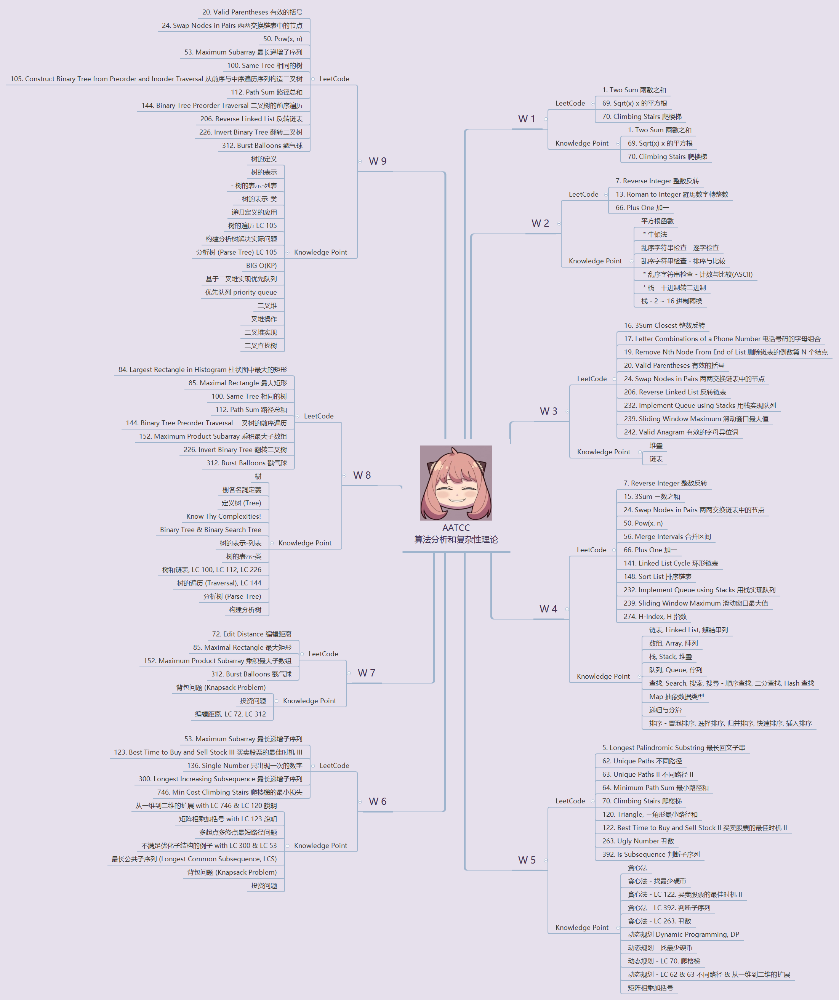

# AATCC - 算法分析和复杂性理论 - Analysis of Algorithms and Theory of Computational Complexity

> 2101212850 干皓丞

PKU 2022 個人實驗報告作業

## Details

第九週課堂總結目前複習與作業。

## Reference

1. https://www.geeksforgeeks.org/construct-tree-from-given-inorder-and-preorder-traversal/

2. https://medium.com/pxcode/getting-started-with-pxcode-pt-3-how-to-integrate-figma-design-1e1232bc1ce9

3. https://www.animaapp.com/blog/design-to-code/how-to-export-figma-to-html/

