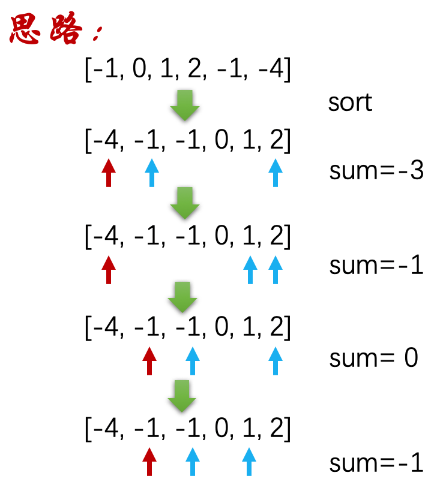
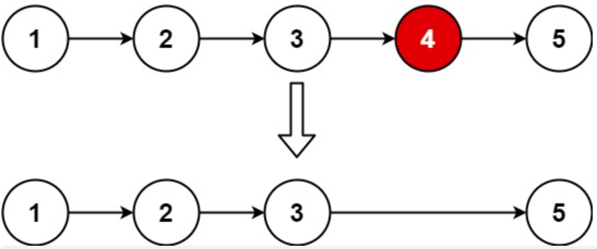
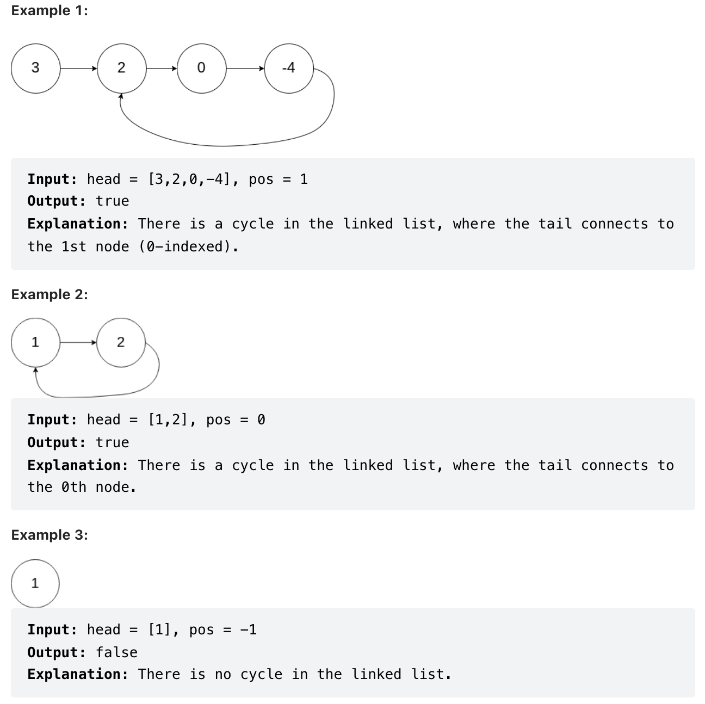
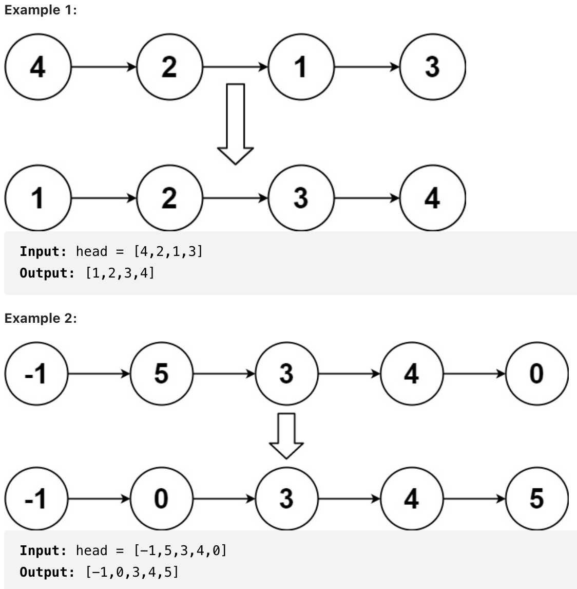

# AATCC - 算法分析和复杂性理论 - Analysis of Algorithms and Theory of Computational Complexity

> 2101212850 干皓丞

PKU 2022 個人實驗報告作業


## LeetCode

### Define

名詞對應 : 

https://github.com/kancheng/kan-cs-report-in-2022/blob/main/AATCC/define.md

### Log

課堂紀錄 :

https://github.com/kancheng/kan-cs-report-in-2022/blob/main/AATCC/log.md

1. Two Sum 兩數之和

7. Reverse Integer 整数反转

13. Roman to Integer 羅馬數字轉整數

15. 3Sum 三数之和

16. 3Sum Closest 整数反转

17. Letter Combinations of a Phone Number 电话号码的字母组合

19. Remove Nth Node From End of List 删除链表的倒数第 N 个结点

20. Valid Parentheses 有效的括号

24. Swap Nodes in Pairs 两两交换链表中的节点

50. Pow(x, n)

56. Merge Intervals 合并区间

66. Plus One 加一

69. Sqrt(x) x 的平方根

70. Climbing Stairs 爬楼梯

141. Linked List Cycle 环形链表

148. Sort List 排序链表

206. Reverse Linked List 反转链表

232. Implement Queue using Stacks 用栈实现队列

239. Sliding Window Maximum 滑动窗口最大值

242. Valid Anagram 有效的字母异位词

274. H-Index, H 指数


## LeetCode 1. Two Sum 兩數之和

Given an array of integers nums and an integer target, return indices of the two numbers such that they add up to target.

You may assume that each input would have exactly one solution, and you may not use the same element twice.

You can return the answer in any order.

给定一个整数数组 nums 和一个整数目标值 target，请你在该数组中找出 和为目标值 target  的那 两个 整数，并返回它们的数组下标。

你可以假设每种输入只会对应一个答案。但是，数组中同一个元素在答案里不能重复出现。

你可以按任意顺序返回答案。

```
class Solution(object):
   def twoSum(self, nums, target):
      """
      :type nums: List[int]
      :type target: int
      :rtype: List[int]
      """
      for i in range(len(nums)):
         tmp = nums[i]
         remain = nums[i+1:]
         if target - tmp in remain:
                return[i, remain.index(target - tmp)+ i + 1]
input_list = [ 2, 7, 11, 15]
target = 9
ob1 = Solution()
print(ob1.twoSum(input_list, target))
```

```
class Solution(object):
    def twoSum(self, nums, target):
        """
        :type nums: List[int]
        :type target: int
        :rtype: List[int]
        """
        dict = {}
        for i in range(len(nums)):
            if target - nums[i] not in dict:
                dict[nums[i]] = i
            else:
                return [dict[target - nums[i]], i]
input_list = [ 2, 7, 11, 15]
target = 9
ob1 = Solution()
print(ob1.twoSum(input_list, target))
```

思路總結

1. 用 For 將每個元素讀過一遍，然後將其逐一取出來一個個判斷，若目標為 9，找到元素 2 ，就會找 7，若找到元素 7 ，就會找 2。效率上沒有很理想。

2. 運用 Python 的字典可以直接去找。用 For 去找，剩下用 IF 來判斷該值有沒有在字典裡面。相對與第一種課堂範例來的理想。


## LeetCode 7. Reverse Integer 整数反转

Given a signed 32-bit integer x, return x with its digits reversed. If reversing x causes the value to go outside the signed 32-bit integer range $[-2^{31}, 2^{31} - 1]$, then return 0.

Assume the environment does not allow you to store 64-bit integers (signed or unsigned).


給你一個 32 位的有符號整數 x ，返回將 x 中的數字部分反轉後的結果。

如果反轉後整數超過 32 位的有符號整數的範圍 $[−2^{31}, 2^{31} − 1]$ ，就返回 0。

假設環境不允許存儲 64 位整數（有符號或無符號）。

給定一個整數數組 nums 和一個整數目標值 target，請你在該數組中找出 和為目標值 target  的那 兩個 整數，並返回它們的數組下標。

你可以假設每種輸入只會對應一個答案。但是，數組中同一個元素在答案裡不能重複出現。

你可以按任意順序返回答案。

Example 1:

```
Input: x = 123
Output: 321
```

Example 2:

```
Input: x = -123
Output: -321
```

Example 3:

```
Input: x = 120
Output: 21
```

思路總結

1. 要求反轉 10 進位。

2. 其反轉的數字必須在 $[−2^31, 2^31 − 1]$ 範圍內，若超過範圍則必須輸出 0 

```
# 絕對值
class Solution1:
    def reverse(self, x: int) -> int:
        max_32 = 2 ** 31 - 1
        if abs(x) > max_32:
            return 0
        if x < 0:
            rint = -int(str(abs(x))[::-1])
        else:
            rint = int(str(x)[::-1])
        if abs(rint) > max_32:
            return 0
        else:
            return rint 
x1 = -123
x2 = 123
x3 = 120
ob1 = Solution1()
print(ob1.reverse(x1))
print(ob1.reverse(x2))
print(ob1.reverse(x3))

# 字串
class Solution2:
    def reverse(self, x):
        """
        :type x: int
        :rtype: int
        """
        if x==0:
            return 0
        str_x = str(x)
        x = ''
        if str_x[0] == '-':
            x += '-'
        x += str_x[len(str_x)-1::-1].lstrip("0").rstrip("-")
        x = int(x)
        if -2**31<x<2**31-1:
            return x
        return 0
x1 = -123
x2 = 123
x3 = 120
ob2 = Solution2()
print(ob2.reverse(x1))
print(ob2.reverse(x2))
print(ob2.reverse(x3))
```

## LeetCode 13. Roman to Integer 羅馬數字轉整數


Roman numerals are represented by seven different symbols: I, V, X, L, C, D and M.

```
Symbol       Value
I             1
V             5
X             10
L             50
C             100
D             500
M             1000
```

For example, 2 is written as II in Roman numeral, just two one's added together. 

12 is written as XII, which is simply X + II. 

The number 27 is written as XXVII, which is XX + V + II.

Roman numerals are usually written largest to smallest from left to right. 

However, the numeral for four is not IIII. 

Instead, the number four is written as IV. 

Because the one is before the five we subtract it making four. 

The same principle applies to the number nine, which is written as IX. There are six instances where subtraction is used:

I can be placed before V (5) and X (10) to make 4 and 9.
X can be placed before L (50) and C (100) to make 40 and 90.
C can be placed before D (500) and M (1000) to make 400 and 900.
Given a roman numeral, convert it to an integer.

羅馬數字包含以下七種字符: I， V， X， L，C，D 和 M。

例如， 羅馬數字 2 寫做 II ，即為兩個並列的 1 。 12 寫做 XII ，即為 X + II 。 27 寫做 XXVII, 即為 XX + V + II 。

通常情況下，羅馬數字中小的數字在大的數字的右邊。但也存在特例，例如 4 不寫做 IIII，而是 IV。數字 1 在數字 5 的左邊，所表示的數等於大數 5 減小數 1 得到的數值 4 。同樣地，數字 9 表示為 IX。這個特殊的規則只適用於以下六種情況：

I 可以放在 V (5) 和 X (10) 的左邊，來表示 4 和 9。

X 可以放在 L (50) 和 C (100) 的左邊，來表示 40 和 90。

C 可以放在 D (500) 和 M (1000) 的左邊，來表示 400 和 900。

給定一個羅馬數字，將其轉換成整數。


Example 1:

```
Input: s = "III"
Output: 3
Explanation: III = 3.
```

Example 2:

```
Input: "IV"
Output: 4
```

Example 3:

```
Input: "IX"
Output: 9
```

Example 4:

```
Input: "LVIII"
Output: 58
Explanation: L = 50, V= 5, III = 3.
```

Example 5:

```
Input: "MCMXCIV"
Output: 1994
Explanation: M = 1000, CM = 900, XC = 90 and IV = 4.
```

Constraints:

- 1 <= s.length <= 15

- s contains only the characters ('I', 'V', 'X', 'L', 'C', 'D', 'M').

s 僅含字符 ('I', 'V', 'X', 'L', 'C', 'D', 'M')

- It is guaranteed that s is a valid roman numeral in the range $[1, 3999]$.

題目數據保證 s 是一個有效的羅馬數字，且表示整數在範圍 $[1, 3999]$ 內

題目所給測試用例皆符合羅馬數字書寫規則，不會出現跨位等情況。 IL 和 IM 這樣的例子並不符合題目要求，49 應該寫作 XLIX，999 應該寫作 CMXCIX 。關於羅馬數字的詳盡書寫規則，可以參考 羅馬數字 - Mathematics 。

https://b2b.partcommunity.com/community/knowledge/en/detail/10753/Roman\%20numerals

思路總結

1. 給一個羅馬數字，將其轉換成整數。其輸入確保在 1 ~ 3999 的範圍內。

2. 按要求的羅馬數字計算出對應的 10 進位阿拉伯數字即可。

3. 首先建立一個 HashMap 或者是 Python 的字典來抓相對應的符號與值，而後對字串從左至右來處理。若當前字符代表的值不小於右邊，就加上該值；否則就减去該值。類推到最左邊的數。

```
class Solution1:
    def romanToInt(self, s):
        rn = {'I':1, 'V':5, 'X':10, 'L':50, 'C':100, 'D':500, 'M':1000}        
        ans=0        
        for i in range(len(s)):            
            if i<len(s)-1 and rn[s[i]]<rn[s[i+1]]:                
                ans -= rn[s[i]]
            else:
                ans += rn[s[i]]
        return ans
x = "III"
ob1 = Solution1()
print(ob1.romanToInt(x))
class Solution2:
    def romanToInt(self, s: 'str') -> 'int':
        value_roman = {"M":1000, "CM":900, "D":500, "CD": 400,
                       "C":100,"XC":90, "L":50, "XL":40,
                       "X":10, "IX":9, "V":5, "IV":4, "I":1}
        num = 0
        specials_list = ["CM","CD","XC","XL","IX","IV"]
        for i in specials_list:
            if i in s:
                num = num + value_roman[i]
                s=s.replace(i,"")
        for i in s:
            num = num + value_roman[i]
        return(num)
x = "III"
ob2 = Solution2()
print(ob2.romanToInt(x))
```

## LeetCode 15. 3Sum 三数之和

Given an integer array nums, return all the triplets [nums[i], nums[j], nums[k]] such that i != j, i != k, and j != k, and nums[i] + nums[j] + nums[k] == 0.

Notice that the solution set must not contain duplicate triplets.


给你一个整数数组 nums，有一个大小为 k 的滑动窗口从数组的最左侧移动到数组的最右侧。你只可以看到在滑动窗口内的 k 个数字。

滑动窗口每次只向右移动一位。返回 滑动窗口中的最大值 。


Example 1:

```
Input: nums = [-1,0,1,2,-1,-4]
Output: [[-1,-1,2],[-1,0,1]]
```

Example 2:

```
Input: nums = []
Output: []
```

Example 3:

```
Input: nums = [0]
Output: []
```

Constraints:

- 0 <= nums.length <= 3000
- -10^5 <= nums[i] <= 10^5


## 解题思路

用 map 提前计算好任意 2 个数字之和，保存起来，可以将时间复杂度降到 O(n^2)。这一题比较麻烦的一点在于，最后输出解的时候，要求输出不重复的解。数组中同一个数字可能出现多次，同一个数字也可能使用多次，但是最后输出解的时候，不能重复。例如 [-1，-1，2] 和 [2, -1, -1]、[-1, 2, -1] 这 3 个解是重复的，即使 -1 可能出现 100 次，每次使用的 -1 的数组下标都是不同的。

这里就需要去重和排序了。map 记录每个数字出现的次数，然后对 map 的 key 数组进行排序，最后在这个排序以后的数组里面扫，找到另外 2 个数字能和自己组成 0 的组合。



```
class Solution(object):
    def threeSum(self, nums):
        if len(nums) < 3:
            return[]
        if all (num == 0 for num in nums):
            return [[ 0, 0, 0]]
        found = []
        nums = sorted(nums)
        rightmost = len(nums) - 1
        for index, eachNum in enumerate(nums):
            left = index + 1
            right = rightmost
            while left < right:
                check_sum = (eachNum + nums[left] + nums[right])
                if check_sum == 0:
                    new_found = [eachNum, nums[left], nums[right]]
                    if new_found not in found:
                        found.append(new_found)
                    right -= 1
                elif check_sum < 0:
                    left += 1
                else :
                    right -= 1
        return found

## 複雜度低版本
class Solution2(object):
    def threeSum(self, nums):
        if len(nums) < 3:
            return []
        if all (num == 0 for num in nums):
            return [[0, 0, 0]]
        found = []
        nums = sorted(nums)
        rightmost = len(nums) - 1
        for index, eachNum in enumerate(nums):
            if index > 0 and nums[index] == nums[index - 1]:
                continue
            left = index + 1
            right = rightmost
            while left < right:
                check_sum = (eachNum + nums[left] + nums[right])
                if check_sum == 0:
                    found.append([eachNum, nums[left], nums[right]])
                    left += 1
                    while left < right and nums[left] == nums[left - 1]:
                        left += 1
                elif check_sum < 0:
                    left += 1
                else :
                    right -= 1
        return found
```


## LeetCode 16. 3Sum Closest 整数反转

Given an integer array nums of length n and an integer target, find three integers in nums such that the sum is closest to target.

Return the sum of the three integers.

You may assume that each input would have exactly one solution.

给你一个长度为 n 的整数数组 nums 和 一个目标值 target。请你从 nums 中选出三个整数，使它们的和与 target 最接近。

返回这三个数的和。

假定每组输入只存在恰好一个解。


Example 1:

```
Input: nums = [-1,2,1,-4], target = 1
Output: 2
Explanation: The sum that is closest to the target is 2. (-1 + 2 + 1 = 2).
```

Example 2:

```
Input: nums = [0,0,0], target = 1
Output: 0
```

Constraints:

- 3 <= nums.length <= 1000

- -1000 <= nums[i] <= 1000

- $-10^4 <= target <= 10^4$

### 解题思路

这一题的解法是用两个指针夹逼的方法。先对数组进行排序，i 从头开始往后面扫。这里同样需要注意数组中存在多个重复数字的问题。具体处理方法很多，可以用 map 计数去重。这里笔者简单的处理，i 在循环的时候和前一个数进行比较，如果相等，i 继续往后移，直到移到下一个和前一个数字不同的位置。j，k 两个指针开始一前一后夹逼。j 为 i 的下一个数字，k 为数组最后一个数字，由于经过排序，所以 k 的数字最大。j 往后移动，k 往前移动，逐渐夹逼出最接近 target 的值。

这道题还可以用暴力解法，三层循环找到距离 target 最近的组合。

```
from typing import List
class Solution:
    def threeSumClosest(self, nums: List[int], target: int) -> int:
        n = len(nums)
        nums.sort()
        re_min = 0 #存储当前最小的差值
        for i in range(n):
            low = i+1
            high = n-1
            while low < high:
                three_sum = nums[i] + nums[low] + nums[high]
                x = target - three_sum #当前三数的差值
                if re_min == 0:
                    re_min = abs(x)
                    sum_min = three_sum #sum_min为当前最接近的和
                if abs(x) < re_min:
                    re_min = abs(x)
                    sum_min = three_sum
                if three_sum == target:
                    return target
                elif three_sum < target:
                    low += 1
                else:
                    high -= 1
        return sum_min
```

## LeetCode 17. Letter Combinations of a Phone Number 电话号码的字母组合


Given a string containing digits from 2-9 inclusive, return all possible letter combinations that the number could represent. Return the answer in any order.

A mapping of digit to letters (just like on the telephone buttons) is given below. Note that 1 does not map to any letters.

给定一个仅包含数字 2-9 的字符串，返回所有它能表示的字母组合。答案可以按 任意顺序 返回。

给出数字到字母的映射如下（与电话按键相同）。注意 1 不对应任何字母。


Example 1:

```
Input: digits = "23"
Output: ["ad","ae","af","bd","be","bf","cd","ce","cf"]
```

Example 2:

```
Input: digits = ""
Output: []
```

Example 3:

```
Input: digits = "2"
Output: ["a","b","c"]
```


Constraints:

- 0 <= digits.length <= 4

- digits[i] is a digit in the range ['2', '9'].(digits[i] 是范围 ['2', '9'] 的一个数字。)


### 解题思路

DFS 递归深搜

### Reference

1. https://www.bilibili.com/video/BV1cy4y167mM/

```
class Solution(object):
    def letterCombinations(self, digits):
        """
        动态规划
        dp[i]: 前i个字母的所有组合
        由于dp[i]只与dp[i-1]有关,可以使用变量代替列表存储降低空间复杂度
        :type digits: str
        :rtype: List[str]
        """
        if not digits:
            return []
        d = {'2': 'abc', '3': 'def', '4': 'ghi', '5': 'jkl',
             '6': 'mno', '7': 'pqrs', '8': 'tuv', '9': 'wxyz'}
        n = len(digits)
        dp = [[] for _ in range(n)]
        dp[0] = [x for x in d[digits[0]]]
        for i in range(1, n):
            dp[i] = [x + y for x in dp[i - 1] for y in d[digits[i]]]
        return dp[-1]

    def letterCombinations2(self, digits):
        """
        使用变量代替上面的列表
        降低空间复杂度
        :type digits: str
        :rtype: List[str]
        """
        if not digits:
            return []
        d = {'2': 'abc', '3': 'def', '4': 'ghi', '5': 'jkl',
             '6': 'mno', '7': 'pqrs', '8': 'tuv', '9': 'wxyz'}
        n = len(digits)
        res = ['']
        for i in range(n):
            res = [x + y for x in res for y in d[digits[i]]]
        return res

    def letterCombinations3(self, digits):
        """
        递归
        :param digits:
        :return:
        """
        d = {'2': 'abc', '3': 'def', '4': 'ghi', '5': 'jkl',
             '6': 'mno', '7': 'pqrs', '8': 'tuv', '9': 'wxyz'}
        if not digits:
            return []
        if len(digits) == 1:
            return [x for x in d[digits[0]]]
        return [x + y for x in d[digits[0]] for y in self.letterCombinations3(digits[1:])]
```

```
class Solution(object):
    def letterCombinations(self, digits):
        if not digits:
            return []
        d = {'2': 'abc', '3': 'def', '4': 'ghi', '5': 'jkl',
             '6': 'mno', '7': 'pqrs', '8': 'tuv', '9': 'wxyz'}
        n = len(digits)
        dp = [[] for _ in range(n)]
        dp[0] = [x for x in d[digits[0]]]
        for i in range(1, n):
            dp[i] = [x + y for x in dp[i - 1] for y in d[digits[i]]]
        return dp[-1]
```

## LeetCode 19. Remove Nth Node From End of List 删除链表的倒数第 N 个结点

Given the head of a linked list, remove the $n^{th}$ node from the end of the list and return its head.

给你一个链表，删除链表的倒数第 n 个结点，并且返回链表的头结点。



Example 1:

```
Input: head = [1,2,3,4,5], n = 2
Output: [1,2,3,5]
```

Example 2:

```
Input: head = [1], n = 1
Output: []
```

Example 3:

```
Input: head = [1,2], n = 1
Output: [1]
```

Constraints:

- The number of nodes in the list is sz.(链表中结点的数目为 sz)

- 1 <= sz <= 30

- 0 <= Node.val <= 100

- 1 <= n <= sz

Follow up: Could you do this in one pass?(你能尝试使用一趟扫描实现吗？)

### 解题思路

- 先循环一次拿到链表的总长度，然后循环到要删除的结点的前一个结点开始删除操作。需要注意的一个特例是，有可能要删除头结点，要单独处理。

- 这道题有一种特别简单的解法。设置 2 个指针，一个指针距离前一个指针 n 个距离。同时移动 2 个指针，2 个指针都移动相同的距离。当一个指针移动到了终点，那么前一个指针就是倒数第 n 个节点了。

### Reference

https://stackoverflow.com/questions/61610160/remove-nth-node-from-end-of-listleetcode-python

```
"""
class Solution:
    def removeNthFromEnd(self, head: ListNode, n: int) -> ListNode:
        head_dummy = ListNode()
        head_dummy.next = head

        slow, fast = head_dummy, head_dummy
        while(n!=0): # fast先往前走n步
            fast = fast.next
            n -= 1
        while(fast.next!=None):
            slow = slow.next
            fast = fast.next
        # fast 走到结尾后，slow 的下一个节点为倒数第N个节点
        slow.next = slow.next.next # 删除
        return head_dummy.next
"""
class Solution:
    def removeNthFromEnd(self, head, n):
        fast = slow = head
        for _ in range(n):
            fast = fast.next
        if not fast:
            return head.next
        while fast.next:
            fast = fast.next
            slow = slow.next
        slow.next = slow.next.next
        return head
```

## LeetCode 20. Valid Parentheses 有效的括号

Given a string s containing just the characters '(', ')', '{', '}', '[' and ']', determine if the input string is valid.

An input string is valid if:

1. Open brackets must be closed by the same type of brackets.

2. Open brackets must be closed in the correct order.


给定一个只包括 '(', ')', '{', '}', '[' and ']' 的字符串 s ，判断字符串是否有效。

有效字符串需满足：

1. 左括号必须用相同类型的右括号闭合。

2. 左括号必须以正确的顺序闭合。


Example 1:

```
Input: s = "()"
Output: true
```

Example 2:

```
Input: s = "()[]{}"
Output: true
```

Example 3:

```
Input: s = "(]"
Output: false
```

Constraints - 提示:

- $1 <= s.length <= 10^4$
- s consists of parentheses only '()[]{}'.

s 仅由括号 '()[]{}' 组成


### 解题思路

- 遇到左括号就进栈push，遇到右括号并且栈顶为与之对应的左括号，就把栈顶元素出栈。最后看栈里面还有没有其他元素，如果为空，即匹配。

- 需要注意，空字符串是满足括号匹配的，即输出 true。

### 補充

括號匹配是使用棧解決的經典問題。題意其實就像我們在寫代碼的過程中，要求括號的順序是一樣的，有左括號，相應的位置必須要有右括號。

如果還記得編譯原理的話，編譯器在 詞法分析的過程中處理括號、花括號等這個符號的邏輯，也是使用了棧這種數據結構。

再舉個例子，linux 系統中，cd 這個進入目錄的命令我們應該再熟悉不過了。

```
cd a/b/c/../../
```

這個命令最後進入a目錄，系統是如何知道進入了a目錄呢 ，即為棧的應用

```
class Solution(object):
    def isValid(self, s):
        stack = []
        paren_map = {')': '(', ']':'[', '}':'{'}
        for c in s:
            if c not in paren_map:
                stack.append(c)
            elif not stack or paren_map[c] != stack.pop():
                return False
        return not stack
x = "()"
ob = Solution()
print(ob.isValid(x))

class Solution:
    def isValid(self, s):
        while '{}' in s or '()' in s or '[]' in s:
            s = s.replace('{}', '')
            s = s.replace('[]', '')
            s = s.replace('()', '')
        return s == ''
x = "()"
x1 = "([)]"
x2 = "{{([][])}()}"

ob = Solution()
print(ob.isValid(x))
print(ob.isValid(x1))
print(ob.isValid(x2))

# 使用栈
class Solution:
    def isValid(self, s: str) -> bool:
        stack = []        
        for item in s:
            if item == '(':
                stack.append(')')
            elif item == '[':
                stack.append(']')
            elif item == '{':
                stack.append('}')
            elif not stack or stack[-1] != item:
                return False
            else:
                stack.pop()        
        return True if not stack else False
x = "()"
ob = Solution()
print(ob.isValid(x))

# 使用字典
class Solution:
    def isValid(self, s: str) -> bool:
        stack = []
        mapping = {
            '(': ')',
            '[': ']',
            '{': '}'
        }
        for item in s:
            if item in mapping.keys():
                stack.append(mapping[item])
            elif not stack or stack[-1] != item: 
                return False
            else: 
                stack.pop()
        return True if not stack else False
x = "()"
ob = Solution()
print(ob.isValid(x))
```

## LeetCode 24. Swap Nodes in Pairs 两两交换链表中的节点

Given a linked list, swap every two adjacent nodes and return its head. You must solve the problem without modifying the values in the list's nodes (i.e., only nodes themselves may be changed.)

给你一个链表，两两交换其中相邻的节点，并返回交换后链表的头节点。你必须在不修改节点内部的值的情况下完成本题（即，只能进行节点交换）。

Example 1:

```
Input: head = [1,2,3,4]
Output: [2,1,4,3]
```

Example 2:

```
Input: head = []
Output: []
```

Example 3:

```
Input: head = [1]
Output: [1]
```

Constraints - 提示:

- The number of nodes in the list is in the range [0, 100]. (链表中节点的数目在范围 [0, 100] 内)

- 0 <= Node.val <= 100


### 解题思路

两两相邻的元素，翻转链表

`pre->a->b->b.next to pre->b->a->b.next`

```
# Knowledge Point

class ListNode:
    def __init__(self, x):
        self.val = x
        self.next = None

    def __repr__(self):
        if self:
            return "{} -> {}".format(self.val, repr(self.next))

if __name__ == "__main__":
    head = ListNode(1)
    head.next = ListNode(2)
    head.next.next = ListNode(3)
    head.next.next.next = ListNode(4)
    head.next.next.next.next = ListNode(5)
    print(head)
```

### Reference

1. https://ithelp.ithome.com.tw/m/articles/10271920

2. https://ithelp.ithome.com.tw/articles/10263980

```
class Solution:
    def swapPairs(self, head: ListNode) -> ListNode:
        pre, pre.next = self, head
        while pre.next and pre.next.next:
            a = pre.next
            b = a.next
            pre.next, b.next, a.next = b, a, b.next
            pre = a
        return self.next
```

## LeetCode 50. Pow(x, n)

Implement pow(x, n), which calculates x raised to the power n (i.e., $x^n$).

实现 pow(x, n) ，即计算 x 的 n 次幂函数（即，$x^n$ ）。


Example 1:

```
Input: x = 2.00000, n = 10
Output: 1024.00000
```

Example 2:

```
Input: x = 2.10000, n = 3
Output: 9.26100
```

Example 3:

```
Input: x = 2.00000, n = -2
Output: 0.25000
Explanation:$ 2^{-2} = {1/2}^{2} = 1/4 = 0.25$
```

Constraints:

- $-100.0 < x < 100.0$
- $-2^{31} <= n <= 2^{31}-1$
- $-10^4 <= x^n <= 10^4$

## 解题思路

要求计算 Pow(x, n)

这一题用递归的方式，不断的将 n 2 分下去。注意 n 的正负数，n 的奇偶性。

```
# KP
# LC 50 Pow(x, n)

# 递归
def myPow(x, n):
    if not n:
        return 1
    if n < 0:
        return 1/ myPow(x, -n)
    if n % 2:
        return x * myPow(x, n - 1)
    return myPow(x * x, n / 2)

# 非递归
def myPow2(x, n):
    if n < 0:
        x = 1 / x
        n = -n
    pow = 1
    while n:
        if n & 1:
            pow *= x
        x *= x
        n >>= 1
    return pow
```

## LeetCode 56. Merge Intervals 合并区间

Given an array of intervals where intervals[i] = [$start_{i}, end_{i}$], merge all overlapping intervals, and return an array of the non-overlapping intervals that cover all the intervals in the input.

以数组 intervals 表示若干个区间的集合，其中单个区间为 intervals[i] = [$start_{i}, end_{i}$] 。请你合并所有重叠的区间，并返回一个不重叠的区间数组，该数组需恰好覆盖输入中的所有区间。


Example 1:

```
Input: intervals = [[1,3],[2,6],[8,10],[15,18]]
Output: [[1,6],[8,10],[15,18]]
Explanation: Since intervals [1,3] and [2,6] overlaps, merge them into [1,6].
```

Example 2:

```
Input: intervals = [[1,4],[4,5]]
Output: [[1,5]]
Explanation: Intervals [1,4] and [4,5] are considered overlapping.
```

Constraints:

- 1 <= intervals.length <= $10^4$

- intervals[i].length == 2

- 0 <= $start_{i}$ <= $end_{i}$ <= $10^4$


## 解题思路

先按照区间起点进行排序。然后从区间起点小的开始扫描，依次合并每个有重叠的区间。

```
from typing import List
class Solution:
    def merge(self, intervals: List[List[int]]) -> List[List[int]]:
        intervals.sort()   #排序列表，以区间开头升序排列
        ans = [intervals[0]]
        L, R = 1, 0
        while L < len(intervals):
            if ans[R][1] < intervals[L][0]:   #如果区间不重合，直接append
                ans.append(intervals[L])
                L += 1
                R += 1
            else:      #如果区间重合，就合并区间
                ans[R] = [ans[R][0], max(ans[R][1], intervals[L][1])]
                L += 1
        return ans
```

## LeetCode 69. Sqrt(x) x 的平方根

Given a non-negative integer x, compute and return the square root of x.

Since the return type is an integer, the decimal digits are truncated, and only the integer part of the result is returned.

Note: You are not allowed to use any built-in exponent function or operator, such as pow(x, 0.5) or x ** 0.5.

给你一个非负整数 x ，计算并返回 x 的 算术平方根 。

由于返回类型是整数，结果只保留 整数部分 ，小数部分将被 舍去 。

注意：不允许使用任何内置指数函数和算符，例如 pow(x, 0.5) 或者 x ** 0.5 。

### 二分查找

```
class Solution:
    def mySqrt(self, x):
        """
        :type x: int
        :rtype: int
        """
        if x < 2:
            return x
        left, right = 1, x // 2
        while left <= right:
            mid = left + (right - left) // 2
            if mid > x / mid:
                right = mid - 1
            else:
                left = mid + 1
        return left - 1
x1 = 4
x2 = 9
ob1 = Solution()
print(ob1.mySqrt(x1))
print(ob1.mySqrt(x2))
```

### 牛頓法

```
def squareroot(input_num):
    root = input_num/2
    for k in range(20):
        root = (1/2)* (root + (input_num/root))
    return root

print(squareroot(3))
```

思路總結

1. 二分查找，分成左右區間。

2. 牛頓法

## LeetCode 66. Plus One 加一


You are given a large integer represented as an integer array digits, where each digits[i] is the $i^{th}$ digit of the integer. 

The digits are ordered from most significant to least significant in left-to-right order. 

The large integer does not contain any leading 0's.

Increment the large integer by one and return the resulting array of digits.

給定一個由 整數 組成的 非空 數組所表示的非負整數，在該數的基礎上加一。

最高位數字存放在數組的首位， 數組中每個元素只存儲單個數字。

你可以假設除了整數 0 之外，這個整數不會以零開頭。


Example 1:

```
Input: digits = [1,2,3]
Output: [1,2,4]
Explanation: The array represents the integer 123.
Incrementing by one gives 123 + 1 = 124.
Thus, the result should be [1,2,4].
```

Example 2:

```
Input: digits = [4,3,2,1]
Output: [4,3,2,2]
Explanation: The array represents the integer 4321.
Incrementing by one gives 4321 + 1 = 4322.
Thus, the result should be [4,3,2,2].
```

Example 3:

```
Input: digits = [9]
Output: [1,0]
Explanation: The array represents the integer 9.
Incrementing by one gives 9 + 1 = 10.
Thus, the result should be [1,0].
```

Constraints:

1. 1 <= digits.length <= 100

2. 0 <= digits[i] <= 9

3.  digits does not contain any leading 0's.

思路總結

1. 給一個陣列(数组, Array)，代表一個十進位數，陣列的 0 下標是十進位數的高位。要求計算這個十進位數加一以後的結果。

2. 從陣列尾部開始由後往前掃，逐位進位即可。最高位若還有進位的需要則在數組內第 0 位再插入一個 1。

```
from typing import List
class Solution1:
    def plusOne(self, digits: List[int]) -> List[int]:
        h = ''.join(map(str, digits))
        h = str(int(h) + 1)
        output = []
        for ch in h:
            output.append(int(ch))
        return output
x = [1,2,3]
ob1 = Solution1()
print(ob1.plusOne([1,2,3]))
class Solution2:
    def plusOne(self, digits: List[int]) -> List[int]:
        return list(map(int, list(str(int(''.join(map(str, digits))) + 1))))
x = [1,2,3]
ob2 = Solution2()
print(ob2.plusOne([1,2,3]))
```


## LeetCode 70. Climbing Stairs 爬楼梯

You are climbing a staircase. It takes n steps to reach the top.

Each time you can either climb 1 or 2 steps. In how many distinct ways can you climb to the top?

假设你正在爬楼梯。需要 n 阶你才能到达楼顶。

每次你可以爬 1 或 2 个台阶。你有多少种不同的方法可以爬到楼顶呢？

```
class Solution:
    def climbStairs(self, n):
        prev, current = 0, 1
        for i in range(n):
            prev, current = current, prev + current
        return current
x1 = 2
x2 = 3
ob1 = Solution()
print(ob1.climbStairs(x1))
print(ob1.climbStairs(x2))
```

思路總結

1. 動態規劃，遞迴公式 f(n-1) + f(n-2)，其結果就是費氏數列。來判斷該值有沒有在字典裡面。相對與第一種課堂範例來的理想。


## LeetCode 141. Linked List Cycle 环形链表

Given head, the head of a linked list, determine if the linked list has a cycle in it.

There is a cycle in a linked list if there is some node in the list that can be reached again by continuously following the next pointer. Internally, pos is used to denote the index of the node that tail's next pointer is connected to. Note that pos is not passed as a parameter.

Return true if there is a cycle in the linked list. Otherwise, return false.

给你一个链表的头节点 head ，判断链表中是否有环。

如果链表中有某个节点，可以通过连续跟踪 next 指针再次到达，则链表中存在环。 为了表示给定链表中的环，评测系统内部使用整数 pos 来表示链表尾连接到链表中的位置（索引从 0 开始）。注意：pos 不作为参数进行传递 。仅仅是为了标识链表的实际情况。

如果链表中存在环 ，则返回 true 。 否则，返回 false 。



Example 1:

```
Input: head = [3,2,0,-4], pos = 1
Output: true
Explanation: There is a cycle in the linked list, where the tail connects to the 1st node (0-indexed).
链表中有一个环，其尾部连接到第二个节点。
```

Example 2:

```
Input: head = [1,2], pos = 0
Output: true
Explanation: There is a cycle in the linked list, where the tail connects to the 0th node.
链表中有一个环，其尾部连接到第一个节点。
```

Example 3:

```
Input: head = [1], pos = -1
Output: false
Explanation: There is no cycle in the linked list.
链表中没有环。
```

Constraints:

- The number of the nodes in the list is in the range(链表中节点的数目范围是) [0, $10^4$].
- $-10^5 <= Node.val <= 10^5$
- pos is -1 or a valid index in the linked-list.(pos 为 -1 或者链表中的一个 有效索引 。)

Follow up: Can you solve it using O(1) (i.e. constant) memory?(你能用 O(1)（即，常量）内存解决此问题吗？)

## 解题思路

给 2 个指针，一个指针是另外一个指针的下一个指针。快指针一次走 2 格，慢指针一次走 1 格。如果存在环，那么前一个指针一定会经过若干圈之后追上慢的指针。

## Reference

- Jserv Linux 核心設計/實作 : https://hackmd.io/@sysprog/linux2022-lab0

- 你所不知道的 C 語言: linked list 和非連續記憶體 : https://hackmd.io/@sysprog/c-linked-list

```
# Linked List Cycle
class Solution(object):
    def hasCycle(self, head):
        fast, slow = head, head
        while fast and fast.next:
            fast, slow = fast.next.next, slow.next
            if fast == slow:
                return True
        return False
```

## LeetCode 148. Sort List 排序链表

Given the head of a linked list, return the list after sorting it in ascending order.

给你链表的头结点 head ，请将其按 升序 排列并返回 排序后的链表 。



Example 1:

```
Input: head = [4,2,1,3]
Output: [1,2,3,4]
```

Example 2:

```
Input: head = [-1,5,3,4,0]
Output: [-1,0,3,4,5]
```

Example 3:

```
Input: head = []
Output: []
```

Constraints:

- The number of nodes in the list is in the range [0, 5 * $10^4$].(链表中节点的数目在范围 [0, 5 * $10^4$])

- $-10^5$ <= Node.val <= $10^5$

Follow up: Can you sort the linked list in O(n logn) time and O(1) memory (i.e. constant space)?

你可以在 O(n log n) 时间复杂度和常数级空间复杂度下，对链表进行排序吗？


## 解题思路

归并排序 ..

```
# Definition for singly-linked list.
class ListNode:
    def __init__(self, val=0, next=None):
        self.val = val
        self.next = next

class Solution:
    def sortList(self, head: ListNode) -> ListNode:
        h_head = ListNode(-1, head)
        mem = []
        while(head is not None):
            next_h = head.next
            head.next = None
            mem.append(head)
            head = next_h
        mem = sorted(mem, key=lambda x: x.val)
        n = len(mem)
        if n == 0:
            return None
        h_head.next = mem[0]
        for i in range(n-1):
            mem[i].next = mem[i+1]     
        return h_head.next
```

## LeetCode 206. Reverse Linked List 反转链表

Given the head of a singly linked list, reverse the list, and return the reversed list.

给你单链表的头节点 head ，请你反转链表，并返回反转后的链表。

Example 1:

```
Input: head = [1,2,3,4,5]
Output: [5,4,3,2,1]
```

Example 2:

```
Input: head = [1,2]
Output: [2,1]
```

Example 3:

```
Input: head = []
Output: []
```

Constraints - 提示:

- The number of nodes in the list is the range [0, 5000].(链表中节点的数目范围是 [0, 5000])

- -5000 <= Node.val <= 5000


Follow-up: 

A linked list can be reversed either iteratively or recursively. Could you implement both?

链表可以选用迭代或递归方式完成反转。你能否用两种方法解决这道题？


### 解题思路

两种思路 1.后挂 2.交换

```
# Knowledge Point

class ListNode:
    def __init__(self, x):
        self.val = x
        self.next = None

    def __repr__(self):
        if self:
            return "{} -> {}".format(self.val, repr(self.next))

    if __name__ == "__main__":
        head = ListNode(1)
        head.next = ListNode(2)
        head.next.next = ListNode(3)
        head.next.next.next = ListNode(4)
        head.next.next.next.next = ListNode(5)
        print(head)
```

### Reference

1. https://ithelp.ithome.com.tw/m/articles/10271920

2. https://ithelp.ithome.com.tw/articles/10263980

```
class ListNode:
    def __init__(self, x):
        self.val = x
        self.next = None

    def __repr__(self):
        if self:
            return "{} -> {}".format(self.val, repr(self.next))

class Solution:
    def reverseList(self, head):
        dummy = ListNode(float("-inf"))
        while head:
            dummy.next, head.next, head = head, dummy.next, head.next
        return dummy.next

# 交換法

class Solution:
    def reverseList(self, head: Optional[ListNode]) -> Optional[ListNode]:
        prev = None
        while head:
            next = head.next
            head.next = prev
            prev = head
            head = next
        return prev

# 遞迴法
class Solution:
    def reverseList(self, head: Optional[ListNode], prev=None) -> Optional[ListNode]:
        if not head: return prev
        next = head.next # 先把下一個記起來
        head.next = prev # 將自己反過來指向前一個
        return self.reverseList(next, head)
```

## LeetCode 232. Implement Queue using Stacks 用栈实现队列

Implement a first in first out (FIFO) queue using only two stacks. The implemented queue should support all the functions of a normal queue (push, peek, pop, and empty).

Implement the MyQueue class:

- void push(int x) Pushes element x to the back of the queue.

- int pop() Removes the element from the front of the queue and returns it.

- int peek() Returns the element at the front of the queue.

- boolean empty() Returns true if the queue is empty, false otherwise.

Notes:

- You must use only standard operations of a stack, which means only push to top, peek/pop from top, size, and is empty operations are valid.

- Depending on your language, the stack may not be supported natively. You may simulate a stack using a list or deque (double-ended queue) as long as you use only a stack's standard operations.

请你仅使用两个栈实现先入先出队列。队列应当支持一般队列支持的所有操作（push、pop、peek、empty）：

实现 MyQueue 类：

- void push(int x) 将元素 x 推到队列的末尾
- int pop() 从队列的开头移除并返回元素
- int peek() 返回队列开头的元素
- boolean empty() 如果队列为空，返回 true ；否则，返回 false

说明：

- 你 只能 使用标准的栈操作 —— 也就是只有 push to top, peek/pop from top, size, 和 is empty 操作是合法的。

- 你所使用的语言也许不支持栈。你可以使用 list 或者 deque（双端队列）来模拟一个栈，只要是标准的栈操作即可


Example 1:

```
Input
["MyQueue", "push", "push", "peek", "pop", "empty"]
[[], [1], [2], [], [], []]
Output
[null, null, null, 1, 1, false]

Explanation
MyQueue myQueue = new MyQueue();
myQueue.push(1); // queue is: [1]
myQueue.push(2); // queue is: [1, 2] (leftmost is front of the queue)
myQueue.peek(); // return 1
myQueue.pop(); // return 1, queue is [2]
myQueue.empty(); // return false
```


Constraints - 提示:

- 1 <= x <= 9

- At most 100 calls will be made to push, pop, peek, and empty. (最多调用 100 次 push、pop、peek 和 empty)

- All the calls to pop and peek are valid. (假设所有操作都是有效的 （例如，一个空的队列不会调用 pop 或者 peek 操作）)


Follow-up: 

Can you implement the queue such that each operation is amortized O(1) time complexity? In other words, performing n operations will take overall O(n) time even if one of those operations may take longer.

你能否实现每个操作均摊时间复杂度为 O(1) 的队列？换句话说，执行 n 个操作的总时间复杂度为 O(n) ，即使其中一个操作可能花费较长时间。


### 解题思路

- 用栈实现一个队列的基本操作：push(x)、pop()、peek()、empty()。

```
class MyQueue:
    def __init__(self):
        """
        in主要负责push，out主要负责pop
        """
        self.stack_in = []
        self.stack_out = []
    def push(self, x: int) -> None:
        """
        有新元素进来，就往in里面push
        """
        self.stack_in.append(x)
    def pop(self) -> int:
        """
        Removes the element from in front of queue and returns that element.
        """
        if self.empty():
            return None
        
        if self.stack_out:
            return self.stack_out.pop()
        else:
            for i in range(len(self.stack_in)):
                self.stack_out.append(self.stack_in.pop())
            return self.stack_out.pop()
    def peek(self) -> int:
        """
        Get the front element.
        """
        ans = self.pop()
        self.stack_out.append(ans)
        return ans
    def empty(self) -> bool:
        """
        只要in或者out有元素，说明队列不为空
        """
        return not (self.stack_in or self.stack_out)
    
# Your MyQueue object will be instantiated and called as such:
# obj = MyQueue()
# obj.push(x)
# param_2 = obj.pop()
# param_3 = obj.peek()
# param_4 = obj.empty()
x = ["MyQueue","push","push","peek","pop","empty"]
obj = MyQueue()
print(obj.push(x))
param_2 = obj.pop()
param_3 = obj.peek()
param_4 = obj.empty()
print(param_2)
print(param_3)
print(param_4)
    
class MyQueue:
    def __init__(self):
        self.A, self.B =[], []
    def push (self, x):
        self.A.append(x)

    def pop(self):
        self.peek()
        return self.B.pop()

    def peek(self):
        if not self.B:
            while self.A:
                self.B.append(self.A.pop())
        return self.B[-1]

    def empty(self):
        return not self.A and not self.B
```

## LeetCode 239. Sliding Window Maximum 滑动窗口最大值

You are given an array of integers nums, there is a sliding window of size k which is moving from the very left of the array to the very right. You can only see the k numbers in the window. Each time the sliding window moves right by one position.

Return the max sliding window.


给你一个整数数组 nums，有一个大小为 k 的滑动窗口从数组的最左侧移动到数组的最右侧。你只可以看到在滑动窗口内的 k 个数字。

滑动窗口每次只向右移动一位。返回 滑动窗口中的最大值 。


Example 1:

```
Input: nums = [1,3,-1,-3,5,3,6,7], k = 3
Output: [3,3,5,5,6,7]
Explanation: 
Window position                Max
---------------               -----
[1  3  -1] -3  5  3  6  7       3
 1 [3  -1  -3] 5  3  6  7       3
 1  3 [-1  -3  5] 3  6  7       5
 1  3  -1 [-3  5  3] 6  7       5
 1  3  -1  -3 [5  3  6] 7       6
 1  3  -1  -3  5 [3  6  7]      7
```

Example 2:

```
Input: nums = [1], k = 1
Output: [1]
```

Constraints:

- $1 <= nums.length <= 10^5$

- $-10^4 <= nums[i] <= 10^4$

- $1 <= k <= nums.length$


### 解题思路

- 給定一個數組和一個窗口為 K 的窗口，當窗口從數組的左邊滑動到數組右邊的時候，輸出每次移動窗口以後，在窗口內的最大值。

- 這道題最暴力的方法就是 2 層循環，時間複雜度 O(n * K)。

- 另一種思路是用優先隊列，每次窗口以後的時候都向優先隊列裡面新增一個節點，並刪除一個節點。時間複雜度是 O(n * log n)

- 最優的解法是用雙端隊列，隊列的一邊永遠都存的是窗口的最大值，隊列的另外一個邊存的是比最大值小的值。隊列中最大值左邊的所有值都出隊。在保證了雙端隊列的一邊即是最大值以後，時間複雜度是 O(n)，空間複雜度是 O(K)

```
class Solution(object):
    def maxSlidingWindow(self, nums, k):
        win, ret = [], []
        for i, v in enumerate(nums):
            if i >= k and win[0] <= i - k: win.pop(0)
            while win and nums[win[-1]] <= v: win.pop()
            win.append(i)
            if i >= k - 1: ret.append(nums[win[0]])
        return ret
# 思路：维护窗口，向右移动时左侧超出窗口的值弹出，
# 因为需要的是窗口内的最大值，
# 所以只要保证窗口内的值是递减的即可，小于新加入的值全部弹出。
# 最左端即为窗口最大值 python解法：
x = [1,3,-1,-3,5,3,6,7]
kn = 3
ob = Solution()
print(ob.maxSlidingWindow(x, kn))
```

```
/*
  思路： 遍历数组 L R 为滑窗左右边界 只增不减
        双向队列保存当前窗口中最大的值的数组下标 双向队列中的数从大到小排序，
        新进来的数如果大于等于队列中的数 则将这些数弹出 再添加
        当R-L+1=k 时 滑窗大小确定 每次R前进一步L也前进一步 保证此时滑窗中最大值的
        数组下标在[L，R]中，并将当前最大值记录
  举例： nums[1，3，-1，-3，5，3，6，7] k=3
     1：L=0，R=0，队列【0】 R-L+1 < k
            队列代表值【1】
     2: L=0,R=1, 队列【1】 R-L+1 < k
            队列代表值【3】
     解释：当前数为3 队列中的数为【1】 要保证队列中的数从大到小 弹出1 加入3
          但队列中保存的是值对应的数组下标 所以队列为【1】 窗口长度为2 不添加记录
     3: L=0,R=2, 队列【1，2】 R-L+1 = k ,result={3}
            队列代表值【3，-1】
     解释：当前数为-1 队列中的数为【3】 比队列尾值小 直接加入 队列为【3，-1】
          窗口长度为3 添加记录记录为队首元素对应的值 result[0]=3
     4: L=1,R=3, 队列【1，2，3】 R-L+1 = k ,result={3，3}
            队列代表值【3，-1,-3】
     解释：当前数为-3 队列中的数为【3，-1】 比队列尾值小 直接加入 队列为【3，-1，-3】
          窗口长度为4 要保证窗口大小为3 L+1=1 此时队首元素下标为1 没有失效
          添加记录记录为队首元素对应的值 result[1]=3
     5: L=2,R=4, 队列【4】 R-L+1 = k ,result={3，3，5}
            队列代表值【5】
     解释：当前数为5 队列中的数为【3，-1，-3】 保证从大到小 依次弹出添加 队列为【5】
          窗口长度为4 要保证窗口大小为3 L+1=2 此时队首元素下标为4 没有失效
          添加记录记录为队首元素对应的值 result[2]=5
    依次类推 如果队首元素小于L说明此时值失效 需要弹出
*/
class Solution {
    public int[] maxSlidingWindow(int[] nums, int k) {
        if(nums==null||nums.length<2) return nums;
        // 双向队列 保存当前窗口最大值的数组位置 保证队列中数组位置的数按从大到小排序
        LinkedList<Integer> list = new LinkedList();
        // 结果数组
        int[] result = new int[nums.length-k+1];
        for(int i=0;i<nums.length;i++){
            // 保证从大到小 如果前面数小 弹出
            while(!list.isEmpty()&&nums[list.peekLast()]<=nums[i]){
                list.pollLast();
            }
            // 添加当前值对应的数组下标
            list.addLast(i);
            // 初始化窗口 等到窗口长度为k时 下次移动在删除过期数值
            if(list.peek()<=i-k){
                list.poll();   
            } 
            // 窗口长度为k时 再保存当前窗口中最大值
            if(i-k+1>=0){
                result[i-k+1] = nums[list.peek()];
            }
        }
        return result;
    }
}
```

## LeetCode 242. Valid Anagram 有效的字母异位词

有效的字母异位词 : 两个单词包含相同的字母，但是次序不同

Given two strings s and t, return true if t is an anagram of s, and false otherwise.

An Anagram is a word or phrase formed by rearranging the letters of a different word or phrase, typically using all the original letters exactly once.

给定两个字符串 s 和 t ，编写一个函数来判断 t 是否是 s 的字母异位词。

注意：若 s 和 t 中每个字符出现的次数都相同，则称 s 和 t 互为字母异位词。

Example 1:

```
Input: s = "anagram", t = "nagaram"
Output: true
```

Example 2:

```
Input: s = "rat", t = "car"
Output: false
```

Constraints - 提示:

- 1 <= s.length, t.length <= 5 * 10^4

- s and t consist of lowercase English letters.(s 和 t 仅包含小写字母)

Follow up - 进阶: What if the inputs contain Unicode characters? How would you adapt your solution to such a case?

如果输入字符串包含 unicode 字符怎么办？你能否调整你的解法来应对这种情况？


### 解题思路

- 可用打表的方式做。先把 s 中的每个字母都存在一个 26 个容量的数组里面，每个下标依次对应 26 个字母。s 中每个字母都对应表中一个字母，每出现一次就加 1。然后再扫字符串 t，每出现一个字母就在表里面减一。如果都出现了，最终表里面的值肯定都是 0 。最终判断表里面的值是否都是 0 即可，有非 0 的数都输出 false 。

```
# defaultdict 解
class Solution:
    def isAnagram(self, s: str, t: str) -> bool:
        from collections import defaultdict
        s_dict = defaultdict(int)
        t_dict = defaultdict(int)
        for x in s:
            s_dict[x] += 1
        for x in t:
            t_dict[x] += 1
        return s_dict == t_dict

# dic 解
class Solutiont:
    def isAnagram(self, s, t):
        dic1, dic2 = {}, {}
        for item in s:
            dic1[item] = dic1.get(item, 0) + 1
        for item in t:
            dic2[item] = dic2.get(item, 0) + 1
        return dic1 == dic2

s = "anagram"
t = "nagaram"
ob = Solution()
print(ob.isAnagram(s, t))

# ASCII 解
class Solutiont:
    def isAnagram(self, s, t):
        dic1, dic2 = [0]*26, [0]*26
        for item in s:
            dic1[ord(item) - ord('a')] += 1
        for item in t:
            dic2[ord(item) - ord('a')] += 1
        return dic1 == dic2

s = "anagram"
t = "nagaram"
ob = Solution()
print(ob.isAnagram(s, t))

class Solution:
    def isAnagram(self, s: str, t: str) -> bool:
        return sorted(s) == sorted(t)
s = "anagram"
t = "nagaram"
ob = Solution()
print(ob.isAnagram(s, t))
```

## LeetCode 274. H-Index, H 指数


Given an array of integers citations where citations[i] is the number of citations a researcher received for their ith paper, return compute the researcher's h-index.

According to the definition of h-index on Wikipedia: A scientist has an index h if h of their n papers have at least h citations each, and the other n − h papers have no more than h citations each.

If there are several possible values for h, the maximum one is taken as the h-index.

给你一个整数数组 citations ，其中 citations[i] 表示研究者的第 i 篇论文被引用的次数。计算并返回该研究者的 h 指数。

根据维基百科上 h 指数的定义：h 代表“高引用次数”，一名科研人员的 h指数是指他（她）的 （n 篇论文中）总共有 h 篇论文分别被引用了至少 h 次。且其余的 n - h 篇论文每篇被引用次数不超过 h 次。

如果 h 有多种可能的值，h 指数 是其中最大的那个。

Example 1:

```
Input: citations = [3,0,6,1,5]
Output: 3
Explanation: [3,0,6,1,5] means the researcher has 5 papers in total and each of them had received 3, 0, 6, 1, 5 citations respectively.
Since the researcher has 3 papers with at least 3 citations each and the remaining two with no more than 3 citations each, their h-index is 3.

给定数组表示研究者总共有 5 篇论文，每篇论文相应的被引用了 3, 0, 6, 1, 5 次。
由于研究者有 3 篇论文每篇 至少 被引用了 3 次，其余两篇论文每篇被引用 不多于 3 次，所以她的 h 指数是 3。
```

Example 2:

```
Input: citations = [1,3,1]
Output: 1
```

Constraints:

- n == citations.length

- 1 <= n <= 5000

- 0 <= citations[i] <= 1000


## 解题思路

可以先将数组里面的数从小到大排序。因为要找最大的 h-index，所以从数组末尾开始往前找，找到第一个数组的值，小于，总长度减去下标的值，这个值就是 h-index。

```
class Solution(object):
    def hIndex(self, citations):
        index = 0
        citations.sort(reverse=True)
        for i in citations:
            if i > index:
                index +=1
        return index
```
