# AATCC - 算法分析和复杂性理论 - Analysis of Algorithms and Theory of Computational Complexity

> 2101212850 干皓丞

PKU 2022 個人實驗報告作業


## LeetCode

### Define

名詞對應 : 

https://github.com/kancheng/kan-cs-report-in-2022/blob/main/AATCC/define.md

### Log

課堂紀錄 :

https://github.com/kancheng/kan-cs-report-in-2022/blob/main/AATCC/log.md

1. Two Sum 兩數之和

5. Longest Palindromic Substring 最长回文子串

7. Reverse Integer 整数反转

13. Roman to Integer 羅馬數字轉整數

15. 3Sum 三数之和

16. 3Sum Closest 整数反转

17. Letter Combinations of a Phone Number 电话号码的字母组合

19. Remove Nth Node From End of List 删除链表的倒数第 N 个结点

20. Valid Parentheses 有效的括号

24. Swap Nodes in Pairs 两两交换链表中的节点

50. Pow(x, n)

53. Maximum Subarray 最长递增子序列

56. Merge Intervals 合并区间

62. Unique Paths 不同路径

63. Unique Paths II 不同路径 II

64. Minimum Path Sum 最小路径和

66. Plus One 加一

69. Sqrt(x) x 的平方根

70. Climbing Stairs 爬楼梯

72. Edit Distance 编辑距离

84. Largest Rectangle in Histogram 柱状图中最大的矩形

85. Maximal Rectangle 最大矩形

100. Same Tree 相同的树

102. Binary Tree Level Order Traversal 二叉树的层序遍历

104. Maximum Depth of Binary Tree 二叉树的最大深度

105. Construct Binary Tree from Preorder and Inorder Traversal 从前序与中序遍历序列构造二叉树

111. Minimum Depth of Binary Tree 二叉树的最小深度

112. Path Sum 路径总和

120. Triangle, 三角形最小路径和

122. Best Time to Buy and Sell Stock II 买卖股票的最佳时机 II

123. Best Time to Buy and Sell Stock III 买卖股票的最佳时机 III

136. Single Number 只出现一次的数字

141. Linked List Cycle 环形链表

144. Binary Tree Preorder Traversal 二叉树的前序遍历

148. Sort List 排序链表

152. Maximum Product Subarray 乘积最大子数组

206. Reverse Linked List 反转链表

208. Implement Trie (Prefix Tree) 实现 Trie (前缀树)

226. Invert Binary Tree 翻转二叉树

232. Implement Queue using Stacks 用栈实现队列

235. Lowest Common Ancestor of a Binary Search Tree 二叉搜索树的最近公共祖先

239. Sliding Window Maximum 滑动窗口最大值

240. Search a 2D Matrix II 搜索二维矩阵 II

242. Valid Anagram 有效的字母异位词

263. Ugly Number 丑数

274. H-Index, H 指数

300. Longest Increasing Subsequence 最长递增子序列

312. Burst Balloons 戳气球

347. Top K Frequent Elements 前 K 个高频元素

374. Guess Number Higher or Lower 二叉树的所有路径

392. Is Subsequence 判断子序列

692. Top K Frequent Words 前 K 个高频单词

720. Longest Word in Dictionary 词典中最长的单词

743. Network Delay Time 网络延迟时间

746. Min Cost Climbing Stairs 爬楼梯的最小损失

787. Cheapest Flights Within K Stops, K 站中转内最便宜的航班

847. Shortest Path Visiting All Nodes 访问所有节点的最短路径

934. Shortest Bridge 最短的桥

997. Find the Town Judge 找到小镇的法官


## LeetCode 1. Two Sum 兩數之和

Given an array of integers nums and an integer target, return indices of the two numbers such that they add up to target.

You may assume that each input would have exactly one solution, and you may not use the same element twice.

You can return the answer in any order.

给定一个整数数组 nums 和一个整数目标值 target，请你在该数组中找出 和为目标值 target  的那 两个 整数，并返回它们的数组下标。

你可以假设每种输入只会对应一个答案。但是，数组中同一个元素在答案里不能重复出现。

你可以按任意顺序返回答案。

```
class Solution(object):
   def twoSum(self, nums, target):
      """
      :type nums: List[int]
      :type target: int
      :rtype: List[int]
      """
      for i in range(len(nums)):
         tmp = nums[i]
         remain = nums[i+1:]
         if target - tmp in remain:
                return[i, remain.index(target - tmp)+ i + 1]
input_list = [ 2, 7, 11, 15]
target = 9
ob1 = Solution()
print(ob1.twoSum(input_list, target))
```

```
class Solution(object):
    def twoSum(self, nums, target):
        """
        :type nums: List[int]
        :type target: int
        :rtype: List[int]
        """
        dict = {}
        for i in range(len(nums)):
            if target - nums[i] not in dict:
                dict[nums[i]] = i
            else:
                return [dict[target - nums[i]], i]
input_list = [ 2, 7, 11, 15]
target = 9
ob1 = Solution()
print(ob1.twoSum(input_list, target))
```

思路總結

1. 用 For 將每個元素讀過一遍，然後將其逐一取出來一個個判斷，若目標為 9，找到元素 2 ，就會找 7，若找到元素 7 ，就會找 2。效率上沒有很理想。

2. 運用 Python 的字典可以直接去找。用 For 去找，剩下用 IF 來判斷該值有沒有在字典裡面。相對與第一種課堂範例來的理想。


## LeetCode 5. Longest Palindromic Substring 最长回文子串

Given a string s, return the longest palindromic substring in s.

给你一个字符串 s，找到 s 中最长的回文子串。

Example 1:

```
Input: s = "babad"
Output: "bab"
Explanation: "aba" is also a valid answer.
```

解释："aba" 同样是符合题意的答案。

Example 2:

```
Input: s = "cbbd"
Output: "bb"
```

Constraints:

- 1 <= s.length <= 1000

- s consist of only digits and English letters.

s 仅由数字和英文字母组成


## 解题思路


解法一，动态规划。定义 dp[i][j] 表示从字符串第 i 个字符到第 j 个字符这一段子串是否是回文串。由回文串的性质可以得知，回文串去掉一头一尾相同的字符以后，剩下的还是回文串。所以状态转移方程是 dp[i][j] = (s[i] == s[j]) && ((j-i < 3) || dp[i+1][j-1])，注意特殊的情况，j - i == 1 的时候，即只有 2 个字符的情况，只需要判断这 2 个字符是否相同即可。j - i == 2 的时候，即只有 3 个字符的情况，只需要判断除去中心以外对称的 2 个字符是否相等。每次循环动态维护保存最长回文串即可。时间复杂度 O(n^2)，空间复杂度 O(n^2)。

解法二，中心扩散法。动态规划的方法中，我们将任意起始，终止范围内的字符串都判断了一遍。其实没有这个必要，如果不是最长回文串，无需判断并保存结果。所以动态规划的方法在空间复杂度上还有优化空间。判断回文有一个核心问题是找到“轴心”。如果长度是偶数，那么轴心是中心虚拟的，如果长度是奇数，那么轴心正好是正中心的那个字母。中心扩散法的思想是枚举每个轴心的位置。然后做两次假设，假设最长回文串是偶数，那么以虚拟中心往 2 边扩散；假设最长回文串是奇数，那么以正中心的字符往 2 边扩散。扩散的过程就是对称判断两边字符是否相等的过程。这个方法时间复杂度和动态规划是一样的，但是空间复杂度降低了。时间复杂度 O(n^2)，空间复杂度 O(1)。

解法三，滑动窗口。这个写法其实就是中心扩散法变了一个写法。中心扩散是依次枚举每一个轴心。滑动窗口的方法稍微优化了一点，有些轴心两边字符不相等，下次就不会枚举这些不可能形成回文子串的轴心了。不过这点优化并没有优化时间复杂度，时间复杂度 O(n^2)，空间复杂度 O(1)。

解法四，马拉车算法。这个算法是本题的最优解，也是最复杂的解法。时间复杂度 O(n)，空间复杂度 O(n)。中心扩散法有 2 处有重复判断，第一处是每次都往两边扩散，不同中心扩散多次，实际上有很多重复判断的字符，能否不重复判断？第二处，中心能否跳跃选择，不是每次都枚举，是否可以利用前一次的信息，跳跃选择下一次的中心？马拉车算法针对重复判断的问题做了优化，增加了一个辅助数组，将时间复杂度从 O(n^2) 优化到了 O(n)，空间换了时间，空间复杂度增加到 O(n)。

https://books.halfrost.com/leetcode/ChapterFour/0001~0099/0005.Longest-Palindromic-Substring/


```
class Solution:
    def longestPalindrome(self, s: str) -> str:
        if s == s[::-1]:
            return s
        max_len = 1
        ans = s[0]
        for i in range(1, len(s)):
            if i - max_len - 1 >= 0 and s[i - max_len - 1: i + 1] == s[i - max_len - 1: i + 1][::-1]:
                ans = s[i - max_len - 1: i + 1]
                max_len += 2
            if i - max_len >= 0 and s[i - max_len: i + 1] == s[i - max_len: i + 1][::-1]:
                ans = s[i - max_len: i + 1]
                max_len += 1
        return ans
```

## LeetCode 7. Reverse Integer 整数反转

Given a signed 32-bit integer x, return x with its digits reversed. If reversing x causes the value to go outside the signed 32-bit integer range $[-2^{31}, 2^{31} - 1]$, then return 0.

Assume the environment does not allow you to store 64-bit integers (signed or unsigned).


給你一個 32 位的有符號整數 x ，返回將 x 中的數字部分反轉後的結果。

如果反轉後整數超過 32 位的有符號整數的範圍 $[−2^{31}, 2^{31} − 1]$ ，就返回 0。

假設環境不允許存儲 64 位整數（有符號或無符號）。

給定一個整數數組 nums 和一個整數目標值 target，請你在該數組中找出 和為目標值 target  的那 兩個 整數，並返回它們的數組下標。

你可以假設每種輸入只會對應一個答案。但是，數組中同一個元素在答案裡不能重複出現。

你可以按任意順序返回答案。

Example 1:

```
Input: x = 123
Output: 321
```

Example 2:

```
Input: x = -123
Output: -321
```

Example 3:

```
Input: x = 120
Output: 21
```

思路總結

1. 要求反轉 10 進位。

2. 其反轉的數字必須在 $[−2^31, 2^31 − 1]$ 範圍內，若超過範圍則必須輸出 0 

```
# 絕對值
class Solution1:
    def reverse(self, x: int) -> int:
        max_32 = 2 ** 31 - 1
        if abs(x) > max_32:
            return 0
        if x < 0:
            rint = -int(str(abs(x))[::-1])
        else:
            rint = int(str(x)[::-1])
        if abs(rint) > max_32:
            return 0
        else:
            return rint 
x1 = -123
x2 = 123
x3 = 120
ob1 = Solution1()
print(ob1.reverse(x1))
print(ob1.reverse(x2))
print(ob1.reverse(x3))

# 字串
class Solution2:
    def reverse(self, x):
        """
        :type x: int
        :rtype: int
        """
        if x==0:
            return 0
        str_x = str(x)
        x = ''
        if str_x[0] == '-':
            x += '-'
        x += str_x[len(str_x)-1::-1].lstrip("0").rstrip("-")
        x = int(x)
        if -2**31<x<2**31-1:
            return x
        return 0
x1 = -123
x2 = 123
x3 = 120
ob2 = Solution2()
print(ob2.reverse(x1))
print(ob2.reverse(x2))
print(ob2.reverse(x3))
```

## LeetCode 13. Roman to Integer 羅馬數字轉整數


Roman numerals are represented by seven different symbols: I, V, X, L, C, D and M.

```
Symbol       Value
I             1
V             5
X             10
L             50
C             100
D             500
M             1000
```

For example, 2 is written as II in Roman numeral, just two one's added together. 

12 is written as XII, which is simply X + II. 

The number 27 is written as XXVII, which is XX + V + II.

Roman numerals are usually written largest to smallest from left to right. 

However, the numeral for four is not IIII. 

Instead, the number four is written as IV. 

Because the one is before the five we subtract it making four. 

The same principle applies to the number nine, which is written as IX. There are six instances where subtraction is used:

I can be placed before V (5) and X (10) to make 4 and 9.
X can be placed before L (50) and C (100) to make 40 and 90.
C can be placed before D (500) and M (1000) to make 400 and 900.
Given a roman numeral, convert it to an integer.

羅馬數字包含以下七種字符: I， V， X， L，C，D 和 M。

例如， 羅馬數字 2 寫做 II ，即為兩個並列的 1 。 12 寫做 XII ，即為 X + II 。 27 寫做 XXVII, 即為 XX + V + II 。

通常情況下，羅馬數字中小的數字在大的數字的右邊。但也存在特例，例如 4 不寫做 IIII，而是 IV。數字 1 在數字 5 的左邊，所表示的數等於大數 5 減小數 1 得到的數值 4 。同樣地，數字 9 表示為 IX。這個特殊的規則只適用於以下六種情況：

I 可以放在 V (5) 和 X (10) 的左邊，來表示 4 和 9。

X 可以放在 L (50) 和 C (100) 的左邊，來表示 40 和 90。

C 可以放在 D (500) 和 M (1000) 的左邊，來表示 400 和 900。

給定一個羅馬數字，將其轉換成整數。


Example 1:

```
Input: s = "III"
Output: 3
Explanation: III = 3.
```

Example 2:

```
Input: "IV"
Output: 4
```

Example 3:

```
Input: "IX"
Output: 9
```

Example 4:

```
Input: "LVIII"
Output: 58
Explanation: L = 50, V= 5, III = 3.
```

Example 5:

```
Input: "MCMXCIV"
Output: 1994
Explanation: M = 1000, CM = 900, XC = 90 and IV = 4.
```

Constraints:

- 1 <= s.length <= 15

- s contains only the characters ('I', 'V', 'X', 'L', 'C', 'D', 'M').

s 僅含字符 ('I', 'V', 'X', 'L', 'C', 'D', 'M')

- It is guaranteed that s is a valid roman numeral in the range $[1, 3999]$.

題目數據保證 s 是一個有效的羅馬數字，且表示整數在範圍 $[1, 3999]$ 內

題目所給測試用例皆符合羅馬數字書寫規則，不會出現跨位等情況。 IL 和 IM 這樣的例子並不符合題目要求，49 應該寫作 XLIX，999 應該寫作 CMXCIX 。關於羅馬數字的詳盡書寫規則，可以參考 羅馬數字 - Mathematics 。

https://b2b.partcommunity.com/community/knowledge/en/detail/10753/Roman\%20numerals

思路總結

1. 給一個羅馬數字，將其轉換成整數。其輸入確保在 1 ~ 3999 的範圍內。

2. 按要求的羅馬數字計算出對應的 10 進位阿拉伯數字即可。

3. 首先建立一個 HashMap 或者是 Python 的字典來抓相對應的符號與值，而後對字串從左至右來處理。若當前字符代表的值不小於右邊，就加上該值；否則就减去該值。類推到最左邊的數。

```
class Solution1:
    def romanToInt(self, s):
        rn = {'I':1, 'V':5, 'X':10, 'L':50, 'C':100, 'D':500, 'M':1000}        
        ans=0        
        for i in range(len(s)):            
            if i<len(s)-1 and rn[s[i]]<rn[s[i+1]]:                
                ans -= rn[s[i]]
            else:
                ans += rn[s[i]]
        return ans
x = "III"
ob1 = Solution1()
print(ob1.romanToInt(x))
class Solution2:
    def romanToInt(self, s: 'str') -> 'int':
        value_roman = {"M":1000, "CM":900, "D":500, "CD": 400,
                       "C":100,"XC":90, "L":50, "XL":40,
                       "X":10, "IX":9, "V":5, "IV":4, "I":1}
        num = 0
        specials_list = ["CM","CD","XC","XL","IX","IV"]
        for i in specials_list:
            if i in s:
                num = num + value_roman[i]
                s=s.replace(i,"")
        for i in s:
            num = num + value_roman[i]
        return(num)
x = "III"
ob2 = Solution2()
print(ob2.romanToInt(x))
```

## LeetCode 15. 3Sum 三数之和

Given an integer array nums, return all the triplets [nums[i], nums[j], nums[k]] such that i != j, i != k, and j != k, and nums[i] + nums[j] + nums[k] == 0.

Notice that the solution set must not contain duplicate triplets.


给你一个整数数组 nums，有一个大小为 k 的滑动窗口从数组的最左侧移动到数组的最右侧。你只可以看到在滑动窗口内的 k 个数字。

滑动窗口每次只向右移动一位。返回 滑动窗口中的最大值 。


Example 1:

```
Input: nums = [-1,0,1,2,-1,-4]
Output: [[-1,-1,2],[-1,0,1]]
```

Example 2:

```
Input: nums = []
Output: []
```

Example 3:

```
Input: nums = [0]
Output: []
```

Constraints:

- 0 <= nums.length <= 3000
- -10^5 <= nums[i] <= 10^5


## 解题思路

用 map 提前计算好任意 2 个数字之和，保存起来，可以将时间复杂度降到 O(n^2)。这一题比较麻烦的一点在于，最后输出解的时候，要求输出不重复的解。数组中同一个数字可能出现多次，同一个数字也可能使用多次，但是最后输出解的时候，不能重复。例如 [-1，-1，2] 和 [2, -1, -1]、[-1, 2, -1] 这 3 个解是重复的，即使 -1 可能出现 100 次，每次使用的 -1 的数组下标都是不同的。

这里就需要去重和排序了。map 记录每个数字出现的次数，然后对 map 的 key 数组进行排序，最后在这个排序以后的数组里面扫，找到另外 2 个数字能和自己组成 0 的组合。


```
class Solution(object):
    def threeSum(self, nums):
        if len(nums) < 3:
            return[]
        if all (num == 0 for num in nums):
            return [[ 0, 0, 0]]
        found = []
        nums = sorted(nums)
        rightmost = len(nums) - 1
        for index, eachNum in enumerate(nums):
            left = index + 1
            right = rightmost
            while left < right:
                check_sum = (eachNum + nums[left] + nums[right])
                if check_sum == 0:
                    new_found = [eachNum, nums[left], nums[right]]
                    if new_found not in found:
                        found.append(new_found)
                    right -= 1
                elif check_sum < 0:
                    left += 1
                else :
                    right -= 1
        return found

## 複雜度低版本
class Solution2(object):
    def threeSum(self, nums):
        if len(nums) < 3:
            return []
        if all (num == 0 for num in nums):
            return [[0, 0, 0]]
        found = []
        nums = sorted(nums)
        rightmost = len(nums) - 1
        for index, eachNum in enumerate(nums):
            if index > 0 and nums[index] == nums[index - 1]:
                continue
            left = index + 1
            right = rightmost
            while left < right:
                check_sum = (eachNum + nums[left] + nums[right])
                if check_sum == 0:
                    found.append([eachNum, nums[left], nums[right]])
                    left += 1
                    while left < right and nums[left] == nums[left - 1]:
                        left += 1
                elif check_sum < 0:
                    left += 1
                else :
                    right -= 1
        return found
```


## LeetCode 16. 3Sum Closest 整数反转

Given an integer array nums of length n and an integer target, find three integers in nums such that the sum is closest to target.

Return the sum of the three integers.

You may assume that each input would have exactly one solution.

给你一个长度为 n 的整数数组 nums 和 一个目标值 target。请你从 nums 中选出三个整数，使它们的和与 target 最接近。

返回这三个数的和。

假定每组输入只存在恰好一个解。


Example 1:

```
Input: nums = [-1,2,1,-4], target = 1
Output: 2
Explanation: The sum that is closest to the target is 2. (-1 + 2 + 1 = 2).
```

Example 2:

```
Input: nums = [0,0,0], target = 1
Output: 0
```

Constraints:

- 3 <= nums.length <= 1000

- -1000 <= nums[i] <= 1000

- $-10^4 <= target <= 10^4$

### 解题思路

这一题的解法是用两个指针夹逼的方法。先对数组进行排序，i 从头开始往后面扫。这里同样需要注意数组中存在多个重复数字的问题。具体处理方法很多，可以用 map 计数去重。这里笔者简单的处理，i 在循环的时候和前一个数进行比较，如果相等，i 继续往后移，直到移到下一个和前一个数字不同的位置。j，k 两个指针开始一前一后夹逼。j 为 i 的下一个数字，k 为数组最后一个数字，由于经过排序，所以 k 的数字最大。j 往后移动，k 往前移动，逐渐夹逼出最接近 target 的值。

这道题还可以用暴力解法，三层循环找到距离 target 最近的组合。

```
from typing import List
class Solution:
    def threeSumClosest(self, nums: List[int], target: int) -> int:
        n = len(nums)
        nums.sort()
        re_min = 0 #存储当前最小的差值
        for i in range(n):
            low = i+1
            high = n-1
            while low < high:
                three_sum = nums[i] + nums[low] + nums[high]
                x = target - three_sum #当前三数的差值
                if re_min == 0:
                    re_min = abs(x)
                    sum_min = three_sum #sum_min为当前最接近的和
                if abs(x) < re_min:
                    re_min = abs(x)
                    sum_min = three_sum
                if three_sum == target:
                    return target
                elif three_sum < target:
                    low += 1
                else:
                    high -= 1
        return sum_min
```

## LeetCode 17. Letter Combinations of a Phone Number 电话号码的字母组合


Given a string containing digits from 2-9 inclusive, return all possible letter combinations that the number could represent. Return the answer in any order.

A mapping of digit to letters (just like on the telephone buttons) is given below. Note that 1 does not map to any letters.

给定一个仅包含数字 2-9 的字符串，返回所有它能表示的字母组合。答案可以按 任意顺序 返回。

给出数字到字母的映射如下（与电话按键相同）。注意 1 不对应任何字母。


Example 1:

```
Input: digits = "23"
Output: ["ad","ae","af","bd","be","bf","cd","ce","cf"]
```

Example 2:

```
Input: digits = ""
Output: []
```

Example 3:

```
Input: digits = "2"
Output: ["a","b","c"]
```


Constraints:

- 0 <= digits.length <= 4

- digits[i] is a digit in the range ['2', '9'].(digits[i] 是范围 ['2', '9'] 的一个数字。)


### 解题思路

DFS 递归深搜

### Reference

1. https://www.bilibili.com/video/BV1cy4y167mM/

```
class Solution(object):
    def letterCombinations(self, digits):
        """
        动态规划
        dp[i]: 前i个字母的所有组合
        由于dp[i]只与dp[i-1]有关,可以使用变量代替列表存储降低空间复杂度
        :type digits: str
        :rtype: List[str]
        """
        if not digits:
            return []
        d = {'2': 'abc', '3': 'def', '4': 'ghi', '5': 'jkl',
             '6': 'mno', '7': 'pqrs', '8': 'tuv', '9': 'wxyz'}
        n = len(digits)
        dp = [[] for _ in range(n)]
        dp[0] = [x for x in d[digits[0]]]
        for i in range(1, n):
            dp[i] = [x + y for x in dp[i - 1] for y in d[digits[i]]]
        return dp[-1]

    def letterCombinations2(self, digits):
        """
        使用变量代替上面的列表
        降低空间复杂度
        :type digits: str
        :rtype: List[str]
        """
        if not digits:
            return []
        d = {'2': 'abc', '3': 'def', '4': 'ghi', '5': 'jkl',
             '6': 'mno', '7': 'pqrs', '8': 'tuv', '9': 'wxyz'}
        n = len(digits)
        res = ['']
        for i in range(n):
            res = [x + y for x in res for y in d[digits[i]]]
        return res

    def letterCombinations3(self, digits):
        """
        递归
        :param digits:
        :return:
        """
        d = {'2': 'abc', '3': 'def', '4': 'ghi', '5': 'jkl',
             '6': 'mno', '7': 'pqrs', '8': 'tuv', '9': 'wxyz'}
        if not digits:
            return []
        if len(digits) == 1:
            return [x for x in d[digits[0]]]
        return [x + y for x in d[digits[0]] for y in self.letterCombinations3(digits[1:])]
```

```
class Solution(object):
    def letterCombinations(self, digits):
        if not digits:
            return []
        d = {'2': 'abc', '3': 'def', '4': 'ghi', '5': 'jkl',
             '6': 'mno', '7': 'pqrs', '8': 'tuv', '9': 'wxyz'}
        n = len(digits)
        dp = [[] for _ in range(n)]
        dp[0] = [x for x in d[digits[0]]]
        for i in range(1, n):
            dp[i] = [x + y for x in dp[i - 1] for y in d[digits[i]]]
        return dp[-1]
```

## LeetCode 19. Remove Nth Node From End of List 删除链表的倒数第 N 个结点

Given the head of a linked list, remove the $n^{th}$ node from the end of the list and return its head.

给你一个链表，删除链表的倒数第 n 个结点，并且返回链表的头结点。


Example 1:

```
Input: head = [1,2,3,4,5], n = 2
Output: [1,2,3,5]
```

Example 2:

```
Input: head = [1], n = 1
Output: []
```

Example 3:

```
Input: head = [1,2], n = 1
Output: [1]
```

Constraints:

- The number of nodes in the list is sz.(链表中结点的数目为 sz)

- 1 <= sz <= 30

- 0 <= Node.val <= 100

- 1 <= n <= sz

Follow up: Could you do this in one pass?(你能尝试使用一趟扫描实现吗？)

### 解题思路

- 先循环一次拿到链表的总长度，然后循环到要删除的结点的前一个结点开始删除操作。需要注意的一个特例是，有可能要删除头结点，要单独处理。

- 这道题有一种特别简单的解法。设置 2 个指针，一个指针距离前一个指针 n 个距离。同时移动 2 个指针，2 个指针都移动相同的距离。当一个指针移动到了终点，那么前一个指针就是倒数第 n 个节点了。

### Reference

https://stackoverflow.com/questions/61610160/remove-nth-node-from-end-of-listleetcode-python

```
"""
class Solution:
    def removeNthFromEnd(self, head: ListNode, n: int) -> ListNode:
        head_dummy = ListNode()
        head_dummy.next = head

        slow, fast = head_dummy, head_dummy
        while(n!=0): # fast先往前走n步
            fast = fast.next
            n -= 1
        while(fast.next!=None):
            slow = slow.next
            fast = fast.next
        # fast 走到结尾后，slow 的下一个节点为倒数第N个节点
        slow.next = slow.next.next # 删除
        return head_dummy.next
"""
class Solution:
    def removeNthFromEnd(self, head, n):
        fast = slow = head
        for _ in range(n):
            fast = fast.next
        if not fast:
            return head.next
        while fast.next:
            fast = fast.next
            slow = slow.next
        slow.next = slow.next.next
        return head
```

## LeetCode 20. Valid Parentheses 有效的括号

Given a string s containing just the characters '(', ')', '{', '}', '[' and ']', determine if the input string is valid.

An input string is valid if:

1. Open brackets must be closed by the same type of brackets.

2. Open brackets must be closed in the correct order.


给定一个只包括 '(', ')', '{', '}', '[' and ']' 的字符串 s ，判断字符串是否有效。

有效字符串需满足：

1. 左括号必须用相同类型的右括号闭合。

2. 左括号必须以正确的顺序闭合。


Example 1:

```
Input: s = "()"
Output: true
```

Example 2:

```
Input: s = "()[]{}"
Output: true
```

Example 3:

```
Input: s = "(]"
Output: false
```

Constraints - 提示:

- $1 <= s.length <= 10^4$
- s consists of parentheses only '()[]{}'.

s 仅由括号 '()[]{}' 组成


### 解题思路

- 遇到左括号就进栈push，遇到右括号并且栈顶为与之对应的左括号，就把栈顶元素出栈。最后看栈里面还有没有其他元素，如果为空，即匹配。

- 需要注意，空字符串是满足括号匹配的，即输出 true。

### 補充

括號匹配是使用棧解決的經典問題。題意其實就像我們在寫代碼的過程中，要求括號的順序是一樣的，有左括號，相應的位置必須要有右括號。

如果還記得編譯原理的話，編譯器在 詞法分析的過程中處理括號、花括號等這個符號的邏輯，也是使用了棧這種數據結構。

再舉個例子，linux 系統中，cd 這個進入目錄的命令我們應該再熟悉不過了。

```
cd a/b/c/../../
```

這個命令最後進入a目錄，系統是如何知道進入了a目錄呢 ，即為棧的應用

```
class Solution(object):
    def isValid(self, s):
        stack = []
        paren_map = {')': '(', ']':'[', '}':'{'}
        for c in s:
            if c not in paren_map:
                stack.append(c)
            elif not stack or paren_map[c] != stack.pop():
                return False
        return not stack
x = "()"
ob = Solution()
print(ob.isValid(x))

class Solution:
    def isValid(self, s):
        while '{}' in s or '()' in s or '[]' in s:
            s = s.replace('{}', '')
            s = s.replace('[]', '')
            s = s.replace('()', '')
        return s == ''
x = "()"
x1 = "([)]"
x2 = "{{([][])}()}"

ob = Solution()
print(ob.isValid(x))
print(ob.isValid(x1))
print(ob.isValid(x2))

# 使用栈
class Solution:
    def isValid(self, s: str) -> bool:
        stack = []        
        for item in s:
            if item == '(':
                stack.append(')')
            elif item == '[':
                stack.append(']')
            elif item == '{':
                stack.append('}')
            elif not stack or stack[-1] != item:
                return False
            else:
                stack.pop()        
        return True if not stack else False
x = "()"
ob = Solution()
print(ob.isValid(x))

# 使用字典
class Solution:
    def isValid(self, s: str) -> bool:
        stack = []
        mapping = {
            '(': ')',
            '[': ']',
            '{': '}'
        }
        for item in s:
            if item in mapping.keys():
                stack.append(mapping[item])
            elif not stack or stack[-1] != item: 
                return False
            else: 
                stack.pop()
        return True if not stack else False
x = "()"
ob = Solution()
print(ob.isValid(x))
```

## LeetCode 24. Swap Nodes in Pairs 两两交换链表中的节点

Given a linked list, swap every two adjacent nodes and return its head. You must solve the problem without modifying the values in the list's nodes (i.e., only nodes themselves may be changed.)

给你一个链表，两两交换其中相邻的节点，并返回交换后链表的头节点。你必须在不修改节点内部的值的情况下完成本题（即，只能进行节点交换）。

Example 1:

```
Input: head = [1,2,3,4]
Output: [2,1,4,3]
```

Example 2:

```
Input: head = []
Output: []
```

Example 3:

```
Input: head = [1]
Output: [1]
```

Constraints - 提示:

- The number of nodes in the list is in the range [0, 100]. (链表中节点的数目在范围 [0, 100] 内)

- 0 <= Node.val <= 100


### 解题思路

两两相邻的元素，翻转链表

`pre->a->b->b.next to pre->b->a->b.next`

```
# Knowledge Point

class ListNode:
    def __init__(self, x):
        self.val = x
        self.next = None

    def __repr__(self):
        if self:
            return "{} -> {}".format(self.val, repr(self.next))

if __name__ == "__main__":
    head = ListNode(1)
    head.next = ListNode(2)
    head.next.next = ListNode(3)
    head.next.next.next = ListNode(4)
    head.next.next.next.next = ListNode(5)
    print(head)
```

### Reference

1. https://ithelp.ithome.com.tw/m/articles/10271920

2. https://ithelp.ithome.com.tw/articles/10263980

```
class Solution:
    def swapPairs(self, head: ListNode) -> ListNode:
        pre, pre.next = self, head
        while pre.next and pre.next.next:
            a = pre.next
            b = a.next
            pre.next, b.next, a.next = b, a, b.next
            pre = a
        return self.next
```

## LeetCode 50. Pow(x, n)

Implement pow(x, n), which calculates x raised to the power n (i.e., $x^n$).

实现 pow(x, n) ，即计算 x 的 n 次幂函数（即，$x^n$ ）。


Example 1:

```
Input: x = 2.00000, n = 10
Output: 1024.00000
```

Example 2:

```
Input: x = 2.10000, n = 3
Output: 9.26100
```

Example 3:

```
Input: x = 2.00000, n = -2
Output: 0.25000
Explanation:$ 2^{-2} = {1/2}^{2} = 1/4 = 0.25$
```

Constraints:

- $-100.0 < x < 100.0$
- $-2^{31} <= n <= 2^{31}-1$
- $-10^4 <= x^n <= 10^4$

## 解题思路

要求计算 Pow(x, n)

这一题用递归的方式，不断的将 n 2 分下去。注意 n 的正负数，n 的奇偶性。

```
# KP
# LC 50 Pow(x, n)

# 递归
def myPow(x, n):
    if not n:
        return 1
    if n < 0:
        return 1/ myPow(x, -n)
    if n % 2:
        return x * myPow(x, n - 1)
    return myPow(x * x, n / 2)

# 非递归
def myPow2(x, n):
    if n < 0:
        x = 1 / x
        n = -n
    pow = 1
    while n:
        if n & 1:
            pow *= x
        x *= x
        n >>= 1
    return pow
```

## LeetCode 53. Maximum Subarray 最长递增子序列

Given an integer array nums, find the contiguous subarray (containing at least one number) which has the largest sum and return its sum.

A subarray is a contiguous part of an array.

给你一个整数数组 nums ，请你找出一个具有最大和的连续子数组（子数组最少包含一个元素），返回其最大和。

子数组 是数组中的一个连续部分。


Example 1:

```
Input: nums = [-2,1,-3,4,-1,2,1,-5,4]
Output: 6
Explanation: [4,-1,2,1] has the largest sum = 6.
```

解释：连续子数组 [4,-1,2,1] 的和最大，为 6 。


Example 2:

```
Input: nums = [1]
Output: 1
```


Example 3:

```
Input: nums = [5,4,-1,7,8]
Output: 23
```


Constraints:

- $1 <= nums.length <= 10^5$
- $10^4 <= nums[i] <= 10^4$

Follow up: If you have figured out the O(n) solution, try coding another solution using the divide and conquer approach, which is more subtle.

如果你已经实现复杂度为 O(n) 的解法，尝试使用更为精妙的 分治法 求解。

### Reference

https://books.halfrost.com/leetcode/ChapterFour/0001~0099/0053.Maximum-Subarray/


```
class Solution(object):
    def maxSubArray(self, nums):
        for i in range(1, len(nums)):
            nums[i]= nums[i] + max(nums[i-1], 0)
        return max(nums)

# LC 53  (KP)

class Solution(object):
    def maxSubArray(self, nums):
        maxSeq =[0]*len(nums) 
        maxSeq[0] = nums[0]
        for i in range(1, len(nums)):
            maxSeq[i] = max(maxSeq[i-1]+nums[i], nums[i])
        maximum = max(maxSeq)
        return maximum

# Sample

class Solution(object):
    def maxSubArray(self, nums):
        maximum = min(nums)
        m = 0
        for i in range(len(nums)):
            m = max(m+nums[i], nums[i])
            if m > maximum:
                maximum = m 
        return maximum

# More Sample

class Solution:
    def maxSubArray(self, nums):
        for i in range(1, len(nums)):
            if nums[i - 1] > 0:
                nums[i] += nums[i - 1]
        print(nums)
        return max(nums)
```

## LeetCode 56. Merge Intervals 合并区间

Given an array of intervals where intervals[i] = [$start_{i}, end_{i}$], merge all overlapping intervals, and return an array of the non-overlapping intervals that cover all the intervals in the input.

以数组 intervals 表示若干个区间的集合，其中单个区间为 intervals[i] = [$start_{i}, end_{i}$] 。请你合并所有重叠的区间，并返回一个不重叠的区间数组，该数组需恰好覆盖输入中的所有区间。


Example 1:

```
Input: intervals = [[1,3],[2,6],[8,10],[15,18]]
Output: [[1,6],[8,10],[15,18]]
Explanation: Since intervals [1,3] and [2,6] overlaps, merge them into [1,6].
```

Example 2:

```
Input: intervals = [[1,4],[4,5]]
Output: [[1,5]]
Explanation: Intervals [1,4] and [4,5] are considered overlapping.
```

Constraints:

- 1 <= intervals.length <= $10^4$

- intervals[i].length == 2

- 0 <= $start_{i}$ <= $end_{i}$ <= $10^4$


## 解题思路

先按照区间起点进行排序。然后从区间起点小的开始扫描，依次合并每个有重叠的区间。

```
from typing import List
class Solution:
    def merge(self, intervals: List[List[int]]) -> List[List[int]]:
        intervals.sort()   #排序列表，以区间开头升序排列
        ans = [intervals[0]]
        L, R = 1, 0
        while L < len(intervals):
            if ans[R][1] < intervals[L][0]:   #如果区间不重合，直接append
                ans.append(intervals[L])
                L += 1
                R += 1
            else:      #如果区间重合，就合并区间
                ans[R] = [ans[R][0], max(ans[R][1], intervals[L][1])]
                L += 1
        return ans
```

## LeetCode 62. Unique Paths 不同路径

There is a robot on an m x n grid. The robot is initially located at the top-left corner (i.e., grid[0][0]). The robot tries to move to the bottom-right corner (i.e., grid[m - 1][n - 1]). The robot can only move either down or right at any point in time.

Given the two integers m and n, return the number of possible unique paths that the robot can take to reach the bottom-right corner.

The test cases are generated so that the answer will be less than or equal to $2 * 10^9$

一个机器人位于一个 m x n 网格的左上角 （起始点在下图中标记为 “Start” ）。

机器人每次只能向下或者向右移动一步。机器人试图达到网格的右下角（在下图中标记为 “Finish” ）。

问总共有多少条不同的路径？

Example 1:

```
Input: m = 3, n = 7
Output: 28
```


Example 2:

```
Input: m = 3, n = 2
Output: 3
Explanation: From the top-left corner, there are a total of 3 ways to reach the bottom-right corner:
1. Right -> Down -> Down
2. Down -> Down -> Right
3. Down -> Right -> Down
```

从左上角开始，总共有 3 条路径可以到达右下角。
1. 向右 -> 向下 -> 向下
2. 向下 -> 向下 -> 向右
3. 向下 -> 向右 -> 向下


Example 3:

```
输入：m = 7, n = 3
输出：28
```


Example 4:

```
输入：m = 3, n = 3
输出：6
```

Constraints:

- 1 <= m, n <= 100

- 题目数据保证答案小于等于 $2 * 10^9$


## 解题思路

- 一个机器人位于一个 m x n 网格的左上角 （起始点在下图中标记为“Start” ）。机器人每次只能向下或者向右移动一步。机器人试图达到网格的右下角（在下图中标记为“Finish”）。问总共有多少条不同的路径？

- 这是一道简单的 DP 题。输出地图上从左上角走到右下角的走法数。

- 由于机器人只能向右走和向下走，所以地图的第一行和第一列的走法数都是 1，地图中任意一点的走法数是 dp[i][j] = dp[i-1][j] + dp[i][j-1]


```
# 走方格
# 62
class Solution(object):
    def uniquePaths(self, m, n):
        dp = [[0 for _ in range(n)] for _ in range(m)]
        for index in range(m):
            dp[index][0] = 1
        for index in range(n):
            dp[0][index] = 1
        for index_i in range(1, m): 
            for index_j in range(1, n):
                dp[index_i][index_j] = dp[index_i-1][index_j] + dp[index_i][index_j-1]
        return dp[m-1][n-1]
if __name__ == "__main__":
    print(Solution().uniquePaths(3,2))
    print(Solution().uniquePaths(9,4))
```

## LeetCode 63. Unique Paths II 不同路径 II

A robot is located at the top-left corner of a m x n grid (marked 'Start' in the diagram below).

The robot can only move either down or right at any point in time. The robot is trying to reach the bottom-right corner of the grid (marked 'Finish' in the diagram below).

Now consider if some obstacles are added to the grids. How many unique paths would there be?

An obstacle and space is marked as 1 and 0 respectively in the grid.

一个机器人位于一个 m x n 网格的左上角 （起始点在下图中标记为 “Start” ）。

机器人每次只能向下或者向右移动一步。机器人试图达到网格的右下角（在下图中标记为 “Finish”）。

现在考虑网格中有障碍物。那么从左上角到右下角将会有多少条不同的路径？

网格中的障碍物和空位置分别用 1 和 0 来表示。


Example 1:

```
Input: obstacleGrid = [[0,0,0],[0,1,0],[0,0,0]]
Output: 2
Explanation: There is one obstacle in the middle of the 3x3 grid above.
There are two ways to reach the bottom-right corner:
1. Right -> Right -> Down -> Down
2. Down -> Down -> Right -> Right
```

解释：3x3 网格的正中间有一个障碍物。
从左上角到右下角一共有 2 条不同的路径：
1. 向右 -> 向右 -> 向下 -> 向下
2. 向下 -> 向下 -> 向右 -> 向右


Example 2:

```
Input: obstacleGrid = [[0,1],[0,0]]
Output: 1
```


Constraints:

- m == obstacleGrid.length
- n == obstacleGrid[i].length
- 1 <= m, n <= 100
- obstacleGrid[i][j] is 0 or 1.


## 解题思路

- 一个机器人位于一个 m x n 网格的左上角 （起始点在下图中标记为“Start” ）。机器人每次只能向下或者向右移动一步。机器人试图达到网格的右下角（在下图中标记为“Finish”）。现在考虑网格中有障碍物。那么从左上角到右下角将会有多少条不同的路径？

- 这一题是第 62 题的加强版。也是一道考察 DP 的简单题。

- 这一题比第 62 题增加的条件是地图中会出现障碍物，障碍物的处理方法是 dp[i][j]=0。

- 需要注意的一种情况是，起点就是障碍物，那么这种情况直接输出 0 。


```
class Solution(object):
    def uniquePathsWithObstacles(self, obstacleGrid):
        m, n = len(obstacleGrid), len(obstacleGrid[0])
        dp = [[0 for _ in range(n)] for _ in range(m)]

        if obstacleGrid[0][0] == 1 or obstacleGrid[m-1][n-1] == 1: 
            return 0
        dp[0][0] = 1
        for index in range(1, m):
            if obstacleGrid[index][0] == 1:
                dp[index][0] = 0
            else:
                dp[index][0] = dp[index-1][0]
        for index in range(1, n):
            if obstacleGrid[0][index] == 1:
                dp[0][index] = 0
            else:
                dp[0][index] = dp[0][index-1]
        for index_i in range(1, m):
            for index_j in range(1, n):
                if obstacleGrid[index_i][index_j] == 1:
                    dp[index_i][index_j] = 0
                else:
                    dp[index_i][index_j] = dp[index_i-1][index_j] + dp[index_i][index_j-1] 
        return dp[m-1][n-1]
```

## LeetCode 64. Minimum Path Sum 最小路径和

Given a m x n grid filled with non-negative numbers, find a path from top left to bottom right, which minimizes the sum of all numbers along its path.

Note: You can only move either down or right at any point in time.


给定一个包含非负整数的 m x n 网格 grid ，请找出一条从左上角到右下角的路径，使得路径上的数字总和为最小。

说明：每次只能向下或者向右移动一步。

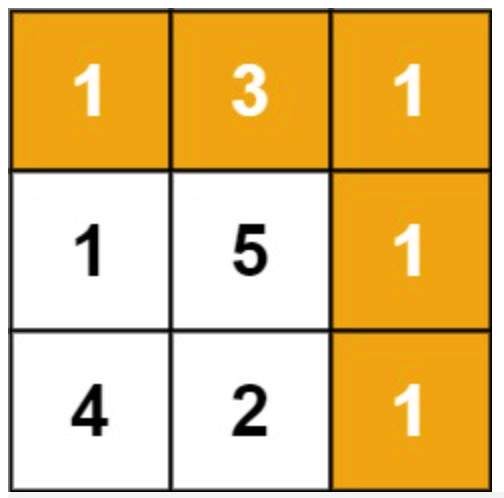

Example 1:

```
Input: grid = [[1,3,1],[1,5,1],[4,2,1]]
Output: 7
Explanation: Because the path 1 → 3 → 1 → 1 → 1 minimizes the sum.
```

因为路径 1→3→1→1→1 的总和最小。

Example 2:

```
Input: grid = [[1,2,3],[4,5,6]]
Output: 12
```

Constraints:

- m == grid.length

- n == grid[i].length

- 1 <= m, n <= 200

- 0 <= grid[i][j] <= 100


## 解题思路

- 给定一个包含非负整数的 m x n 网格，请找出一条从左上角到右下角的路径，使得路径上的数字总和为最小。说明：每次只能向下或者向右移动一步。

- 在地图上求出从左上角到右下角的路径中，数字之和最小的一个，输出数字和。

- 这一题最简单的想法就是用一个二维数组来 DP，当然这是最原始的做法。由于只能往下和往右走，只需要维护 2 列信息就可以了，从左边推到最右边即可得到最小的解。

```
class Solution(object):
    def minPathSum(self, grid):
        #此数组用于记忆化搜索
        dp = [[0]*len(grid[0]) for i in range(len(grid))]
        for i in range(len(grid)):
            for j in range(len(grid[0])):
                #在起点的时候
                if (i == 0 and j == 0):
                    dp[i][j] = grid[0][0]
                #在左边缘的时候
                elif (j == 0 and i != 0):
                    dp[i][j] = dp[i - 1][j]  + grid[i][j]
                #在上边缘的时候
                elif (i == 0 and j != 0):
                    dp[i][j] = dp[i][j-1] + grid[i][j]
                # 普遍情况下
                else:
                    dp[i][j] = min(dp[i - 1][j], dp[i][j - 1]) + grid[i][j]                    
        return dp[len(grid)-1][len(grid[0])-1]
```


## LeetCode 66. Plus One 加一


You are given a large integer represented as an integer array digits, where each digits[i] is the $i^{th}$ digit of the integer. 

The digits are ordered from most significant to least significant in left-to-right order. 

The large integer does not contain any leading 0's.

Increment the large integer by one and return the resulting array of digits.

給定一個由 整數 組成的 非空 數組所表示的非負整數，在該數的基礎上加一。

最高位數字存放在數組的首位， 數組中每個元素只存儲單個數字。

你可以假設除了整數 0 之外，這個整數不會以零開頭。


Example 1:

```
Input: digits = [1,2,3]
Output: [1,2,4]
Explanation: The array represents the integer 123.
Incrementing by one gives 123 + 1 = 124.
Thus, the result should be [1,2,4].
```

Example 2:

```
Input: digits = [4,3,2,1]
Output: [4,3,2,2]
Explanation: The array represents the integer 4321.
Incrementing by one gives 4321 + 1 = 4322.
Thus, the result should be [4,3,2,2].
```

Example 3:

```
Input: digits = [9]
Output: [1,0]
Explanation: The array represents the integer 9.
Incrementing by one gives 9 + 1 = 10.
Thus, the result should be [1,0].
```

Constraints:

1. 1 <= digits.length <= 100

2. 0 <= digits[i] <= 9

3.  digits does not contain any leading 0's.

思路總結

1. 給一個陣列(数组, Array)，代表一個十進位數，陣列的 0 下標是十進位數的高位。要求計算這個十進位數加一以後的結果。

2. 從陣列尾部開始由後往前掃，逐位進位即可。最高位若還有進位的需要則在數組內第 0 位再插入一個 1。

```
from typing import List
class Solution1:
    def plusOne(self, digits: List[int]) -> List[int]:
        h = ''.join(map(str, digits))
        h = str(int(h) + 1)
        output = []
        for ch in h:
            output.append(int(ch))
        return output
x = [1,2,3]
ob1 = Solution1()
print(ob1.plusOne([1,2,3]))
class Solution2:
    def plusOne(self, digits: List[int]) -> List[int]:
        return list(map(int, list(str(int(''.join(map(str, digits))) + 1))))
x = [1,2,3]
ob2 = Solution2()
print(ob2.plusOne([1,2,3]))
```


## LeetCode 69. Sqrt(x) x 的平方根

Given a non-negative integer x, compute and return the square root of x.

Since the return type is an integer, the decimal digits are truncated, and only the integer part of the result is returned.

Note: You are not allowed to use any built-in exponent function or operator, such as pow(x, 0.5) or x ** 0.5.

给你一个非负整数 x ，计算并返回 x 的 算术平方根 。

由于返回类型是整数，结果只保留 整数部分 ，小数部分将被 舍去 。

注意：不允许使用任何内置指数函数和算符，例如 pow(x, 0.5) 或者 x ** 0.5 。

### 二分查找

```
class Solution:
    def mySqrt(self, x):
        """
        :type x: int
        :rtype: int
        """
        if x < 2:
            return x
        left, right = 1, x // 2
        while left <= right:
            mid = left + (right - left) // 2
            if mid > x / mid:
                right = mid - 1
            else:
                left = mid + 1
        return left - 1
x1 = 4
x2 = 9
ob1 = Solution()
print(ob1.mySqrt(x1))
print(ob1.mySqrt(x2))
```

### 牛頓法

```
def squareroot(input_num):
    root = input_num/2
    for k in range(20):
        root = (1/2)* (root + (input_num/root))
    return root

print(squareroot(3))
```

思路總結

1. 二分查找，分成左右區間。

2. 牛頓法


## LeetCode 70. Climbing Stairs 爬楼梯

You are climbing a staircase. It takes n steps to reach the top.

Each time you can either climb 1 or 2 steps. In how many distinct ways can you climb to the top?

假设你正在爬楼梯。需要 n 阶你才能到达楼顶。

每次你可以爬 1 或 2 个台阶。你有多少种不同的方法可以爬到楼顶呢？

```
class Solution:
    def climbStairs(self, n):
        prev, current = 0, 1
        for i in range(n):
            prev, current = current, prev + current
        return current
x1 = 2
x2 = 3
ob1 = Solution()
print(ob1.climbStairs(x1))
print(ob1.climbStairs(x2))
```

思路總結

1. 動態規劃，遞迴公式 f(n-1) + f(n-2)，其結果就是費氏數列。來判斷該值有沒有在字典裡面。相對與第一種課堂範例來的理想。


## LeetCode 72. Edit Distance 编辑距离

Given two strings word1 and word2, return the minimum number of operations required to convert word1 to word2.

You have the following three operations permitted on a word:

- Insert a character

- Delete a character

- Replace a character


给你两个单词 word1 和 word2， 请返回将 word1 转换成 word2 所使用的最少操作数 。

你可以对一个单词进行如下三种操作：

- 插入一个字符

- 删除一个字符

- 替换一个字符


Example 1:

```
Input: word1 = "horse", word2 = "ros"
Output: 3
Explanation: 
horse -> rorse (replace 'h' with 'r')
rorse -> rose (remove 'r')
rose -> ros (remove 'e')

```

输入：word1 = "horse", word2 = "ros"
输出：3
解释：
horse -> rorse (将 'h' 替换为 'r')
rorse -> rose (删除 'r')
rose -> ros (删除 'e')


Example 2:

```
Input: word1 = "intention", word2 = "execution"
Output: 5
Explanation: 
intention -> inention (remove 't')
inention -> enention (replace 'i' with 'e')
enention -> exention (replace 'n' with 'x')
exention -> exection (replace 'n' with 'c')
exection -> execution (insert 'u')
```

输入：word1 = "intention", word2 = "execution"
输出：5
解释：
intention -> inention (删除 't')
inention -> enention (将 'i' 替换为 'e')
enention -> exention (将 'n' 替换为 'x')
exention -> exection (将 'n' 替换为 'c')
exection -> execution (插入 'u')


Constraints:


- 0 <= word1.length, word2.length <= 500

- word1 and word2 consist of lowercase English letters.

- word1 和 word2 由小写英文字母组成

```
class Solution:
    def minDistance(self, word1: str, word2: str) -> int:
        dp = [[0] * (len(word2)+1) for _ in range(len(word1)+1)]
        for i in range(len(word1)+1):
            dp[i][0] = i
        for j in range(len(word2)+1):
            dp[0][j] = j
        for i in range(1, len(word1)+1):
            for j in range(1, len(word2)+1):
                if word1[i-1] == word2[j-1]:
                    dp[i][j] = dp[i-1][j-1]
                else:
                    dp[i][j] = min(dp[i-1][j-1], dp[i-1][j], dp[i][j-1]) + 1
        return dp[-1][-1]

class Solution:
    def minDistance(self, word1: str, word2: str) -> int:
        n1 = len(word1)
        n2 = len(word2)
        if not n1 or not n2:
            return n1 + n2
        dp=[[0] * (n2+1) for _ in range(n1 +1)]
        for j in range(1, n2 + 1):
            dp[0][j] = dp[0][j-1] + 1
        for i in range(1, n1 + 1):
            dp[i][0] = dp[i-1][0]+ 1
        for i in range(1, n1 + 1):
            for j in range(1, n2 + 1):
                if word1[i-1] == word2[j-1]:
                    dp[i][j] = dp[i-1][j-1]
                else:
                    dp[i][j]= min(dp[i][j-1],dp[i-1][j],dp[i-1][j-1]) + 1
        return dp[-1][-1]

class Solution:
    def minDistance(self, word1: str, word2: str) -> int:
        n1 = len(word1)
        n2 = len(word2)
        if not n1 or not n2:
            return n1 + n2
        dp0 = list(range(n2+1))
        dp1=[0]*(n2+1)
        for i in range(n1):
            dp1[0]=i+1
            for j in range(len(word2)):
                if word1[i] == word2[j]:
                    dp1[j+1] = dp0[j]
                else:
                    dp1[j+1] = min(dp0[j+1], dp1[j], dp0[j]) + 1
            dp0 = dp1[:]
        return dp1[-1]
```

## LeetCode 84. Largest Rectangle in Histogram 柱状图中最大的矩形

Given an array of integers heights representing the histogram's bar height where the width of each bar is 1, return the area of the largest rectangle in the histogram.

给定 n 个非负整数，用来表示柱状图中各个柱子的高度。每个柱子彼此相邻，且宽度为 1 。

求在该柱状图中，能够勾勒出来的矩形的最大面积。

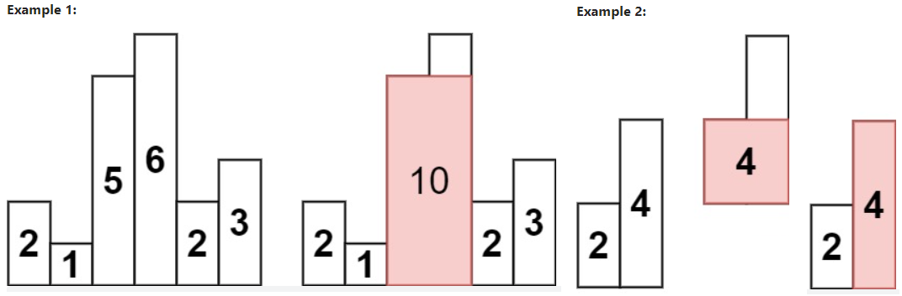

Example 1:

```
Input: heights = [2,1,5,6,2,3]
Output: 10
Explanation: The above is a histogram where width of each bar is 1.
The largest rectangle is shown in the red area, which has an area = 10 units.
```
最大的矩形为图中红色区域，面积为 10

Example 2:

```
Input: heights = [2,4]
Output: 4
```

Constraints:

- 1 <= heights.length <= $10^5$

- 0 <= heights[i] <= $10^4$

```
from typing import List
class Solution:
    def largestRectangleArea(self, heights: List[int]) -> int:
        stack = [-1]
        heights.append(0)
        n,ans = len(heights),0
        for i in range(n):
            while len(stack) > 1 and heights[stack[-1]] > heights[i]:
                p = stack.pop()
                l,r = stack[-1],i
                ans = max(ans,heights[p] * (r - l - 1))            
            stack.append(i)
        return ans

class Solution(object):
    def largestRectangleArea(self, heights):
        # 定义一个栈 stack
        stack = []
        # 添加两个哨兵
        # 在 heights 的前方和后方设置哨兵节点
        heights.insert(0,0)
        heights.append(0)
        dp=[1]*len(heights)
        stack.append()
        for i in range(1, len(heights)):
            # 当前元素大于栈內最后元素
            if heights [i]>=heights[stack[-1]]:
                stack.append(i)
            # 当前元素小于栈内最后元素,需要把楼内的元素 pop 出来
            else:
                while(heights[stack[-1]]>heights[1]):
                    item=stack.pop()
                    dp[item]=i-stack[-1]-1
                stack.append(i)
        # dp=dp[1:-1]
        for j in range(len(dp)):
            dp[j]=dp[j]*heights[j]
        return max(dp)
```

## LeetCode 85. Maximal Rectangle 最大矩形

Given a rows x cols binary matrix filled with 0's and 1's, find the largest rectangle containing only 1's and return its area.

给定一个仅包含 0 和 1 、大小为 rows x cols 的二维二进制矩阵，找出只包含 1 的最大矩形，并返回其面积。


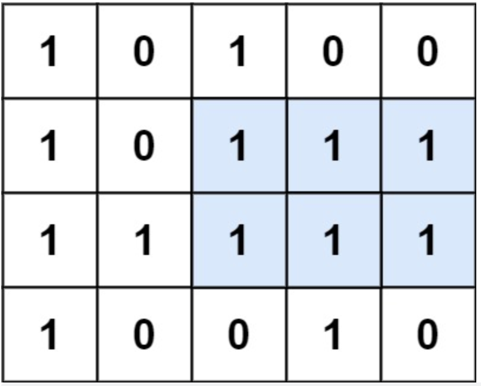

Example 1:

```
Input: matrix = [["1","0","1","0","0"],["1","0","1","1","1"],["1","1","1","1","1"],["1","0","0","1","0"]]
Output: 6
Explanation: The maximal rectangle is shown in the above picture.
```

最大矩形如上图所示。

Example 2:

```
Input: matrix = []
Output: 0
```

Example 3:

```
Input: matrix = [["0"]]
Output: 0
```

Example 4:

```
Input: matrix = [["1"]]
Output: 1
```

Example 5:

```
Input: matrix = [["0","0"]]
Output: 0
```

Constraints:

- rows == matrix.length

- cols == matrix[i].length

- 1 <= row, cols <= 200

- matrix[i][j] is '0' or '1'.

```
from typing import List
class Solution:
    def maximalRectangle(self, matrix: List[List[str]]) -> int:
        if not matrix or not matrix[0]:
            return 0
        nums = [int(''.join(row), base=2) for row in matrix] # 先将每一行变成2进制的数字
        ans, N = 0, len(nums)
        for i in range(N):# 遍历每一行，求以这一行为第一行的最大矩形
            j, num = i, nums[i]
            while j < N: # 依次与下面的行进行与运算。
                num = num & nums[j]  # num 中为1的部分，说明上下两行该位置都是1，相当于求矩形的高，高度为j-i+1
                # print('num=',bin(num))
                if not num: # 没有1说明没有涉及第i到第j行的竖直矩形
                    break
                width, curnum = 0, num
                while curnum: 
                    # 将cursum与自己右移一位进行&操作。如果有两个1在一起，那么cursum才为1，相当于求矩形宽度
                    width += 1
                    curnum = curnum & (curnum >> 1)
                    # print('curnum',bin(curnum))
                ans = max(ans, width * (j-i+1))
                # print('i','j','width',i,j,width)
                # print('ans=',ans)
                j += 1
        return ans

class Solution:
    def maximalRectangle(self, matrix) -> int:
        if len(matrix) == 0:
            return 0
        res = 0
        m, n = len(matrix), len(matrix[0])
        heights = [0] * n
        for i in range(m):
            for j in range(n):
                if matrix[i][j] == '0':
                    heights[j] = 0
                else:
                    heights[j] = heights[j] + 1
            res = max(res, self.largestRectangleArea(heights))
        return res

    def largestRectangleArea(self, heights):
        heights.append(0)
        stack = []
        res = 0
        for i in range(len(heights)):
            while stack and heights[i] < heights[stack[-1]]:
                s = stack.pop()
                res = max(res, heights[s] * ((i - stack[-1] - 1) if stack else i))
            stack.append(i)
        return res
```
## LeetCode 100. Same Tree 相同的树

Given the roots of two binary trees p and q, write a function to check if they are the same or not.

Two binary trees are considered the same if they are structurally identical, and the nodes have the same value.


给你两棵二叉树的根节点 p 和 q ，编写一个函数来检验这两棵树是否相同。

如果两个树在结构上相同，并且节点具有相同的值，则认为它们是相同的。

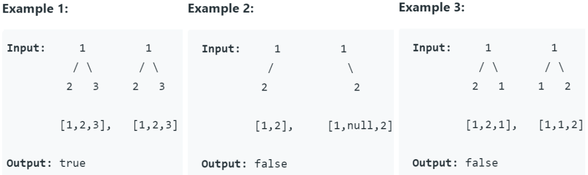

Example 1:

```
Input: p = [1,2,3], q = [1,2,3]
Output: true
```


Example 2:

```
Input: p = [1,2], q = [1,null,2]
Output: false
```

Example 3:

```
Input: p = [1,2,1], q = [1,1,2]
Output: false
```


Constraints:

- The number of nodes in both trees is in the range [0, 100].(两棵树上的节点数目都在范围 [0, 100] 内)

- -$10^4 <= Node.val <= 10^4$

```
# Definition for a binary tree node.
class TreeNode:
    def __init__(self, val=0, left=None, right=None):
        self.val = val
        self.left = left
        self.right = right
class Solution:
    # def isSameTree(self, p: TreeNode, q: TreeNode) -> bool:
    def isSameTree(self, p, q):
        if not p and not q:
            return True
        elif p is not None and q is not None:
            if p.val == q.val:
                return self.isSameTree(p.left, q.left) and self.isSameTree(p.right, q.right)
            else:
                return False
        else:
            return False
```

## LeetCode 102. Binary Tree Level Order Traversal 二叉树的层序遍历

Given the root of a binary tree, return the level order traversal of its nodes' values. (i.e., from left to right, level by level).

给你二叉树的根节点 root ，返回其节点值的 层序遍历 。 （即逐层地，从左到右访问所有节点）。


Example 1:

```
Input: root = [3,9,20,null,null,15,7]
Output: [[3],[9,20],[15,7]]
Example 2:
```

Example 2:

```
Input: root = [1]
Output: [[1]]
Example 3:
```

Example 3:

```
Input: root = []
Output: []
```

Constraints:

- The number of nodes in the tree is in the range [0, 2000]. (树中节点数目在范围 [0, 2000] 内)

- -1000 <= Node.val <= 1000

```
# Definition for a binary tree node.
class TreeNode(object):
    def __init__(self, x):
        self.val = x
        self.left = None
        self.right = None
class Solution(object):
    def levelOrder(self, root):
        if not root:
            return []
        queue = [(root, 0)]
        levelMap = {}
        while queue:
            node, level = queue.pop(0)
            if node.left:
                queue.append((node.left, level+1))
            if node.right:
                queue.append((node.right, level+1))
            if level in levelMap:
                levelMap[level].append(node.val)
            else:
                levelMap[level] = [node.val]
        result = []
        for key, value in levelMap.items():
            result.append(value)
        return result
if __name__ == '__main__':
    tree = TreeNode(3)
    tree.left = TreeNode(9)
    tree.right = TreeNode(20)
    tree.right.left = TreeNode(15)
    tree.right.right = TreeNode(7)
    print(Solution().levelOrder(tree))
```

## LeetCode 104. Maximum Depth of Binary Tree 二叉树的最大深度

Given the root of a binary tree, return its maximum depth.

A binary tree's maximum depth is the number of nodes along the longest path from the root node down to the farthest leaf node.

给定一个二叉树，找出其最大深度。

二叉树的深度为根节点到最远叶子节点的最长路径上的节点数。

说明: 叶子节点是指没有子节点的节点。


Example 1:

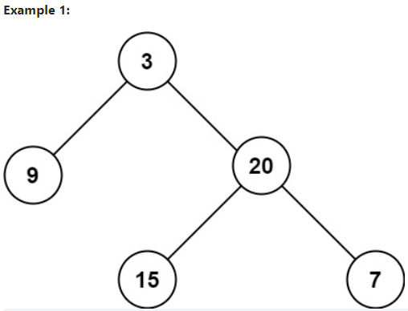

```
给定二叉树 [3,9,20,null,null,15,7]，

    3
   / \
  9  20
    /  \
   15   7
返回它的最大深度 3 。

```

Example 2:

```
Input: root = [1,null,2]
Output: 2
```

Constraints:

- The number of nodes in the tree is in the range [0, $10^4$].
- -100 <= Node.val <= 100

```
# Definition for a binary tree node.
class TreeNode:
    def __init__(self, x):
        self.val = x
        self.left = None
        self.right = None

class Solution:
    def maxDepth(self, root):
        """
        :type root: TreeNode
        :rtype: int
        """
        if root is None:
            return 0
        else:
            return max(self.maxDepth(root.left), self.maxDepth(root.right)) + 1

if __name__ == '__main__':
    root = TreeNode(3)
    root.left = TreeNode(9)
    root.right = TreeNode(20)
    root.left.left = TreeNode(7)
    root.left.right = TreeNode(15)
    print(Solution().maxDepth(root))
```

## LeetCode 105. Construct Binary Tree from Preorder and Inorder Traversal 从前序与中序遍历序列构造二叉树

Given two integer arrays preorder and inorder where preorder is the preorder traversal of a binary tree and inorder is the inorder traversal of the same tree, construct and return the binary tree.

给定两个整数数组 preorder 和 inorder，其中 preorder 是二叉树的先序遍历， inorder 是同一棵树的中序遍历，请构造二叉树并返回其根节点。

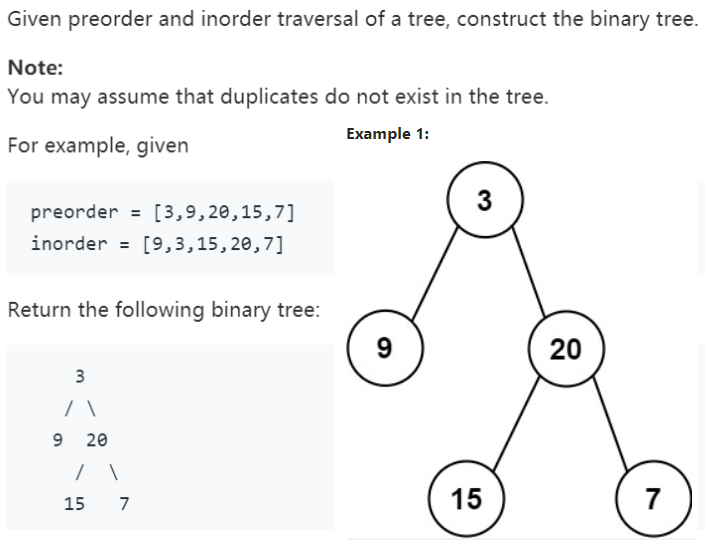

Example 1:

```
Input: preorder = [3,9,20,15,7], inorder = [9,3,15,20,7]
Output: [3,9,20,null,null,15,7]
```

Example 2:

```
Input: preorder = [-1], inorder = [-1]
Output: [-1]
```

Constraints:

- 1 <= preorder.length <= 3000

- inorder.length == preorder.length

- -3000 <= preorder[i], inorder[i] <= 3000

- preorder and inorder consist of unique values.

preorder 和 inorder 均 无重复 元素

- Each value of inorder also appears in preorder.

inorder 均出现在 preorder

- preorder is guaranteed to be the preorder traversal of the tree.

preorder 保证 为二叉树的前序遍历序列

- inorder is guaranteed to be the inorder traversal of the tree.

inorder 保证 为二叉树的中序遍历序列

### Reference

https://www.youtube.com/watch?v=GeltTz3Z1rw


### LC 105 說明

```

# Definition for a binary tree node.
class TreeNode:
    def __init__(self, x):
        self.val = x
        self.left = None
        self.right = None
class Solution(object):
    def buildTree(self, preorder, inorder):
        # ... Code ...
        return root
preorder = [3,9,20,15,7]
inorder = [9,3,15,20,7]
root = Solution().buildTree(preorder, inorder)

```

前序遍历：遍历顺序为 父节点 -> 左子节点 -> 右子节点

中序遍历：遍历顺序为 左子节点 -> 父节点 -> 右子节点

前序遍历的第一个元素为根节点，而在中序遍历中，该根节点所在位置的左侧为左子树，右侧为右子树。

```
# Definition for a binary tree node.
class TreeNode:
    def __init__(self, val=0, left=None, right=None):
        self.val = val
        self.left = left
        self.right = right
class Solution:
    def buildTree(self, preorder: List[int], inorder: List[int]) -> TreeNode:
        dic = {}
        for idx,i in enumerate(inorder):
            dic[i] = idx

        def dfs(pre_left,ino_l,ino_r):
            if pre_left>=len(preorder) or ino_l> ino_r or ino_r>=len(inorder) or ino_l<0 or ino_r<0: return None
            node = TreeNode(preorder[pre_left])
            mid = dic[preorder[pre_left]]
           # print(mid)
            pre_left = pre_left 
            node.left = dfs(pre_left + 1,ino_l,mid-1)
            node.right = dfs(pre_left + (mid - ino_l+1), mid+1, ino_r )
            return node
        return dfs(0,0,len(inorder)-1)

# Definition for a binary tree node.
class TreeNode:
    def __init__(self, x):
        self.val = x
        self.left = None
        self.right = None
class Solution(object):
    def buildTree(self, preorder, inorder):
        if len(inorder) == 0:
            return None
        # 前序遍历第一个值为根节点
        root = TreeNode(preorder[0])
        # 因为没有重复元素，所以可以直接根据值来查找根节点在中序遍历中的位置
        mid = inorder.index(preorder[0])
        # 构建左子树
        root.left = self.buildTree(preorder[1:mid + 1], inorder[:mid])
        # 构建右子树
        root.right = self.buildTree(preorder[mid + 1:], inorder[mid + 1:])
        return root
preorder = [3,9,20,15,7]
inorder = [9,3,15,20,7]
root = Solution().buildTree(preorder, inorder)
```

## LeetCode 111. Minimum Depth of Binary Tree 二叉树的最小深度

Given a binary tree, find its minimum depth.

The minimum depth is the number of nodes along the shortest path from the root node down to the nearest leaf node.

Note: A leaf is a node with no children.

给定一个二叉树，找出其最小深度。

最小深度是从根节点到最近叶子节点的最短路径上的节点数量。

说明：叶子节点是指没有子节点的节点。

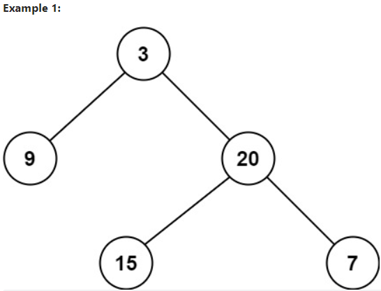

Example 1:

```
Input: root = [3,9,20,null,null,15,7]
Output: 2
Example 2:
```

Example 2:

```
Input: root = [2,null,3,null,4,null,5,null,6]
Output: 5
```

Constraints:

- The number of nodes in the tree is in the range [0, $10^5$]. (树中节点数的范围在 [0, $10^5$] 内)

- -1000 <= Node.val <= 1000

```
# Definition for a binary tree node.
class TreeNode:
    def __init__(self, x):
        self.val = x
        self.left = None
        self.right = None
class Solution:
    def minDepth(self, root):
        """
        :type root: TreeNode
        :rtype: int
        """
        if root is None:
            return 0
        if root.left and root.right:
            return min(self.minDepth(root.left), self.minDepth(root.right)) + 1
        else:
            return max(self.minDepth(root.left), self.minDepth(root.right)) + 1
if __name__ == '__main__':
    root = TreeNode(3)
    root.left = TreeNode(9)
    root.right = TreeNode(20)
    root.right.left = TreeNode(7)
    root.right.right = TreeNode(15)
    print(Solution().minDepth(root))
```

## LeetCode 120. Triangle, 三角形最小路径和

Given a triangle array, return the minimum path sum from top to bottom.

For each step, you may move to an adjacent number of the row below. More formally, if you are on index i on the current row, you may move to either index i or index i + 1 on the next row.

给定一个三角形 triangle ，找出自顶向下的最小路径和。

每一步只能移动到下一行中相邻的结点上。相邻的结点 在这里指的是 下标 与 上一层结点下标 相同或者等于 上一层结点下标 + 1 的两个结点。也就是说，如果正位于当前行的下标 i ，那么下一步可以移动到下一行的下标 i 或 i + 1 。


Example 1:

```
Input: triangle = [[2],[3,4],[6,5,7],[4,1,8,3]]
Output: 11
Explanation: The triangle looks like:
   2
  3 4
 6 5 7
4 1 8 3
The minimum path sum from top to bottom is 2 + 3 + 5 + 1 = 11 (underlined above).
```

自顶向下的最小路径和为 11（即，2 + 3 + 5 + 1 = 11）。

Example 2:

```
Input: triangle = [[-10]]
Output: -10
```

Constraints:

- 1 <= triangle.length <= 200

- triangle[0].length == 1

- triangle[i].length == triangle[i - 1].length + 1

- $-10^{4} <= triangle[i][j] <= 10^{4}$

Follow up: Could you do this using only O(n) extra space, where n is the total number of rows in the triangle?

你可以只使用 O(n) 的额外空间（n 为三角形的总行数）来解决这个问题吗？

## 解题思路

- 求出从三角形顶端到底端的最小和。要求最好用 O(n) 的时间复杂度。

- 这一题最优解是不用辅助空间，直接从下层往上层推。普通解法是用二维数组 DP，稍微优化的解法是一维数组 DP。


```
from typing import List
class Solution:
    def minimumTotal(self, triangle: List[List[int]]) -> int:
        depth = len(triangle)
        for i in range(-2, -depth-1, -1):
            for j in range(depth + 1 + i):
                triangle[i][j] += min(triangle[i+1][j], triangle[i+1][j+1])
        return triangle[0][0]
```

## LeetCode 112. Path Sum 路径总和

Given the root of a binary tree and an integer targetSum, return true if the tree has a root-to-leaf path such that adding up all the values along the path equals targetSum.

A leaf is a node with no children.

给你二叉树的根节点 root 和一个表示目标和的整数 targetSum 。判断该树中是否存在 根节点到叶子节点 的路径，这条路径上所有节点值相加等于目标和 targetSum 。如果存在，返回 true ；否则，返回 false 。

叶子节点 是指没有子节点的节点。

Example 1:

```
Input: root = [5,4,8,11,null,13,4,7,2,null,null,null,1], targetSum = 22
Output: true
Explanation: The root-to-leaf path with the target sum is shown.
```

解释：等于目标和的根节点到叶节点路径如上图所示。


Example 2:

```
Input: root = [1,2,3], targetSum = 5
Output: false
Explanation: There two root-to-leaf paths in the tree:
(1 --> 2): The sum is 3.
(1 --> 3): The sum is 4.
There is no root-to-leaf path with sum = 5.
```

解释：树中存在两条根节点到叶子节点的路径：
(1 --> 2): 和为 3
(1 --> 3): 和为 4
不存在 sum = 5 的根节点到叶子节点的路径。


Example 3:

```
Input: root = [], targetSum = 0
Output: false
Explanation: Since the tree is empty, there are no root-to-leaf paths.
```

解释：由于树是空的，所以不存在根节点到叶子节点的路径。

Constraints:

- The number of nodes in the tree is in the range [0, 5000].

树中节点的数目在范围 [0, 5000] 内

- -1000 <= Node.val <= 1000

- -1000 <= targetSum <= 1000

```
# Definition for a binary tree node.
class TreeNode:
    def __init__(self, val=0, left=None, right=None):
        self.val = val
        self.left = left
        self.right = right

class Solution:
    def hasPathSum(self, root: TreeNode, targetSum: int) -> bool:
        if not root: return False
        res = []
        def pathval(root, path):
            path = path.copy()
            if not (root.left or root.right): 
                res.append(path)
                return
            if root.left:
                path.append(root.left.val)
                pathval(root.left, path)
                path.pop()
            if root.right:
                path.append(root.right.val)
                pathval(root.right, path)
                path.pop()
        pathval(root, [root.val])
        for path in res: 
            if sum(path) == targetSum: return True
        return False
```

## LeetCode 122. Best Time to Buy and Sell Stock II 买卖股票的最佳时机 II

You are given an integer array prices where prices[i] is the price of a given stock on the $i^{th}$ day.

On each day, you may decide to buy and/or sell the stock. You can only hold at most one share of the stock at any time. However, you can buy it then immediately sell it on the same day.

Find and return the maximum profit you can achieve.


给定一个数组 prices ，其中 prices[i] 表示股票第 i 天的价格。

在每一天，你可能会决定购买和/或出售股票。你在任何时候 最多 只能持有 一股 股票。你也可以购买它，然后在 同一天 出售。
返回 你能获得的 最大 利润 。

Example 1:

```
Input: prices = [7,1,5,3,6,4]
Output: 7
Explanation: Buy on day 2 (price = 1) and sell on day 3 (price = 5), profit = 5-1 = 4.
Then buy on day 4 (price = 3) and sell on day 5 (price = 6), profit = 6-3 = 3.
Total profit is 4 + 3 = 7.
```
在第 2 天（股票价格 = 1）的时候买入，在第 3 天（股票价格 = 5）的时候卖出, 这笔交易所能获得利润 = 5-1 = 4 。
随后，在第 4 天（股票价格 = 3）的时候买入，在第 5 天（股票价格 = 6）的时候卖出, 这笔交易所能获得利润 = 6-3 = 3 。


Example 2:

```
Input: prices = [1,2,3,4,5]
Output: 4
Explanation: Buy on day 1 (price = 1) and sell on day 5 (price = 5), profit = 5-1 = 4.
Total profit is 4.
```

在第 1 天（股票价格 = 1）的时候买入，在第 5 天 （股票价格 = 5）的时候卖出, 这笔交易所能获得利润 = 5-1 = 4 。
注意你不能在第 1 天和第 2 天接连购买股票，之后再将它们卖出。因为这样属于同时参与了多笔交易，你必须在再次购买前出售掉之前的股票。


Example 3:

```
Input: prices = [7,6,4,3,1]
Output: 0
Explanation: There is no way to make a positive profit, so we never buy the stock to achieve the maximum profit of 0.
```

在这种情况下, 没有交易完成, 所以最大利润为 0。

Constraints:

- $1 <= prices.length <= 3 * 10^4$
- $0 <= prices[i] <= 10^4$

## 解题思路

- 给定一个数组，它的第 i 个元素是一支给定股票第 i 天的价格。设计一个算法来计算你所能获取的最大利润。你可以尽可能地完成更多的交易（多次买卖一支股票）。注意：你不能同时参与多笔交易（你必须在再次购买前出售掉之前的股票）。

- 要求输出最大收益，这一题不止买卖一次，可以买卖多次，买卖不能在同一天内操作。

- 最大收益来源，必然是每次跌了就买入，涨到顶峰的时候就抛出。只要有涨峰就开始计算赚的钱，连续涨可以用两两相减累加来计算，两两相减累加，相当于涨到波峰的最大值减去谷底的值。这一点看通以后，题目非常简单。


```
# 122(KP) 
class Solution:
    def maxProfit (self, prices):
        if len(prices) <= 1:
            return 0
        total = 0
        for i in range(1, len(prices)):
            if prices[i] > prices[i-1]:
                total += prices[i] - prices[i-1]
        return total
if __name__ == '__main__':
    # prices = [ 6, 1, 3, 2, 4, 7]
    prices = [7, 1, 5, 3, 6,4]
    # prices = [1, 2, 3, 4, 5]
    print(Solution().maxProfit(prices))
```

## LeetCode 123. Best Time to Buy and Sell Stock III 买卖股票的最佳时机 III

You are given an array prices where prices[i] is the price of a given stock on the ith day.

Find the maximum profit you can achieve. You may complete at most two transactions.

Note: You may not engage in multiple transactions simultaneously (i.e., you must sell the stock before you buy again).

给定一个数组，它的第 i 个元素是一支给定的股票在第 i 天的价格。

设计一个算法来计算你所能获取的最大利润。你最多可以完成 两笔 交易。

注意：你不能同时参与多笔交易（你必须在再次购买前出售掉之前的股票）。


Example 1:

```
Input: prices = [3,3,5,0,0,3,1,4]
Output: 6
Explanation: Buy on day 4 (price = 0) and sell on day 6 (price = 3), profit = 3-0 = 3.
Then buy on day 7 (price = 1) and sell on day 8 (price = 4), profit = 4-1 = 3.
```

解释：在第 4 天（股票价格 = 0）的时候买入，在第 6 天（股票价格 = 3）的时候卖出，这笔交易所能获得利润 = 3-0 = 3 。
随后，在第 7 天（股票价格 = 1）的时候买入，在第 8 天 （股票价格 = 4）的时候卖出，这笔交易所能获得利润 = 4-1 = 3 。


Example 2:

```
Input: prices = [1,2,3,4,5]
Output: 4
Explanation: Buy on day 1 (price = 1) and sell on day 5 (price = 5), profit = 5-1 = 4.
Note that you cannot buy on day 1, buy on day 2 and sell them later, as you are engaging multiple transactions at the same time. You must sell before buying again.
```

解释：在第 1 天（股票价格 = 1）的时候买入，在第 5 天 （股票价格 = 5）的时候卖出, 这笔交易所能获得利润 = 5-1 = 4 。   
     注意你不能在第 1 天和第 2 天接连购买股票，之后再将它们卖出。   
     因为这样属于同时参与了多笔交易，你必须在再次购买前出售掉之前的股票。


Example 3:

```
Input: prices = [7,6,4,3,1]
Output: 0
Explanation: In this case, no transaction is done, i.e. max profit = 0.
```

解释：在这个情况下, 没有交易完成, 所以最大利润为 0。

Constraints:

- $1 <= prices.length <= 10^5$
- $0 <= prices[i] <= 10^5$


## 解题思路

- 要求输出最大收益，这一题不止买卖一次，可以买卖多次，买卖不能在同一天内操作。

- 最大收益来源，必然是每次跌了就买入，涨到顶峰的时候就抛出。只要有涨峰就开始计算赚的钱，连续涨可以用两两相减累加来计算，两两相减累加，相当于涨到波峰的最大值减去谷底的值。这一点看通以后，题目非常简单。

## 定义状态:

dp[i][j][k] 

i 天结束时的最高利润 = [天数][是否持有股票][卖出次数] 

i: 0, ..., n

j: 0, 1

k: 0, 1, 2

## Reference

1. https://blog.csdn.net/m0_52043808/article/details/121456025


```
class Solution:
    def maxProfit(self, prices):
        if prices==[]:
            return 0
        length=len(prices)
        #结束时的最高利润=[天数][是否持有股票][卖出次数] 
        dp=[ [[0,0,0],[0,0,0] ] for i in range(0,length) ]
        #第一天休息
        dp[0][0][0]=0 
        #第一天买入
        dp[0][1][0]=-prices[0]
        # 第一天不可能已经有卖出
        dp[0][0][1] = float('-inf') 
        dp[0][0][2] = float('-inf')
        #第一天不可能已经卖出
        dp[0][1][1]=float('-inf')
        dp[0][1][2]=float('-inf')
        for i in range(1,length):
            #未持股，未卖出过，说明从未进行过买卖
            dp[i][0][0]=0 
            #未持股，卖出过1次，可能是今天卖的，可能是之前卖的
            dp[i][0][1]=max(dp[i-1][1][0]+prices[i],dp[i-1][0][1]) 
            #未持股，卖出过2次，可能是今天卖的，可能是之前卖的
            dp[i][0][2]=max(dp[i-1][1][1]+prices[i],dp[i-1][0][2]) 
            #持股，未卖出过，可能是今天买的，可能是之前买的
            dp[i][1][0]=max(dp[i-1][0][0]-prices[i],dp[i-1][1][0]) 
            #持股，卖出过1次，可能是今天买的，可能是之前买的
            dp[i][1][1]=max(dp[i-1][0][1]-prices[i],dp[i-1][1][1]) 
            #持股，卖出过2次，不可能
            dp[i][1][2]=float('-inf')
        return max(dp[length-1][0][1],dp[length-1][0][2],0)
if __name__ == "__main__":
    list = [3,1,5,2,1,3,1,9] 
    print(Solution().maxProfit(list))
```

## LeetCode 136. Single Number 只出现一次的数字

Given a non-empty array of integers nums, every element appears twice except for one. Find that single one.

You must implement a solution with a linear runtime complexity and use only constant extra space.

给定一个非空整数数组，除了某个元素只出现一次以外，其余每个元素均出现两次。找出那个只出现了一次的元素。

说明：你的算法应该具有线性时间复杂度。 你可以不使用额外空间来实现吗？


Example 1:

```
Input: nums = [2,2,1]
Output: 1
```

Example 2:

```
Input: nums = [4,1,2,1,2]
Output: 4
```

Example 3:

```
Input: nums = [1]
Output: 1
```

Constraints:

- $1 <= nums.length <= 3 * 10^{4}$
- $-3 * 10^{4} <= nums[i] <= 3 * 10^{4}$
- Each element in the array appears twice except for one element which appears only once.

```
class Solution:
    def singleNumber(self, nums):
        """
        :type nums: List[int]
        :rtype: int
        """
        a = 0
        for num in nums:
            a = a ^ num
        return a

from typing import List
class Solution:
    def singleNumber(self, nums: List[int]) -> int:
        return functools.reduce(int.__xor__,nums)
```

## LeetCode 141. Linked List Cycle 环形链表

Given head, the head of a linked list, determine if the linked list has a cycle in it.

There is a cycle in a linked list if there is some node in the list that can be reached again by continuously following the next pointer. Internally, pos is used to denote the index of the node that tail's next pointer is connected to. Note that pos is not passed as a parameter.

Return true if there is a cycle in the linked list. Otherwise, return false.

给你一个链表的头节点 head ，判断链表中是否有环。

如果链表中有某个节点，可以通过连续跟踪 next 指针再次到达，则链表中存在环。 为了表示给定链表中的环，评测系统内部使用整数 pos 来表示链表尾连接到链表中的位置（索引从 0 开始）。注意：pos 不作为参数进行传递 。仅仅是为了标识链表的实际情况。

如果链表中存在环 ，则返回 true 。 否则，返回 false 。


Example 1:

```
Input: head = [3,2,0,-4], pos = 1
Output: true
Explanation: There is a cycle in the linked list, where the tail connects to the 1st node (0-indexed).
链表中有一个环，其尾部连接到第二个节点。
```

Example 2:

```
Input: head = [1,2], pos = 0
Output: true
Explanation: There is a cycle in the linked list, where the tail connects to the 0th node.
链表中有一个环，其尾部连接到第一个节点。
```

Example 3:

```
Input: head = [1], pos = -1
Output: false
Explanation: There is no cycle in the linked list.
链表中没有环。
```

Constraints:

- The number of the nodes in the list is in the range(链表中节点的数目范围是) [0, $10^4$].
- $-10^5 <= Node.val <= 10^5$
- pos is -1 or a valid index in the linked-list.(pos 为 -1 或者链表中的一个 有效索引 。)

Follow up: Can you solve it using O(1) (i.e. constant) memory?(你能用 O(1)（即，常量）内存解决此问题吗？)

## 解题思路

给 2 个指针，一个指针是另外一个指针的下一个指针。快指针一次走 2 格，慢指针一次走 1 格。如果存在环，那么前一个指针一定会经过若干圈之后追上慢的指针。

## Reference

- Jserv Linux 核心設計/實作 : https://hackmd.io/@sysprog/linux2022-lab0

- 你所不知道的 C 語言: linked list 和非連續記憶體 : https://hackmd.io/@sysprog/c-linked-list

```
# Linked List Cycle
class Solution(object):
    def hasCycle(self, head):
        fast, slow = head, head
        while fast and fast.next:
            fast, slow = fast.next.next, slow.next
            if fast == slow:
                return True
        return False
```

## LeetCode 144. Binary Tree Preorder Traversal 二叉树的前序遍历

Given the root of a binary tree, return the preorder traversal of its nodes' values.

给你二叉树的根节点 root ，返回它节点值的 前序 遍历。

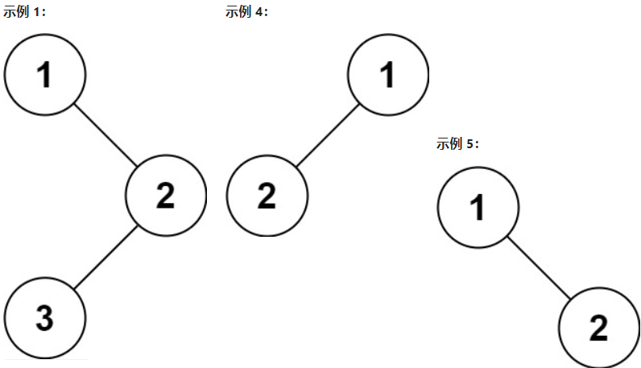

Example 1:

```
Input: root = [1,null,2,3]
Output: [1,2,3]
```

Example 2:

```
Input: root = []
Output: []
```

Example 3:

```
Input: root = [1]
Output: [1]
```

Example 4:

```
输入：root = [1,2]
输出：[1,2]
```

Example 5:

```
输入：root = [1,null,2]
输出：[1,2]
```

Constraints:

- The number of nodes in the tree is in the range [0, 100].

树中节点数目范围在 [0, 100] 内

- -100 <= Node.val <= 100


Follow up: Recursive solution is trivial, could you do it iteratively?

进阶：递归算法很简单，你可以通过迭代算法完成吗？

```
# Definition for a binary tree node.
class TreeNode:
    def __init__(self, val=0, left=None, right=None):
        self.val = val
        self.left = left
        self.right = right
# Python 迭代
class Solution(object):
    def preorderTraversal(self, root):
        if not root:
            return []
        
        stack = [root]
        res = []
        while stack:
            cur = stack.pop()
            res.append(cur.val)            
            if cur.right:
                stack.append(cur.right)
            if cur.left:
                stack.append(cur.left)
        return res

# Python 递归
class Solution(object):
    def preorderTraversal(self, root):
        if not root:
            return []
        return [root.val] + self.preorderTraversal(root.left) + self.preorderTraversal(root.right)

# Definition for a binary tree node.
class TreeNode:
    def __init__(self, val=0, left=None, right=None):
        self.val = val
        self.left = left
        self.right = right

class Solution(object):
    def preorderTraversal(self, root):
        ret = []
        stack = [root]
        while stack:
            node = stack.pop()
            if node:
                ret.append(node.val)
                stack.append(node.right)
                stack.append(node.left)
        return ret

root = TreeNode(5)
root.left = TreeNode(4)
root.right = TreeNode(8)
root.right.left = TreeNode(13)
root.right.right = TreeNode(4)
root.right.right.right = TreeNode(1)
root.left.left = TreeNode(11)
root.left.left.left = TreeNode(7)
root.left.left.right = TreeNode(2)
print(Solution().preorderTraversal(root))
```

## LeetCode 148. Sort List 排序链表

Given the head of a linked list, return the list after sorting it in ascending order.

给你链表的头结点 head ，请将其按 升序 排列并返回 排序后的链表 。


Example 1:

```
Input: head = [4,2,1,3]
Output: [1,2,3,4]
```

Example 2:

```
Input: head = [-1,5,3,4,0]
Output: [-1,0,3,4,5]
```

Example 3:

```
Input: head = []
Output: []
```

Constraints:

- The number of nodes in the list is in the range [0, 5 * $10^4$].(链表中节点的数目在范围 [0, 5 * $10^4$])

- $-10^5$ <= Node.val <= $10^5$

Follow up: Can you sort the linked list in O(n logn) time and O(1) memory (i.e. constant space)?

你可以在 O(n log n) 时间复杂度和常数级空间复杂度下，对链表进行排序吗？


## 解题思路

归并排序 ..

```
# Definition for singly-linked list.
class ListNode:
    def __init__(self, val=0, next=None):
        self.val = val
        self.next = next

class Solution:
    def sortList(self, head: ListNode) -> ListNode:
        h_head = ListNode(-1, head)
        mem = []
        while(head is not None):
            next_h = head.next
            head.next = None
            mem.append(head)
            head = next_h
        mem = sorted(mem, key=lambda x: x.val)
        n = len(mem)
        if n == 0:
            return None
        h_head.next = mem[0]
        for i in range(n-1):
            mem[i].next = mem[i+1]     
        return h_head.next
```

## LeetCode 152. Maximum Product Subarray 乘积最大子数组

Given an integer array nums, find a contiguous non-empty subarray within the array that has the largest product, and return the product.

The test cases are generated so that the answer will fit in a 32-bit integer.

A subarray is a contiguous subsequence of the array.

给你一个整数数组 nums，请你找出数组中乘积最大的非空连续子数组（该子数组中至少包含一个数字），并返回该子数组所对应的乘积。

测试用例的答案是一个 32-位 整数。

子数组 是数组的连续子序列。


Example 1:

```
Input: nums = [2,3,-2,4]
Output: 6
Explanation: [2,3] has the largest product 6.
```

子数组 [2,3] 有最大乘积 6。

Example 2:

```
Input: nums = [-2,0,-1]
Output: 0
Explanation: The result cannot be 2, because [-2,-1] is not a subarray.
```

结果不能为 2, 因为 [-2,-1] 不是子数组。

Constraints:

- $1 <= nums.length <= 2 * 10^{4}$

- -10 <= nums[i] <= 10

- The product of any prefix or suffix of nums is guaranteed to fit in a 32-bit integer.

nums 的任何前缀或后缀的乘积都 保证 是一个 32-位 整数


## 解题思路

1. 给定一个整数数组 nums ，找出一个序列中乘积最大的连续子序列（该序列至少包含一个数）。

2. 给出一个数组，要求找出这个数组中连续元素乘积最大的值。

3. 这一题是 DP 的题，状态转移方程是：最大值是 Max(f(n)) = Max( Max(f(n-1)) * n, Min(f(n-1)) * n)；最小值是 Min(f(n)) = Min( Max(f(n-1)) * n, Min(f(n-1)) * n)。只要动态维护这两个值，如果最后一个数是负数，最大值就在负数 * 最小值中产生，如果最后一个数是正数，最大值就在正数 * 最大值中产生。

```
class Solution:
    def maxProduct(self, A):
        B = A[::-1]
        for i in range(1, len(A)):
            A[i] *= A[i - 1] or 1
            B[i] *= B[i - 1] or 1
        return max(max(A),max(B)) 
```

## LeetCode 206. Reverse Linked List 反转链表

Given the head of a singly linked list, reverse the list, and return the reversed list.

给你单链表的头节点 head ，请你反转链表，并返回反转后的链表。

Example 1:

```
Input: head = [1,2,3,4,5]
Output: [5,4,3,2,1]
```

Example 2:

```
Input: head = [1,2]
Output: [2,1]
```

Example 3:

```
Input: head = []
Output: []
```

Constraints - 提示:

- The number of nodes in the list is the range [0, 5000].(链表中节点的数目范围是 [0, 5000])

- -5000 <= Node.val <= 5000


Follow-up: 

A linked list can be reversed either iteratively or recursively. Could you implement both?

链表可以选用迭代或递归方式完成反转。你能否用两种方法解决这道题？


### 解题思路

两种思路 1.后挂 2.交换

```
# Knowledge Point

class ListNode:
    def __init__(self, x):
        self.val = x
        self.next = None

    def __repr__(self):
        if self:
            return "{} -> {}".format(self.val, repr(self.next))

    if __name__ == "__main__":
        head = ListNode(1)
        head.next = ListNode(2)
        head.next.next = ListNode(3)
        head.next.next.next = ListNode(4)
        head.next.next.next.next = ListNode(5)
        print(head)
```

### Reference

1. https://ithelp.ithome.com.tw/m/articles/10271920

2. https://ithelp.ithome.com.tw/articles/10263980

```
class ListNode:
    def __init__(self, x):
        self.val = x
        self.next = None

    def __repr__(self):
        if self:
            return "{} -> {}".format(self.val, repr(self.next))

class Solution:
    def reverseList(self, head):
        dummy = ListNode(float("-inf"))
        while head:
            dummy.next, head.next, head = head, dummy.next, head.next
        return dummy.next

# 交換法

class Solution:
    def reverseList(self, head: Optional[ListNode]) -> Optional[ListNode]:
        prev = None
        while head:
            next = head.next
            head.next = prev
            prev = head
            head = next
        return prev

# 遞迴法
class Solution:
    def reverseList(self, head: Optional[ListNode], prev=None) -> Optional[ListNode]:
        if not head: return prev
        next = head.next # 先把下一個記起來
        head.next = prev # 將自己反過來指向前一個
        return self.reverseList(next, head)
```

## LeetCode 208. Implement Trie (Prefix Tree) 实现 Trie (前缀树)

A trie (pronounced as "try") or prefix tree is a tree data structure used to efficiently store and retrieve keys in a dataset of strings. There are various applications of this data structure, such as autocomplete and spellchecker.

Implement the Trie class:

- Trie() Initializes the trie object.

- void insert(String word) Inserts the string word into the trie.

- boolean search(String word) Returns true if the string word is in the trie (i.e., was inserted before), and false otherwise.

- boolean startsWith(String prefix) Returns true if there is a previously inserted string word that has the prefix prefix, and false otherwise.

Trie（发音类似 "try"）或者说 前缀树 是一种树形数据结构，用于高效地存储和检索字符串数据集中的键。这一数据结构有相当多的应用情景，例如自动补完和拼写检查。

请你实现 Trie 类：

Trie() 初始化前缀树对象。
void insert(String word) 向前缀树中插入字符串 word 。
boolean search(String word) 如果字符串 word 在前缀树中，返回 true（即，在检索之前已经插入）；否则，返回 false 。
boolean startsWith(String prefix) 如果之前已经插入的字符串 word 的前缀之一为 prefix ，返回 true ；否则，返回 false 。

Example 1:

```
Input
["Trie", "insert", "search", "search", "startsWith", "insert", "search"]
[[], ["apple"], ["apple"], ["app"], ["app"], ["app"], ["app"]]
Output
[null, null, true, false, true, null, true]

Explanation
Trie trie = new Trie();
trie.insert("apple");
trie.search("apple");   // return True
trie.search("app");     // return False
trie.startsWith("app"); // return True
trie.insert("app");
trie.search("app");     // return True
```

Constraints:

- 1 <= word.length, prefix.length <= 2000

- word and prefix consist only of lowercase English letters.

word 和 prefix 仅由小写英文字母组成

- At most 3 * $10^{4}$ calls in total will be made to insert, search, and startsWith.

insert、search 和 startsWith 调用次数 总计 不超过 3 * $10^4$ 次

```
class TreeNode(object):
    def __init__(self):
        self.word = False
        self.children = {}

class Trie(object):
    def __init__(self):
        """
        Initialize your data structure here.
        """
        self.root = TreeNode()
    def insert(self, word):
        """
        Inserts a word into the trie.
        :type word: str
        :rtype: void
        """
        node = self.root
        for char in word:
            if char not in node.children:
                node.children[char] = TreeNode()
            node = node.children[char]
        node.word = True

    def search(self, word):
        """
        Returns if the word is in the trie.
        :type word: str
        :rtype: bool
        """
        node = self.root
        for char in word:
            if char not in node.children:
                return False
            node = node.children[char]
        return node.word
    def startsWith(self, prefix):
        """
        Returns if there is any word in the trie
        that starts with the given prefix.
        :type prefix: str
        :rtype: bool
        """
        node = self.root
        for char in prefix:
            if char not in node.children:
                return False
            node = node.children[char]
        return True
```

## LeetCode 226. Invert Binary Tree 翻转二叉树

Given the root of a binary tree, invert the tree, and return its root.

给你一棵二叉树的根节点 root ，翻转这棵二叉树，并返回其根节点。

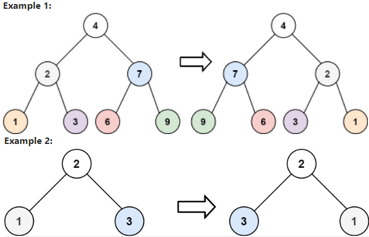

Example 1:

```
Input: root = [4,2,7,1,3,6,9]
Output: [4,7,2,9,6,3,1]
```

Example 2:

```
Input: root = [2,1,3]
Output: [2,3,1]
```

Example 3:

```
Input: root = []
Output: []
```

Constraints:

- The number of nodes in the tree is in the range [0, 100].

树中节点数目范围在 [0, 100] 内

- -100 <= Node.val <= 100

```
# Definition for a binary tree node.
class TreeNode:
    def __init__(self, val=0, left=None, right=None):
        self.val = val
        self.left = left
        self.right = right
class Solution:
    def invertTree(self, root: TreeNode) -> TreeNode:
        self.spyxfamily(root)
        return root
    def spyxfamily(self,root):
        if root is  None:
            return
        root.left,root.right=root.right,root.left
        self.spyxfamily(root.left)
        self.spyxfamily(root.right)

# Definition for a binary tree node.
class TreeNode(object):
    def __init__(self, x):
        self.val = x
        self.left = None
        self.right = No
class Solution(object):
    def invertTree(self, root):
        if root:
            root.left, root.right = self.invertTree(root.right), self.invertTree(root.left)
            return root
```

## LeetCode 232. Implement Queue using Stacks 用栈实现队列

Implement a first in first out (FIFO) queue using only two stacks. The implemented queue should support all the functions of a normal queue (push, peek, pop, and empty).

Implement the MyQueue class:

- void push(int x) Pushes element x to the back of the queue.

- int pop() Removes the element from the front of the queue and returns it.

- int peek() Returns the element at the front of the queue.

- boolean empty() Returns true if the queue is empty, false otherwise.

Notes:

- You must use only standard operations of a stack, which means only push to top, peek/pop from top, size, and is empty operations are valid.

- Depending on your language, the stack may not be supported natively. You may simulate a stack using a list or deque (double-ended queue) as long as you use only a stack's standard operations.

请你仅使用两个栈实现先入先出队列。队列应当支持一般队列支持的所有操作（push、pop、peek、empty）：

实现 MyQueue 类：

- void push(int x) 将元素 x 推到队列的末尾
- int pop() 从队列的开头移除并返回元素
- int peek() 返回队列开头的元素
- boolean empty() 如果队列为空，返回 true ；否则，返回 false

说明：

- 你 只能 使用标准的栈操作 —— 也就是只有 push to top, peek/pop from top, size, 和 is empty 操作是合法的。

- 你所使用的语言也许不支持栈。你可以使用 list 或者 deque（双端队列）来模拟一个栈，只要是标准的栈操作即可


Example 1:

```
Input
["MyQueue", "push", "push", "peek", "pop", "empty"]
[[], [1], [2], [], [], []]
Output
[null, null, null, 1, 1, false]

Explanation
MyQueue myQueue = new MyQueue();
myQueue.push(1); // queue is: [1]
myQueue.push(2); // queue is: [1, 2] (leftmost is front of the queue)
myQueue.peek(); // return 1
myQueue.pop(); // return 1, queue is [2]
myQueue.empty(); // return false
```


Constraints - 提示:

- 1 <= x <= 9

- At most 100 calls will be made to push, pop, peek, and empty. (最多调用 100 次 push、pop、peek 和 empty)

- All the calls to pop and peek are valid. (假设所有操作都是有效的 （例如，一个空的队列不会调用 pop 或者 peek 操作）)


Follow-up: 

Can you implement the queue such that each operation is amortized O(1) time complexity? In other words, performing n operations will take overall O(n) time even if one of those operations may take longer.

你能否实现每个操作均摊时间复杂度为 O(1) 的队列？换句话说，执行 n 个操作的总时间复杂度为 O(n) ，即使其中一个操作可能花费较长时间。


### 解题思路

- 用栈实现一个队列的基本操作：push(x)、pop()、peek()、empty()。

```
class MyQueue:
    def __init__(self):
        """
        in主要负责push，out主要负责pop
        """
        self.stack_in = []
        self.stack_out = []
    def push(self, x: int) -> None:
        """
        有新元素进来，就往in里面push
        """
        self.stack_in.append(x)
    def pop(self) -> int:
        """
        Removes the element from in front of queue and returns that element.
        """
        if self.empty():
            return None
        
        if self.stack_out:
            return self.stack_out.pop()
        else:
            for i in range(len(self.stack_in)):
                self.stack_out.append(self.stack_in.pop())
            return self.stack_out.pop()
    def peek(self) -> int:
        """
        Get the front element.
        """
        ans = self.pop()
        self.stack_out.append(ans)
        return ans
    def empty(self) -> bool:
        """
        只要in或者out有元素，说明队列不为空
        """
        return not (self.stack_in or self.stack_out)
    
# Your MyQueue object will be instantiated and called as such:
# obj = MyQueue()
# obj.push(x)
# param_2 = obj.pop()
# param_3 = obj.peek()
# param_4 = obj.empty()
x = ["MyQueue","push","push","peek","pop","empty"]
obj = MyQueue()
print(obj.push(x))
param_2 = obj.pop()
param_3 = obj.peek()
param_4 = obj.empty()
print(param_2)
print(param_3)
print(param_4)
    
class MyQueue:
    def __init__(self):
        self.A, self.B =[], []
    def push (self, x):
        self.A.append(x)

    def pop(self):
        self.peek()
        return self.B.pop()

    def peek(self):
        if not self.B:
            while self.A:
                self.B.append(self.A.pop())
        return self.B[-1]

    def empty(self):
        return not self.A and not self.B
```

## LeetCode 235. Lowest Common Ancestor of a Binary Search Tree 二叉搜索树的最近公共祖先

Given a binary search tree (BST), find the lowest common ancestor (LCA) of two given nodes in the BST.

According to the definition of LCA on Wikipedia: “The lowest common ancestor is defined between two nodes p and q as the lowest node in T that has both p and q as descendants (where we allow a node to be a descendant of itself).”

给定一个二叉搜索树, 找到该树中两个指定节点的最近公共祖先。

百度百科中最近公共祖先的定义为：“对于有根树 T 的两个结点 p、q，最近公共祖先表示为一个结点 x，满足 x 是 p、q 的祖先且 x 的深度尽可能大（一个节点也可以是它自己的祖先）。”

例如，给定如下二叉搜索树:  root = [6,2,8,0,4,7,9,null,null,3,5]

https://baike.baidu.com/item/%E6%9C%80%E8%BF%91%E5%85%AC%E5%85%B1%E7%A5%96%E5%85%88/8918834

https://en.wikipedia.org/wiki/Lowest_common_ancestor

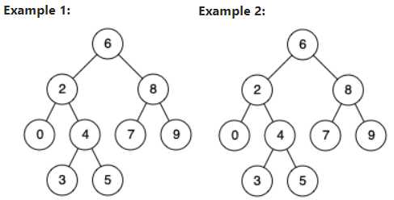

Example 1:

```
Input: root = [6,2,8,0,4,7,9,null,null,3,5], p = 2, q = 8
Output: 6
Explanation: The LCA of nodes 2 and 8 is 6.
节点 2 和节点 8 的最近公共祖先是 6。
```

Example 2:

```
Input: root = [6,2,8,0,4,7,9,null,null,3,5], p = 2, q = 4
Output: 2
Explanation: The LCA of nodes 2 and 4 is 2, since a node can be a descendant of itself according to the LCA definition.
节点 2 和节点 4 的最近公共祖先是 2, 因为根据定义最近公共祖先节点可以为节点本身。
```

Example 3:

```
Input: root = [2,1], p = 2, q = 1
Output: 2
```

Constraints:

- The number of nodes in the tree is in the range $[2, 10^{5}]$.

- $-109$ <= Node.val <= $10^{9}$

- All Node.val are unique.

- p != q

- p and q will exist in the BST.

- 所有节点的值都是唯一的。

- p、q 为不同节点且均存在于给定的二叉搜索树中。


### 解题思路

1. 在二叉搜索树中求两个节点的最近公共祖先，由于二叉搜索树的特殊性质，所以找任意两个节点的最近公共祖先非常简单。

2. python3 利用二叉搜索树的特点，如果p、q的值都小于root，说明p q 肯定在root的左子树中；如果p q都大于root，说明肯定在root的右子树中，如果一个在左一个在右 则说明此时的root记为对应的最近公共祖先

```
class Solution(object):
    def lowestCommonAncestor(self, root, p, q):
        """
        :type root: TreeNode
        :type p: TreeNode
        :type q: TreeNode
        :rtype: TreeNode
        """
        if p.val<root.val and q.val<root.val:
            return self.lowestCommonAncestor(root.left,p,q)
        if p.val>root.val and q.val>root.val:
            return self.lowestCommonAncestor(root.right,p,q)
```

## LeetCode 239. Sliding Window Maximum 滑动窗口最大值

You are given an array of integers nums, there is a sliding window of size k which is moving from the very left of the array to the very right. You can only see the k numbers in the window. Each time the sliding window moves right by one position.

Return the max sliding window.


给你一个整数数组 nums，有一个大小为 k 的滑动窗口从数组的最左侧移动到数组的最右侧。你只可以看到在滑动窗口内的 k 个数字。

滑动窗口每次只向右移动一位。返回 滑动窗口中的最大值 。


Example 1:

```
Input: nums = [1,3,-1,-3,5,3,6,7], k = 3
Output: [3,3,5,5,6,7]
Explanation: 
Window position                Max
---------------               -----
[1  3  -1] -3  5  3  6  7       3
 1 [3  -1  -3] 5  3  6  7       3
 1  3 [-1  -3  5] 3  6  7       5
 1  3  -1 [-3  5  3] 6  7       5
 1  3  -1  -3 [5  3  6] 7       6
 1  3  -1  -3  5 [3  6  7]      7
```

Example 2:

```
Input: nums = [1], k = 1
Output: [1]
```

Constraints:

- $1 <= nums.length <= 10^5$

- $-10^4 <= nums[i] <= 10^4$

- $1 <= k <= nums.length$


### 解题思路

- 給定一個數組和一個窗口為 K 的窗口，當窗口從數組的左邊滑動到數組右邊的時候，輸出每次移動窗口以後，在窗口內的最大值。

- 這道題最暴力的方法就是 2 層循環，時間複雜度 O(n * K)。

- 另一種思路是用優先隊列，每次窗口以後的時候都向優先隊列裡面新增一個節點，並刪除一個節點。時間複雜度是 O(n * log n)

- 最優的解法是用雙端隊列，隊列的一邊永遠都存的是窗口的最大值，隊列的另外一個邊存的是比最大值小的值。隊列中最大值左邊的所有值都出隊。在保證了雙端隊列的一邊即是最大值以後，時間複雜度是 O(n)，空間複雜度是 O(K)

```
class Solution(object):
    def maxSlidingWindow(self, nums, k):
        win, ret = [], []
        for i, v in enumerate(nums):
            if i >= k and win[0] <= i - k: win.pop(0)
            while win and nums[win[-1]] <= v: win.pop()
            win.append(i)
            if i >= k - 1: ret.append(nums[win[0]])
        return ret
# 思路：维护窗口，向右移动时左侧超出窗口的值弹出，
# 因为需要的是窗口内的最大值，
# 所以只要保证窗口内的值是递减的即可，小于新加入的值全部弹出。
# 最左端即为窗口最大值 python解法：
x = [1,3,-1,-3,5,3,6,7]
kn = 3
ob = Solution()
print(ob.maxSlidingWindow(x, kn))
```

```
/*
  思路： 遍历数组 L R 为滑窗左右边界 只增不减
        双向队列保存当前窗口中最大的值的数组下标 双向队列中的数从大到小排序，
        新进来的数如果大于等于队列中的数 则将这些数弹出 再添加
        当R-L+1=k 时 滑窗大小确定 每次R前进一步L也前进一步 保证此时滑窗中最大值的
        数组下标在[L，R]中，并将当前最大值记录
  举例： nums[1，3，-1，-3，5，3，6，7] k=3
     1：L=0，R=0，队列【0】 R-L+1 < k
            队列代表值【1】
     2: L=0,R=1, 队列【1】 R-L+1 < k
            队列代表值【3】
     解释：当前数为3 队列中的数为【1】 要保证队列中的数从大到小 弹出1 加入3
          但队列中保存的是值对应的数组下标 所以队列为【1】 窗口长度为2 不添加记录
     3: L=0,R=2, 队列【1，2】 R-L+1 = k ,result={3}
            队列代表值【3，-1】
     解释：当前数为-1 队列中的数为【3】 比队列尾值小 直接加入 队列为【3，-1】
          窗口长度为3 添加记录记录为队首元素对应的值 result[0]=3
     4: L=1,R=3, 队列【1，2，3】 R-L+1 = k ,result={3，3}
            队列代表值【3，-1,-3】
     解释：当前数为-3 队列中的数为【3，-1】 比队列尾值小 直接加入 队列为【3，-1，-3】
          窗口长度为4 要保证窗口大小为3 L+1=1 此时队首元素下标为1 没有失效
          添加记录记录为队首元素对应的值 result[1]=3
     5: L=2,R=4, 队列【4】 R-L+1 = k ,result={3，3，5}
            队列代表值【5】
     解释：当前数为5 队列中的数为【3，-1，-3】 保证从大到小 依次弹出添加 队列为【5】
          窗口长度为4 要保证窗口大小为3 L+1=2 此时队首元素下标为4 没有失效
          添加记录记录为队首元素对应的值 result[2]=5
    依次类推 如果队首元素小于L说明此时值失效 需要弹出
*/
class Solution {
    public int[] maxSlidingWindow(int[] nums, int k) {
        if(nums==null||nums.length<2) return nums;
        // 双向队列 保存当前窗口最大值的数组位置 保证队列中数组位置的数按从大到小排序
        LinkedList<Integer> list = new LinkedList();
        // 结果数组
        int[] result = new int[nums.length-k+1];
        for(int i=0;i<nums.length;i++){
            // 保证从大到小 如果前面数小 弹出
            while(!list.isEmpty()&&nums[list.peekLast()]<=nums[i]){
                list.pollLast();
            }
            // 添加当前值对应的数组下标
            list.addLast(i);
            // 初始化窗口 等到窗口长度为k时 下次移动在删除过期数值
            if(list.peek()<=i-k){
                list.poll();   
            } 
            // 窗口长度为k时 再保存当前窗口中最大值
            if(i-k+1>=0){
                result[i-k+1] = nums[list.peek()];
            }
        }
        return result;
    }
}
```

## LeetCode 240. Search a 2D Matrix II 搜索二维矩阵 II

Write an efficient algorithm that searches for a value target in an m x n integer matrix matrix. This matrix has the following properties:

- Integers in each row are sorted in ascending from left to right.

- Integers in each column are sorted in ascending from top to bottom.

编写一个高效的算法来搜索 m x n 矩阵 matrix 中的一个目标值 target 。该矩阵具有以下特性：

- 每行的元素从左到右升序排列。

- 每列的元素从上到下升序排列。

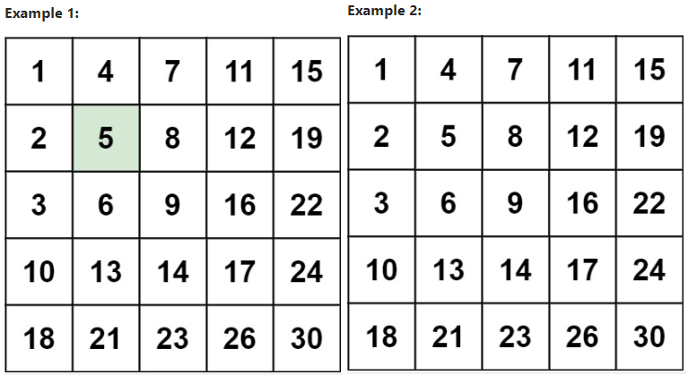

Example 1:

```
Input: matrix = [[1,4,7,11,15],[2,5,8,12,19],[3,6,9,16,22],[10,13,14,17,24],[18,21,23,26,30]], target = 5
Output: true
```

Example 2:

```
Input: matrix = [[1,4,7,11,15],[2,5,8,12,19],[3,6,9,16,22],[10,13,14,17,24],[18,21,23,26,30]], target = 20
Output: false
```


Constraints:

- m == matrix.length
- n == matrix[i].length
- 1 <= n, m <= 300
- $-10^{9} <= matrix[i][j] <= 10^{9}$
- All the integers in each row are sorted in ascending order.
- All the integers in each column are sorted in ascending order.
- $-10^{9} <= target <= 10^{9}$

```
class Solution:
    def searchMatrix(self, matrix, target):
        """
        :type matrix: List[List[int]]
        :type target: int
        :rtype: bool
        """
        m = len(matrix)
        if m == 0:
            return False
        n = len(matrix[0])
        if n == 0:
            return False

        i = m - 1
        j = 0
        while i >= 0 and j < n:
            if matrix[i][j] == target:
                return True
            elif matrix[i][j] < target:
                j = j + 1
            else:
                i = i - 1
        return False
```

## LeetCode 242. Valid Anagram 有效的字母异位词

有效的字母异位词 : 两个单词包含相同的字母，但是次序不同

Given two strings s and t, return true if t is an anagram of s, and false otherwise.

An Anagram is a word or phrase formed by rearranging the letters of a different word or phrase, typically using all the original letters exactly once.

给定两个字符串 s 和 t ，编写一个函数来判断 t 是否是 s 的字母异位词。

注意：若 s 和 t 中每个字符出现的次数都相同，则称 s 和 t 互为字母异位词。

Example 1:

```
Input: s = "anagram", t = "nagaram"
Output: true
```

Example 2:

```
Input: s = "rat", t = "car"
Output: false
```

Constraints - 提示:

- 1 <= s.length, t.length <= 5 * 10^4

- s and t consist of lowercase English letters.(s 和 t 仅包含小写字母)

Follow up - 进阶: What if the inputs contain Unicode characters? How would you adapt your solution to such a case?

如果输入字符串包含 unicode 字符怎么办？你能否调整你的解法来应对这种情况？


### 解题思路

- 可用打表的方式做。先把 s 中的每个字母都存在一个 26 个容量的数组里面，每个下标依次对应 26 个字母。s 中每个字母都对应表中一个字母，每出现一次就加 1。然后再扫字符串 t，每出现一个字母就在表里面减一。如果都出现了，最终表里面的值肯定都是 0 。最终判断表里面的值是否都是 0 即可，有非 0 的数都输出 false 。

```
# defaultdict 解
class Solution:
    def isAnagram(self, s: str, t: str) -> bool:
        from collections import defaultdict
        s_dict = defaultdict(int)
        t_dict = defaultdict(int)
        for x in s:
            s_dict[x] += 1
        for x in t:
            t_dict[x] += 1
        return s_dict == t_dict

# dic 解
class Solutiont:
    def isAnagram(self, s, t):
        dic1, dic2 = {}, {}
        for item in s:
            dic1[item] = dic1.get(item, 0) + 1
        for item in t:
            dic2[item] = dic2.get(item, 0) + 1
        return dic1 == dic2

s = "anagram"
t = "nagaram"
ob = Solution()
print(ob.isAnagram(s, t))

# ASCII 解
class Solutiont:
    def isAnagram(self, s, t):
        dic1, dic2 = [0]*26, [0]*26
        for item in s:
            dic1[ord(item) - ord('a')] += 1
        for item in t:
            dic2[ord(item) - ord('a')] += 1
        return dic1 == dic2

s = "anagram"
t = "nagaram"
ob = Solution()
print(ob.isAnagram(s, t))

class Solution:
    def isAnagram(self, s: str, t: str) -> bool:
        return sorted(s) == sorted(t)
s = "anagram"
t = "nagaram"
ob = Solution()
print(ob.isAnagram(s, t))
```

## LeetCode 263. Ugly Number 丑数

An ugly number is a positive integer whose prime factors are limited to 2, 3, and 5.

Given an integer n, return true if n is an ugly number.

判断一个数字是否是“丑陋数字”，“丑陋数字”的定义是一个正数，并且因子只包含 2，3，5 。


Example 1:

```
Input: n = 6
Output: true
Explanation: 6 = 2 × 3
```

Example 2:

```
Input: n = 1
Output: true
Explanation: 1 has no prime factors, therefore all of its prime factors are limited to 2, 3, and 5.
```

没有质因数，因此它的全部质因数是 {2, 3, 5} 的空集。习惯上将其视作第一个丑数。

Example 3:

```
Input: n = 14
Output: false
Explanation: 14 is not ugly since it includes the prime factor 7.
```

14 不是丑数，因为它包含了另外一个质因数 7 。

Constraints:

- $-2^{31} <= n <= 2^{31} - 1$


## 解题思路

判断一个数字是否是“丑陋数字”，“丑陋数字”的定义是一个正数，并且因子只包含 2，3，5 。

```
class Solution:
    def isUgly(self, num):
        if num == 0:
            return False
        for i in [2,3,5]:
            while num % i == 0:
                num /= i
        return num == 1
if __name__ == "__main__":
    print(Solution().isUgly(18))
    print(Solution().isUgly(14))
```

## LeetCode 274. H-Index, H 指数


Given an array of integers citations where citations[i] is the number of citations a researcher received for their ith paper, return compute the researcher's h-index.

According to the definition of h-index on Wikipedia: A scientist has an index h if h of their n papers have at least h citations each, and the other n − h papers have no more than h citations each.

If there are several possible values for h, the maximum one is taken as the h-index.

给你一个整数数组 citations ，其中 citations[i] 表示研究者的第 i 篇论文被引用的次数。计算并返回该研究者的 h 指数。

根据维基百科上 h 指数的定义：h 代表“高引用次数”，一名科研人员的 h指数是指他（她）的 （n 篇论文中）总共有 h 篇论文分别被引用了至少 h 次。且其余的 n - h 篇论文每篇被引用次数不超过 h 次。

如果 h 有多种可能的值，h 指数 是其中最大的那个。

Example 1:

```
Input: citations = [3,0,6,1,5]
Output: 3
Explanation: [3,0,6,1,5] means the researcher has 5 papers in total and each of them had received 3, 0, 6, 1, 5 citations respectively.
Since the researcher has 3 papers with at least 3 citations each and the remaining two with no more than 3 citations each, their h-index is 3.

给定数组表示研究者总共有 5 篇论文，每篇论文相应的被引用了 3, 0, 6, 1, 5 次。
由于研究者有 3 篇论文每篇 至少 被引用了 3 次，其余两篇论文每篇被引用 不多于 3 次，所以她的 h 指数是 3。
```

Example 2:

```
Input: citations = [1,3,1]
Output: 1
```

Constraints:

- n == citations.length

- 1 <= n <= 5000

- 0 <= citations[i] <= 1000


## 解题思路

可以先将数组里面的数从小到大排序。因为要找最大的 h-index，所以从数组末尾开始往前找，找到第一个数组的值，小于，总长度减去下标的值，这个值就是 h-index。

```
class Solution(object):
    def hIndex(self, citations):
        index = 0
        citations.sort(reverse=True)
        for i in citations:
            if i > index:
                index +=1
        return index
```

## LeetCode 300. Longest Increasing Subsequence 最长递增子序列


Given an integer array nums, return the length of the longest strictly increasing subsequence.

A subsequence is a sequence that can be derived from an array by deleting some or no elements without changing the order of the remaining elements. For example, [3,6,2,7] is a subsequence of the array [0,3,1,6,2,2,7].


给你一个整数数组 nums ，找到其中最长严格递增子序列的长度。

子序列 是由数组派生而来的序列，删除（或不删除）数组中的元素而不改变其余元素的顺序。例如，[3,6,2,7] 是数组 [0,3,1,6,2,2,7] 的子序列。


Example 1:

```
Input: nums = [10,9,2,5,3,7,101,18]
Output: 4
Explanation: The longest increasing subsequence is [2,3,7,101], therefore the length is 4.

```

最长递增子序列是 [2,3,7,101]，因此长度为 4 。

Example 2:

```
Input: nums = [0,1,0,3,2,3]
Output: 4
```


Example 3:

```
Input: nums = [7,7,7,7,7,7,7]
Output: 1
```


Constraints:

- $1 <= nums.length <= 2500$

- $10^4 <= nums[i] <= 10^4$

Follow up: Can you come up with an algorithm that runs in O(n log(n)) time complexity?

你能将算法的时间复杂度降低到 O(n log(n)) 吗?

## Tip

你能将算法的时间复杂度降低到 O(n log(n)) 吗?  ... 利用二叉搜索


## Reference

https://books.halfrost.com/leetcode/ChapterFour/0300~0399/0300.Longest-Increasing-Subsequence/


```
class Solution(object):
    def lengthOfLIS(self, nums):
        if not nums:
            return 0
        N = len(nums)
        dp = [1 for _ in range(N)]
        ans = 1
        for i in range(1, N):
            temp = []
            temp.append(1)
            for j in range(i):
                if nums[i] > nums[j]:
                    temp.append(dp[j] + 1)
            dp[i] = max(temp)
            ans = max(ans, dp[i]) 
        return ans

# Sample 简洁版
class Solution(object):
    def lengthOfLIS(self, nums):
        if not nums:
            return 0
        N = len(nums)
        dp = [1 for _ in range(N)]
        ans = 1
        for i in range(1, N):
            for j in range(i):
                if nums[i] > nums[j]:
                    dp[i] = max(dp[i], dp[j] + 1)
            ans = max(ans, dp[i])
        return ans
```

## LeetCode 312. Burst Balloons 戳气球

You are given n balloons, indexed from 0 to n - 1. Each balloon is painted with a number on it represented by an array nums. You are asked to burst all the balloons.

If you burst the ith balloon, you will get nums[i - 1] * nums[i] * nums[i + 1] coins. If i - 1 or i + 1 goes out of bounds of the array, then treat it as if there is a balloon with a 1 painted on it.

Return the maximum coins you can collect by bursting the balloons wisely.

有 n 个气球，编号为0 到 n - 1，每个气球上都标有一个数字，这些数字存在数组 nums 中。

现在要求你戳破所有的气球。戳破第 i 个气球，你可以获得 nums[i - 1] * nums[i] * nums[i + 1] 枚硬币。 这里的 i - 1 和 i + 1 代表和 i 相邻的两个气球的序号。如果 i - 1或 i + 1 超出了数组的边界，那么就当它是一个数字为 1 的气球。

求所能获得硬币的最大数量。


Example 1:

```
Input: nums = [3,1,5,8]
Output: 167
Explanation:
nums = [3,1,5,8] --> [3,5,8] --> [3,8] --> [8] --> []
coins =  3*1*5    +   3*5*8   +  1*3*8  + 1*8*1 = 167
```


Example 2:

```
Input: nums = [1,5]
Output: 10
```


Constraints:

- n == nums.length

- 1 <= n <= 300

- 0 <= nums[i] <= 100

```
from typing import List
def maxCoins(self, nums: List[int]) -> int:
        if len(nums) == 0:
            return 0
        if len(nums) < 2:
            return nums[0]
        nums = [1] + nums + [1]
        dp = [[0] * len(nums) for _ in range(len(nums))]
        for i in range(len(nums) - 1, -1, -1):
            for j in range(i + 2, len(nums)):
                for k in range(i + 1, j):
                    dp[i][j] = max(dp[i][j], dp[i][k] + dp[k][j] + nums[i] * nums[k] * nums[j])
        # print(dp)
        return dp[0][-1]

class Solution:
    def maxCoins(self, nums):
        if not nums: return 0
        if len(nums) == 1: return nums[0]
        nums = [1] + nums + [1]
        dp = [[0] * len(nums) for _ in range(len(nums))]
        for i in range(len(nums)-1, -1, -1): 
            for j in range(i+2, len(nums)):
                for k in range(i+1, j):
                    dp[i][j] = max(dp[i][j], dp[i][k]+dp[k][j]+nums[i]*nums[k]*nums[j])
        return dp[0][-1]

class Solution:
    def maxCoins(self, nums): 
        n = len(nums) 
        nums.insert(0, 1)
        nums.append(1)
        c = [[0] * (n + 2) for _ in range(n + 2)]
        for len_ in range(1, n + 1):
            for left in range(1, n - len_ + 2):
                right = left + len_ - 1
                for k in range(left, right + 1):
                    c[left][right] = max(c[left][right], c[left][k - 1] + nums[left - 1] * nums[k] * nums[right + 1] + c[k + 1][right])
        return c[1][n]
```
## LeetCode 347. Top K Frequent Elements 前 K 个高频元素

Given an integer array nums and an integer k, return the k most frequent elements. You may return the answer in any order.

给你一个整数数组 nums 和一个整数 k ，请你返回其中出现频率前 k 高的元素。你可以按 任意顺序 返回答案。

Example 1:

```
Input: nums = [1,1,1,2,2,3], k = 2
Output: [1,2]
```

Example 2:

```
Input: nums = [1], k = 1
Output: [1]
```


Constraints:

- $1 <= nums.length <= 10^{5}$

- k is in the range [1, the number of unique elements in the array].

- It is guaranteed that the answer is unique.

```
from typing import List 
#时间复杂度：O(nlogk)
#空间复杂度：O(n)
import heapq
class Solution:
    def topKFrequent(self, nums: List[int], k: int) -> List[int]:
        #要统计元素出现频率
        map_ = {} #nums[i]:对应出现的次数
        for i in range(len(nums)):
            map_[nums[i]] = map_.get(nums[i], 0) + 1
        
        #对频率排序
        #定义一个小顶堆，大小为 k
        pri_que = [] #小顶堆
        
        #用固定大小为 k 的小顶堆，扫面所有频率的数值
        for key, freq in map_.items():
            heapq.heappush(pri_que, (freq, key))
            if len(pri_que) > k: #如果堆的大小大于了K，则队列弹出，保证堆的大小一直为k
                heapq.heappop(pri_que)
        
        #找出前 K 个高频元素，因为小顶堆先弹出的是最小的，所以倒叙来输出到数组
        result = [0] * k
        for i in range(k-1, -1, -1):
            result[i] = heapq.heappop(pri_que)[1]
        return result
```

## LeetCode 374. Guess Number Higher or Lower 二叉树的所有路径

We are playing the Guess Game. The game is as follows:

I pick a number from 1 to n. You have to guess which number I picked.

Every time you guess wrong, I will tell you whether the number I picked is higher or lower than your guess.

You call a pre-defined API int guess(int num), which returns three possible results:

- -1: Your guess is higher than the number I picked (i.e. num > pick).

- 1: Your guess is lower than the number I picked (i.e. num < pick).

- 0: your guess is equal to the number I picked (i.e. num == pick).

Return the number that I picked.

猜数字游戏的规则如下：

每轮游戏，我都会从 1 到 n 随机选择一个数字。 请你猜选出的是哪个数字。
如果你猜错了，我会告诉你，你猜测的数字比我选出的数字是大了还是小了。
你可以通过调用一个预先定义好的接口 int guess(int num) 来获取猜测结果，返回值一共有 3 种可能的情况（-1，1 或 0）：

-1：我选出的数字比你猜的数字小 pick < num
1：我选出的数字比你猜的数字大 pick > num
0：我选出的数字和你猜的数字一样。恭喜！你猜对了！pick == num

返回我选出的数字。

Example 1:

```
Input: n = 10, pick = 6
Output: 6
```

Example 2:

```
Input: n = 1, pick = 1
Output: 1
```

Example 3:

```
Input: n = 2, pick = 1
Output: 1
```

Constraints:

- 1 <= n <= $2^31$ - 1

- 1 <= pick <= n

```
class Solution:
    def guessNumber(self, n: int) -> int:
        left ,right = 1,n
        while left <= right:
            mid = (left + right) // 2
            if guess(mid) == 1:
                left = mid + 1
            elif guess(mid) == -1:
                right = mid - 1
            else :
                return mid
```

## LeetCode 392. Is Subsequence 判断子序列

Given two strings s and t, return true if s is a subsequence of t, or false otherwise.

A subsequence of a string is a new string that is formed from the original string by deleting some (can be none) of the characters without disturbing the relative positions of the remaining characters. (i.e., "ace" is a subsequence of "abcde" while "aec" is not).

给定字符串 s 和 t ，判断 s 是否为 t 的子序列。

字符串的一个子序列是原始字符串删除一些（也可以不删除）字符而不改变剩余字符相对位置形成的新字符串。（例如，"ace"是"abcde"的一个子序列，而"aec"不是）。

进阶：

如果有大量输入的 S，称作 S1, S2, ... , Sk 其中 k >= 10亿，你需要依次检查它们是否为 T 的子序列。在这种情况下，你会怎样改变代码？


Example 1:

```
Input: s = "abc", t = "ahbgdc"
Output: true
```

Example 2:

```
Input: s = "axc", t = "ahbgdc"
Output: false
```

Constraints:

- $0 <= s.length <= 100$
- $0 <= t.length <= 10^4$
- s and t consist only of lowercase English letters.

两个字符串都只由小写字符组成。


## 解题思路

- 给定字符串 s 和 t ，判断 s 是否为 t 的子序列。你可以认为 s 和 t 中仅包含英文小写字母。字符串 t 可能会很长，而 s 是个短字符串（长度 <=100）。字符串的一个子序列是原始字符串删除一些（也可以不删除）字符而不改变剩余字符相对位置形成的新字符串。（例如，“ace"是"abcde"的一个子序列，而"aec"不是）。

- 给定 2 个字符串 s 和 t，问 s 是不是 t 的子序列。注意 s 在 t 中还需要保持 s 的字母的顺序。

- 贪心算法。

```
class Solution:
    def isSubsequence(self, s, t):
        if not s:
            return True
        i, l_s = 0, len(s)
        for v in t:
            if s[i] == v:
                i += 1
            if i == l_s:
                return True
        return False
if __name__ == '__main__':
    print(Solution().isSubsequence('dck', 'goodluck'))
```

## LeetCode 692. Top K Frequent Words 前 K 个高频单词

Given an array of strings words and an integer k, return the k most frequent strings.

Return the answer sorted by the frequency from highest to lowest. Sort the words with the same frequency by their lexicographical order.

给定一个单词列表 words 和一个整数 k ，返回前 k 个出现次数最多的单词。

返回的答案应该按单词出现频率由高到低排序。如果不同的单词有相同出现频率， 按字典顺序 排序。


Example 1:

```
Input: words = ["i","love","leetcode","i","love","coding"], k = 2
Output: ["i","love"]
Explanation: "i" and "love" are the two most frequent words.
Note that "i" comes before "love" due to a lower alphabetical order.
解析: "i" 和 "love" 为出现次数最多的两个单词，均为2次。注意，按字母顺序 "i" 在 "love" 之前。
```

Example 2:

```
Input: words = ["the","day","is","sunny","the","the","the","sunny","is","is"], k = 4
Output: ["the","is","sunny","day"]
Explanation: "the", "is", "sunny" and "day" are the four most frequent words, with the number of occurrence being 4, 3, 2 and 1 respectively.
解析: "the", "is", "sunny" 和 "day" 是出现次数最多的四个单词，出现次数依次为 4, 3, 2 和 1 次。
```

Constraints:

- 1 <= words.length <= 500
- 1 <= words[i] <= 10
- words[i] consists of lowercase English letters.
- k is in the range [1, The number of unique words[i]]

words[i] 由小写英文字母组成。

k 的取值范围是 [1, 不同 words[i] 的数量]

Follow-up: Could you solve it in O(n log(k)) time and O(n) extra space?

进阶：尝试以 O(n log k) 时间复杂度和 O(n) 空间复杂度解决。

```
from typing import List
class Solution:
    def topKFrequent(self, words: List[str], k: int) -> List[str]:
        q = []
        dic = collections.defaultdict(int)
        for word in words:
            dic[word] += 1
        
        for key, val in dic.items():
            heapq.heappush(q, (-val, key))
        
        return [heapq.heappop(q)[1] for i in range(k)]
```

## LeetCode 720. Longest Word in Dictionary 词典中最长的单词

Given an array of strings words representing an English Dictionary, return the longest word in words that can be built one character at a time by other words in words.

If there is more than one possible answer, return the longest word with the smallest lexicographical order. If there is no answer, return the empty string.


给出一个字符串数组 words 组成的一本英语词典。返回 words 中最长的一个单词，该单词是由 words 词典中其他单词逐步添加一个字母组成。

若其中有多个可行的答案，则返回答案中字典序最小的单词。若无答案，则返回空字符串。

Example 1:

```
Input: words = ["w","wo","wor","worl","world"]
Output: "world"
Explanation: The word "world" can be built one character at a time by "w", "wo", "wor", and "worl".
单词"world"可由"w", "wo", "wor", 和 "worl"逐步添加一个字母组成。
```

Example 2:

```
Input: words = ["a","banana","app","appl","ap","apply","apple"]
Output: "apple"
Explanation: Both "apply" and "apple" can be built from other words in the dictionary. However, "apple" is lexicographically smaller than "apply".
"apply" 和 "apple" 都能由词典中的单词组成。但是 "apple" 的字典序小于 "apply" 
```

Constraints:

- 1 <= words.length <= 1000

- 1 <= words[i].length <= 30

- words[i] consists of lowercase English letters.

所有输入的字符串 words[i] 都只包含小写字母。

```
class Solution(object):
    def longestWord(self, words):
        valid = set([""])
        for word in sorted(words, key=len):
            if word[:-1] in valid:
                valid.add(word)
        return max(sorted(valid), key=len)
if __name__ == '__main__':
    words = ["a", "banana", "app", "appl", "ap", "apply", "apple"]
    print(Solution().longestWord(words))
```

## LeetCode 743. Network Delay Time 网络延迟时间

You are given a network of n nodes, labeled from 1 to n. You are also given times, a list of travel times as directed edges times[i] = (ui, vi, wi), where ui is the source node, vi is the target node, and wi is the time it takes for a signal to travel from source to target.

We will send a signal from a given node k. Return the minimum time it takes for all the n nodes to receive the signal. If it is impossible for all the n nodes to receive the signal, return -1.

有 n 个网络节点，标记为 1 到 n。给你一个列表 times，表示信号经过 有向 边的传递时间。 times[i] = (ui, vi, wi)，其中 ui 是源节点，vi 是目标节点， wi 是一个信号从源节点传递到目标节点的时间。现在，从某个节点 K 发出一个信号。需要多久才能使所有节点都收到信号？如果不能使所有节点收到信号，返回 -1 。

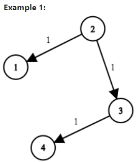

Example 1:

```
Input: times = [[2,1,1],[2,3,1],[3,4,1]], n = 4, k = 2
Output: 2
```

Example 2:

```
Input: times = [[1,2,1]], n = 2, k = 1
Output: 1
```

Example 3:

```
Input: times = [[1,2,1]], n = 2, k = 2
Output: -1
```

Constraints:

- 1 <= k <= n <= 100
- 1 <= times.length <= 6000
- times[i].length == 3
- 1 <= ui, vi <= n
- ui != vi
- 0 <= wi <= 100
- All the pairs (ui, vi) are unique. (i.e., no multiple edges.)

所有 (ui, vi) 对都 互不相同（即，不含重复边）

```
from typing import List
class Solution:
    # Bellman-Ford 算法
    def networkDelayTime(self, times: List[List[int]], n: int, k: int) -> int:
        dis={node:float('inf') for node in range(1,n+1)}
        dis[k]=0
        for _ in range(n-1):
            for u,v,w in times:
                dis[v]=min(dis[v],dis[u]+w)
        res=max(dis.values())
        return res if res != float('inf') else -1   
```

## LeetCode 746. Min Cost Climbing Stairs 爬楼梯的最小损失

You are given an integer array cost where cost[i] is the cost of ith step on a staircase. Once you pay the cost, you can either climb one or two steps.

You can either start from the step with index 0, or the step with index 1.

Return the minimum cost to reach the top of the floor.

给你一个整数数组 cost ，其中 cost[i] 是从楼梯第 i 个台阶向上爬需要支付的费用。一旦你支付此费用，即可选择向上爬一个或者两个台阶。

你可以选择从下标为 0 或下标为 1 的台阶开始爬楼梯。

请你计算并返回达到楼梯顶部的最低花费。


Example 1:

```
Input: cost = [10,15,20]
Output: 15
Explanation: You will start at index 1.
- Pay 15 and climb two steps to reach the top.
The total cost is 15.
```
输入：cost = [10,15,20]
输出：15
解释：你将从下标为 1 的台阶开始。
- 支付 15 ，向上爬两个台阶，到达楼梯顶部。
总花费为 15 。


Example 2:

```
Input: cost = [1,100,1,1,1,100,1,1,100,1]
Output: 6
Explanation: You will start at index 0.
- Pay 1 and climb two steps to reach index 2.
- Pay 1 and climb two steps to reach index 4.
- Pay 1 and climb two steps to reach index 6.
- Pay 1 and climb one step to reach index 7.
- Pay 1 and climb two steps to reach index 9.
- Pay 1 and climb one step to reach the top.
The total cost is 6.
```

输入：cost = [1,100,1,1,1,100,1,1,100,1]
输出：6
解释：你将从下标为 0 的台阶开始。
- 支付 1 ，向上爬两个台阶，到达下标为 2 的台阶。
- 支付 1 ，向上爬两个台阶，到达下标为 4 的台阶。
- 支付 1 ，向上爬两个台阶，到达下标为 6 的台阶。
- 支付 1 ，向上爬一个台阶，到达下标为 7 的台阶。
- 支付 1 ，向上爬两个台阶，到达下标为 9 的台阶。
- 支付 1 ，向上爬一个台阶，到达楼梯顶部。
总花费为 6 。


Constraints:

- 2 <= cost.length <= 1000
- 0 <= cost[i] <= 999

```
class Solution:
    def minCostClimbingStairs(self, cost):
        cost.append(0)
        for i in range(2, len(cost)):
            cost[i] += min(cost[i - 1], cost[i - 2])
        return cost[-1]
```

## LeetCode 787. Cheapest Flights Within K Stops, K 站中转内最便宜的航班

There are n cities connected by some number of flights. You are given an array flights where flights[i] = [fromi, toi, pricei] indicates that there is a flight from city fromi to city toi with cost pricei.

You are also given three integers src, dst, and k, return the cheapest price from src to dst with at most k stops. If there is no such route, return -1.

有 n 个城市通过一些航班连接。给你一个数组 flights ，其中 flights[i] = [fromi, toi, pricei] ，表示该航班都从城市 fromi 开始，以价格 pricei 抵达 toi。

现在给定所有的城市和航班，以及出发城市 src 和目的地 dst，你的任务是找到出一条最多经过 k 站中转的路线，使得从 src 到 dst 的 价格最便宜 ，并返回该价格。 如果不存在这样的路线，则输出 -1。

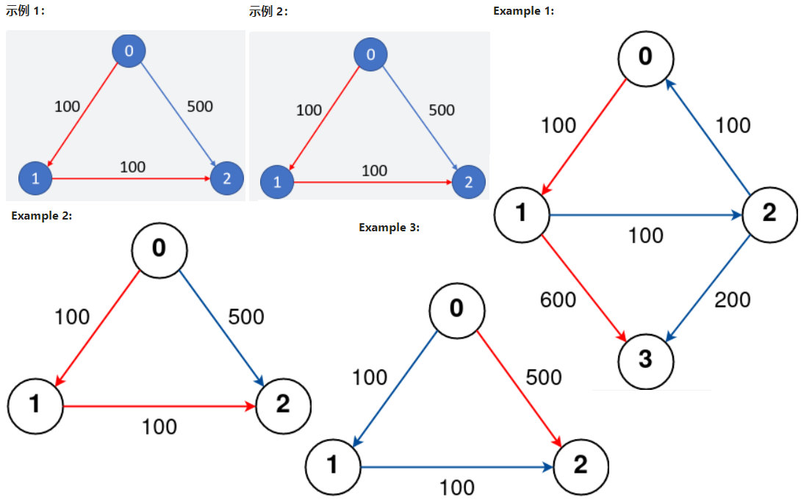

Example 1:

```
Input: n = 4, flights = [[0,1,100],[1,2,100],[2,0,100],[1,3,600],[2,3,200]], src = 0, dst = 3, k = 1
Output: 700
Explanation:
The graph is shown above.
The optimal path with at most 1 stop from city 0 to 3 is marked in red and has cost 100 + 600 = 700.
Note that the path through cities [0,1,2,3] is cheaper but is invalid because it uses 2 stops.

```

Example 2:

```
Input: n = 3, flights = [[0,1,100],[1,2,100],[0,2,500]], src = 0, dst = 2, k = 1
Output: 200
Explanation:
The graph is shown above.
The optimal path with at most 1 stop from city 0 to 2 is marked in red and has cost 100 + 100 = 200.
```

Example 3:

```
Input: n = 3, flights = [[0,1,100],[1,2,100],[0,2,500]], src = 0, dst = 2, k = 0
Output: 500
Explanation:
The graph is shown above.
The optimal path with no stops from city 0 to 2 is marked in red and has cost 500.
```

示例 1：

```
输入: 
n = 3, edges = [[0,1,100],[1,2,100],[0,2,500]]
src = 0, dst = 2, k = 1
输出: 200
解释: 
城市航班图如下
从城市 0 到城市 2 在 1 站中转以内的最便宜价格是 200，如图中红色所示。
```

示例 2：

```
输入: 
n = 3, edges = [[0,1,100],[1,2,100],[0,2,500]]
src = 0, dst = 2, k = 0
输出: 500
解释: 
城市航班图如下
从城市 0 到城市 2 在 0 站中转以内的最便宜价格是 500，如图中蓝色所示。
```

Constraints:

- 1 <= n <= 100
- 0 <= flights.length <= (n * (n - 1) / 2)
- flights[i].length == 3
- 0 <= fromi, toi < n
- $from_i$ != $to_i$
- 1 <= pricei <= $10^4$
- There will not be any multiple flights between two cities.(航班没有重复，且不存在自环)
- 0 <= src, dst, k < n
- src != dst

```
class Solution:
    def findCheapestPrice(self, n: int, flights: List[List[int]], src: int, dst: int, K: int) -> int:
        if src == dst: return 0
        graph = collections.defaultdict(dict)
        for start,end,cost in flights:
            graph[start][end] = cost

        queue = [(0,0,src)]
        while queue:
            cost, k, end = heapq.heappop(queue)
            if k > K+1 : continue
            if end == dst: return cost
            for key, val in graph[end].items():
                heapq.heappush(queue,(cost+val,k+1,key))
        return -1
```

## LeetCode 847. Shortest Path Visiting All Nodes 访问所有节点的最短路径

You have an undirected, connected graph of n nodes labeled from 0 to n - 1. You are given an array graph where graph[i] is a list of all the nodes connected with node i by an edge.

Return the length of the shortest path that visits every node. You may start and stop at any node, you may revisit nodes multiple times, and you may reuse edges.

存在一个由 n 个节点组成的无向连通图，图中的节点按从 0 到 n - 1 编号。

给你一个数组 graph 表示这个图。其中，graph[i] 是一个列表，由所有与节点 i 直接相连的节点组成。

返回能够访问所有节点的最短路径的长度。你可以在任一节点开始和停止，也可以多次重访节点，并且可以重用边。

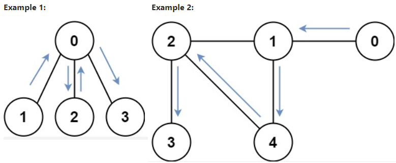

Example 1:

```
Input: graph = [[1,2,3],[0],[0],[0]]
Output: 4
Explanation: One possible path is [1,0,2,0,3]
一种可能的路径为 [1,0,2,0,3]
```

Example 2:

```
Input: graph = [[1],[0,2,4],[1,3,4],[2],[1,2]]
Output: 4
Explanation: One possible path is [0,1,4,2,3]
一种可能的路径为 [0,1,4,2,3]
```

Constraints:

- n == graph.length

- 1 <= n <= 12

- 0 <= graph[i].length < n

- graph[i] does not contain i.(graph[i] 不包含 i)

- If graph[a] contains b, then graph[b] contains a.(如果 graph[a] 包含 b ，那么 graph[b] 也包含 a)

- The input graph is always connected.(输入的图总是连通图)

```
class Solution:
    def shortestPathLength(self, graph: List[List[int]]) -> int:
        q = collections.deque([])
        visited = set()
        n = len(graph)
        for i in range(n):
            q.append((i, 1 << i))
            visited.add((i, 1 << i))
        dis = 0
        while q:
            dis += 1
            for _ in range(len(q)):
                cur, cur_state = q.popleft()
                for nxt in graph[cur]:
                    nxt_state = cur_state | (1 << nxt)
                    if nxt_state == (1 << n) - 1: return dis
                    if (nxt, nxt_state) not in visited:
                        q.append((nxt, nxt_state))
                        visited.add((nxt, nxt_state))
        return 0
```

## LeetCode 934. Shortest Bridge 最短的桥

You are given an n x n binary matrix grid where 1 represents land and 0 represents water.

An island is a 4-directionally connected group of 1's not connected to any other 1's. There are exactly two islands in grid.

You may change 0's to 1's to connect the two islands to form one island.

Return the smallest number of 0's you must flip to connect the two islands.

在给定的二维二进制数组 A 中，存在两座岛。（岛是由四面相连的 1 形成的一个最大组。）

现在，我们可以将 0 变为 1，以使两座岛连接起来，变成一座岛。

返回必须翻转的 0 的最小数目。（可以保证答案至少是 1 。）


Example 1:

```
Input: grid = [[0,1],[1,0]]
Output: 1
```

Example 2:

```
Input: grid = [[0,1,0],[0,0,0],[0,0,1]]
Output: 2
```

Example 3:

```
Input: grid = [[1,1,1,1,1],[1,0,0,0,1],[1,0,1,0,1],[1,0,0,0,1],[1,1,1,1,1]]
Output: 1
```

Constraints:

- n == grid.length == grid[i].length
- 2 <= n <= 100
- grid[i][j] is either 0 or 1.
- There are exactly two islands in grid.

```
/* 思路: DFS + BFS */
/* 先用深度优先搜索DFS, 找到第1个岛屿, 将岛屿元素置为2, 并入队   */
/* 再用广度优先搜索BFS, 从第1个岛屿元素开始向外寻找, 找到的0置为2 */
/* 当找到第一个1时, 就返回寻找的路径step                       */

/* 队列结构体定义 */
typedef struct {
    int x;
    int y;
    int step;
} Queue;

/* DFS 寻找第一个岛屿元素 */
void dfs(int **A, int ASize, int i, int j, Queue *Q, int *rear) {
    if (i < 0 || i >= ASize || j < 0 || j >= ASize || A[i][j] != 1) {
        return;
    }
    /* 元素置为2, 并入队, step置为0 */
    A[i][j]           = 2;
    Q[(*rear)].x      = i;
    Q[(*rear)].y      = j;
    Q[(*rear)++].step = 0;

    /* 上下左右继续寻找 */
    dfs(A, ASize, i - 1, j, Q, rear); 
    dfs(A, ASize, i + 1, j, Q, rear);
    dfs(A, ASize, i, j - 1, Q, rear);
    dfs(A, ASize, i, j + 1, Q, rear);
    return;
}

int shortestBridge(int** A, int ASize, int* AColSize){
    Queue *Q = (Queue*)malloc(sizeof(Queue) * ASize * ASize);
    int front = 0;
    int rear  = 0;
    int find  = 0;
    int i, j, x, y, xx, yy, step;
    int xShift[] = {-1, 1,  0, 0};
    int yShift[] = { 0, 0, -1, 1};

    /* DFS第一个岛屿 */
    for (i = 0; i < ASize; i++) {
        for (j = 0; j < ASize; j++) {
            if (A[i][j] == 1) {
                dfs(A, ASize, i, j, Q, &rear);
                find = 1;
                break;
            }
        }
        /* 只寻找第一个岛屿 */
        if (find == 1) {
            break;
        }
    }

    /* BFS 第一个岛屿向外扩散 */
    while (front != rear) {
        x    = Q[front].x;
        y    = Q[front].y;
        step = Q[front++].step;

        /* 上下左右扩散 */
        for (i = 0; i < 4; i++) {
            xx = x + xShift[i];
            yy = y + yShift[i];
            if (xx < 0 || xx >= ASize || yy < 0 || yy >= ASize || A[xx][yy] == 2) {
                continue;
            }
            if (A[xx][yy] == 1) { /* 找到另一岛屿时, 返回step */
                return step;
            }
            A[xx][yy]      = 2; /* 将扩散到的0置为2, 并入队 */
            Q[rear].x      = xx;
            Q[rear].y      = yy;
            Q[rear++].step = step + 1;
        }
    }
    free(Q);
    return step;
}
```

```
from collections import deque
from typing import List
class Solution:
    def shortestBridge(self, grid: List[List[int]]) -> int:
        def dfs(grid, x, y):
            grid[x][y] = 0
            seen.append([x, y])
            seen_set.add(f'{x}#{y}')
            axis = [[x - 1, y], [x + 1, y], [x, y -1], [x, y + 1]]
            for x, y in axis:
                if 0 <= x < m and 0 <= y < n and grid[x][y] == 1:
                    dfs(grid, x, y)
        
        def bfs(grid, seen):
            seen = deque(seen)
            seen_other_flag = False
            level = 0
            while seen:
                for _ in range(len(seen)):
                    x, y = seen.popleft()
                    axis = [[x - 1, y], [x + 1, y], [x, y -1], [x, y + 1]]
                    for x, y in axis:
                        index = f'{x}#{y}'
                        if 0 <= x < m and 0 <= y < n and index not in seen_set:
                            if grid[x][y] == 0:
                                seen.append([x, y])
                                seen_set.add(f'{x}#{y}')
                            else:
                                return level
                level += 1
                

            return level
 
        seen = []
        seen_set = set()
        m = len(grid)
        n = len(grid[0])
        search_flag = 0
        for i in range(m):
            for j in range(n):
                if grid[i][j] == 1 and not search_flag:
                    dfs(grid, i, j)
                    search_flag = 1
        level = bfs(grid, seen)
        return level
```

## LeetCode 997. Find the Town Judge 找到小镇的法官

In a town, there are n people labeled from 1 to n. There is a rumor that one of these people is secretly the town judge.

If the town judge exists, then:

1. The town judge trusts nobody.

2. Everybody (except for the town judge) trusts the town judge.

3. There is exactly one person that satisfies properties 1 and 2.

You are given an array trust where trust[i] = [$a_i$, $b_i$] representing that the person labeled ai trusts the person labeled bi.

Return the label of the town judge if the town judge exists and can be identified, or return -1 otherwise.

小镇里有 n 个人，按从 1 到 n 的顺序编号。传言称，这些人中有一个暗地里是小镇法官。

如果小镇法官真的存在，那么：

小镇法官不会信任任何人。
每个人（除了小镇法官）都信任这位小镇法官。
只有一个人同时满足属性 1 和属性 2 。
给你一个数组 trust ，其中 trust[i] = [$a_i$, $b_i$] 表示编号为 $a_i$ 的人信任编号为 $b_i$ 的人。

如果小镇法官存在并且可以确定他的身份，请返回该法官的编号；否则，返回 -1 。


Example 1:

```
Input: n = 2, trust = [[1,2]]
Output: 2
```

Example 2:

```
Input: n = 3, trust = [[1,3],[2,3]]
Output: 3
```

Example 3:

```
Input: n = 3, trust = [[1,3],[2,3],[3,1]]
Output: -1
```

Constraints:

- 1 <= n <= 1000

- 0 <= trust.length <= $10^4$

- trust[i].length == 2

- All the pairs of trust are unique. (trust 中的所有 trust[i] = [$a_i$, $b_i$] 互不相同)

- $a_i$ != $b_i$

- 1 <= $a_i$, $b_i$ <= n

```
'''
In a town, there are N people labelled from 1 to N.  There is a rumor that one of these people is secretly the town judge.
If the town judge exists, then:
The town judge trusts nobody.
Everybody (except for the town judge) trusts the town judge.
There is exactly one person that satisfies properties 1 and 2.
You are given trust, an array of pairs trust[i] = [a, b] representing that the person labelled a trusts the person labelled b.
If the town judge exists and can be identified, return the label of the town judge.  Otherwise, return -1.

Example 1:
Input: N = 2, trust = [[1,2]]
Output: 2
Example 2:
Input: N = 3, trust = [[1,3],[2,3]]
Output: 3
'''


class Solution(object):
    def findJudge(self, N, trust):
        if not trust:
            return 1
        mapping = {}
        unique = set()
        for truste_list in trust:
            unique.add(truste_list[0])
            if truste_list[1] in mapping:
                mapping[truste_list[1]] += 1
            else:
                mapping[truste_list[1]] = 1

        unique_set = len(unique)
        for key, value in mapping.items():
            if (value == N-1) & (unique_set == N-1):
                return key
        return -1


    def findJudge2(self, N, trust):
        from collections import Counter
        people = set([x[0] for x in trust])
        if not len(people):
            if N == 1:
                return 1
            else:
                return -1

        if len(people) == N - 1:
            trustee = Counter([x[1] for x in trust])
            for t in trustee.keys():
                if trustee[t] == N - 1:
                    return t
            return -1
        return -1


if __name__ == '__main__':
    trust = [[1, 3], [2, 3]]
    # trust = [[1,3],[2,1], [2,1]]
    # trust = [[1,8],[1,3],[2,8],[2,3],[4,8],[4,3],[5,8],[5,3],[6,8],[6,3],[7,8],[7,3],[9,8],[9,3],[11,8],[11,3]]

    print(Solution().findJudge(3, trust))
    # print(Solution().findJudge2(3, trust))
```
