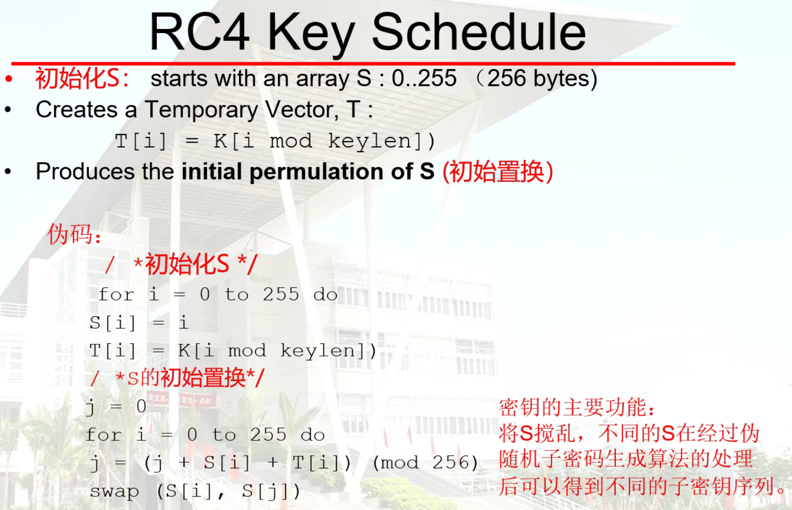
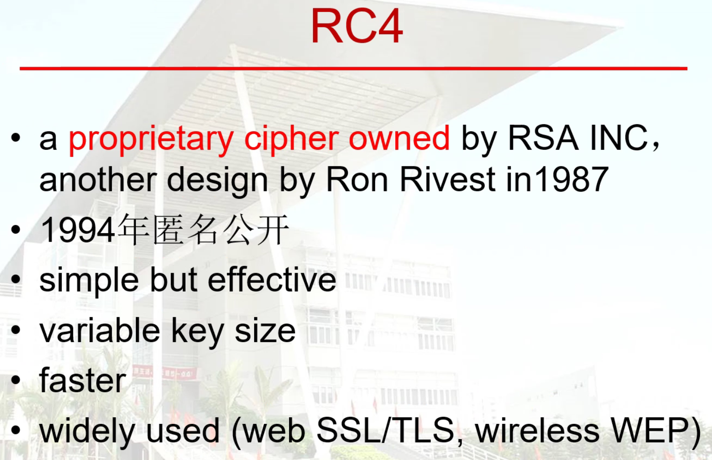
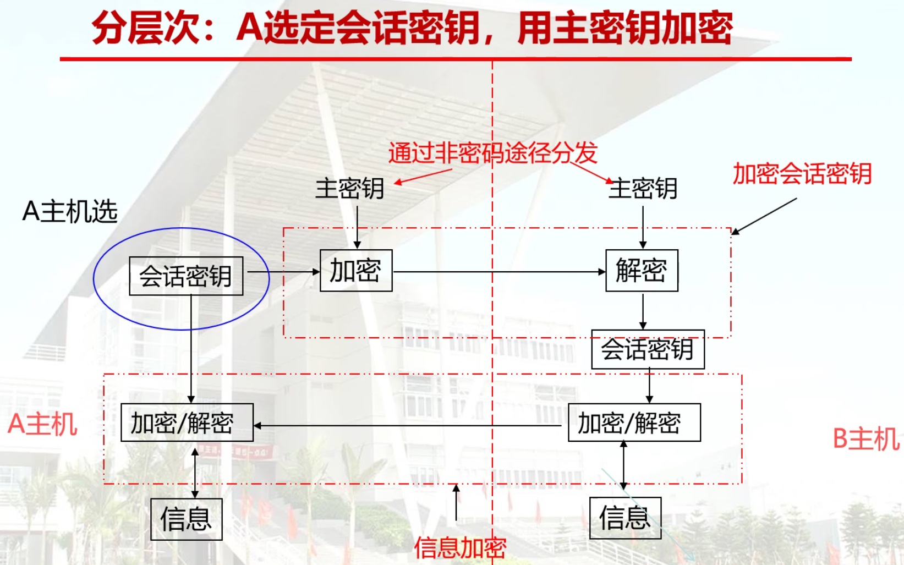
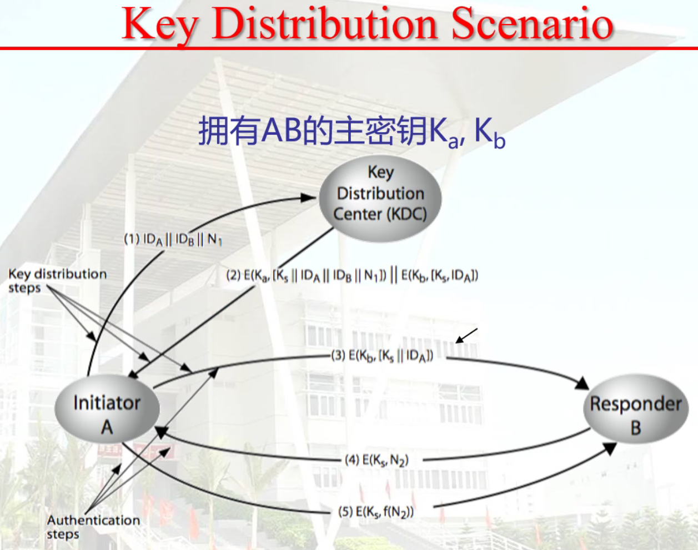
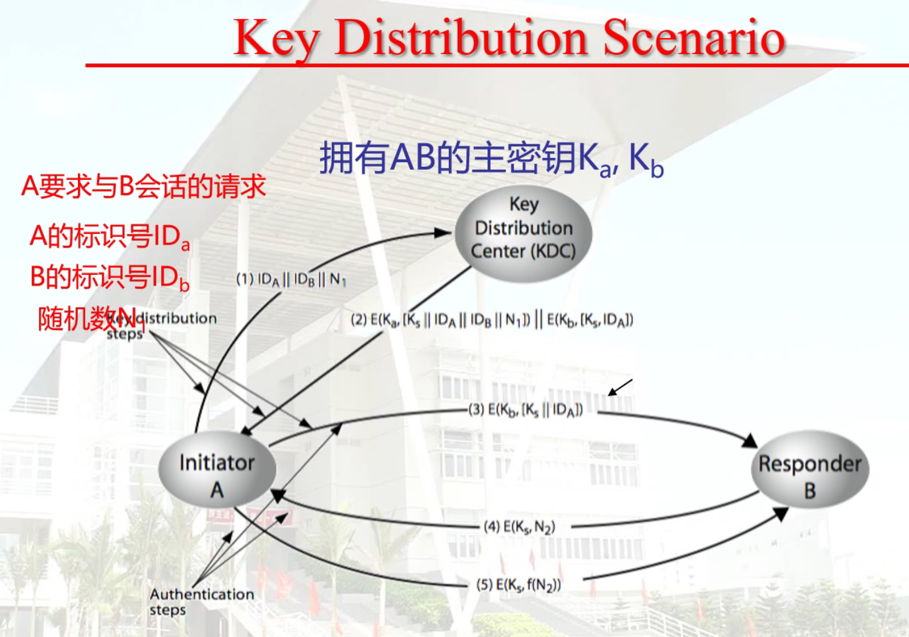
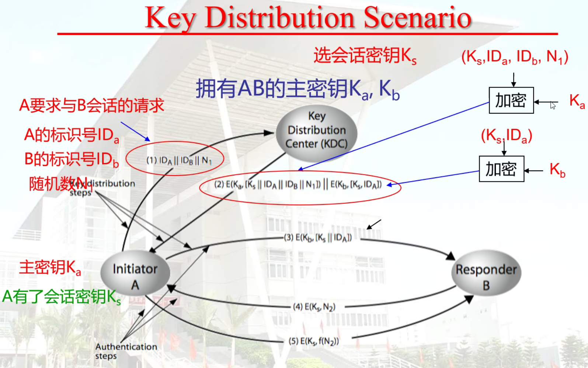
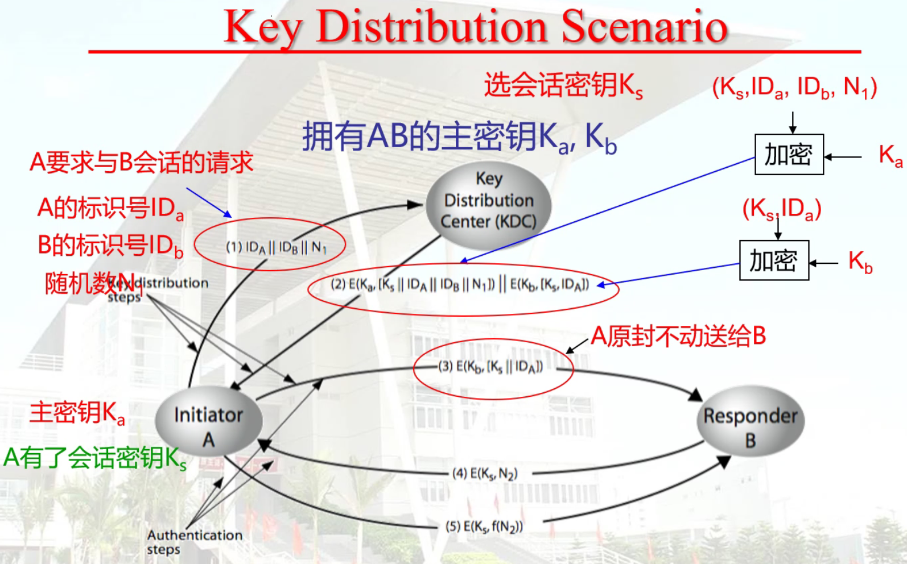
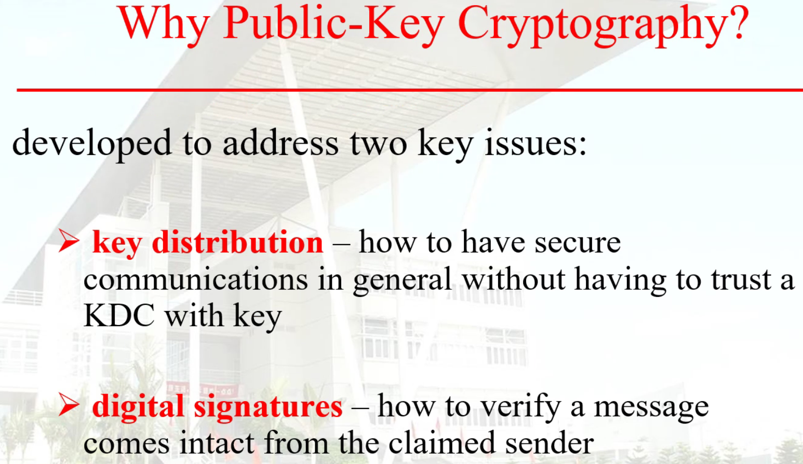
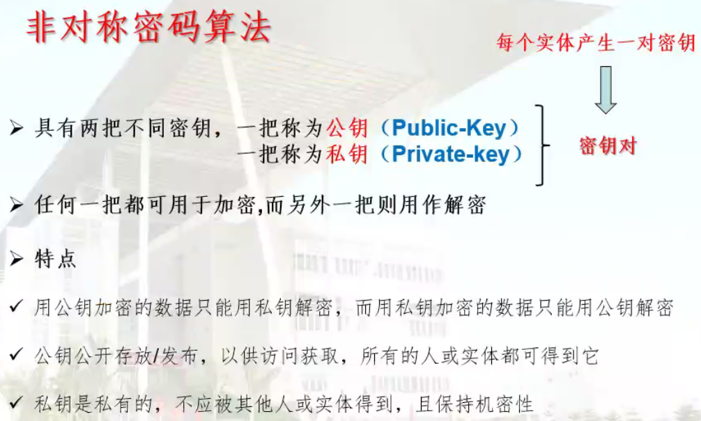

# Note - CNIS 密码编码学与网络信息安全 Cryptography and Network Information Security

## 1. RC4

## 2. 加密流程

## 3. Key Distribution Scenario

## 4. Why Public Key Cryptography?

## 5. 公鑰密碼體制

## 6. 非對稱

