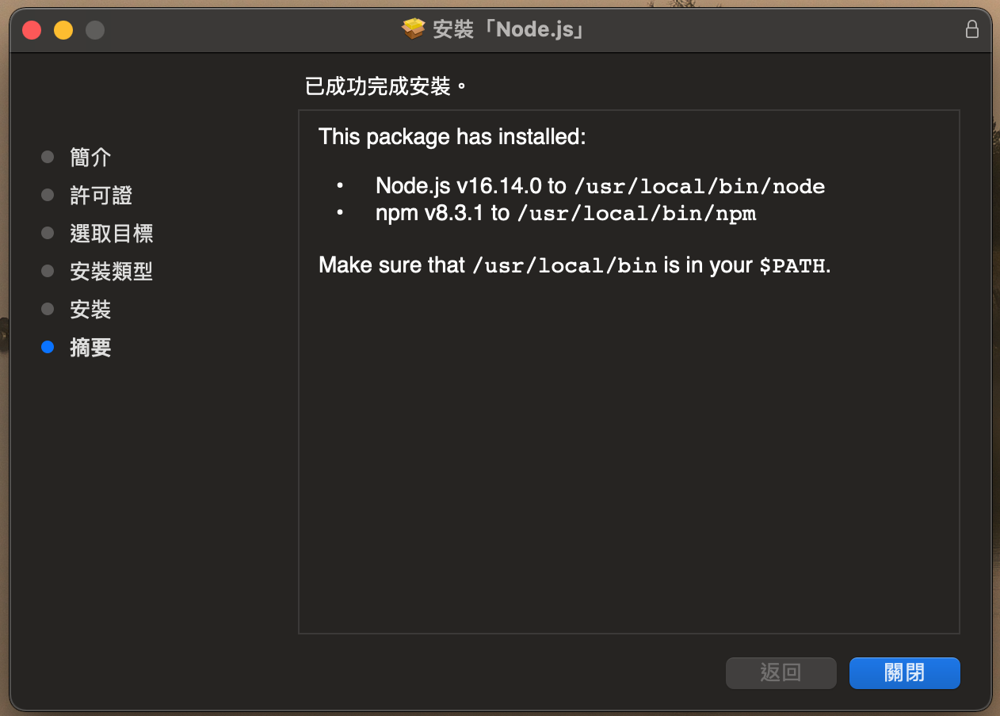

# DIP - 数字图像处理 - Digital Image Processing

> 2101212850 干皓丞

PKU 2022 個人實驗報告作業

## Details

技術文件與紀錄

## Node.js & Npm




```
$ vim .bashrc 
```

```
# Node.js & Npm
export PATH=${PATH}:/usr/local/bin
```

## Vue

1. links

https://vuejs.org/

https://vuejs.org/guide/introduction.html

https://cli.vuejs.org/zh/guide/


2. Install - 全局

Node.js & Npm 要推到比較新的版本。

```
# 安裝 CLI
$ npm install --global @vue/cli

# VUE 版本
$ vue --version

# 建立 Vue 專案
$ vue create vue-app

# 伺服器執行
$ npm run serve
```

3. Install - 部分

```
npm init vue@latest
```

```
cd <your-project-name>
npm install
npm run dev
```

## Angualr

```
# 安裝 CLI
$ npm install -g @angular/cli

# 建立 Angular 專案
$ ng new ag-app

# 進入專案
$ cd ag-app

# 啟動 Server
$ ng serve --open
```


## React

https://reactjs.org/

```
# 安裝 React
$ npm install -g create-react-app

# 建立名為 react-app 的 React 專案
$ create-react-app react-app

$ create-react-app [Project Name]

# 進入 React 專案執行
$ npm start
```

## Laravel

https://laravel.com/


1. Install

https://laravel.com/docs/9.x/installation


## Go

https://go.dev/

https://go.dev/doc/


## Pytorch

https://pytorch.org/

https://pytorch.org/tutorials/

https://pytorch.org/docs/stable/index.html


