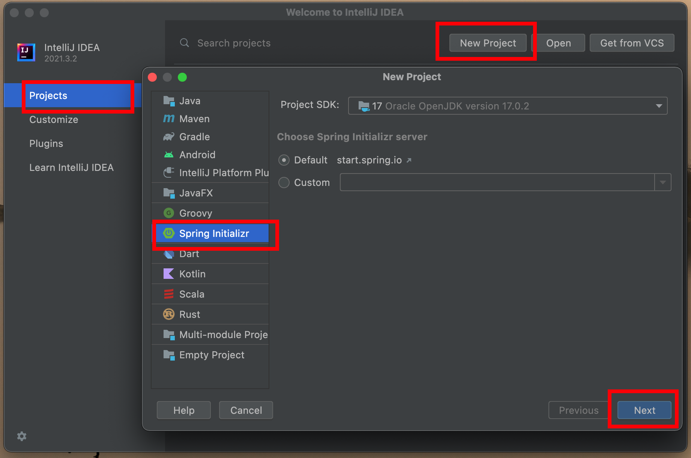
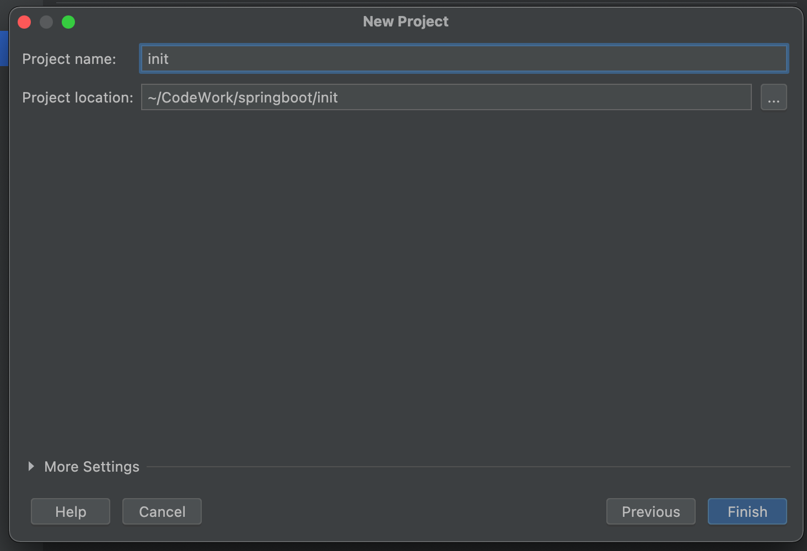
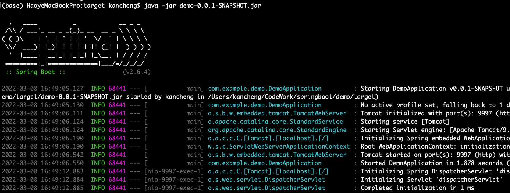

# DIP - 数字图像处理 - Digital Image Processing

> 2101212850 干皓丞

PKU 2022 個人實驗報告作業

## Details

技術文件與紀錄

## Cmd

```
tree  -I 'node_modules*'
```

## Node.js & Npm


```
$ vim .bashrc 
```

```
# Node.js & Npm
export PATH=${PATH}:/usr/local/bin
```

## Vue

1. links

https://vuejs.org/

https://vuejs.org/guide/introduction.html

https://cli.vuejs.org/zh/guide/


2. Install - 全局

Node.js & Npm 要推到比較新的版本。

```
# 安裝 CLI
$ npm install --global @vue/cli

# VUE 版本
$ vue --version

# 建立 Vue 專案
$ vue create vue-app

# 伺服器執行
$ npm run serve
```

3. Install - 部分

```
npm init vue@latest
```

```
cd <your-project-name>
npm install
npm run dev
```

4. init

```
(base) HaoyeMacBookPro:vue-app kancheng$ tree  -I 'node_modules*' 
.
├── README.md
├── babel.config.js
├── jsconfig.json
├── package-lock.json
├── package.json
├── public
│             ├── favicon.ico
│             └── index.html
├── src
│             ├── App.vue
│             ├── assets
│             │             └── logo.png
│             ├── components
│             │             ├── HelloWorld.vue
│             │             └── HelloWorldTest.vue
│             └── main.js
└── vue.config.js

4 directories, 13 files
(base) HaoyeMacBookPro:vue-app kancheng$ 
```

## Angualr

```
# 安裝 CLI
$ npm install -g @angular/cli

# 建立 Angular 專案
$ ng new ag-app

# 進入專案
$ cd ag-app

# 啟動 Server
$ ng serve --open
```


## React

https://reactjs.org/

```
# 安裝 React
$ npm install -g create-react-app

# 建立名為 react-app 的 React 專案
$ create-react-app react-app

$ create-react-app [Project Name]

# 進入 React 專案執行
$ npm start
```

## Laravel

https://laravel.com/


1. Install

https://laravel.com/docs/9.x/installation


## Go

https://go.dev/

https://go.dev/doc/


## Pytorch

https://pytorch.org/

https://pytorch.org/tutorials/

https://pytorch.org/docs/stable/index.html


## Python Flask

https://flask.palletsprojects.com/en/2.0.x/

https://flask.palletsprojects.com/en/2.0.x/installation/

1. 啟動

fap-dome.py

```
from flask import Flask

app = Flask(__name__)

@app.route("/")
def home():
    return "OwO//"

app.run()
```
```
python fap-dome.py
```

2. 加入 HTML

f-app.py

```
from flask import Flask
from flask import render_template

app = Flask(__name__)

@app.route("/")
def home():
    return render_template("index.html")

app.run()
```

command
```
python fap-dome.py
```

the tree

```
.
├── f-app.py
└── templates
    └── index.html
```

index.html

```
<!DOCTYPE html>
<html>
<head>
	<meta charset="utf-8">
	<meta name="viewport" content="width=device-width, initial-scale=1">
	<title></title>
</head>
<body>
	<h1>Flask Test</h1>
	<p>Python 後端測試</p>
</body>
</html>
```

## Python Django

https://www.djangoproject.com/


## Java Spring Boot

JDK 必須要對應上指定 Spring Boot 的版本。

https://spring.io/projects/spring-boot

https://start.spring.io/


### Spring Boot 產生專案

在此用 init 來產生專案，Maven 要設定好 !

官網可以手動下載


Install ItelliJ IDEA


可以手動匯入新檔案，也可以用工具，在此用工具產生。


安裝工具







完成

### Spring Boot Hello, World !


在此用 demo 來產生專案，Maven 要設定好 !


```
package com.example.demo;

import org.springframework.boot.SpringApplication;
import org.springframework.boot.autoconfigure.SpringBootApplication;
import org.springframework.web.bind.annotation.GetMapping;
import org.springframework.web.bind.annotation.RestController;

@RestController
@SpringBootApplication
public class DemoApplication {

	public static void main(String[] args) {
		SpringApplication.run(DemoApplication.class, args);
	}
	@GetMapping("/hello")
	public String hello() {
		return "Hello World";
	}

}
```


Port Number

```
server.port=9997
```


```
java -jar [Name].jar
```




完成

