# DMSASD - 数字媒体软件与系统开发 - Digital Media Software And System Development

> 2101212850 干皓丞

PKU 2022 個人實驗報告作業

## Details

筆記整理

## About

1. https://www.libsdl.org/

2. http://dranger.com/ffmpeg/

3. https://www.ffmpeg.org/

## FFMPEG 构成

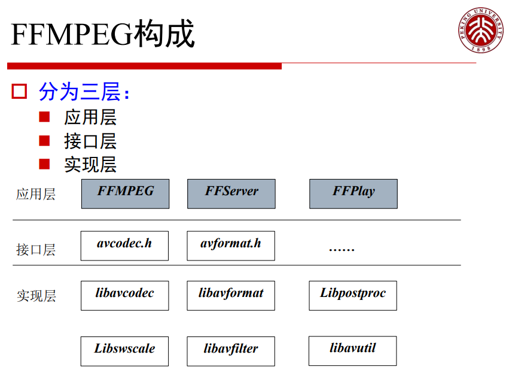

## 主要构成部分

- ffmpeg - 视频文件转换命令行工具,也支持经过实时电视卡抓取和编码成视频文件.

- ffserver - 用于实时广播的多媒体服务器.也支持时间平移

- ffplay - 用 SDL和FFmpeg库开发的一个简单的媒体播放器

- libavcodec - 一个包含了所有 FFmpeg 音视频编解码器的库.为了保证最优性能和高可复用性,大多数编解码器从头开发的.

- libavformat - 一个包含了所有的普通音视格式的解析器和产生器的库.

- Libpostproc - 后处理

- Libswscale - 影像缩放

## FFMPEG 使用

```
ffmpeg [[options][`-i' input_file]]... {[options] output_file}...
```
实例：

```
ffmpeg -i snatch_1.vob -f avi -vcodec mpeg4 -b 800 -g 300 -bf 2 -acodec mp3 -ab 128 snatch.avi
```

## FFMPEG 功能-转码

将原始yuv文件转换成avi文件

```
ffmpeg -i /tmp/test.yuv /tmp/out.avi
```

反之

```
ffmpeg -i mydivx.avi -o hugefile.yuv
```

转换音频文件 a.wav 和原始的 YUV 视频文件 a.yuv 到 mpeg 文件 a.mpeg

```
ffmpeg -i /tmp/a.wav -s 640x480 -i /tmp/a.yuv /tmp/a.mpg
```

改变音频采样率和格式

```
ffmpeg -i /tmp/a.wav -ar 22050 /tmp/a.mp2
```

同时编码到几种格式并且在输入流和输出流之间建立映射

```
ffmpeg -i /tmp/a.wav -ab 64 /tmp/a.mp2 -ab 128 /tmp/b.mp2 -map 0:0 -map 0:0
```

## FFMPEG 支持的文件格式

```
ffmpeg -formats
```
> - D - Decoding available
> - E - Encoding available

## FFMPEG 支持的编解码格式

Ffmpeg -codecs

-codecs' Show available codecs. The fields preceding the codec names have the following meanings:

- 'D' Decoding available
- 'E' Encoding available
- 'V/A/S' Video/audio/subtitle codec
- 'S' Codec supports slices
- 'D' Codec supports direct rendering
- 'T' Codec can handle input truncated at random locations instead of only at frame boundaries 

## 通用选项

- -L license
- -h 帮助 -formats 显示可用的格式，编解码的，协议的。。。
- -f fmt 强迫采用格式fmt
- -i filename 输入文件
- -y 覆盖输出文件
- -t duration 设置纪录时间 hh:mm:ss[.xxx]格式的记录时间
- -ss position 搜索到指定的时间 [-]hh:mm:ss[.xxx]的格式
- -title string 设置标题
- -author string 设置作者
- -copyright string 设置版权
- -comment string 设置评论
- -target type 设置目标文件类型(vcd,svcd,dvd) 所有的格式选项（比特率，编解码以及缓冲区大小）自动设置 ，只需要输入如下的就可以了： ffmpeg -i myfile.avi -target vcd /tmp/vcd.mpg
- -hq 激活高质量设置
- -itsoffset offset 设置以秒为基准的时间偏移，该选项影响所有后面的输入文件。该偏移被加到输入文件的时戳，定义一个正偏移意味着相应的流被延迟了 offset秒。 [-]hh:mm:ss[.xxx]的格式 

## 视频选项

- -b bitrate 设置比特率，缺省200kb/s
- -vframes 设置帧数
- -r fps 设置帧频 缺省25
- -s size 设置帧大小 格式为WXH 缺省160X128.下面的简写也可以直接使用： Sqcif 128X96 qcif 176X144 cif 252X288 4cif 704X576
- -aspect aspect 设置横纵比 4:3 16:9 或 1.3333 1.7777
- -croptop size 设置顶部切除带大小 像素单位
- -cropbottom size
- –cropleft size
- –cropright size
- -padtop size 设置顶部补齐的大小 像素单位
- -padbottom size
- –padleft size
- –padright size
- –padcolor color 设置补齐条颜色(hex,6 个 16 进制的数，红:绿:兰排列，比 如 000000 代表黑色)

- -vn 不做视频处理
- -bt tolerance 设置视频码率容忍度kbit/s
- -maxrate bitrate设置最大视频码率容忍度
- -minrate bitreate 设置最小视频码率容忍度
- -bufsize size 设置码率控制缓冲区大小
- -vcodec codec 强制使用codec编解码方式。 如果用 copy 表示原始编解码数据必须被拷贝。
- -sameq 使用同样视频质量作为源（VBR）
- -pass n 选择处理遍数（1或者2）。两遍编码非常有用。第一遍生成统计信息，第二遍生成精确的请求的码率
- -passlogfile file 选择两遍的纪录文件名为 file 

## 高级视频选项
- -g gop_size 设置图像组大小
- -intra 仅适用帧内编码
- -qscale q 使用固定的视频量化标度(VBR)
- -qmin q 最小视频量化标度(VBR)
- -qmax q 最大视频量化标度(VBR)
- -qdiff q 量化标度间最大偏差 (VBR)
- -qblur blur 视频量化标度柔化(VBR)
- -qcomp compression 视频量化标度压缩(VBR)
- -rc_init_cplx complexity 一遍编码的初始复杂度
- -b_qfactor factor 在p和b帧间的qp因子
- -i_qfactor factor 在p和i帧间的qp因子
- -b_qoffset offset 在p和b帧间的qp偏差
- -i_qoffset offset 在p和i帧间的qp偏差 
- -rc_eq equation 设置码率控制方程 默认tex^qComp
- -rc_override override 特定间隔下的速率控制重载
- -me method 设置运动估计的方法 可用方法有 zero phods log x1 epzs(缺省) full
- -dct_algo algo 设置dct的算法 可用的有
  - 0 FF_DCT_AUTO 缺省的DCT
  - 1 FF_DCT_FASTINT
  - 2 FF_DCT_INT
  - 3 FF_DCT_MMX
  - 4 FF_DCT_MLIB
  - 5 FF_DCT_ALTIVEC
- -idct_algo algo 设置idct算法。可用的有
  - 0 FF_IDCT_AUTO 缺省的IDCT
  - 1 FF_IDCT_INT
  - 2 FF_IDCT_SIMPLE
  - 3 FF_IDCT_SIMPLEMMX
  - 4 FF_IDCT_LIBMPEG2MMX
  - 5 FF_IDCT_PS2 ，…

- -bf frames 使用frames B 帧，支持mpeg1,mpeg2,mpeg4
- -mbd mode 宏块决策
  - 0 FF_MB_DECISION_SIMPLE 使用mb_cmp
  - 1 FF_MB_DECISION_BITS
  - 2 FF_MB_DECISION_RD
- -4mv 使用4个运动矢量 仅用于mpeg4 -part 使用数据划分 仅用于mpeg4
- -aic 使能高级帧内编码 h263+
- -umv 使能无限运动矢量 h263+
- -deinterlace 不采用交织方法
- -interlace 强迫交织法编码 仅对mpeg2和mpeg4有效。当你的输入是交织的并且你想要保持交织以最小图像损失的时候采用该选项。可选的方法 是不交织，但是损失更大
- -psnr 计算压缩帧的 psnr
- -vstats 输出视频编码统计到vstats_hhmmss.log 

## 音频选项

- -ab bitrate 设置音频码率
- -ar freq 设置音频采样率
- -ac channels 设置通道 缺省为1
- -an 不使能音频纪录
- -acodec codec 使用 codec 编解码

## 应用 FFMPEG API 快速开发與主要数据结构

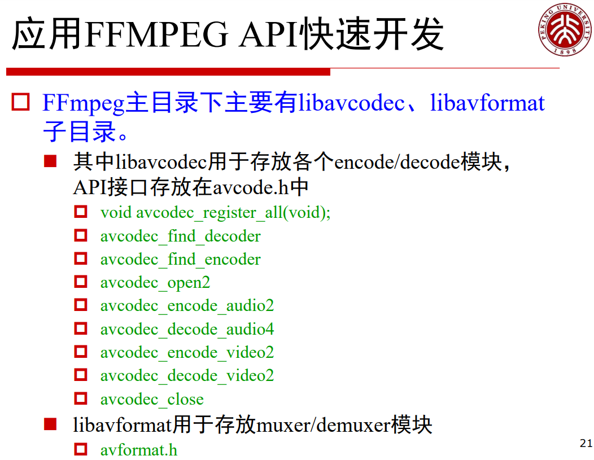

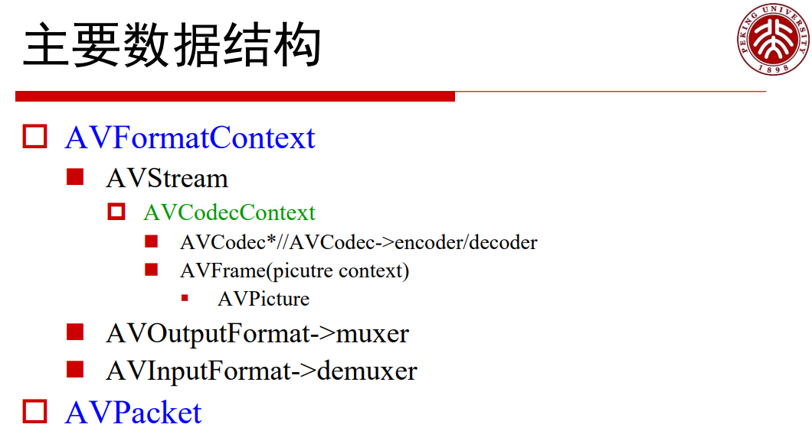

## FFPLAY 基本文件播放流程

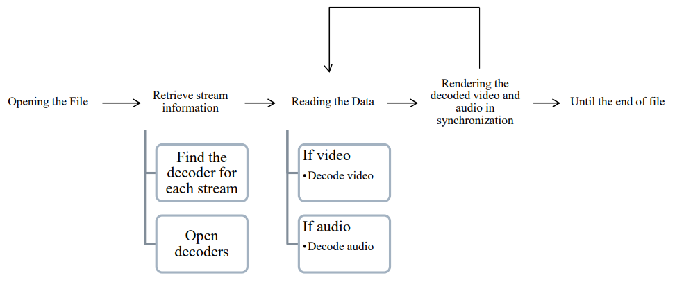

## FFPLAY 文件头解析

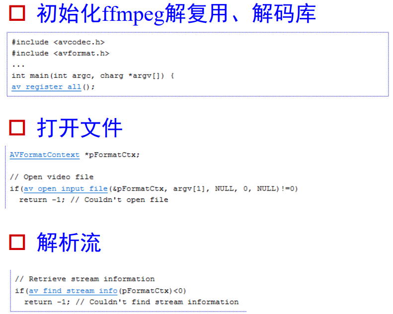

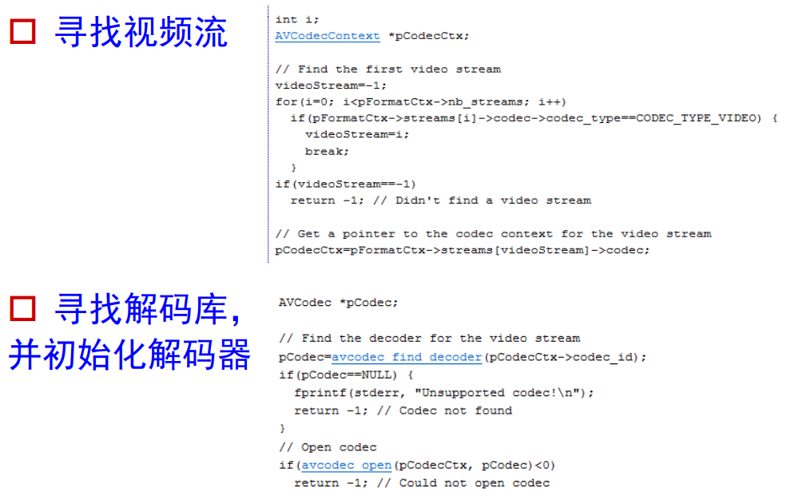

## 为输出图像分配存储空间

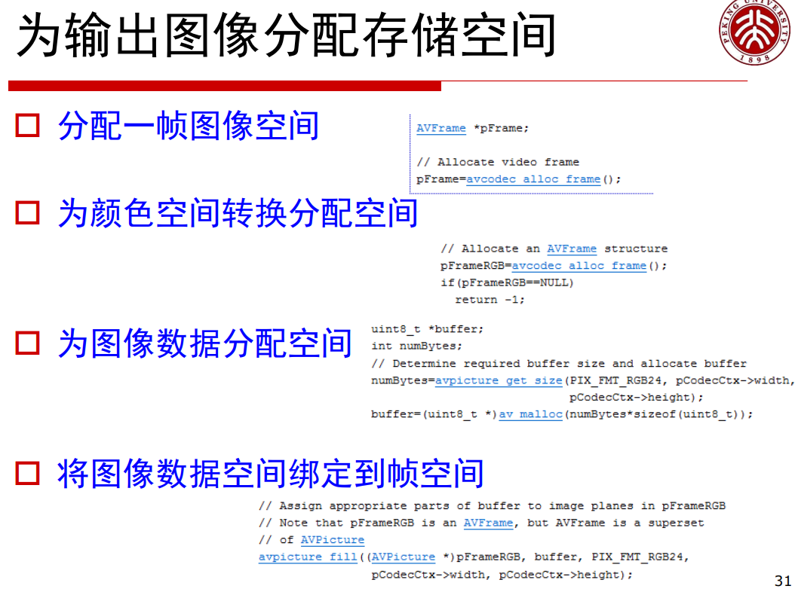

## 读入数据、解码

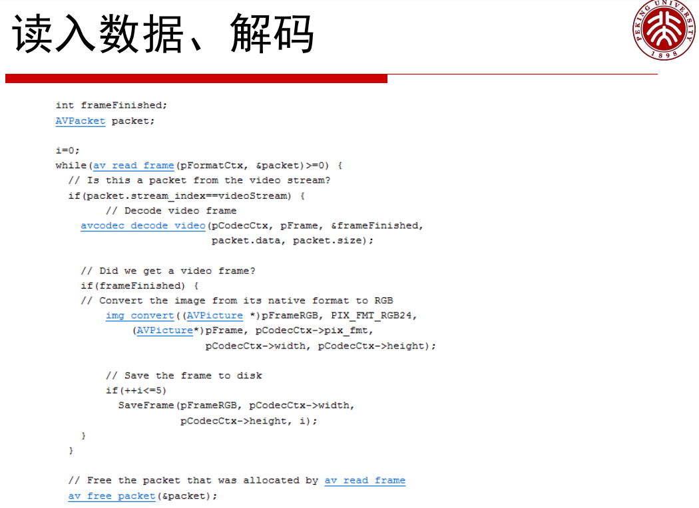

## 视音频播放

SDL 是 Simple Direct Layer 缩写，跨平台多媒体库：Linux, Windows, Windows CE，MacOS。

- http://www.libsdl.org/

- Simple DirectMedia Layer is a cross-platform multimedia library designed to provide low level access to audio, keyboard, mouse, joystick, 3D hardware via OpenGL, and 2D video framebuffer.

## 播放音频

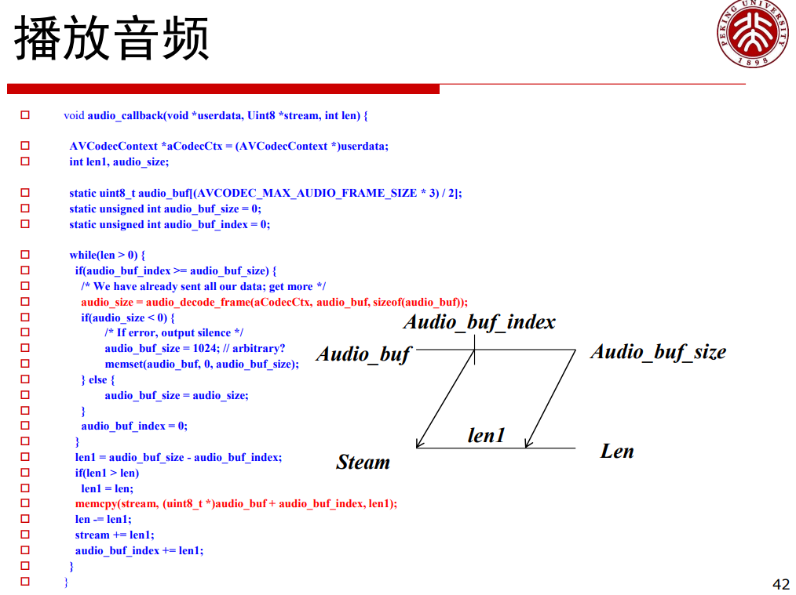

## 解码音频

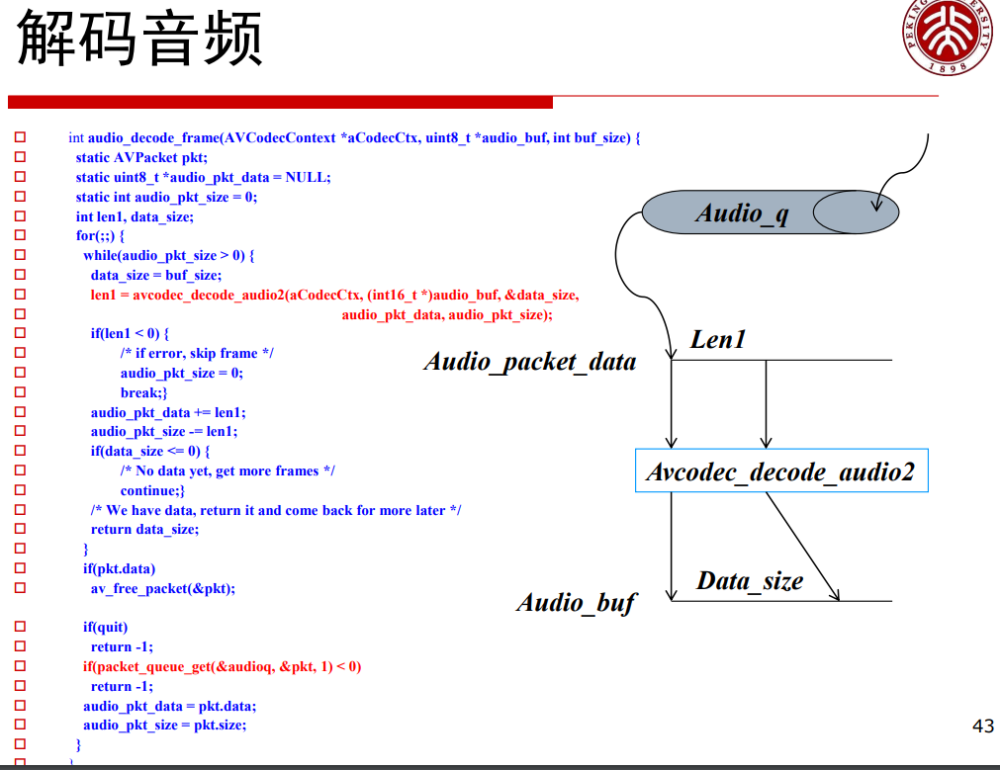

## 多线程架构

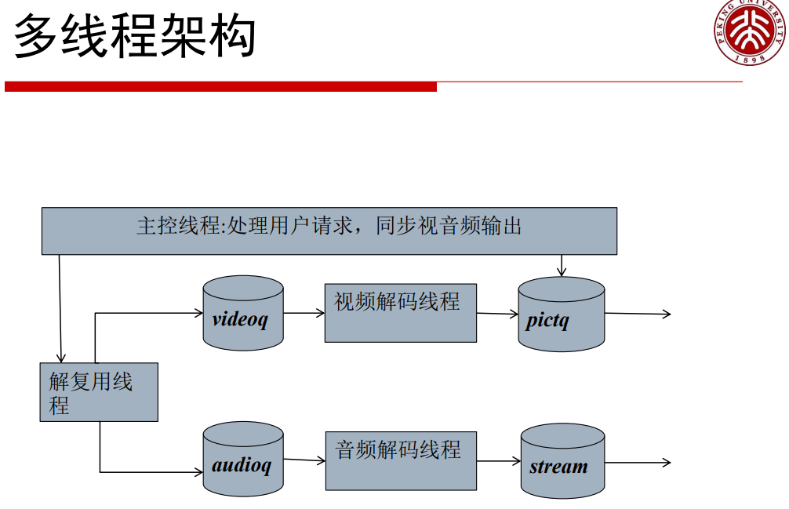