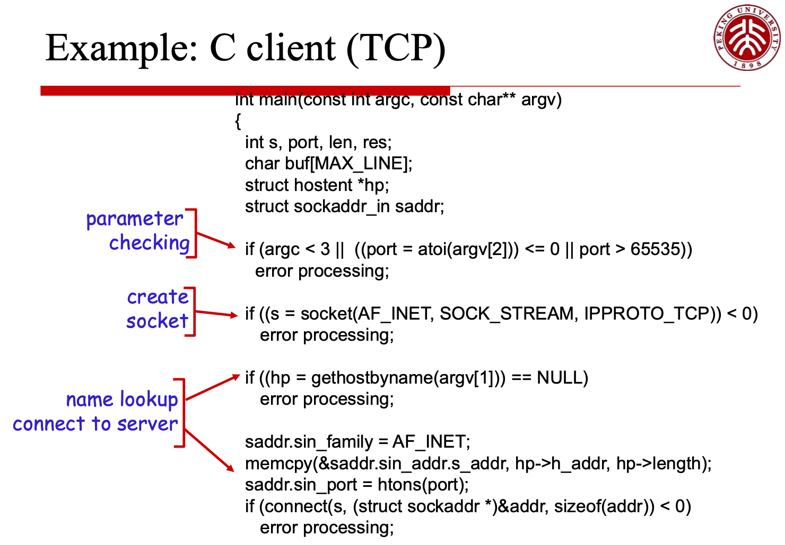

# DMSASD - 数字媒体软件与系统开发 - Digital Media Software And System Development

> 2101212850 干皓丞

PKU 2022 個人實驗報告作業

## Details

筆記整理

## About

## 典型的流媒体协议和服务器

RTSP：RealNetworks 公司的 Helix Server，采用RTP/RTSP协议接收、传输视频，采用 Real Player 作为播放前端；

RTMP：Adobe 公司的 Flash Media Server,采用 RTMP(RTMPT/RTMPE/RTMPS) 协议接收、传输视频，采用 Flash Player 作为播放前端。

HLS：HTTP Live Streaming（HLS）是苹果公司(Apple Inc.)实现的基于 HTTP 的流媒体传输协议，可实现流媒体的直播和点播，主要应用在iOS系统，为iOS设备（如iPhone、iPad）提供音视频直播和点播方案。

RFC2326 中定义了一个流媒体会话控制协议：RTSP（Real Time Streaming Protocol）

- RTSP（Real Time Streaming Protocol，实时流媒体协议），是由Real network 和Netscape共同提出的如何有效地在 IP 网络上传输流媒体数据的应用层协议。

- RTSP 提供一种可扩展的框架，使能够提供能控制的，按需传输实时数据，比如音频和视频文件。


## 开源流媒体服务器

- 流媒体解决方案 Live555 （C++）

- 流媒体平台框架 EasyDarwin （C++）

- 实时流媒体播放服务器程序 DarwinStreamingSrvr （C++)

- Flash 流媒体服务器 Red5 （Java）

- 流媒体服务器 Open Streaming Server （Java）

- FMS 流媒体服务器 （Adobe，收费的）

- Wowza 流媒体服务器（Java）

- 开源流媒体平台 FreeCast（Java）


## CDN

- CDN 的全称是 Content Delivery Network，即内容分发网络

- CDN 是构建在网络之上的内容分发网络，依靠部署在各地的边缘服务器，通过中心平台的负载均衡、内容分发、调度等功能模块，使用户就近获取所需内容，降低网络拥塞，提高用户访问响应速度和命中率。

- CDN 的关键技术主要有内容存储和分发技术。


## 代表性的 HTTP streaming 协议

- HLS:Apple’s HTTP Live Streaming

- MSS:Microsoft’s Smooth Streaming

- HDS:Adobe’s HTTP Dynamic Streaming


## TCP & UDP

Example client-server app:

1. client reads line from standard input, sends to server via socket

2. server reads line from socket

3. server converts line to uppercase, sends back to client

4. client reads, prints modified line from socket

## C Client TCP



```
int main(const int argc, const char** argv)
{
	int s, port, len, res;
	char buf[MAX_LINE];
	struct hostent *hp;
	struct sockaddr_in saddr;

	// parameter checking
	if (argc < 3 || ((port = atoi(argv[2])) <= 0 || port > 65535))
		error processing;
	
	// parameter checking - end

	// create socket
	if ((s = socket(AF_INET, SOCK_STREAM, IPPROTO_TCP)) < 0)
		error processing;

	// create socket - end

	// name lookup
	if ((hp = gethostbyname(argv[1])) == NULL)
		error processing;

	saddr.sin_family = AF_INET;
	memcpy(&saddr.sin_addr.s_addr, hp->h_addr, hp->length);
	saddr.sin_port = htons(port);
	if (connect(s, (struct sockaddr *)&addr, sizeof(addr)) < 0)
		error processing;

	// name lookup - end

	// Read a line from stdin
	if (fgets(buf, sizeof(buf), stdin) == NULL)
		error processing;

	// Read a line from stdin - end

	// Send the line to server
	if ((res = write(s, buf, len)) <= 0)
		error processing;

	// Send the line to server - end

	// Receive the line from
	if ((res = read(s, buf, sizeof(buf)-1) <= 0)
		error processing;

	buf[res] = 0;
	printf(“received: %s”, buf);

	close(s);
	return 0;
}
```


## Reference

1. https://www.geeksforgeeks.org/tcp-server-client-implementation-in-c/

2. https://www.cs.uregina.ca/Links/class-info/330/Sockets/Sample/server.c

3. https://blog.yslifes.com/archives/652

4. https://doc.rust-lang.org/std/net/struct.TcpStream.html

5. https://blog.csdn.net/eickandy/article/details/51461928


